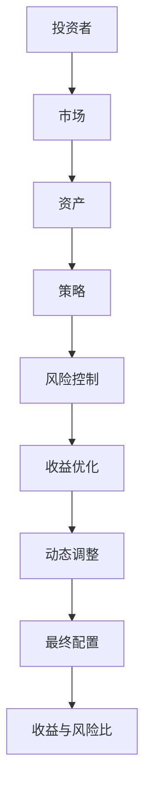
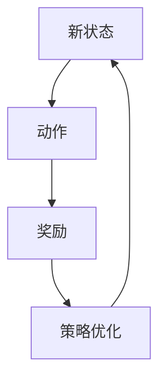

                 

# 金融领域元强化学习在多周期资产配置中的应用

## 关键词：元强化学习，多周期资产配置，金融，强化学习，算法优化

## 摘要

本文探讨了元强化学习（Meta-Reinforcement Learning）在金融领域多周期资产配置中的应用。通过分析多周期资产配置的复杂性，结合元强化学习的核心原理，本文提出了一种基于元强化学习的多周期资产配置框架。该框架通过优化多个时间周期内的资产配置策略，提高了投资组合的收益与风险比。文章详细介绍了元强化学习的算法原理、数学模型、系统架构设计以及实际案例分析，为金融领域的投资决策提供了新的思路和方法。

---

# 第一部分: 引言

## 第1章: 问题背景与研究意义

### 1.1 问题背景

#### 1.1.1 金融领域资产配置的挑战

资产配置是金融投资中的核心问题，涉及如何将资金分配到不同资产类别（如股票、债券、商品等）以实现收益最大化和风险最小化。然而，资产配置的复杂性主要体现在以下几个方面：

1. **多时间周期的复杂性**：资产在不同时间周期（如短期、中期、长期）的表现差异显著，传统的单周期配置策略难以应对多周期的动态变化。
2. **市场的不确定性**：金融市场具有高度的不确定性，价格波动、政策变化等因素都会影响资产的收益和风险。
3. **投资者行为的影响**：投资者的心理预期和行为也会对资产配置产生重大影响，进一步增加了问题的复杂性。

#### 1.1.2 多周期资产配置的复杂性

多周期资产配置需要在多个时间维度上进行动态优化，例如：

1. **短期与长期的平衡**：如何在短期收益与长期增长之间找到最佳平衡点。
2. **资产类别间的动态调整**：不同资产类别的表现会随时间变化，需要不断调整配置比例。
3. **风险控制的多层次**：在不同周期内，风险的来源和影响机制不同，需要多层次的风险管理策略。

#### 1.1.3 强化学习在金融中的应用潜力

强化学习（Reinforcement Learning, RL）是一种通过试错机制优化决策过程的机器学习方法，近年来在金融领域得到了广泛关注。其优势在于：

1. **动态决策能力**：强化学习能够根据环境反馈动态调整决策策略。
2. **非线性关系建模**：强化学习擅长处理复杂的非线性关系，适合金融市场中复杂的投资决策问题。
3. **多步优化能力**：强化学习能够进行多步优化，适合多周期资产配置中的长期规划问题。

### 1.2 研究意义

#### 1.2.1 元强化学习的核心价值

元强化学习（Meta-Reinforcement Learning）是一种新兴的强化学习方法，旨在通过元学习（Meta-Learning）快速适应不同任务或环境的变化。其核心价值在于：

1. **快速适应能力**：元强化学习能够在不同环境中快速调整策略，适合金融市场中多变的环境。
2. **多任务优化能力**：元强化学习能够同时优化多个相关任务，适合多周期资产配置中的多目标优化问题。
3. **高效学习效率**：元强化学习能够在较少的数据和环境中完成高效学习，适合金融数据有限的场景。

#### 1.2.2 多周期资产配置的创新性

多周期资产配置的核心创新在于：

1. **动态优化策略**：通过强化学习实现资产配置的动态优化，适应市场的变化。
2. **多层次决策框架**：构建多层次的决策框架，分别处理短期、中期和长期的资产配置问题。
3. **多目标优化**：在多周期资产配置中，需要同时考虑收益、风险、流动性等多个目标。

#### 1.2.3 研究的理论与实践意义

从理论角度看，本文研究将元强化学习引入金融领域，拓展了强化学习在金融中的应用边界。从实践角度看，本文提出的方法能够为投资者提供一种高效、动态的资产配置工具，提升投资收益并降低风险。

---

## 第2章: 核心概念与联系

### 2.1 元强化学习的定义与特点

#### 2.1.1 元强化学习的定义

元强化学习（Meta-Reinforcement Learning）是强化学习与元学习（Meta-Learning）的结合，旨在通过元学习机制优化强化学习过程。具体来说，元强化学习在多个相关任务中进行学习，通过共享不同任务的策略，快速适应新任务。

#### 2.1.2 元强化学习的核心特点

1. **多任务优化**：元强化学习能够在多个相关任务中共享学习经验，提高学习效率。
2. **快速适应能力**：通过元学习机制，元强化学习能够快速适应新环境或任务。
3. **层次化决策**：元强化学习通常采用层次化结构，分别处理不同层次的决策问题。

#### 2.1.3 元强化学习与传统强化学习的对比

| 对比维度                | 元强化学习                                | 传统强化学习                              |
|-------------------------|------------------------------------------|------------------------------------------|
| 任务数量                | 多个相关任务                              | 单个任务                                  |
| 策略共享                | 策略共享，快速适应新任务                  | 策略独立，不共享                          |
| 适应性                  | 高，能够快速适应新环境                    | 低，需要重新训练新环境                    |

### 2.2 多周期资产配置的定义与特点

#### 2.2.1 多周期资产配置的定义

多周期资产配置是指在多个时间周期内进行资产配置，旨在通过动态调整资产组合，实现长期收益最大化和风险最小化。与单周期资产配置相比，多周期资产配置更注重时间维度上的动态优化。

#### 2.2.2 多周期资产配置的核心要素

1. **时间维度**：资产配置需要考虑不同时间周期的收益和风险。
2. **资产类别**：不同资产类别的收益和风险特征在不同周期内表现不同。
3. **动态调整**：根据市场变化和投资者目标，动态调整资产配置比例。

#### 2.2.3 多周期资产配置与传统资产配置的对比

| 对比维度                | 多周期资产配置                            | 传统资产配置                              |
|-------------------------|------------------------------------------|------------------------------------------|
| 时间维度                | 考虑多个时间周期                          | 考虑单个时间周期                          |
| 动态调整能力            | 强，能够根据市场变化动态调整              | 弱，通常采用静态配置                      |
| 优化目标                | 多目标优化（收益、风险、流动性等）        | 单目标优化（通常为收益最大化）            |

### 2.3 元强化学习与多周期资产配置的联系

#### 2.3.1 元强化学习在多周期资产配置中的应用

1. **多层次决策框架**：元强化学习的层次化结构与多周期资产配置的多层次决策需求高度契合。
2. **快速适应市场变化**：元强化学习的快速适应能力能够应对多周期资产配置中的市场波动。
3. **多目标优化能力**：元强化学习的多任务优化能力能够同时处理收益、风险等多个目标。

#### 2.3.2 元强化学习如何优化多周期资产配置

1. **短期与长期的平衡**：通过元强化学习的多层次决策框架，实现短期收益与长期增长的平衡。
2. **资产类别间的动态调整**：利用元强化学习的动态优化能力，实现不同资产类别间的配置比例动态调整。
3. **风险控制的多层次管理**：通过元强化学习的多目标优化能力，实现多层次的风险管理。

#### 2.3.3 元强化学习与多周期资产配置的结合方式

1. **层次化决策结构**：将多周期资产配置问题分解为多个层次的决策问题，分别进行优化。
2. **共享学习经验**：通过元强化学习的策略共享机制，实现不同时间周期之间的经验共享。
3. **快速适应市场变化**：利用元强化学习的快速适应能力，应对多周期资产配置中的市场波动。

---

## 第3章: 核心概念原理与关系图

### 3.1 元强化学习的核心原理

#### 3.1.1 多智能体系统

元强化学习通常采用多智能体系统（Multi-Agent System）来实现多个任务或环境的共享学习。多个智能体分别负责不同任务或环境的策略优化，并通过共享经验实现快速适应。

#### 3.1.2 元学习机制

元学习（Meta-Learning）是一种通过学习如何快速学习新任务的方法。在元强化学习中，元学习机制用于优化强化学习过程，通过共享不同任务的策略，实现快速适应新任务。

#### 3.1.3 强化学习算法的改进

元强化学习通过改进强化学习算法，引入元学习机制，实现多任务优化和快速适应能力。

### 3.2 多周期资产配置的核心原理

#### 3.2.1 资产配置的动态优化

多周期资产配置的核心在于动态优化，通过不断调整资产配置比例，实现收益与风险的最优平衡。

#### 3.2.2 多周期投资策略

多周期投资策略是指在多个时间周期内进行投资决策，考虑短期、中期和长期的目标和风险。

#### 3.2.3 资产配置的组合优化

资产配置的组合优化是指在多个资产类别之间，找到最优的组合比例，以实现收益与风险的最优平衡。

### 3.3 核心概念关系图

#### 3.3.1 ER实体关系图

#### 3.3.2 系统架构图

#### 3.3.3 算法流程图

---

## 第4章: 元强化学习算法原理

### 4.1 元强化学习算法的数学模型

元强化学习的核心算法通常基于元学习的优化目标。假设我们有多个任务或环境，每个任务的目标是优化投资组合的收益与风险比。元强化学习通过共享这些任务的策略，实现快速适应。

#### 4.1.1 状态空间定义

状态空间（State Space）是描述环境状态的集合。在多周期资产配置中，状态可以定义为：

- 当前时间周期
- 各个资产的当前价格或收益率
- 投资组合的当前配置比例
- 当前的收益与风险比

#### 4.1.2 动作空间定义

动作空间（Action Space）是智能体可以执行的动作的集合。在多周期资产配置中，动作可以定义为：

- 调整资产配置比例
- 资产买卖决策
- 风险控制策略

---

接下来的章节将继续深入探讨算法实现、系统架构设计、项目实战等内容，为读者提供一个完整的从理论到实践的指导。

