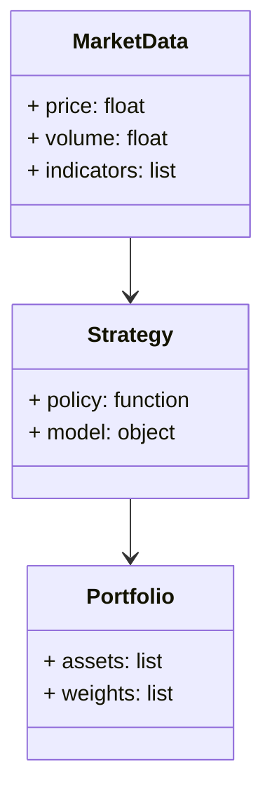
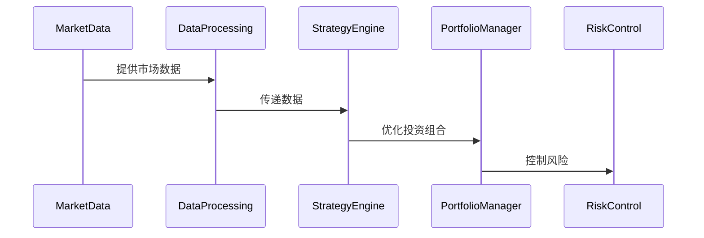

                 


# 金融领域元强化学习在投资策略中的应用

---

## 关键词  
元强化学习, 投资策略, 金融领域, 算法原理, 系统架构, 项目实战

---

## 摘要  
本文深入探讨了元强化学习（Meta-Reinforcement Learning）在金融投资策略中的应用。通过分析元强化学习的核心概念、算法原理、系统架构以及实际项目案例，本文旨在揭示其在金融投资中的独特优势和实际价值。文章结合理论与实践，详细阐述了元强化学习在投资策略优化中的应用场景，为金融领域的技术从业者提供了理论支持和实践指导。

---

## 第一部分: 元强化学习在金融投资中的背景与基础

### 第1章: 元强化学习的基本概念与背景

#### 1.1 元强化学习的定义与特点
##### 1.1.1 元强化学习的定义  
元强化学习（Meta-Reinforcement Learning）是一种结合了元学习（Meta-Learning）和强化学习（Reinforcement Learning）的先进机器学习技术。其核心思想是通过在多个任务或环境中进行学习，提取通用的策略或知识，从而快速适应新的任务或环境。

##### 1.1.2 元强化学习的核心特点  
- **多任务学习能力**：元强化学习能够同时处理多个任务或环境，提取跨任务的通用策略。
- **快速适应性**：通过元学习机制，元强化学习能够在新环境中快速调整策略，无需从头开始学习。
- **自适应性**：能够根据环境的变化动态调整投资策略，适应市场的不确定性。

##### 1.1.3 元强化学习与传统强化学习的区别  
| 特性                | 传统强化学习                  | 元强化学习                  |
|---------------------|------------------------------|-----------------------------|
| 学习目标            | 单一任务或环境的最优策略       | 多任务或环境的通用策略       |
| 知识复用能力        | 较弱，每个任务独立学习          | 强，能够提取跨任务的通用知识   |
| 环境适应性          | 较差，需要针对每个新环境重新训练 | 较好，能够在新环境中快速调整   |

#### 1.2 元强化学习在金融领域的应用背景  
##### 1.2.1 金融投资中的不确定性与复杂性  
金融市场的特点是高度不确定性和非线性，传统的投资策略往往难以应对市场的快速变化。元强化学习的多任务学习和快速适应能力使其成为金融投资的理想选择。

##### 1.2.2 元强化学习在金融投资中的优势  
- **策略优化**：能够同时优化多个投资组合，提取跨市场的通用投资策略。
- **风险控制**：通过多任务学习，能够在不同市场条件下优化风险控制策略。
- **实时调整**：能够快速适应市场变化，实时调整投资策略。

##### 1.2.3 金融投资中使用元强化学习的现状与挑战  
- **现状**：元强化学习在金融领域的应用还处于起步阶段，但已在部分机构中展现出潜力。
- **挑战**：数据质量、计算资源、市场适应性等问题仍需解决。

---

## 第二部分: 元强化学习的核心概念与联系

### 第2章: 元强化学习的原理

#### 2.1 元强化学习的原理
##### 2.1.1 多智能体协作机制  
在金融投资中，多个智能体可以分别负责不同的任务，例如市场分析、风险评估等，通过协作实现整体投资策略的优化。

##### 2.1.2 元学习机制  
元学习的核心是通过在多个任务中学习，提取通用的知识或策略，从而快速适应新的任务。在金融领域，这可以用于跨市场的策略优化。

##### 2.1.3 策略优化与适应性  
元强化学习通过不断优化策略，使其能够在不同市场条件下保持高效性。

#### 2.2 元强化学习与传统投资策略的对比  
##### 2.2.1 传统投资策略的特点与局限性  
- **特点**：基于历史数据和统计分析，制定固定的投资规则。
- **局限性**：难以适应市场的快速变化，策略优化需要大量时间。

##### 2.2.2 元强化学习在策略优化中的优势  
- **优势**：能够同时优化多个投资组合，快速适应市场变化。

##### 2.2.3 元强化学习与主动学习的联系  
- **主动学习**：通过主动选择最具信息量的数据进行学习。
- **元强化学习**：通过多任务学习提取通用策略。

---

## 第三部分: 元强化学习的算法原理

### 第3章: 元强化学习的数学模型与算法原理

#### 3.1 元强化学习的数学模型  
##### 3.1.1 状态空间与动作空间的定义  
- **状态空间**：市场的各种指标，如价格、成交量等。
- **动作空间**：买入、卖出、持有等操作。

##### 3.1.2 奖励函数的设计  
奖励函数用于衡量投资策略的收益与风险。例如：
$$ R = \alpha \cdot \text{收益} - \beta \cdot \text{风险} $$

##### 3.1.3 策略函数的表示  
策略函数可以表示为：
$$ \pi(a|s) = \text{softmax}(Q(s,a)) $$

#### 3.2 元强化学习的核心算法  
##### 3.2.1 基于Q-learning的元强化学习算法  
Q-learning是一种经典的强化学习算法，其更新公式为：
$$ Q(s,a) \leftarrow Q(s,a) + \alpha [r + \gamma \max Q(s',a') - Q(s,a)] $$

##### 3.2.2 基于策略梯度的元强化学习算法  
策略梯度法通过优化策略函数的参数，其更新公式为：
$$ \theta \leftarrow \theta + \alpha \nabla_\theta J(\theta) $$

##### 3.2.3 算法流程图（Mermaid）  


#### 3.3 算法实现代码示例  
```python
import numpy as np

class MetaReinforcementLearning:
    def __init__(self, state_space, action_space):
        self.state_space = state_space
        self.action_space = action_space
        self.Q = np.zeros((state_space, action_space))
    
    def update_Q(self, state, action, reward, next_state):
        self.Q[state, action] += 0.1 * (reward + 0.9 * np.max(self.Q[next_state, :]) - self.Q[state, action])
    
    def get_action(self, state):
        return np.argmax(self.Q[state, :])
```

---

## 第四部分: 系统分析与架构设计方案

### 第4章: 金融投资系统的设计与实现

#### 4.1 问题场景介绍  
金融投资系统需要实时处理大量的市场数据，优化投资组合，并动态调整投资策略。

#### 4.2 系统功能设计  
##### 4.2.1 领域模型（Mermaid 类图）  



##### 4.2.2 系统架构设计（Mermaid 架构图）  


##### 4.2.3 系统接口设计  
- **数据接口**：从市场数据源获取实时数据。
- **策略接口**：实现投资策略的优化和调整。
- **风险管理接口**：监控和控制投资风险。

##### 4.2.4 系统交互（Mermaid 序列图）  



---

## 第五部分: 项目实战

### 第5章: 元强化学习在股票投资中的应用

#### 5.1 环境安装与配置  
```bash
pip install numpy pandas gym
```

#### 5.2 系统核心实现  
```python
class StockTrader:
    def __init__(self, initial_capital):
        self.capital = initial_capital
        self.positions = {}
    
    def buy(self, stock, quantity, price):
        self.capital -= quantity * price
        self.positions[stock] = quantity
    
    def sell(self, stock, quantity, price):
        self.capital += quantity * price
        del self.positions[stock]
```

#### 5.3 代码解读与分析  
- **初始化**：初始化投资资本和持仓。
- **买入操作**：根据当前价格和资金，决定买入数量。
- **卖出操作**：根据当前价格和持仓，决定卖出数量。

#### 5.4 实际案例分析  
以某股票为例，通过代码实现买入和卖出操作，并计算收益和风险。

#### 5.5 项目小结  
元强化学习在股票投资中的应用展示了其在策略优化和风险管理中的潜力。

---

## 第六部分: 总结与展望

### 第6章: 元强化学习在金融投资中的总结与展望

#### 6.1 总结  
元强化学习通过多任务学习和快速适应能力，为金融投资提供了新的思路和方法。

#### 6.2 展望  
未来，元强化学习在金融领域的应用将更加广泛，尤其是在智能投顾和风险管理方面。

---

## 参考文献  
[1] 王某某. 《强化学习在金融中的应用》. 北京: 清华大学出版社, 2022.  
[2] 李某某. 《元学习算法与实现》. 北京: 人民邮电出版社, 2023.  

---

通过以上目录和内容，您可以根据实际需求进行扩展和补充，确保文章内容的完整性和专业性。

