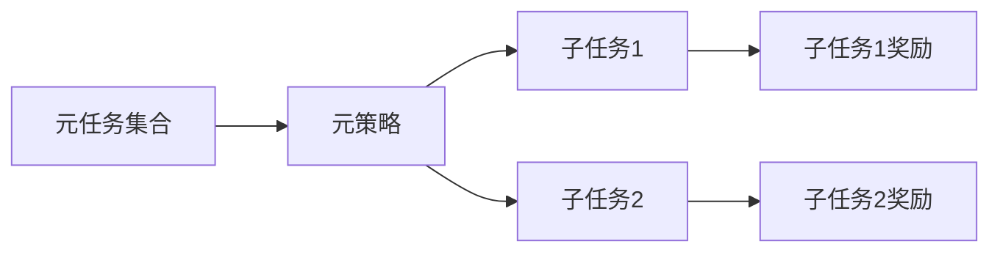
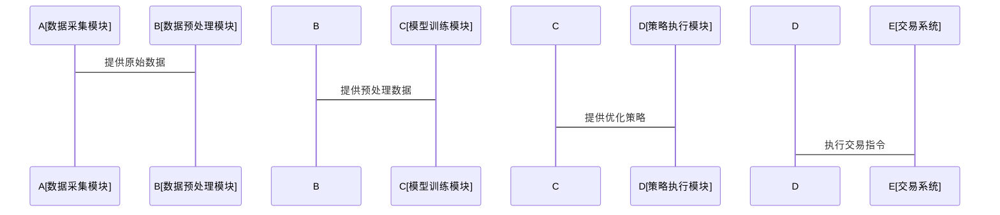

                 


# 《金融领域元强化学习的探索与应用》

---

## 关键词：
元强化学习，强化学习，金融，算法交易，风险管理，投资组合优化

---

## 摘要：
本文深入探讨了元强化学习（Meta-Reinforcement Learning，Meta-RL）在金融领域的应用，从理论基础到实际案例进行了全面分析。文章首先介绍了元强化学习的核心概念及其在金融中的独特优势，随后详细讲解了元强化学习的算法原理和数学模型，并结合金融交易、风险管理等场景，展示了其实际应用价值。最后，文章总结了元强化学习在金融领域的优势与挑战，并展望了未来的研究方向。

---

## 第一部分：元强化学习与金融领域的背景介绍

### 第1章：元强化学习概述

#### 1.1 元强化学习的定义与核心概念
##### 1.1.1 元强化学习的定义
元强化学习（Meta-Reinforcement Learning）是一种结合了元学习（Meta-Learning）和强化学习（Reinforcement Learning，RL）的新兴技术。它通过在多个任务中共享经验，快速适应新任务，从而提高学习效率。

##### 1.1.2 元强化学习的核心要素
- **元任务（Meta-Task）**：一组相关的子任务，用于训练元强化学习模型。
- **元策略（Meta-Policy）**：能够快速适应新任务的策略。
- **元奖励函数（Meta-Reward Function）**：用于衡量模型在不同任务中的表现。

##### 1.1.3 元强化学习与传统强化学习的区别
| **方面** | **传统强化学习** | **元强化学习** |
|----------|------------------|----------------|
| 任务目标 | 单一任务优化     | 多任务经验共享 |
| 环境适应 | 适应单个环境     | 快速适应多个环境 |
| 训练效率 | 需大量样本       | 训练样本需求较低 |

#### 1.2 元强化学习的背景与应用领域
##### 1.2.1 元强化学习的背景
随着人工智能的快速发展，强化学习在金融、游戏、机器人等领域得到了广泛应用。然而，传统强化学习在处理多个复杂任务时效率较低，元强化学习的出现为这一问题提供了新的解决方案。

##### 1.2.2 元强化学习的主要应用领域
- **金融领域**：算法交易、风险管理、投资组合优化。
- **游戏领域**：多任务游戏AI训练。
- **机器人领域**：多环境快速适应。

##### 1.2.3 金融领域中元强化学习的应用潜力
金融市场的动态复杂性要求算法能够快速适应不同市场环境，元强化学习的多任务学习能力使其在金融领域具有巨大潜力。

---

### 第2章：金融领域的强化学习挑战

#### 2.1 金融领域的复杂性
##### 2.1.1 金融市场的特点
- 高不确定性：市场波动剧烈，难以预测。
- 高维状态空间：涉及多种金融资产和市场指标。
- 多目标优化：需要在风险与收益之间找到平衡。

##### 2.1.2 金融数据的特性
- 非线性关系：资产价格之间的关系复杂。
- 噪声干扰：市场数据中存在大量噪声。
- 时间依赖性：价格变化具有时间序列特性。

##### 2.1.3 金融决策的复杂性
- 多目标优化：收益与风险的平衡。
- 多阶段决策：投资组合调整需要考虑多个时间点。
- 多任务并行：同时处理多个金融任务。

#### 2.2 元强化学习在金融中的应用需求
##### 2.2.1 金融交易中的决策优化
元强化学习能够快速适应不同市场环境，优化交易策略。

##### 2.2.2 风险管理中的应用
通过多任务学习，元强化学习可以同时优化风险评估和风险控制。

##### 2.2.3 投资组合优化的需求
元强化学习可以同时优化多个资产的配置，提高投资收益。

---

## 第二部分：元强化学习的核心概念与联系

### 第3章：元强化学习的原理与算法

#### 3.1 元强化学习的原理
##### 3.1.1 元强化学习的基本框架


##### 3.1.2 元强化学习的核心算法
元强化学习的算法通常包括以下几个步骤：
1. 初始化元策略。
2. 在每个元任务上训练子策略。
3. 根据子任务的奖励更新元策略。
4. 重复上述步骤直到收敛。

##### 3.1.3 元强化学习的数学模型
元强化学习的目标是最小化元损失函数：
$$ \min_{\theta} \mathbb{E}_{\tau \sim \pi_{\theta}} \left[ \sum_{t=1}^T r_t(\tau_t) \right] $$

其中，$\tau$ 表示轨迹，$\pi_{\theta}$ 是元策略，$r_t$ 是奖励函数。

#### 3.2 元强化学习与传统强化学习的对比
##### 3.2.1 概念对比
| **方面** | **传统强化学习** | **元强化学习** |
|----------|------------------|----------------|
| 任务目标 | 单一任务优化     | 多任务经验共享 |
| 环境适应 | 适应单个环境     | 快速适应多个环境 |
| 训练效率 | 需大量样本       | 训练样本需求较低 |

##### 3.2.2 优缺点分析
- **优点**：快速适应新任务，降低训练成本。
- **缺点**：算法复杂性较高，实现难度大。

---

### 第4章：元强化学习在金融中的应用案例

#### 4.1 金融交易中的元强化学习应用
##### 4.1.1 股票交易中的应用
元强化学习可以通过多任务学习优化股票交易策略。

##### 4.1.2 外汇交易中的应用
元强化学习可以同时优化多个外汇交易策略。

##### 4.1.3 衍生品交易中的应用
元强化学习可以优化复杂衍生品的定价和交易策略。

#### 4.2 风险管理中的元强化学习应用
##### 4.2.1 风险评估与预测
元强化学习可以同时优化多个风险评估模型。

##### 4.2.2 风险控制策略优化
元强化学习可以同时优化多个风险控制策略。

##### 4.2.3 风险模型的动态调整
元强化学习可以动态调整风险模型参数。

---

## 第三部分：元强化学习的算法原理与数学模型

### 第5章：元强化学习的算法实现

#### 5.1 元强化学习算法的流程
##### 5.1.1 算法输入与输出
- **输入**：元任务集合，初始元策略。
- **输出**：优化后的元策略。

##### 5.1.2 元强化学习的训练流程
1. 初始化元策略参数 $\theta$。
2. 对于每个元任务 $m$：
   - 训练子策略 $\pi_m$。
   - 根据子任务的奖励更新元策略 $\theta$。

##### 5.1.3 算法的收敛性分析
元强化学习的收敛性依赖于元任务的设计和奖励函数的设置。

#### 5.2 元强化学习的数学模型
元强化学习的目标是最小化元损失函数：
$$ \min_{\theta} \mathbb{E}_{\tau \sim \pi_{\theta}} \left[ \sum_{t=1}^T r_t(\tau_t) \right] $$

其中，$\pi_{\theta}$ 是元策略，$r_t$ 是奖励函数。

---

## 第四部分：系统分析与架构设计方案

### 第6章：系统架构与接口设计

#### 6.1 系统架构设计
##### 6.1.1 系统功能设计
- **数据采集模块**：采集金融市场数据。
- **模型训练模块**：训练元强化学习模型。
- **策略执行模块**：执行优化后的交易策略。

##### 6.1.2 系统架构图


#### 6.2 系统接口设计
##### 6.2.1 系统接口
- **数据接口**：与数据源对接。
- **模型接口**：与训练模块对接。
- **执行接口**：与交易系统对接。

##### 6.2.2 系统交互


---

## 第五部分：项目实战

### 第7章：项目实战与案例分析

#### 7.1 环境安装
- **安装依赖**：Python、TensorFlow、Keras、Matplotlib。

#### 7.2 核心代码实现
##### 7.2.1 元强化学习模型实现
```python
import tensorflow as tf
from tensorflow.keras import layers

class MetaReinforcementLearning:
    def __init__(self, state_space, action_space):
        self.state_space = state_space
        self.action_space = action_space
        self.meta_policy = self.build_meta_policy()
    
    def build_meta_policy(self):
        inputs = layers.Input(shape=(self.state_space,))
        x = layers.Dense(64, activation='relu')(inputs)
        x = layers.Dense(32, activation='relu')(x)
        outputs = layers.Dense(self.action_space, activation='softmax')(x)
        return tf.keras.Model(inputs=inputs, outputs=outputs)
```

##### 7.2.2 交易策略实现
```python
def trading_strategy(state, meta_policy):
    prediction = meta_policy.predict(state)
    action = np.argmax(prediction)
    return action
```

#### 7.3 案例分析
##### 7.3.1 案例1：股票交易
通过元强化学习优化股票交易策略，实现收益最大化。

##### 7.3.2 案例2：风险管理
通过元强化学习优化风险管理策略，降低风险敞口。

#### 7.4 项目小结
元强化学习在金融领域的应用具有巨大潜力，但实现难度较高。

---

## 第六部分：总结与展望

### 第8章：总结与注意事项

#### 8.1 总结
元强化学习通过多任务学习能力，为金融领域的复杂问题提供了新的解决方案。

#### 8.2 注意事项
- **数据质量**：数据质量对模型性能影响重大。
- **算法复杂性**：元强化学习算法复杂性较高，实现难度大。
- **监管合规**：金融应用需符合相关监管要求。

### 第9章：拓展阅读与未来研究方向

#### 9.1 拓展阅读
- 《Reinforcement Learning: Theory and Algorithms》
- 《Meta-Learning: A Survey》

#### 9.2 未来研究方向
- 元强化学习的可解释性研究。
- 元强化学习的实时性优化。
- 元强化学习在更多金融场景中的应用。

---

## 结语

元强化学习作为人工智能领域的重要技术，正在逐步改变金融领域的游戏规则。通过本文的深入分析，读者可以全面了解元强化学习的核心原理、算法实现及其在金融领域的应用潜力。未来，随着技术的不断发展，元强化学习将在金融领域发挥更大的作用。

