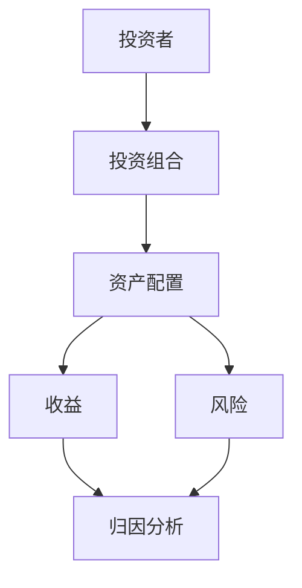
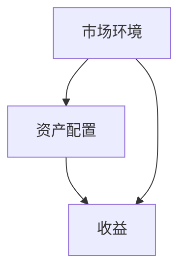
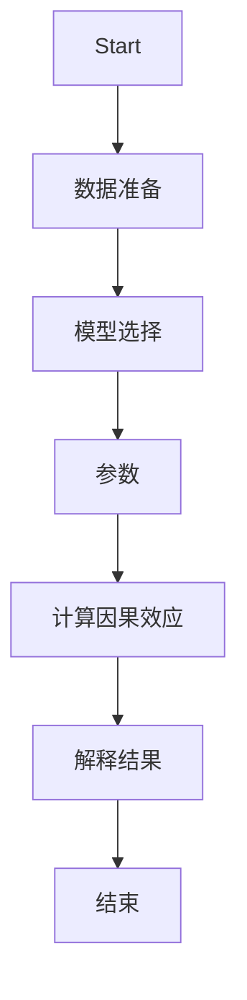
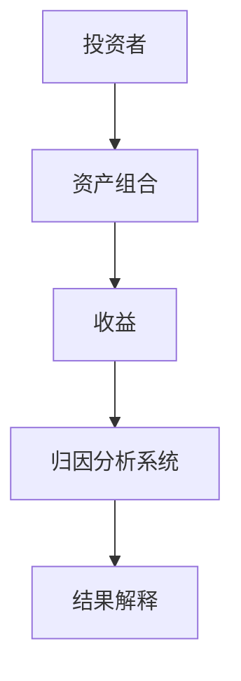
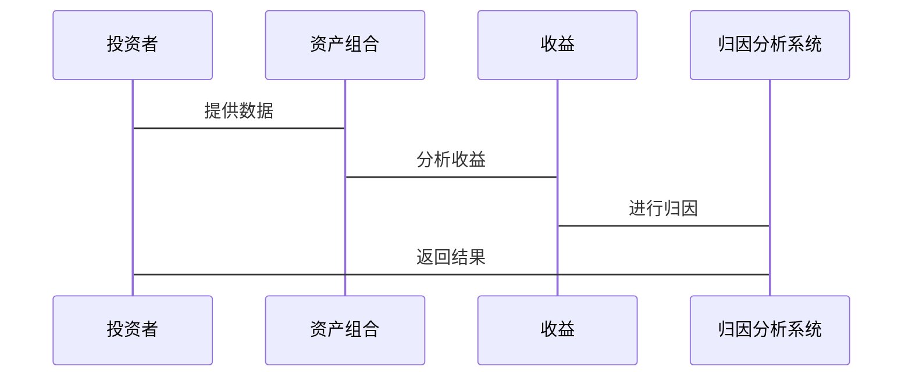

                 


## 《金融领域因果推断在投资策略归因分析中的应用》

### 关键词：因果推断，投资策略，归因分析，金融建模，数学模型

### 摘要：本文深入探讨了因果推断在金融投资策略归因分析中的应用，从基本原理到具体实现，结合实际案例，系统阐述了如何利用因果推断来分析投资收益的来源，优化投资组合，并提升决策的科学性和准确性。

---

# 第1章: 背景介绍

## 1.1 问题背景

### 1.1.1 金融投资中的归因分析需求
- 投资者需要了解投资组合收益的具体来源，如资产配置、个股选择或市场时机。
- 归因分析帮助识别哪些决策对收益贡献最大，从而优化未来的投资策略。

### 1.1.2 因果推断在金融分析中的重要性
- 传统的统计方法只能揭示相关性，无法确定因果关系。
- 因果推断能够识别变量之间的因果关系，帮助投资者做出更科学的决策。

### 1.1.3 传统统计推断的局限性
- 传统回归分析只能捕捉相关性，无法排除其他变量的干扰。
- 在复杂金融环境中，变量之间可能存在复杂的交互作用，传统方法难以捕捉。

## 1.2 问题描述

### 1.2.1 投资策略归因分析的目标
- 分解投资收益，识别各因素的贡献。
- 理解各因素对收益的影响机制。

### 1.2.2 因果推断在归因分析中的应用场景
- 分析资产配置对收益的影响。
- 确定个股选择对整体收益的贡献。

### 1.2.3 问题解决的必要性
- 优化投资策略，提高收益。
- 控制风险，避免依赖相关性误导。

## 1.3 问题解决

### 1.3.1 因果推断的基本原理
- 确定因果关系，而非相关关系。
- 通过实验或观察数据，推断变量之间的因果路径。

### 1.3.2 投资策略归因分析的方法
- 使用因果推断分解收益来源。
- 确定各因素对收益的因果贡献。

### 1.3.3 传统方法与因果推断的对比
- 传统方法：相关性分析，无法确定因果。
- 因果推断：识别因果关系，提供更准确的归因。

## 1.4 边界与外延

### 1.4.1 因果推断的适用范围
- 适用于有明确因果关系的变量分析。
- 需要足够的数据支持因果关系的推断。

### 1.4.2 归因分析的边界条件
- 数据质量和数量限制。
- 模型假设的合理性。

### 1.4.3 与其他金融分析方法的关系
- 因果推断补充传统统计方法的不足。
- 结合其他方法，提供更全面的分析。

## 1.5 概念结构与核心要素

### 1.5.1 因果推断的核心要素
- 潜在结果：每个变量在不同情况下的结果。
- 因果图：变量之间的因果关系网络。

### 1.5.2 归因分析的框架模型
- 五因素模型：资产配置、证券选择、行业选择、地域选择、市场时机。
- 每个因素的影响程度。

### 1.5.3 核心概念之间的关系
- 因果图展示各因素之间的相互作用。
- 潜在结果用于衡量每个因素的独立影响。

---

# 第2章: 核心概念与联系

## 2.1 核心概念原理

### 2.1.1 因果推断的基本原理
- 确定因果关系，而非相关性。
- 通过干预或观察数据推断因果。

### 2.1.2 潜在结果框架
- 定义每个变量在不同情况下的结果。
- 通过比较潜在结果，确定因果影响。

### 2.1.3 因果图模型
- 用图表示变量之间的因果关系。
- 通过调整图中的路径，计算因果效应。

## 2.2 概念属性特征对比

### 2.2.1 因果关系与相关关系对比

| 特性       | 相关关系             | 因果关系             |
|------------|----------------------|----------------------|
| 定义       | 变量间的统计关联     | 变量间的因果联系     |
| 是否存在方向性 | 否                   | 是                   |
| 是否存在干预 | 否                   | 是                   |

### 2.2.2 不同因果推断方法的特征对比

| 方法         | 定义                     | 适用场景             |
|--------------|--------------------------|----------------------|
| 倾向评分匹配 | 通过匹配相似样本，减少偏差 | 处理存在混杂变量的情况 |
| 工具变量法 | 利用工具变量，估计因果效应 | 工具变量可观察的情况 |

### 2.2.3 归因分析中的关键属性

| 属性       | 描述                     |
|------------|--------------------------|
| 资产配置     | 不同资产的比例分配       |
| 证券选择     | 个股的选择标准           |
| 行业选择     | 行业权重的调整           |
| 市场时机     | 市场走势的预测能力       |
| 地域选择     | 不同地区的资产配置       |

## 2.3 ER实体关系图



---

# 第3章: 算法原理讲解

## 3.1 算法流程

### 3.1.1 因果推断的基本流程
1. 收集数据
2. 构建因果图
3. 选择合适的因果推断方法
4. 计算因果效应
5. 解释结果

### 3.1.2 投资策略归因分析的算法步骤
1. 数据准备
2. 确定归因因素
3. 构建因果图模型
4. 应用因果推断算法计算各因素的影响
5. 分析结果并优化投资策略

## 3.2 算法实现

### 3.2.1 倾向评分匹配

```python
import numpy as np
import pandas as pd

def propensity_score_matching(treatment, outcome, covariates):
    # 假设treatment是处理变量（1表示处理，0表示对照）
    # outcome是结果变量
    # covariates是协变量
    # 建立倾向评分模型
    model = sm.Logit(outcome, sm.add_constant(covariates))
    result = model.fit()
    propensity_scores = result.predict()
    # 匹配对照组和处理组
    matched_pairs = []
    for t in treatment.unique():
        for _ in range(len(treatment[treatment == t])):
            matched_pairs.append(propensity_scores[treatment == t].values[0])
    return matched_pairs
```

### 3.2.2 工具变量法

```python
import statsmodels.api as sm

def instrumental_variable回归(endogenous_var, instrument, exogenous_vars, data):
    # 建立工具变量回归模型
    model = sm.OLS(endogenous_var, sm.add_constant(exogenous_vars))
    result = model.fit()
    return result.params[instrument]  # 返回因果效应
```

### 3.2.3 结构方程模型



## 3.3 算法流程图



---

# 第4章: 系统分析与架构设计

## 4.1 系统分析

### 4.1.1 问题场景
- 投资者需要分析投资组合的收益来源。
- 使用因果推断方法进行归因分析。

### 4.1.2 系统功能设计


### 4.1.3 系统架构设计



### 4.1.4 系统接口设计
- 输入接口：投资者的资产组合数据。
- 输出接口：归因分析结果。

## 4.2 交互序列图



---

# 第5章: 项目实战

## 5.1 环境安装

```bash
pip install numpy pandas statsmodels
```

## 5.2 核心实现

```python
import numpy as np
import pandas as pd
import statsmodels.api as sm

def causal_inference_analysis(data, treatment, outcome, covariates):
    # 构建因果图
    model = sm.Logit(outcome, sm.add_constant(covariates))
    result = model.fit()
    propensity_scores = result.predict()
    # 进行倾向评分匹配
    matched_data = data.copy()
    matched_data['matched'] = propensity_scores.round()
    # 计算因果效应
    treated_effect = result.params[treatment].round(2)
    return treated_effect

# 示例数据
data = pd.DataFrame({
    '资产配置': np.random.randn(100),
    '收益': np.random.randn(100),
    '行业选择': np.random.randn(100),
    '个股选择': np.random.randn(100)
})

treatment = '资产配置'
outcome = '收益'
covariates = ['行业选择', '个股选择']

result = causal_inference_analysis(data, treatment, outcome, covariates)
print(result)
```

## 5.3 案例分析

### 5.3.1 数据预处理
- 清洗数据，处理缺失值和异常值。

### 5.3.2 模型训练
- 使用倾向评分匹配或工具变量法训练模型。

### 5.3.3 结果分析
- 解释各因素对收益的因果效应。

## 5.4 实战总结
- 确定因果效应，优化投资策略。

---

# 第6章: 小结

## 6.1 总结

- 因果推断在投资策略归因分析中的应用，帮助投资者更准确地理解收益来源。
- 通过因果图和倾向评分匹配等方法，识别因果关系，优化投资决策。

## 6.2 最佳实践 tips

- 数据质量至关重要，确保数据完整性和准确性。
- 结合多种方法，提高分析的准确性。
- 定期更新模型，适应市场变化。

## 6.3 注意事项

- 模型假设需合理，避免误导性结论。
- 解释结果时，考虑外部因素的影响。

## 6.4 拓展阅读

- 推荐阅读相关书籍和论文，深入理解因果推断的应用。

---

通过以上结构化的内容，读者可以系统地了解因果推断在金融投资策略归因分析中的应用，掌握相关理论和实践技巧。

