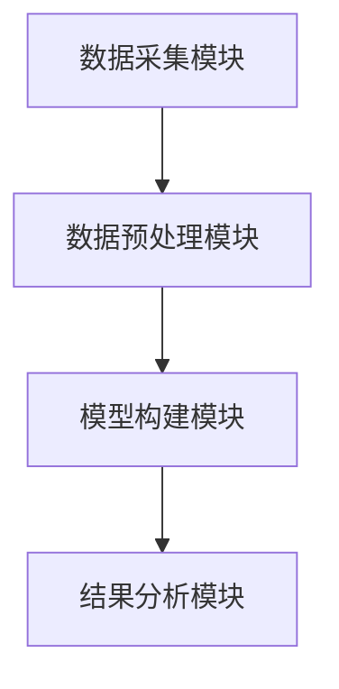

                 


# 《金融领域因果推断在货币政策传导机制分析中的应用》

> 关键词：货币政策，因果推断，信贷渠道，资产价格渠道，结构方程模型

> 摘要：本文探讨了因果推断在分析货币政策传导机制中的应用，通过详细分析货币政策的传导路径、金融领域的特殊性以及具体的数学模型和算法实现，展示了如何利用因果推断来理解货币政策对实体经济的影响。

---

## 第一部分: 背景与基础

### 第1章: 货币政策传导机制概述

#### 1.1 货币政策的基本概念

##### 1.1.1 货币政策的定义与目标
货币政策是中央银行通过调节货币供应量和利率等工具，以实现经济发展目标（如稳定物价、促进就业、经济增长和国际收支平衡）的一种宏观调控手段。货币政策的目标通常包括短期目标（如调整利率）和长期目标（如实现价格稳定和经济增长）。

##### 1.1.2 货币政策的工具与实施主体
货币政策的实施工具主要包括公开市场操作、调整法定存款准备金率、调整再贴现率、窗口指导等。实施主体通常是中央银行，如中国人民银行、美联储等。

##### 1.1.3 货币政策传导机制的路径与层次
货币政策的传导机制通常包括以下路径：
1. **直接渠道**：中央银行通过调整利率直接影响市场利率。
2. **信贷渠道**：利率变化影响银行信贷行为，进而影响企业和个人的借贷行为。
3. **资产价格渠道**：利率变化影响资产价格，进而影响企业和个人的财富效应。
4. **汇率渠道**：利率变化影响汇率，进而影响出口和进口。

#### 1.2 货币政策传导机制的核心问题

##### 1.2.1 传导机制的复杂性
货币政策的传导机制涉及多个中间变量，如利率、信贷、资产价格等，这些变量之间可能存在复杂的相互作用。

##### 1.2.2 传统传导机制的局限性
传统的货币政策传导机制分析通常基于相关关系的统计模型，但相关关系并不能完全反映因果关系，可能导致政策分析的偏差。

##### 1.2.3 引入因果推断的必要性
因果推断可以帮助我们识别货币政策变量之间的因果关系，从而更准确地分析货币政策的传导机制。

### 第2章: 因果推断的基本概念与方法

#### 2.1 因果关系与相关关系的区别

##### 2.1.1 相关关系的局限性
相关关系只能反映变量之间的关联程度，不能确定变量之间的因果关系。例如，高利率可能与低投资相关，但高利率可能是低投资的结果，而不是原因。

##### 2.1.2 因果关系的定义与特征
因果关系是指一个变量的变化直接导致另一个变量的变化。因果关系具有时间顺序性和可干预性。

##### 2.1.3 因果推断的基本框架
因果推断的基本框架包括识别因果关系、估计因果效应和验证因果关系的步骤。

#### 2.2 潜在结果框架

##### 2.2.1 潜在结果的概念
潜在结果是指在某个特定的干预下，个体可能产生的结果。例如，如果政策利率提高，企业可能选择减少投资，这就是一个潜在结果。

##### 2.2.2 因果效应的定义
因果效应是指在干预情况下，处理组和对照组之间的平均结果差异。

##### 2.2.3 潜在结果框架的应用
潜在结果框架广泛应用于随机对照试验（RCT）和观察数据的因果推断。

#### 2.3 常见的因果推断方法

##### 2.3.1 随机化试验
随机化试验是通过随机分配处理组和对照组，以确保变量之间的因果关系。

##### 2.3.2 倾向评分匹配
倾向评分匹配是一种通过匹配处理组和对照组，以平衡协变量的因果推断方法。

##### 2.3.3 工具变量法
工具变量法是一种通过引入工具变量来解决内生性问题的因果推断方法。

##### 2.3.4 结构方程模型
结构方程模型是一种通过构建方程组来描述变量之间因果关系的方法。

---

### 第3章: 金融领域因果推断的特殊性

#### 3.1 金融数据的特性

##### 3.1.1 数据的高维性
金融数据通常包含大量的变量，如利率、汇率、股票价格等，导致数据维度较高。

##### 3.1.2 数据的异质性
金融数据可能来自不同的市场、不同的金融机构，具有异质性。

##### 3.1.3 数据的动态性
金融数据具有很强的动态性，价格和利率等变量会随时变化。

#### 3.2 金融领域因果推断的挑战

##### 3.2.1 数据偏差问题
金融数据可能存在样本选择偏差、测量误差等问题，影响因果推断的准确性。

##### 3.2.2 模型假设的限制
因果推断方法通常依赖于一定的假设，如工具变量的合理性、排除性假设等，这些假设在金融领域可能难以满足。

##### 3.2.3 金融市场的复杂性
金融市场存在复杂的互动关系，如市场参与者的博弈行为、信息不对称等，增加了因果推断的难度。

#### 3.3 金融领域因果推断的解决方案

##### 3.3.1 数据预处理方法
数据预处理方法包括数据清洗、降维、变量变换等，以提高数据质量。

##### 3.3.2 模型选择策略
选择合适的因果推断方法，如工具变量法、结构方程模型等，以适应金融数据的特性。

##### 3.3.3 结果验证方法
通过交叉验证、敏感性分析等方法，验证因果推断结果的稳健性。

---

## 第二部分: 货币政策传导机制的因果分析框架

### 第4章: 货币政策传导机制的理论模型

#### 4.1 货币政策传导机制的理论模型

##### 4.1.1 信贷渠道
信贷渠道是指货币政策通过影响银行信贷供给，进而影响企业和个人的投资和消费行为。

##### 4.1.2 资产价格渠道
资产价格渠道是指货币政策通过影响资产价格，进而影响企业和个人的财富效应。

##### 4.1.3 汇率渠道
汇率渠道是指货币政策通过影响汇率，进而影响出口和进口。

##### 4.1.4 利率渠道
利率渠道是指货币政策通过影响市场利率，进而影响企业和个人的借贷成本。

#### 4.2 因果推断在货币政策传导机制中的应用

##### 4.2.1 因果关系的识别
识别货币政策变量之间的因果关系，如利率变化是否导致信贷变化。

##### 4.2.2 因果效应的分解
分解货币政策通过不同渠道对实体经济的影响效应。

---

## 第三部分: 数学模型与算法实现

### 第5章: 数学模型与算法实现

#### 5.1 结构方程模型

##### 5.1.1 结构方程模型的定义
结构方程模型是一种通过构建方程组来描述变量之间因果关系的方法。

##### 5.1.2 结构方程模型的数学表达
结构方程模型可以用以下公式表示：
$$
y = \beta x + \epsilon
$$
其中，$y$ 是因变量，$x$ 是自变量，$\beta$ 是系数，$\epsilon$ 是误差项。

##### 5.1.3 结构方程模型的实现步骤
1. 确定变量之间的因果关系。
2. 构建结构方程模型的方程组。
3. 估计模型参数。
4. 验证模型的合理性。

#### 5.2 工具变量法

##### 5.2.1 工具变量法的定义
工具变量法是一种通过引入工具变量来解决内生性问题的因果推断方法。

##### 5.2.2 工具变量法的数学表达
工具变量法可以用以下公式表示：
$$
y = \alpha z + \beta x + \epsilon
$$
其中，$y$ 是因变量，$z$ 是工具变量，$x$ 是内生变量，$\alpha$ 和 $\beta$ 是系数，$\epsilon$ 是误差项。

##### 5.2.3 工具变量法的实现步骤
1. 选择合适的工具变量。
2. 进行工具变量回归。
3. 检验工具变量的合理性。

---

## 第四部分: 系统架构与项目实战

### 第6章: 系统架构与项目实战

#### 6.1 系统架构设计

##### 6.1.1 系统功能设计
系统功能包括数据采集、模型构建和结果分析。

##### 6.1.2 系统架构图
以下是一个简单的系统架构图，展示了各模块之间的关系：



#### 6.2 项目实战

##### 6.2.1 环境配置
需要安装Python、Pandas、NumPy、Scikit-learn等库。

##### 6.2.2 核心代码实现
以下是工具变量法的Python代码示例：

```python
import numpy as np
import statsmodels.api as sm

# 生成数据
n = 1000
z = np.random.normal(0, 1, n)
x = z + np.random.normal(0, 1, n)
y = 2 * x + 3 * z + np.random.normal(0, 1, n)

# 构建模型
model = sm.OLS(y, sm.add_constant(x))
results = model.fit()

# 显示结果
print(results.params)
```

##### 6.2.3 案例分析
以货币政策对信贷的影响为例，分析工具变量法的应用。

---

## 第五部分: 总结与展望

### 第7章: 总结与展望

#### 7.1 总结
本文探讨了因果推断在货币政策传导机制分析中的应用，通过理论分析和实际案例，展示了因果推断在金融领域的强大能力。

#### 7.2 展望
未来的研究可以进一步探索更多因果推断方法在货币政策传导机制中的应用，同时结合大数据和机器学习技术，提高分析的准确性和效率。

---

### 注意事项

1. 本文中的代码和图表仅为示例，实际应用中需要根据具体数据和场景进行调整。
2. 因果推断需要依赖一定的假设，因此在实际应用中需要谨慎选择工具变量和模型。
3. 数据分析结果仅供参考，实际政策制定需要结合多方面因素。

---

### Tips

- **因果推断的核心在于识别因果关系，而不是仅仅寻找相关关系。**
- **在金融领域，因果推断的应用需要结合具体场景，选择合适的工具和方法。**
- **数据质量和模型假设对因果推断的结果有重要影响，因此在实际应用中需要特别注意。**

---

通过本文的分析，我们可以看到因果推断在货币政策传导机制分析中的巨大潜力，同时也需要我们不断探索和实践，以更好地服务于金融领域的实际需求。

