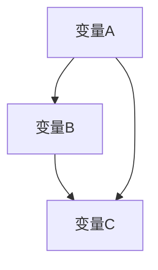
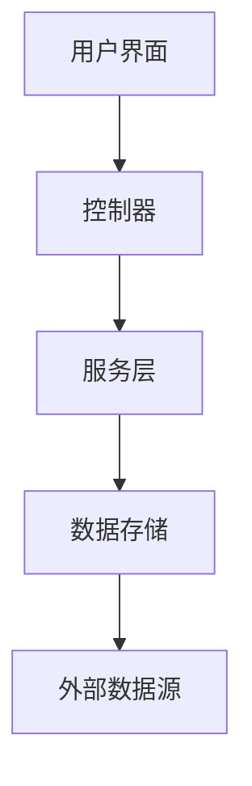
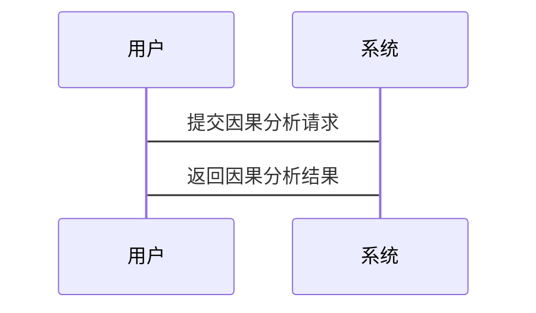

                 


---

# 《金融领域因果推断的研究与应用》

## 关键词：因果推断，金融分析，时间序列，系统性风险，资产定价，工具变量法

## 摘要：本文系统地探讨了因果推断在金融领域的研究与应用。从因果推断的基本理论出发，分析了其在金融数据中的独特挑战，详细介绍了因果推断的核心方法及其在资产定价、风险管理和金融时间序列分析中的具体应用。通过实际案例和系统设计，展示了如何利用因果推断解决复杂的金融问题，并总结了未来的研究方向。

---

# 第1章：因果推断的基本概念与背景

## 1.1 因果推断的定义与特点

### 1.1.1 因果关系的定义
因果关系是指一个事件（原因）导致另一个事件（结果）发生的必然联系。在统计学中，因果推断试图通过观察数据推断变量之间的因果关系，而不仅仅是相关关系。例如，因果推断可以帮助我们确定“变量A是否导致变量B的变化”，而不仅仅是“变量A与变量B相关”。

### 1.1.2 因果推断与相关概念的对比
| 概念 | 描述 |
|------|------|
| 相关关系 | 两个变量之间存在统计上的关联，但不一定存在因果关系。 |
| 因果关系 | 一个变量的变化直接导致另一个变量的变化。 |
| 调整方法 | 通过控制其他变量来估计因果效应的方法。 |
| 工具变量法 | 使用一个工具变量来估计因果效应，通常用于处理内生性问题。 |

### 1.1.3 金融领域因果推断的背景与意义
金融领域因果推断的背景可以追溯到金融市场分析的需求。传统统计方法往往只能发现相关关系，而无法确定因果关系。例如，在资产定价中，相关关系可能表明某种资产与市场指数相关，但因果推断可以帮助我们确定市场指数是否影响该资产的收益。

---

## 1.2 金融领域因果推断的背景

### 1.2.1 金融数据分析的复杂性
金融数据通常具有以下特点：
- **内生性**：变量之间的关系可能是双向的，例如，资产收益可能影响市场指数，市场指数也可能影响资产收益。
- **异质性**：不同资产或市场的行为可能不同。
- **时间依赖性**：金融数据通常具有时间序列特性，例如滞后效应和趋势。

### 1.2.2 传统统计推断的局限性
传统统计方法（如回归分析）通常只能发现相关关系，而无法确定因果关系。例如，回归分析可能会显示两个变量之间的显著相关性，但无法排除其他潜在变量的影响。

### 1.2.3 因果推断在金融研究中的应用前景
因果推断在金融研究中的应用前景广阔。例如：
- 资产定价：确定哪些因素影响资产收益。
- 风险管理：识别哪些因素可能导致市场波动。
- 金融政策评估：评估政策变化对市场的影响。

---

## 1.3 本章小结
本章介绍了因果推断的基本概念和特点，并讨论了其在金融领域的背景与意义。因果推断可以帮助我们从相关关系中区分出因果关系，从而更好地理解和预测金融市场的行为。

---

# 第2章：因果推断的基本理论

## 2.1 因果关系的数学定义

### 2.1.1 随机变量与因果关系
随机变量是指其取值具有不确定性，且其概率分布可以通过数据估计的变量。在因果推断中，我们通常需要定义处理变量（Treatment）、结果变量（Outcome）和潜在结果（Potential Outcome）。

### 2.1.2 因果图模型
因果图模型是一种用于表示因果关系的图形化工具。它通过绘制变量之间的因果关系，帮助我们识别因果路径和潜在的混淆变量。

**Mermaid图示例：**


### 2.1.3 潜在结果框架
潜在结果框架是因果推断的核心理论之一。它假设每个单元在每个处理水平下都有一个潜在的结果。例如，对于一个二分类处理变量，每个单元在处理组和对照组下都有一个潜在的结果。

---

## 2.2 因果推断的核心原理

### 2.2.1 因果作用的识别
因果作用的识别是指通过观察数据，推断出因果效应的方法。常用的识别方法包括调整方法和工具变量法。

### 2.2.2 调整方法与因果推断
调整方法是通过控制其他变量，消除混淆变量的影响，从而估计因果效应。例如，在回归分析中，我们可以控制其他变量，以估计处理变量对结果变量的净效应。

### 2.2.3 随机化与倾向评分
随机化是一种通过随机分配处理变量，确保处理组和对照组之间除了处理变量外，其他变量都均衡的方法。倾向评分是一种通过估计每个单元被分配到处理组的概率，调整观察数据，以估计因果效应的方法。

---

## 2.3 金融领域因果推断的特殊性

### 2.3.1 金融数据的异质性
金融数据的异质性是指不同资产或市场的行为可能不同。例如，某些资产可能对市场指数的变化更敏感，而其他资产可能不受影响。

### 2.3.2 市场微观结构的影响
市场微观结构是指市场中买卖双方的互动方式，例如订单簿、交易量和价格变动。这些因素可能会影响因果关系的识别。

### 2.3.3 金融时间序列的特性
金融时间序列通常具有以下特性：
- **趋势**：数据可能呈现长期趋势。
- **周期性**：数据可能具有季节性或周期性波动。
- **波动性**：数据可能具有较高的波动性。

---

## 2.4 本章小结
本章介绍了因果推断的基本理论，包括因果关系的数学定义、因果图模型和潜在结果框架。同时，讨论了金融领域因果推断的特殊性，包括金融数据的异质性、市场微观结构的影响和金融时间序列的特性。

---

# 第3章：金融领域因果分析的挑战与方法

## 3.1 金融因果分析的挑战

### 3.1.1 数据的内生性问题
内生性问题是指解释变量和误差项之间存在相关性，导致回归系数估计有偏。例如，在资产定价中，市场指数和资产收益可能同时受到其他因素的影响。

### 3.1.2 金融市场的复杂性
金融市场的复杂性包括多个变量之间的相互作用，例如，市场指数可能影响资产收益，而资产收益也可能反过来影响市场指数。

### 3.1.3 时间序列的动态性
金融时间序列通常具有动态性，例如滞后效应和自相关性。这使得因果关系的识别更加复杂。

---

## 3.2 金融因果分析的主要方法

### 3.2.1 调整方法
调整方法是通过控制其他变量，消除混淆变量的影响，从而估计因果效应。例如，在回归分析中，我们可以控制其他变量，以估计处理变量对结果变量的净效应。

### 3.2.2 工具变量法
工具变量法是一种通过使用工具变量来估计因果效应的方法。工具变量需要满足两个条件：
1. 工具变量与处理变量相关。
2. 工具变量与结果变量仅通过处理变量影响。

### 3.2.3 断点回归
断点回归是一种通过分析断点附近的行为，估计因果效应的方法。断点是指处理变量刚好达到某个阈值的点。例如，在政策评估中，断点回归可以用于估计政策变化对结果变量的影响。

---

## 3.3 本章小结
本章讨论了金融因果分析的主要挑战，包括数据的内生性问题、金融市场的复杂性和时间序列的动态性。同时，介绍了几种常用的因果分析方法，包括调整方法、工具变量法和断点回归。

---

# 第4章：金融领域因果推断的应用场景

## 4.1 资产定价与风险分析

### 4.1.1 资产收益的因果分析
资产收益的因果分析可以帮助我们确定哪些因素影响资产收益。例如，我们可以使用工具变量法来估计市场指数对资产收益的影响。

### 4.1.2 风险因素的因果关系
风险因素的因果关系分析可以帮助我们确定哪些因素是系统性风险的驱动因素。例如，我们可以使用因果图模型来识别系统性风险的主要来源。

### 4.1.3 资产配置的因果推断
资产配置的因果推断可以帮助我们确定哪些资产对投资组合的收益贡献更大。例如，我们可以使用潜在结果框架来估计不同资产对投资组合收益的因果效应。

---

## 4.2 金融时间序列分析

### 4.2.1 时间序列的因果关系
时间序列的因果关系分析可以帮助我们确定哪些滞后变量对当前结果变量有显著影响。例如，我们可以使用Granger因果检验来判断变量A是否是变量B的Granger原因。

### 4.2.2 动态因果模型
动态因果模型是一种用于分析时间序列数据中动态因果关系的模型。它可以通过建模变量之间的动态关系，估计因果效应。

### 4.2.3 金融事件的因果分析
金融事件的因果分析可以帮助我们确定哪些事件对市场有显著影响。例如，我们可以使用工具变量法来估计金融危机对市场收益的影响。

---

## 4.3 金融网络与系统性风险

### 4.3.1 金融网络的因果关系
金融网络的因果关系分析可以帮助我们确定哪些机构或市场对金融系统的稳定性有较大影响。例如，我们可以使用因果图模型来识别系统性风险的关键节点。

### 4.3.2 系统性风险的因果推断
系统性风险的因果推断可以帮助我们确定哪些因素是系统性风险的主要驱动因素。例如，我们可以使用潜在结果框架来估计不同因素对系统性风险的因果效应。

### 4.3.3 金融危机的预警与分析
金融危机的预警与分析可以帮助我们提前识别潜在的金融风险。例如，我们可以使用因果推断方法来分析金融危机的前兆因素。

---

## 4.4 本章小结
本章介绍了因果推断在金融领域的应用场景，包括资产定价与风险分析、金融时间序列分析和金融网络与系统性风险。通过这些应用，我们可以更好地理解和预测金融市场的行为。

---

## 4.5 本章小结
本章讨论了因果推断在金融领域的应用场景，包括资产定价与风险分析、金融时间序列分析和金融网络与系统性风险。通过这些应用，我们可以更好地理解和预测金融市场的行为。

---

## 第5章：金融领域因果推断的系统设计与实现

## 5.1 系统功能设计

### 5.1.1 问题场景介绍
在金融领域，因果推断的系统设计通常涉及以下问题场景：
- 如何处理大规模金融数据？
- 如何选择合适的因果分析方法？
- 如何可视化因果关系？

### 5.1.2 系统功能需求
- 数据获取与处理：从金融数据源获取数据，并进行清洗和预处理。
- 因果模型构建：选择合适的因果分析方法，构建因果模型。
- 结果分析与可视化：对因果分析结果进行可视化展示，并生成报告。

### 5.1.3 系统架构设计



### 5.1.4 系统交互设计



---

## 5.2 系统实现细节

### 5.2.1 数据获取与处理
- 数据获取：通过API或数据库获取金融数据。
- 数据清洗：处理缺失值、异常值等。
- 数据预处理：对数据进行标准化、归一化等处理。

### 5.2.2 因果模型构建
- 方法选择：根据具体问题选择合适的因果分析方法，例如工具变量法或断点回归。
- 模型实现：使用Python或其他编程语言实现因果分析模型。

### 5.2.3 结果分析与可视化
- 结果分析：对因果分析结果进行分析和解释。
- 结果可视化：使用图表展示因果关系，例如因果图或回归系数可视化。

---

## 5.3 本章小结
本章讨论了因果推断在金融领域的系统设计与实现，包括系统功能设计、系统架构设计和系统交互设计。通过系统的实现，我们可以更高效地应用因果推断方法解决金融问题。

---

## 第6章：金融领域因果推断的项目实战

## 6.1 项目背景与目标

### 6.1.1 项目背景
本项目旨在通过因果推断方法，分析资产定价中的因果关系，帮助投资者更好地理解市场行为。

### 6.1.2 项目目标
- 确定哪些因素影响资产收益。
- 估计市场指数对资产收益的因果效应。

---

## 6.2 项目实施步骤

### 6.2.1 环境配置
- 安装必要的Python库，例如pandas、numpy、scikit-learn和 causalnex。

### 6.2.2 数据预处理
- 获取金融数据，例如股票价格和市场指数。
- 清洗数据，处理缺失值和异常值。

### 6.2.3 模型实现
- 使用工具变量法估计市场指数对资产收益的因果效应。
- 使用因果图模型可视化因果关系。

### 6.2.4 结果分析
- 解释因果分析结果，确定哪些因素对资产收益有显著影响。

### 6.2.5 代码实现

```python
import pandas as pd
import numpy as np
from causalnex因果推断库 import 因果模型

# 数据获取与处理
data = pd.read_csv('金融数据.csv')
data = data.dropna()

# 因果模型构建
model = 因果模型()
model.fit(data)

# 结果分析
result = model.estimate_causal_effect('市场指数', '资产收益')
print(result)
```

---

## 6.3 本章小结
本章通过一个实际项目，展示了因果推断在资产定价中的应用。通过项目实施，我们可以更好地理解因果推断方法在金融分析中的具体应用。

---

## 第7章：总结与展望

## 7.1 本章总结
本文系统地探讨了因果推断在金融领域的研究与应用。从因果推断的基本理论出发，分析了其在金融数据中的独特挑战，详细介绍了因果推断的核心方法及其在资产定价、风险管理和金融时间序列分析中的具体应用。通过实际案例和系统设计，展示了如何利用因果推断解决复杂的金融问题。

---

## 7.2 未来研究方向

### 7.2.1 因果推断与机器学习的结合
未来的研究可以探索因果推断与机器学习的结合，例如使用深度学习方法估计因果效应。

### 7.2.2 金融时间序列的因果分析
未来的研究可以进一步探索金融时间序列的因果分析，例如动态因果模型的应用。

### 7.2.3 金融网络的因果关系
未来的研究可以进一步探索金融网络的因果关系，例如识别系统性风险的关键节点。

---

## 7.3 本章小结
本文总结了因果推断在金融领域的研究与应用，并展望了未来的研究方向。未来的研究可以进一步探索因果推断与机器学习的结合、金融时间序列的因果分析和金融网络的因果关系。

---

## 附录：工具包安装与使用指南

### 附录A：工具包安装
- 使用pip安装必要的Python库：
  ```bash
  pip install pandas numpy scikit-learn causalnex
  ```

### 附录B：工具包使用指南
- 使用 causalnex 库进行因果分析：
  ```python
  from causalnex因果推断库 import 因果模型
  model = 因果模型()
  model.fit(data)
  result = model.estimate_causal_effect('处理变量', '结果变量')
  print(result)
  ```

---

# 结语
因果推断在金融领域的研究与应用是一个充满挑战但又极具潜力的领域。通过本文的探讨，我们可以看到，因果推断不仅可以帮助我们更好地理解金融市场的行为，还可以为金融决策提供更有力的支持。未来的研究可以进一步探索因果推断与机器学习的结合，以及金融时间序列和金融网络中的因果关系。

