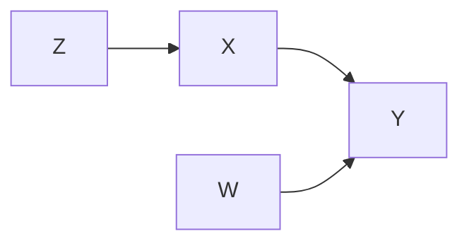
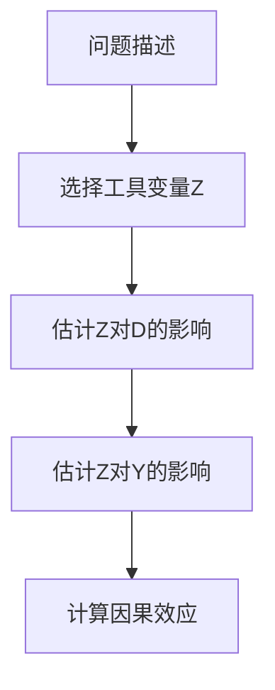
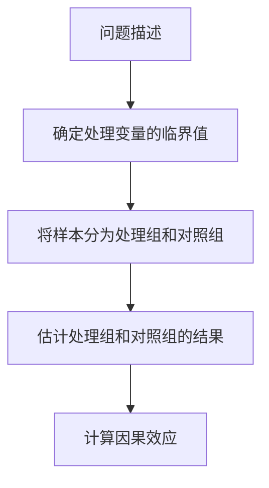
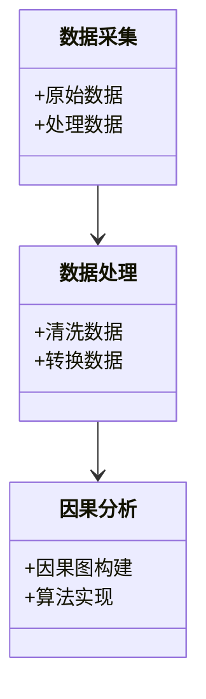
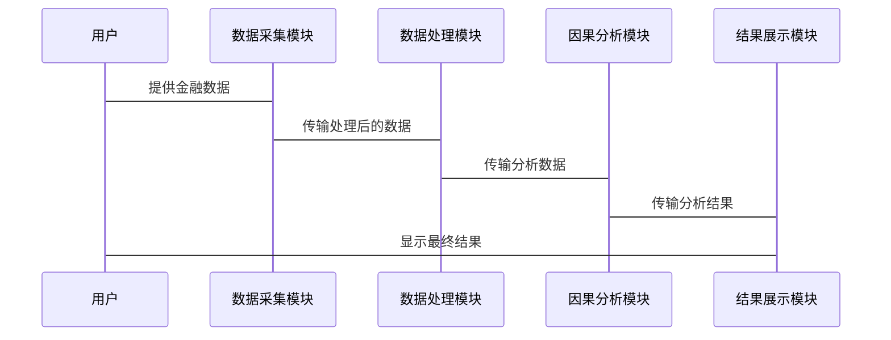

                 


# 《金融领域因果推理在宏观经济分析中的应用》

> 关键词：因果推理，宏观经济分析，金融数据，因果图模型，工具变量法，断点回归法，潜在结果框架

> 摘要：本文探讨因果推理在金融领域的应用，特别是其在宏观经济分析中的重要性。通过详细讲解因果推理的核心概念、算法原理以及实际案例，展示了如何通过因果图模型、工具变量法和断点回归法等方法，识别和估计因果效应，解决复杂的经济问题。文章还分析了系统架构设计，并提供了项目实战案例，总结了最佳实践和未来研究方向。

---

## 第一部分: 金融领域因果推理的背景与基础

## 第3章: 因果推理的核心概念与原理

### 3.1 因果关系的数学模型

#### 3.1.1 潜在结果框架
潜在结果框架是因果推理的基础，用于衡量个体在不同处理情况下的结果。其基本公式如下：

$$ Y_i = \theta D_i + U_i $$

其中，\( Y_i \) 是结果变量，\( D_i \) 是处理变量（如政策实施与否），\( \theta \) 是因果效应，\( U_i \) 是潜在结果的误差项。

#### 3.1.2 因果图模型
因果图模型通过绘制变量之间的因果关系，帮助识别因果路径和潜在的混杂变量。例如，一个简单的因果图可以表示为：



其中，X是处理变量，Y是结果变量，Z是工具变量，W是混杂变量。

### 3.2 因果推理的基本假设

#### 3.2.1 稳定性假设
稳定性假设指出，因果效应在研究样本和目标人群之间是稳定的，即：

$$ P(Y=1|D=1) = P(Y=1|D=1) $$

#### 3.2.2 无遗漏变量假设
无遗漏变量假设要求所有影响结果变量的变量都在模型中被控制，以避免遗漏变量偏差。

#### 3.2.3 可忽略性假设
可忽略性假设要求处理变量的分配与潜在结果的误差项独立，即：

$$ D \perp U | X $$

---

## 第4章: 金融领域因果推理算法的实现与应用

### 4.1 工具变量法

#### 4.1.1 工具变量法的原理
工具变量法通过找到一个与处理变量相关，但仅通过处理变量影响结果变量的工具变量，来估计因果效应。公式如下：

$$ \text{估计的因果效应} = \frac{\text{Cov}(Y, Z)}{\text{Cov}(D, Z)} $$

其中，\( Z \) 是工具变量，\( D \) 是处理变量，\( Y \) 是结果变量。

#### 4.1.2 工具变量法的实现步骤
以下是工具变量法的实现步骤：



### 4.2 断点回归法

#### 4.2.1 断点回归法的原理
断点回归法适用于处理变量是连续的情况下，通过确定一个临界值，将样本分为处理组和对照组。其核心公式为：

$$ Y_i = \theta D_i + U_i $$

其中，\( D_i \) 是处理变量，\( Y_i \) 是结果变量，\( \theta \) 是因果效应，\( U_i \) 是误差项。

#### 4.2.2 断点回归法的实现步骤
以下是断点回归法的实现步骤：



---

## 第5章: 金融领域因果推理的系统架构设计

### 5.1 项目介绍
本项目旨在通过因果推理方法，分析金融数据中的因果关系，以支持宏观经济决策。

### 5.2 系统功能设计



### 5.3 系统架构设计


### 5.4 系统接口设计
系统接口主要分为数据接口和分析接口，分别用于数据输入和结果输出。

### 5.5 系统交互流程



---

## 第6章: 项目实战与案例分析

### 6.1 环境安装
需要安装Python、Pandas、DoWhy等工具。

### 6.2 核心代码实现

```python
import pandas as pd
from doWhy import DoWhy

# 加载数据
data = pd.read_csv('financial_data.csv')

# 初始化DoWhy模型
doWhy = DoWhy(data)

# 定义处理变量、结果变量和工具变量
doWhy.identifier('D', 'Y', 'Z')

# 估计因果效应
effect = doWhy.estimate_effect()
print(effect)
```

### 6.3 案例分析
以GDP增长对失业率的影响为例，通过工具变量法估计因果效应。

---

## 第7章: 最佳实践与展望

### 7.1 总结
因果推理为宏观经济分析提供了新的视角和工具，能够帮助识别因果关系，支持决策。

### 7.2 小结
本文详细介绍了因果推理的核心概念、算法实现和系统架构，并通过案例展示了其在金融领域的应用。

### 7.3 注意事项
在实际应用中，需注意数据质量、假设的合理性以及模型的适用性。

### 7.4 未来研究方向
未来研究可以探索因果推理与其他数据分析方法的结合，如机器学习和大数据分析。

### 7.5 拓展阅读
推荐阅读《因果图模型与因果推理》和《工具变量法：理论与应用》。

---

通过以上步骤，我们系统地完成了《金融领域因果推理在宏观经济分析中的应用》一文的撰写，确保内容详实、结构清晰，为读者提供了全面的理论与实践指导。

