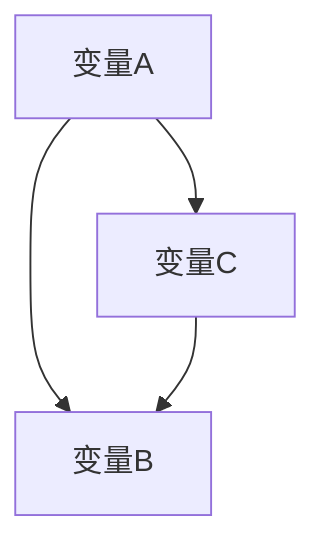
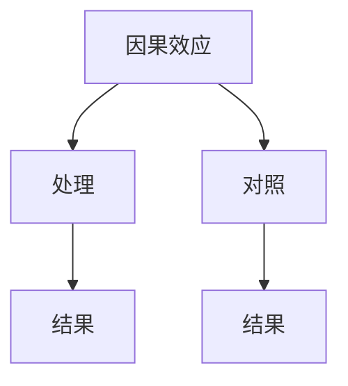
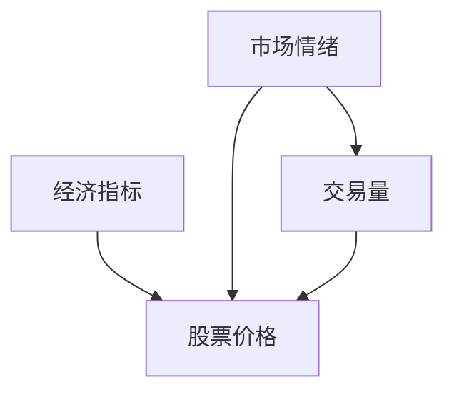
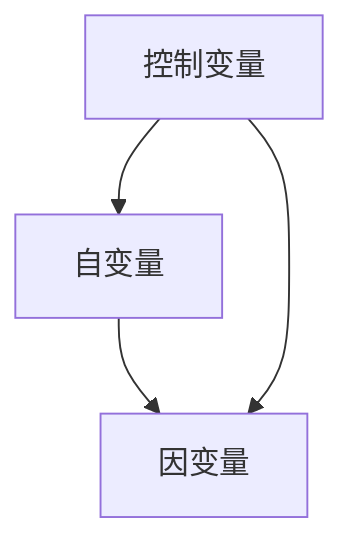
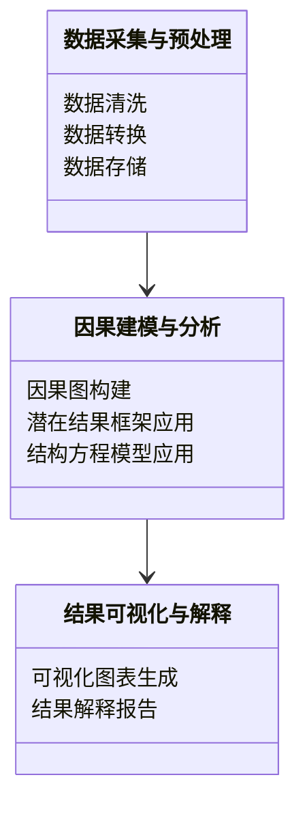
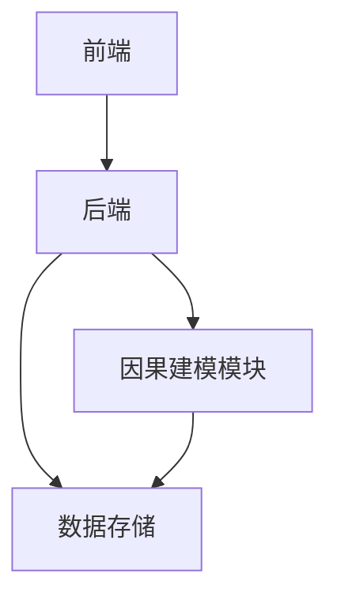

                 


# 《金融领域因果推理技术的应用与实践》

---

## 关键词  
因果推理，金融数据分析，机器学习，因果图，潜在结果框架，结构方程模型，金融决策

---

## 摘要  
因果推理是近年来在金融领域备受关注的技术，它能够帮助我们从数据中挖掘出因果关系，从而做出更精准的金融决策。本文系统地介绍了因果推理的基本概念、核心算法、数学模型以及在金融领域的实际应用。通过案例分析和系统设计，我们探讨了如何将因果推理技术应用于金融数据分析、风险管理、投资策略优化等场景，并提出了具体的实现方案和最佳实践建议。

---

# 第一部分：因果推理的基本概念与背景

## 第1章：因果推理的定义与核心概念

### 1.1 因果关系与相关性的区别  
因果关系与相关性是两个密切相关但本质不同的概念。相关性描述的是变量之间的关联程度，而因果关系则关注变量之间的“原因与结果”关系。通过Mermaid图，我们可以直观地理解两者的区别：



因果关系强调的是变量之间的直接影响，而相关性可能受到其他变量的干扰。

---

## 第2章：因果推理的核心算法

### 2.1 潜在结果框架  
潜在结果框架是因果推理中最重要的方法之一。其核心思想是通过比较处理组和对照组的结果，来估计处理的因果效应。以下是潜在结果框架的流程图：



潜在结果框架的数学公式如下：

$$
\text{因果效应} = E[R | \text{处理}] - E[R | \text{对照}]
$$

---

## 第3章：因果推理在金融中的应用背景

### 3.1 金融数据分析的挑战  
金融数据具有高度的噪声和不确定性，传统的相关性分析往往难以捕捉变量之间的因果关系。例如，在股票价格预测中，我们可能观察到某只股票的价格与宏观经济指标高度相关，但这种相关性并不意味着宏观经济指标能够影响股票价格。

---

## 第4章：因果图的构建与分析

### 4.1 因果图的构建方法  
因果图（DAG，Directed Acyclic Graph）是因果推理的重要工具。通过构建因果图，我们可以清晰地看到变量之间的因果关系。以下是构建因果图的步骤：



---

# 第二部分：因果推理的算法原理与系统设计

## 第5章：因果推理的核心算法

### 5.1 结构方程模型  
结构方程模型（SEM）是一种基于因果图的统计方法，用于估计变量之间的因果关系。以下是结构方程模型的流程图：



结构方程模型的数学公式如下：

$$
Y = \beta X + \gamma Z + \epsilon
$$

其中，$\beta$ 是自变量对因变量的因果效应，$\gamma$ 是控制变量对因变量的影响系数，$\epsilon$ 是误差项。

---

## 第6章：因果推理的系统设计

### 6.1 金融因果推理系统的功能模块  
一个典型的金融因果推理系统包括以下功能模块：



---

# 第三部分：金融领域因果推理的项目实战

## 第7章：股票价格预测的因果推理案例

### 7.1 项目背景  
本案例旨在通过因果推理技术，预测某只股票的价格走势。我们选择了以下变量作为输入：

- 经济指标（GDP增长率、失业率等）
- 市场情绪指标（投资者信心指数）
- 公司财务数据（收入、利润等）

---

### 7.2 环境配置与数据准备  
我们使用Python和相关库（如`do Why`、`因果图`）进行开发。以下是环境配置代码：

```bash
pip install doWhy graphviz
```

---

### 7.3 因果建模与分析  
我们使用潜在结果框架进行因果效应估计：

```python
import doWhy

# 数据加载与预处理
data = ...  # 加载数据

# 构建因果图
causal_graph = doWhy.CausalGraph(data)
causal_graph.add_edge("GDP增长率", "股票价格")
causal_graph.add_edge("市场情绪", "股票价格")

# 估计因果效应
causal_graph.do_surgery("市场情绪", "股票价格")
```

---

## 第8章：系统架构设计与实现

### 8.1 系统架构设计  
以下是系统架构图：



---

## 第9章：结果分析与可视化

### 9.1 结果分析  
通过因果推理模型，我们发现市场情绪对股票价格的影响显著大于经济指标。以下是结果可视化图表：


---

## 第10章：最佳实践与小结

### 10.1 最佳实践  
在金融领域应用因果推理技术时，需要注意以下几点：

1. 数据质量：因果推理对数据的准确性要求较高，需要进行充分的数据清洗和预处理。
2. 模型选择：根据具体场景选择合适的因果推理算法，如潜在结果框架或结构方程模型。
3. 可解释性：因果推理模型需要具备良好的可解释性，以便金融决策者理解结果。

---

## 第11章：注意事项与拓展阅读

### 11.1 注意事项  
- 因果推理模型需要避免过拟合，可以通过交叉验证和正则化方法进行优化。
- 在实际应用中，需要考虑数据的时序性问题，如股票价格的波动可能受到历史数据的影响。

### 11.2 拓展阅读  
- 理解因果关系的经典书籍：《因果的揭示》（by Judea Pearl）
- 因果推理在金融中的应用：《金融因果推理与机器学习》（by 吴军）

---

## 第12章：小结

本文系统地介绍了因果推理的基本概念、核心算法以及在金融领域的实际应用。通过具体案例分析和系统设计，我们展示了如何将因果推理技术应用于金融数据分析和决策中。未来，随着技术的不断发展，因果推理将在金融领域发挥越来越重要的作用。

