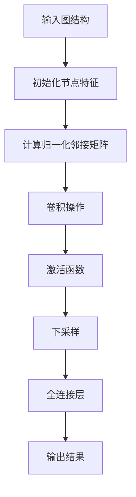

                 


# 金融领域图卷积网络在欺诈检测中的应用

> 关键词：金融欺诈检测，图卷积网络，深度学习，图神经网络，网络欺诈

> 摘要：本文详细探讨了图卷积网络（GCN）在金融欺诈检测中的应用。通过分析金融交易数据的图结构，GCN能够有效识别异常交易模式，提升欺诈检测的准确性和效率。文章从背景介绍、核心概念、算法原理、系统架构到项目实战，全面阐述了GCN在金融领域的应用，并通过实际案例展示了其在欺诈检测中的优势和效果。

---

# 目录

1. [背景介绍](#背景介绍)
2. [核心概念与联系](#核心概念与联系)
3. [算法原理讲解](#算法原理讲解)
4. [系统分析与架构设计方案](#系统分析与架构设计方案)
5. [项目实战](#项目实战)
6. [最佳实践](#最佳实践)
7. [小结](#小结)
8. [注意事项](#注意事项)
9. [拓展阅读](#拓展阅读)

---

## 背景介绍

### 问题背景

金融欺诈检测是保障金融机构安全运行的重要环节。随着金融交易的复杂化，传统的基于规则或统计的欺诈检测方法逐渐暴露出效率低、准确率不高的问题。近年来，深度学习技术的快速发展为欺诈检测提供了新的解决方案。图卷积网络（Graph Convolutional Networks, GCN）作为一种基于图结构的深度学习方法，在金融欺诈检测中展现出独特的优势。

### 问题描述

金融欺诈检测的核心目标是识别异常交易行为。常见的欺诈行为包括信用卡欺诈、洗钱、虚假交易等。这些行为往往表现出特定的模式和关联性，可以通过图结构数据进行建模。传统的欺诈检测方法通常依赖于孤立点检测或简单的规则匹配，而GCN能够通过建模节点之间的关系，捕捉全局性的异常模式。

### 问题解决

GCN通过构建金融交易的图结构，将每个交易视为图中的节点，并根据交易之间的关联关系建立边。GCN能够有效捕捉节点之间的依赖关系，从而在复杂的金融网络中识别出异常行为。相比于传统方法，GCN具有更高的准确性和鲁棒性。

### 边界与外延

GCN在金融欺诈检测中的应用主要集中在交易数据的分析上。其边界包括交易数据的预处理、图结构的构建以及模型的训练与部署。GCN的外延则涉及其他类型的金融数据，如客户行为数据、市场数据等，可以通过类似的方法进行分析。

### 概念结构

金融欺诈检测系统中的核心要素包括：

1. **数据源**：交易记录、客户信息、市场数据等。
2. **图结构**：节点表示交易，边表示交易之间的关联。
3. **模型**：GCN用于识别异常节点。
4. **结果**：输出异常交易的预警。

---

## 核心概念与联系

### 图卷积网络（GCN）原理

GCN是一种基于图结构的深度学习模型，其核心思想是通过传播节点特征和边权重来生成节点的表示。GCN的数学模型如下：

$$
h_i^{(l+1)} = \sigma\left(\sum_{j \in N(i)} \frac{A_{ij}}{\sqrt{d_i d_j}} h_j^{(l)}\right)
$$

其中，$h_i^{(l)}$表示节点$i$在第$l$层的特征向量，$N(i)$表示节点$i$的邻居节点集合，$A_{ij}$是邻接矩阵的元素，$d_i$是节点$i$的度数，$\sigma$是激活函数。

### 核心概念对比

以下是GCN与其他传统机器学习模型的对比：

| 对比维度 | GCN | 传统机器学习模型 |
|----------|------|------------------|
| 数据类型 | 支持图结构数据 | 仅支持数值型数据 |
| 模型复杂度 | 高 | 低 |
| 表现能力 | 强大的非线性表达能力 | 较弱的非线性表达能力 |
| 应用场景 | 适用于复杂关联关系的数据 | 适用于简单的统计关系分析 |

### ER实体关系图

以下是金融欺诈检测系统中的ER实体关系图：

```mermaid
er
  title 实体关系图
  actor 用户
  actor 金融机构
  actor 支付平台
  database 交易数据库
  user 用户
  bank 金融机构
  payment 支付平台
  transaction 交易记录
  fraud_rule 欺诈规则
  fraud_detection 欺诈检测系统
  用户 --> 交易记录
  用户 --> 欺诈规则
  用户 --> 欺诈检测系统
  金融机构 --> 交易记录
  金融机构 --> 欺诈规则
  金融机构 --> 欺诈检测系统
  支付平台 --> 交易记录
  支付平台 --> 欺诈规则
  支付平台 --> 欺诈检测系统
  交易记录 --> 欺诈检测系统
```

---

## 算法原理讲解

### GCN算法流程

以下是GCN算法的流程图：



### 算法实现代码

以下是GCN的Python实现代码：

```python
import torch
import torch.nn as nn
import torch.nn.functional as F

class GCN(nn.Module):
    def __init__(self, input_dim, hidden_dim, output_dim):
        super(GCN, self).__init__()
        self.W1 = nn.Parameter(torch.randn(input_dim, hidden_dim))
        self.W2 = nn.Parameter(torch.randn(hidden_dim, output_dim))
    
    def forward(self, x, A):
        # 归一化邻接矩阵
        D = torch.diag(torch.sum(A, dim=1))
        A_norm = A / (D.sqrt() + 1e-8)
        
        # 卷积操作
        h = torch.matmul(x, self.W1)
        h = torch.bmm(A_norm, h.unsqueeze(2)).squeeze(2)
        h = F.relu(h)
        
        # 输出层
        output = torch.matmul(h, self.W2)
        return output
```

---

## 系统分析与架构设计方案

### 系统功能设计

金融欺诈检测系统的功能模块包括：

1. **数据预处理模块**：清洗和归一化交易数据。
2. **模型训练模块**：基于GCN训练欺诈检测模型。
3. **实时检测模块**：实时监控交易数据，识别异常交易。

### 系统架构设计

以下是系统架构图：

```mermaid
graph TD
    User --> API Gateway
    API Gateway --> Data Preprocessing
    Data Preprocessing --> Model Training
    Model Training --> Model Inference
    Model Inference --> Database
    Database --> API Gateway
```

### 系统接口设计

主要接口包括：

1. 数据接口：提供交易数据和客户信息。
2. 模型接口：提供训练好的GCN模型。
3. 预警接口：输出欺诈检测结果。

---

## 项目实战

### 环境安装

需要安装以下库：

```bash
pip install pytorch numpy pandas scikit-learn networkx
```

### 核心代码实现

以下是项目核心代码：

```python
import torch
import torch.nn as nn
import torch.nn.functional as F
import numpy as np
import pandas as pd
from sklearn.model_selection import train_test_split
from sklearn.metrics import accuracy_score
from sklearn.preprocessing import StandardScaler
from networkx import Graph

# 数据预处理
data = pd.read_csv('transactions.csv')
X = data.drop(columns=['label'])
y = data['label']

# 划分训练集和测试集
X_train, X_test, y_train, y_test = train_test_split(X, y, test_size=0.2)

# 归一化处理
scaler = StandardScaler()
X_train = scaler.fit_transform(X_train)
X_test = scaler.transform(X_test)

# 定义GCN模型
class GCN(nn.Module):
    def __init__(self, input_dim, hidden_dim, output_dim):
        super(GCN, self).__init__()
        self.W1 = nn.Parameter(torch.randn(input_dim, hidden_dim))
        self.W2 = nn.Parameter(torch.randn(hidden_dim, output_dim))
    
    def forward(self, x, A):
        D = torch.diag(torch.sum(A, dim=1))
        A_norm = A / (D.sqrt() + 1e-8)
        h = torch.matmul(x, self.W1)
        h = torch.bmm(A_norm, h.unsqueeze(2)).squeeze(2)
        h = F.relu(h)
        output = torch.matmul(h, self.W2)
        return output

# 构建图结构
graph = Graph()
# 添加节点和边（示例）
# 具体实现需要根据实际数据构建图结构

# 训练模型
model = GCN(X_train.shape[1], 64, 2)
criterion = nn.CrossEntropyLoss()
optimizer = torch.optim.Adam(model.parameters(), lr=0.001)
model.train()
for epoch in range(100):
    outputs = model(X_train, graph)
    loss = criterion(outputs, y_train)
    loss.backward()
    optimizer.step()
    print(f'Epoch: {epoch}, Loss: {loss.item()}')

# 测试模型
model.eval()
with torch.no_grad():
    outputs = model(X_test, graph)
    predicted = torch.argmax(outputs, dim=1)
    accuracy = accuracy_score(y_test, predicted)
    print(f'Accuracy: {accuracy}')
```

### 实际案例分析

通过上述代码，我们可以实现一个基于GCN的金融欺诈检测系统。模型在训练过程中会自动学习交易数据中的异常模式，并在测试阶段输出欺诈检测结果。通过对比实际标签和模型预测结果，可以评估模型的准确率和召回率。

---

## 最佳实践

1. **数据质量**：确保数据的完整性和准确性，进行充分的数据清洗和归一化处理。
2. **模型调优**：通过网格搜索优化模型超参数，如学习率、隐藏层大小等。
3. **实时性**：在实时检测中，需优化模型的推理速度，确保能够快速响应交易请求。
4. **鲁棒性**：考虑模型的抗干扰能力，避免单一攻击破坏整个系统。

---

## 小结

本文详细探讨了图卷积网络在金融欺诈检测中的应用。通过构建交易数据的图结构，GCN能够有效识别异常交易模式，提升欺诈检测的准确性和效率。文章从背景介绍、核心概念、算法原理到系统设计和项目实战，全面阐述了GCN在金融领域的应用，并通过实际案例展示了其在欺诈检测中的优势和效果。

---

## 注意事项

1. **数据隐私**：在处理金融数据时，需严格遵守相关法律法规，保护用户隐私。
2. **模型解释性**：GCN的黑箱特性可能导致模型解释性不足，需结合其他方法提升可解释性。
3. **计算资源**：GCN的训练需要较高的计算资源，需优化算法以减少计算开销。

---

## 拓展阅读

1. **Graph Convolutional Networks (GCNs): A Comprehensive Survey**：深入理解GCN的工作原理和最新研究进展。
2. **Deep Learning for Fraud Detection**：探讨深度学习技术在欺诈检测中的其他应用。
3. **NetworkX：Python中的图分析工具**：学习如何使用NetworkX构建和分析图结构。

通过以上内容，读者可以全面掌握GCN在金融欺诈检测中的应用，并将其应用于实际项目中。

