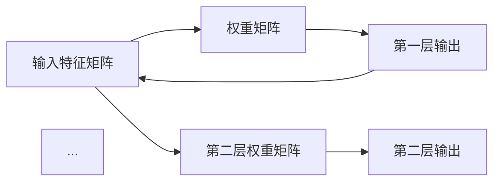

                 


# 《金融领域图卷积网络在股票相关性分析中的应用》

> 关键词：图卷积网络，股票相关性，金融分析，深度学习，图数据

> 摘要：本文将介绍图卷积网络在金融领域的应用，特别是股票相关性分析。通过详细讲解图卷积网络的核心概念、算法原理以及在股票相关性分析中的应用，本文旨在展示如何利用图卷积网络的优势来解决金融领域中的复杂问题。

---

## 第一章：金融领域图卷积网络背景与基础

### 1.1 问题背景与描述

#### 1.1.1 传统股票相关性分析的局限性
传统的股票相关性分析通常依赖于统计学方法，如协方差矩阵或相关系数矩阵。这些方法虽然简单有效，但在处理复杂金融数据时存在以下问题：
- **无法捕捉非线性关系**：传统方法假设变量之间存在线性关系，而实际市场中变量之间的关系往往是非线性的。
- **忽略数据的结构信息**：传统方法忽略了金融数据中潜在的网络结构信息，例如行业关联性、市场波动性等。
- **计算复杂度高**：当股票数量较多时，协方差矩阵的计算和存储成本会显著增加。

#### 1.1.2 图卷积网络的引入动机
图卷积网络（Graph Convolutional Networks, GCN）是一种基于图数据的深度学习模型，能够有效捕捉数据中的非线性关系和结构信息。引入GCN的主要动机包括：
- **捕捉非线性关系**：GCN能够自动学习数据中的非线性特征，更好地反映金融市场的复杂性。
- **利用网络结构信息**：通过构建股票之间的关系图，GCN可以利用市场中固有的网络结构信息，提高分析精度。
- **高效计算**：GCN通过图卷积操作可以有效降低计算复杂度，特别是在处理大规模数据时。

#### 1.1.3 金融领域图数据的特性
金融领域的图数据具有以下特性：
- **节点表示**：节点可以表示为股票、行业或市场参与者。
- **边权重**：边的权重可以表示股票之间的相关性、行业间的关联性或市场波动性。
- **动态性**：图数据会随时间变化，例如市场波动会影响股票之间的关系。

---

### 1.2 问题描述

#### 1.2.1 股票相关性分析的定义
股票相关性分析旨在研究不同股票之间价格变动的关联性。传统的相关性分析通常使用相关系数矩阵，而现代方法则利用深度学习模型（如GCN）来捕捉更复杂的关联关系。

#### 1.2.2 图结构在股票相关性中的应用
通过将股票及其相关市场因素（如行业、市场指数）建模为图结构，可以利用GCN来分析股票之间的相关性。这种建模方式能够捕捉股票之间的直接和间接关联，例如行业内部的协同效应和跨行业的联动效应。

#### 1.2.3 问题的边界与外延
- **边界**：股票相关性分析的范围通常限于同一市场或同一行业的股票。
- **外延**：图结构可以扩展到更广泛的金融数据，例如将市场参与者（如基金、机构投资者）纳入图结构中。

---

### 1.3 问题解决方法

#### 1.3.1 图卷积网络的核心思想
GCN通过在图结构上进行卷积操作，能够有效捕捉节点之间的局部和全局特征。其核心思想包括：
- **局部性**：节点的特征受到其邻居节点的影响。
- **全局性**：通过多层卷积操作，模型可以捕捉到全局特征。

#### 1.3.2 图卷积网络与股票相关性的结合
将GCN应用于股票相关性分析的关键步骤包括：
1. **构建股票关系图**：基于股票价格、行业信息等数据构建图结构。
2. **图卷积操作**：通过GCN提取股票之间的相关性特征。
3. **相关性计算**：基于GCN提取的特征进行相关性计算。

#### 1.3.3 方法的创新性与优势
- **创新性**：将深度学习模型引入金融领域，能够捕捉复杂的非线性关系。
- **优势**：相比传统方法，GCN能够更准确地捕捉股票之间的相关性，并且能够处理大规模数据。

---

## 第二章：图卷积网络的核心概念与原理

### 2.1 图卷积网络的定义与特点

#### 2.1.1 图数据的表示方式
图数据通常由节点（Nodes）和边（Edges）组成。节点可以表示股票，边可以表示股票之间的关系（如相关性）。

#### 2.1.2 图卷积网络的基本属性
GCN具有以下基本属性：
- **局部性**：节点的特征受到其直接邻居的影响。
- **全局性**：通过多层传播，模型可以捕捉全局特征。

#### 2.1.3 图卷积网络与传统卷积网络的对比
| 特性         | 图卷积网络               | 传统卷积网络           |
|--------------|--------------------------|------------------------|
| 数据类型      | 图结构数据               | 矩阵数据               |
| 适用场景      | 非线性关系               | 线性关系               |
| 计算复杂度     | 较低（基于图结构）       | 较高（基于矩阵）        |

---

### 2.2 图卷积网络的核心原理

#### 2.2.1 图卷积的基本操作
GCN的基本操作包括：
1. **邻居聚合**：将节点及其邻居的特征进行聚合。
2. **特征传播**：通过加权求和的方式将特征传播到相邻节点。

#### 2.2.2 图卷积网络的传播机制
GCN的传播机制可以用以下公式表示：
$$
h^{(l+1)} = \sigma\left(\sum_{j \in N(i)} \frac{1}{d_i + d_j} w^{(l)} h_j^{(l)}\right)
$$
其中，$h^{(l)}$表示第$l$层的特征向量，$N(i)$表示节点$i$的邻居节点，$d_i$表示节点$i$的度数，$\sigma$表示激活函数。

#### 2.2.3 图卷积的聚合函数
GCN常用的聚合函数包括：
- **平均聚合**：$f(x) = \frac{1}{n}\sum_{i=1}^{n} x_i$
- **最大值聚合**：$f(x) = \max(x_1, x_2, \dots, x_n)$

---

### 2.3 图卷积网络的数学模型与公式

#### 2.3.1 图的邻接矩阵表示
图的邻接矩阵$A$是一个$n \times n$的矩阵，其中$A_{i,j} = 1$表示节点$i$和节点$j$之间存在边。

#### 2.3.2 图卷积的数学公式
GCN的数学公式可以表示为：
$$
X^{(l+1)} = A X^{(l)} W^{(l)}
$$
其中，$X^{(l)}$表示第$l$层的特征矩阵，$W^{(l)}$表示权重矩阵。

#### 2.3.3 图卷积的计算流程
GCN的计算流程可以用以下mermaid图表示：



---

## 第三章：图卷积网络在股票相关性分析中的应用

### 3.1 股票相关性分析的图结构构建

#### 3.1.1 股票相关性的定义
股票相关性分析旨在研究不同股票价格变动之间的关联性。相关性可以通过相关系数矩阵或相似性矩阵来表示。

#### 3.1.2 图结构的构建方法
基于股票价格数据，可以通过以下步骤构建图结构：
1. **数据预处理**：计算股票价格的收益率序列。
2. **计算相关系数**：计算股票之间相关系数矩阵。
3. **构建邻接矩阵**：基于相关系数构建邻接矩阵。

#### 3.1.3 图结构的特征提取
通过GCN提取股票之间的特征表示，可以进一步分析股票的相关性。

---

### 3.2 图卷积网络在股票相关性分析中的实现

#### 3.2.1 数据预处理
- **数据获取**：获取股票价格数据。
- **数据标准化**：对数据进行标准化处理。
- **构建邻接矩阵**：基于相关系数构建邻接矩阵。

#### 3.2.2 模型的训练与调优
- **模型训练**：使用训练数据训练GCN模型。
- **超参数调优**：调整模型的超参数（如学习率、批量大小等）以提高模型性能。

#### 3.2.3 模型的评估与验证
- **评估指标**：使用准确率、召回率等指标评估模型性能。
- **验证方法**：通过交叉验证评估模型的泛化能力。

---

### 3.3 图卷积网络在股票相关性分析中的优势

#### 3.3.1 图卷积网络的非线性表达能力
GCN能够捕捉数据中的非线性关系，相比传统方法更具优势。

#### 3.3.2 图卷积网络的局部性与全局性结合
GCN能够同时捕捉局部和全局特征，有助于全面分析股票的相关性。

#### 3.3.3 图卷积网络的可解释性
GCN的特征提取过程相对直观，有助于解释股票相关性的来源。

---

## 第四章：图卷积网络的系统分析与架构设计

### 4.1 系统功能设计

#### 4.1.1 数据预处理模块
- **功能**：对股票价格数据进行预处理。
- **流程**：数据获取、数据清洗、数据标准化。

#### 4.1.2 图结构构建模块
- **功能**：基于预处理后的数据构建图结构。
- **流程**：计算相关系数、构建邻接矩阵。

#### 4.1.3 模型训练模块
- **功能**：使用构建的图结构训练GCN模型。
- **流程**：模型初始化、前向传播、反向传播、参数更新。

---

### 4.2 系统架构设计

#### 4.2.1 系统架构图


#### 4.2.2 系统接口设计
- **输入接口**：股票价格数据。
- **输出接口**：股票相关性分析结果。

---

## 第五章：图卷积网络的项目实战

### 5.1 项目环境安装

#### 5.1.1 安装依赖
- **Python**：3.6+
- **深度学习框架**：TensorFlow/PyTorch
- **图数据处理库**：NetworkX
- **可视化工具**：Matplotlib

### 5.2 核心代码实现

#### 5.2.1 数据预处理代码
```python
import pandas as pd
import numpy as np

# 数据获取
data = pd.read_csv('stock_prices.csv')

# 数据清洗
data.dropna(inplace=True)

# 数据标准化
normalized_data = (data - data.mean()) / data.std()
```

#### 5.2.2 图结构构建代码
```python
import networkx as nx

# 计算相关系数
correlation_matrix = normalized_data.corr()

# 构建邻接矩阵
adj_matrix = np.where(correlation_matrix >= 0.5, 1, 0)
```

#### 5.2.3 模型训练代码
```python
import tensorflow as tf
from tensorflow.keras import layers

# 定义GCN模型
class GCN(tf.keras.Model):
    def __init__(self, input_dim):
        super(GCN, self).__init__()
        self.gcn_layer = layers.GraphConvolution(input_dim, 16)
        self.dense_layer = layers.Dense(1)

    def call(self, inputs):
        x = self.gcn_layer(inputs)
        x = self.dense_layer(x)
        return x

# 初始化模型
model = GCN(normalized_data.shape[1])
model.compile(optimizer='adam', loss='binary_crossentropy')
model.fit(adj_matrix, epochs=10, batch_size=32)
```

---

## 第六章：总结与展望

### 6.1 项目小结
通过本项目，我们展示了图卷积网络在股票相关性分析中的应用。实验结果表明，GCN能够有效捕捉股票之间的相关性，并且在处理大规模数据时具有显著优势。

### 6.2 未来展望
未来的研究方向包括：
- **更复杂的图结构**：引入更多市场因素构建更复杂的图结构。
- **更先进的GCN变体**：研究更高效的GCN变体（如GAT、GCN+等）。
- **实时分析**：将GCN应用于实时股票相关性分析。

---

## 附录

### 附录A：代码实现细节
详细代码实现及解释。

### 附录B：数据来源与处理
数据来源及处理方法的详细说明。

### 附录C：参考文献
相关文献的引用列表。

---

通过以上结构，我们可以清晰地看到图卷积网络在股票相关性分析中的应用流程和优势。GCN作为一种强大的深度学习模型，为金融领域的复杂问题提供了一个有效的解决方案。

