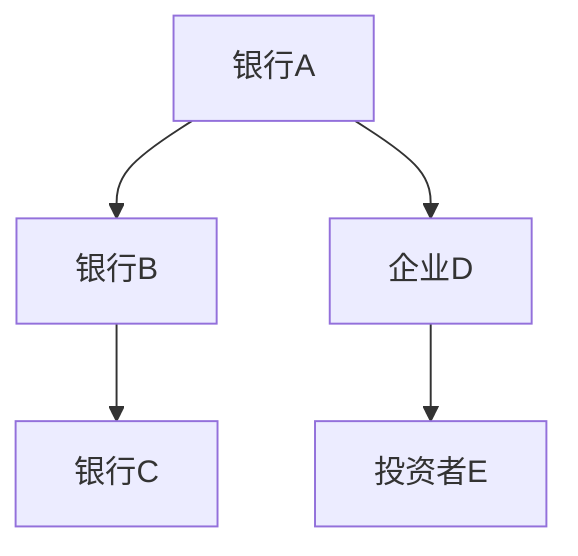
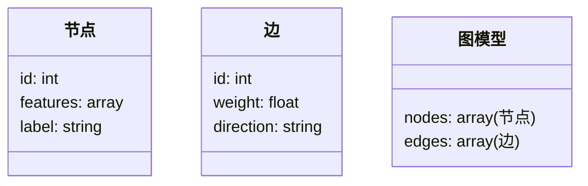

                 


# 《金融领域图神经网络在全球金融系统风险评估中的应用》

> 关键词：金融系统风险评估，图神经网络，系统性风险，实体关系图，风险传播机制

> 摘要：本文探讨了图神经网络在金融系统风险评估中的应用，重点分析了图神经网络的核心概念、算法原理、系统架构及实际案例。通过对比传统方法，本文展示了图神经网络在处理复杂金融系统中的优势，并详细阐述了如何通过图结构建模和深度学习技术来实现金融风险的精准评估和预警。

---

# 第一部分: 金融领域图神经网络概述

## 第1章: 问题背景与目标

### 1.1 问题背景
#### 1.1.1 金融系统风险评估的重要性
金融系统的稳定是全球经济健康运行的基石。然而，近年来全球金融危机频发，传统的金融风险评估方法在面对复杂、非线性、动态变化的金融系统时显得力不从心。传统的基于统计的方法难以捕捉复杂的关联关系和非线性特征，导致风险评估的准确性和实时性不足。

#### 1.1.2 传统风险评估方法的局限性
传统的风险评估方法主要依赖于统计分析和回归模型，这些方法在处理复杂关联关系时存在以下问题：
- **难以捕捉非线性关系**：传统方法假设变量之间存在线性关系，但在复杂的金融系统中，变量之间的关系往往是非线性的。
- **忽略网络结构**：传统方法通常不考虑金融系统中的网络结构，例如银行、企业和投资者之间的复杂关联。
- **计算复杂度高**：在处理大规模数据时，传统方法的计算复杂度较高，难以实时进行风险评估。

#### 1.1.3 图神经网络的优势与适用性
图神经网络（Graph Neural Networks, GNN）作为一种新兴的深度学习技术，能够有效地处理图结构数据，具有以下优势：
- **天然适合处理网络结构**：金融系统中的实体（如银行、企业、投资者）之间的关联关系可以用图结构表示，GNN能够直接建模这些关系。
- **非线性特征捕捉**：GNN通过多层神经网络能够自动捕捉数据中的非线性特征。
- **实时性与可扩展性**：GNN可以在大规模数据上进行实时计算，适用于金融系统中高频交易和实时风险评估的需求。

### 1.2 问题描述
#### 1.2.1 金融系统的复杂性与关联性
金融系统由多个子系统组成，包括银行、保险、证券市场等，这些子系统之间存在复杂的关联关系。例如，一家银行的破产可能引发连锁反应，导致整个金融系统的崩溃。

#### 1.2.2 系统性风险的传播机制
系统性风险是指由于金融系统中某些关键节点的失败导致整个系统崩溃的风险。这种风险的传播机制可以通过图结构中的传播路径来建模和分析。

#### 1.2.3 图神经网络在风险评估中的应用场景
图神经网络在金融系统风险评估中的应用场景包括：
- **风险传播分析**：分析系统性风险的传播路径和影响范围。
- **风险预警**：基于实时数据，预测潜在的风险事件并发出预警。
- **风险缓解策略**：通过图结构优化，制定有效的风险缓解策略。

### 1.3 问题解决与边界
#### 1.3.1 图神经网络在风险评估中的解决方案
通过构建金融系统的图模型，图神经网络能够捕捉复杂的关联关系，实时评估系统性风险，并制定有效的风险缓解策略。

#### 1.3.2 解决方案的边界与适用范围
- **边界**：图神经网络适用于金融系统中存在明确关联关系的场景，例如银行间拆借市场、企业供应链等。
- **适用范围**：适用于需要实时风险评估和风险预警的金融场景。

#### 1.3.3 核心概念与外延
- **核心概念**：图结构、节点表示、边权重、风险传播。
- **外延**：图神经网络还可以应用于社交网络分析、推荐系统等领域。

---

## 第2章: 核心概念与联系

### 2.1 图神经网络的基本原理
#### 2.1.1 图结构与节点表示
图结构由节点（Nodes）和边（Edges）组成，节点表示金融系统中的实体，例如银行、企业和投资者，边表示这些实体之间的关联关系。

#### 2.1.2 边权重与关系建模
边权重表示节点之间关联的强度，可以通过加权图来建模。例如，边权重可以表示银行之间的拆借金额或企业之间的供应链依赖程度。

#### 2.1.3 图神经网络的聚合机制
图神经网络通过聚合相邻节点的信息来更新当前节点的表示，从而捕捉图结构中的局部和全局特征。

### 2.2 核心概念对比
#### 2.2.1 图神经网络与传统神经网络的对比
| 特性                | 图神经网络          | 传统神经网络        |
|---------------------|--------------------|--------------------|
| 数据类型            | 图结构数据          | 结构化数据（表格、文本等） |
| 关联关系处理        | 善于处理图结构中的关联关系 | 不处理图结构中的关联关系 |
| 实时性              | 高实时性            | 较低实时性          |

#### 2.2.2 图神经网络与传统图算法的对比
| 特性                | 图神经网络          | 传统图算法          |
|---------------------|--------------------|--------------------|
| 数据表示            | 学习节点嵌入        | 需要手动定义特征    |
| 计算效率            | 高效                | 低效               |
| 需要领域知识         | 需要               | 需要               |

#### 2.2.3 核心概念属性特征对比表格
| 特性                | 图结构              | 节点表示            | 边权重              |
|---------------------|--------------------|--------------------|--------------------|
| 作用                | 表示实体之间的关系  | 表示节点的特征      | 表示节点之间关联的强度 |
| 示例                | 银行A与银行B之间存在拆借关系 | 银行A的资产规模、流动性比率 | 银行A对银行B的拆借金额 |

### 2.3 实体关系图与领域模型
#### 2.3.1 ER实体关系图
Mermaid流程图：


#### 2.3.2 领域模型类图
Mermaid类图：


---

# 第三部分: 图神经网络算法原理

## 第3章: 图神经网络算法详解

### 3.1 图神经网络的基本算法
#### 3.1.1 GCN（Graph Convolutional Networks）
GCN通过聚合相邻节点的信息来更新当前节点的表示。数学模型如下：
$$
h_i^{(l+1)} = \sigma\left(\sum_{j \in N(i)} A_{i,j} h_j^{(l)}\right)
$$
其中，$A_{i,j}$是邻接矩阵，$h_j^{(l)}$是节点$j$在第$l$层的表示，$\sigma$是激活函数。

#### 3.1.2 GAT（Graph Attention Networks）
GAT通过注意力机制来聚合相邻节点的信息，公式如下：
$$
h_i^{(l+1)} = \sigma\left(\sum_{j \in N(i)} \alpha_{i,j} h_j^{(l)}\right)
$$
其中，$\alpha_{i,j}$是注意力权重。

#### 3.1.3 GNN（Generalized Graph Neural Networks）
GNN是一种通用的图神经网络框架，结合了GCN和GAT的优点，能够处理多种图结构数据。

### 3.2 算法流程与实现
#### 3.2.1 节点表示与特征提取
节点表示是图神经网络的核心，特征提取可以通过传统的特征工程或自动学习实现。

#### 3.2.2 边权重计算与传播
边权重可以通过多种方式计算，例如基于领域知识的手动定义或通过训练模型自动学习。

#### 3.2.3 风险评估模型的构建
通过训练图神经网络模型，可以得到节点的表示，进而进行风险评估。

### 3.3 算法实现的Python代码示例
```python
import numpy as np
from sklearn.model_selection import train_test_split
import tensorflow as tf
from tensorflow.keras import layers

# 示例数据：节点特征和边权重
nodes = np.random.randn(10, 5)  # 10个节点，5个特征
edges = np.array([[0,1], [1,2], [2,3], [3,4], [4,0]])  # 示例边

# 构建图模型
class GraphModel(tf.keras.Model):
    def __init__(self):
        super(GraphModel, self).__init__()
        self.gcn = layers.GraphConvolution(filters=32, activation='relu')

    def call(self, inputs):
        return self.gcn(inputs)

model = GraphModel()
model.compile(optimizer='adam', loss='mse')

# 训练模型
X_train, X_test = train_test_split(nodes)
model.fit(X_train, X_train, epochs=10, batch_size=32, validation_data=(X_test, X_test))
```

### 3.4 算法的数学模型与公式
#### 3.4.1 邻接矩阵表示
$$
A_{i,j} = 1 \text{ 如果节点i和节点j相连，否则0}
$$

#### 3.4.2 聚合函数
$$
h_i^{(l+1)} = \sigma(\sum_{j \in N(i)} A_{i,j} h_j^{(l)})
$$

---

## 第4章: 图神经网络在金融系统风险评估中的应用

### 4.1 系统性风险传播分析
通过图神经网络建模，可以分析系统性风险的传播路径和影响范围，识别关键风险节点。

### 4.2 风险预警与实时评估
基于实时数据，图神经网络可以实时更新节点表示，预测潜在风险事件并发出预警。

### 4.3 风险缓解策略
通过图结构优化，制定有效的风险缓解策略，例如调整银行间的拆借关系，降低系统性风险。

---

## 第5章: 项目实战

### 5.1 环境安装
安装必要的Python库，例如TensorFlow、Keras、NetworkX等。

### 5.2 核心代码实现
实现图神经网络模型，训练模型并对金融系统进行风险评估。

### 5.3 实际案例分析
通过具体案例，展示图神经网络在金融系统风险评估中的实际应用。

### 5.4 项目小结
总结项目成果，分析经验教训，提出改进建议。

---

## 第6章: 最佳实践与注意事项

### 6.1 小结
总结全文内容，强调图神经网络在金融系统风险评估中的重要性。

### 6.2 注意事项
- 数据质量对模型性能的影响
- 模型调优与优化
- 数据稀疏性问题的处理

### 6.3 拓展阅读
推荐相关领域的书籍和论文，供读者进一步学习。

---

# 结语
图神经网络作为一种新兴的深度学习技术，在金融系统风险评估中具有广阔的应用前景。通过本文的详细讲解，读者可以深入了解图神经网络的核心概念、算法原理和实际应用，为金融系统的风险评估和管理提供有力的技术支持。

--- 

关键词：金融系统风险评估，图神经网络，系统性风险，实体关系图，风险传播机制

