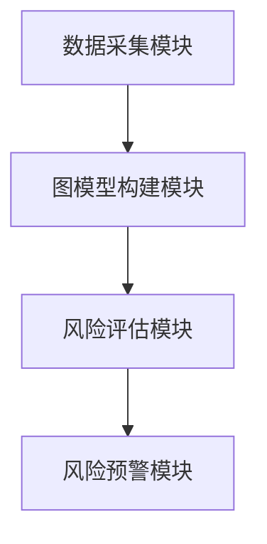
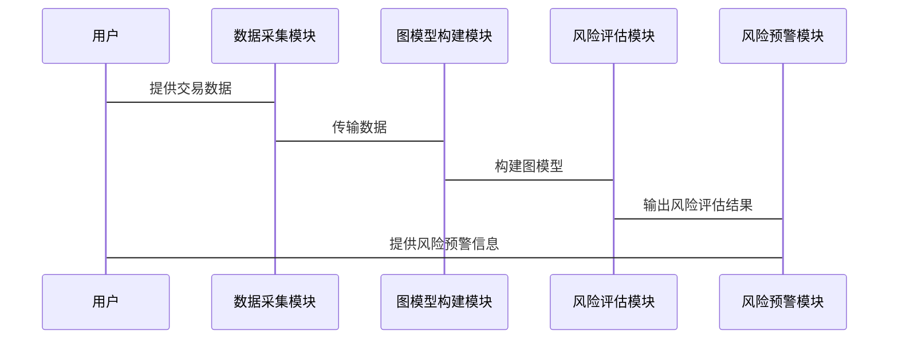

                 

<think>
好的，我将按照您的要求撰写一篇关于《金融领域图神经网络在系统性风险评估中的应用》的技术博客文章。我会按照要求，逐步分析和推理，确保内容逻辑清晰、结构紧凑、简单易懂，同时涵盖所有必要的部分。

---

# 金融领域图神经网络在系统性风险评估中的应用

> 关键词：图神经网络、系统性风险、金融网络、深度学习、风险管理

> 摘要：  
系统性风险是金融市场中的一个复杂问题，传统的金融风险评估方法在面对日益复杂的金融市场时显得力不从心。图神经网络（Graph Neural Networks, GNNs）作为一种新兴的深度学习技术，能够有效捕捉金融市场中的复杂关联关系，为系统性风险的评估提供了新的思路。本文将详细探讨图神经网络在系统性风险评估中的应用，包括图神经网络的基本原理、系统性风险的建模方法、实际应用场景以及未来研究方向。

---

## 第1章：系统性风险与金融领域的复杂性

### 1.1 系统性风险的基本概念

#### 1.1.1 系统性风险的定义与特征
系统性风险是指由于金融系统中某些共同因素的影响，导致整个金融系统发生系统性崩溃的风险。其主要特征包括：
- **普遍性**：影响整个金融系统，而非单一机构或资产。
- **传染性**：风险可能从一个机构或市场传染到其他机构或市场。
- **不可分割性**：系统性风险无法通过分散投资完全消除。

#### 1.1.2 金融系统中的相互关联性
金融系统中的机构、资产和市场之间存在复杂的关联关系。例如：
- 银行之间通过同业拆借市场相互关联。
- 股票市场中个股的波动可能影响整个市场的稳定性。
- 全球化背景下，一个国家的金融动荡可能影响全球金融市场。

#### 1.1.3 系统性风险的传播机制
系统性风险的传播机制主要包括以下几种：
- **直接传染**：某一金融机构的破产直接导致其他机构的损失。
- **间接传染**：通过共同的债权人或债务人传播风险。
- **市场情绪传染**：市场恐慌情绪的蔓延可能导致整体市场波动。

### 1.2 传统金融风险评估方法的局限性

#### 1.2.1 传统风险评估模型的局限性
传统的金融风险评估方法，如VaR（Value at Risk）和CVaR（Conditional Value at Risk），主要基于统计模型和假设条件，难以捕捉金融系统中的复杂关联关系。

#### 1.2.2 传统方法在复杂金融网络中的不足
- **忽略网络结构**：传统方法通常假设资产之间独立，忽略了金融市场中的网络依赖性。
- **计算复杂度高**：在复杂金融网络中，传统的统计方法计算效率较低。
- **难以捕捉非线性关系**：传统方法难以捕捉金融市场中的非线性关联。

### 1.3 图神经网络在金融领域的应用前景

#### 1.3.1 图神经网络的基本原理
图神经网络是一种基于图结构的深度学习方法，能够有效处理图数据中的节点和边的关系。其核心思想是通过聚合邻居节点的信息来更新当前节点的表示。

#### 1.3.2 图神经网络在金融领域的应用现状
- **信用风险评估**：通过图神经网络分析企业之间的关联关系，评估信用风险。
- **股价预测**：利用图神经网络捕捉股票之间的依赖关系，预测股价波动。
- **欺诈检测**：通过图神经网络识别金融交易中的欺诈行为。

#### 1.3.3 系统性风险评估中的图神经网络潜力
- **捕捉系统性风险的传播路径**：图神经网络能够建模金融系统中的复杂关联，帮助识别系统性风险的传播路径。
- **预测系统性风险**：通过图神经网络对金融网络进行建模，可以预测系统性风险的发生概率。

### 1.4 本章小结
本章主要介绍了系统性风险的基本概念、金融系统的复杂性以及传统风险评估方法的局限性。同时，还探讨了图神经网络在金融领域的应用前景，为后续章节的深入分析奠定了基础。

---

## 第2章：图神经网络的核心概念与原理

### 2.1 图结构与节点表示

#### 2.1.1 图的基本概念与属性
图（Graph）由节点（Nodes）和边（Edges）组成。在金融领域，节点可以表示为金融机构、资产或市场，边表示它们之间的关联关系。

#### 2.1.2 节点与边的属性特征
- **节点属性**：如机构的资产规模、信用评级等。
- **边属性**：如机构之间的交易金额、关联强度等。

#### 2.1.3 图的表示学习方法
图的表示学习方法包括：
- **基于邻接矩阵的方法**：如谱图卷积网络（Spectral Graph Convolutional Networks）。
- **基于注意力机制的方法**：如图注意力网络（Graph Attention Networks）。

### 2.2 图神经网络的基本原理

#### 2.2.1 图卷积网络（GCN）的基本原理
图卷积网络通过聚合节点及其邻居的信息来更新节点的表示。其核心公式为：
$$
h_i^{(l+1)} = \sigma\left(\sum_{j \in N(i)} \frac{A_{ij}}{\sqrt{d_i d_j}} h_j^{(l)}\right)
$$
其中，$A_{ij}$ 是邻接矩阵的元素，$d_i$ 和 $d_j$ 分别是节点$i$和$j$的度数，$\sigma$是激活函数。

#### 2.2.2 图注意力机制（GAT）的核心思想
图注意力机制通过计算节点之间的注意力权重来聚合信息：
$$
\alpha_{ij} = \text{softmax}\left(\frac{W h_i^T h_j}{\sqrt{d_k}}\right)
$$
其中，$\alpha_{ij}$ 是节点$i$和$j$之间的注意力权重，$W$是可学习的参数。

#### 2.2.3 图嵌入与节点表示的对比分析
图嵌入方法通过将图结构嵌入到低维空间，得到节点的表示向量。节点表示方法包括：
- **基于邻居聚合的方法**：如GCN和GAT。
- **基于图遍历的方法**：如GraphSAGE。

### 2.3 系统性风险评估中的图模型构建

#### 2.3.1 金融网络的构建方法
金融网络可以通过以下步骤构建：
1. 数据收集：收集金融机构之间的交易数据、资产价格数据等。
2. 节点表示：将金融机构、资产等表示为图中的节点。
3. 边的构建：根据交易数据或相关性数据，构建节点之间的边。

#### 2.3.2 系统性风险的传播模型
系统性风险的传播模型可以通过图神经网络建模。例如：
- **直接传播模型**：节点之间的风险通过边直接传播。
- **间接传播模型**：风险通过多步传播影响整个网络。

#### 2.3.3 图模型在系统性风险评估中的应用
图模型可以用于：
- **风险传播路径分析**：识别系统性风险的传播路径。
- **风险影响范围预测**：预测系统性风险对整个金融系统的影响范围。

### 2.4 核心概念对比表
以下是图神经网络中几种常见算法的对比表：

| 方法       | 基本原理                     | 优点                     | 缺点                     |
|------------|----------------------------|--------------------------|--------------------------|
| GCN        | 基于邻接矩阵的卷积操作       | 计算简单                 | 无法捕捉长距离关系       |
| GAT        | 基于注意力机制的图卷积       | 能捕捉长距离关系         | 计算复杂                 |
| GraphSAGE  | 基于图遍历的节点聚合         | 易扩展                   | 聚合策略依赖于超参数       |

### 2.5 本章小结
本章详细介绍了图神经网络的核心概念与原理，包括图结构、节点表示和图模型的构建方法。这些内容为后续章节在系统性风险评估中的应用奠定了理论基础。

---

## 第3章：系统性风险评估的图神经网络建模与实现

### 3.1 系统性风险评估的图模型构建

#### 3.1.1 数据预处理与特征提取
- **数据来源**：收集金融机构的交易数据、资产价格数据等。
- **特征提取**：提取机构的资产规模、信用评级等特征。

#### 3.1.2 图结构的构建
- **边的权重计算**：根据交易金额或相关性计算边的权重。
- **邻接矩阵的构建**：将图结构表示为邻接矩阵。

#### 3.1.3 图模型的选择与设计
- **选择图神经网络算法**：根据具体需求选择GCN、GAT等算法。
- **模型架构设计**：设计图神经网络的输入层、隐藏层和输出层。

### 3.2 图神经网络的训练与优化

#### 3.2.1 模型训练
- **训练数据准备**：将图数据输入模型进行训练。
- **损失函数设计**：使用交叉熵损失函数或均方误差损失函数。
- **优化算法选择**：使用Adam优化器进行模型优化。

#### 3.2.2 模型调优
- **超参数调优**：调整学习率、批量大小等超参数。
- **模型评估**：使用验证集评估模型的性能。

### 3.3 系统性风险评估的实现

#### 3.3.1 风险传播路径分析
- **基于图神经网络的传播模型**：识别系统性风险的传播路径。
- **风险影响范围预测**：预测风险对整个金融系统的影响范围。

#### 3.3.2 风险评估结果的可视化
- **图结构可视化**：使用网络可视化工具（如Gephi）展示金融网络的结构。
- **风险传播路径可视化**：用路径图展示风险的传播路径。

### 3.4 本章小结
本章详细介绍了系统性风险评估的图神经网络建模与实现过程，包括数据预处理、图模型构建、模型训练与优化以及风险评估的实现。

---

## 第4章：系统性风险评估的系统分析与架构设计

### 4.1 系统性风险评估系统的需求分析

#### 4.1.1 问题场景介绍
- **系统性风险的实时监测**：需要实时监测金融系统的风险状况。
- **风险传播路径分析**：需要分析风险的传播路径。
- **风险预警与干预**：需要在风险发生前进行预警，并制定干预措施。

#### 4.1.2 系统功能需求
- **数据采集模块**：采集金融机构的交易数据、资产价格数据等。
- **图模型构建模块**：构建金融网络的图结构。
- **风险评估模块**：使用图神经网络评估系统性风险。
- **风险预警模块**：根据评估结果发出风险预警。

### 4.2 系统架构设计

#### 4.2.1 系统功能模块设计
- **数据采集模块**：负责数据的收集与预处理。
- **图模型构建模块**：负责图结构的构建与优化。
- **风险评估模块**：负责系统性风险的评估与预测。
- **风险预警模块**：负责风险预警与干预措施的制定。

#### 4.2.2 系统架构图
以下是一个系统架构的Mermaid图：



### 4.3 系统接口设计

#### 4.3.1 数据接口
- **输入接口**：接收金融机构的交易数据、资产价格数据等。
- **输出接口**：输出风险评估结果和风险预警信息。

#### 4.3.2 模型接口
- **输入接口**：接收图模型的输入数据。
- **输出接口**：输出模型的预测结果。

### 4.4 系统交互流程

#### 4.4.1 系统交互流程图
以下是一个系统交互流程的Mermaid图：



### 4.5 本章小结
本章详细介绍了系统性风险评估系统的架构设计，包括系统功能模块、系统架构图和系统交互流程图。这些内容为后续章节的项目实战奠定了基础。

---

## 第5章：系统性风险评估的项目实战

### 5.1 环境安装与配置

#### 5.1.1 环境需求
- **Python**：需要安装Python 3.6及以上版本。
- **深度学习框架**：推荐使用TensorFlow或PyTorch。
- **图神经网络库**：推荐使用DGL（Deep Graph Library）或GNN（Graph Neural Networks）库。

#### 5.1.2 安装步骤
```bash
pip install dgl
pip install torch
pip install numpy
pip install matplotlib
```

### 5.2 核心代码实现

#### 5.2.1 数据预处理
```python
import numpy as np
import pandas as pd

# 数据加载
data = pd.read_csv('financial_data.csv')

# 特征提取
features = data[['asset_size', 'credit_rating', 'market_value']]
```

#### 5.2.2 图模型构建
```python
import dgl

# 创建图结构
graph = dgl.Graph()
graph.add_nodes(n_nodes)
for i in range(n_nodes):
    for j in range(i+1, n_nodes):
        if data[i][j] > 0:
            graph.add_edge(i, j)
```

#### 5.2.3 图神经网络模型
```python
import torch
import torch.nn as nn
import torch.nn.functional as F

class GNNModel(nn.Module):
    def __init__(self, in_dim, hidden_dim, out_dim):
        super(GNNModel, self).__init__()
        self.conv = dgl.nn.GraphConv(in_dim, hidden_dim)
        self.fc = nn.Linear(hidden_dim, out_dim)

    def forward(self, graph, features):
        h = self.conv(graph, features)
        h = F.relu(h)
        h = self.fc(h)
        return h
```

#### 5.2.4 模型训练与优化
```python
# 模型训练
optimizer = torch.optim.Adam(model.parameters(), lr=0.01)
criterion = nn.CrossEntropyLoss()

for epoch in range(num_epochs):
    outputs = model(graph, inputs)
    loss = criterion(outputs, labels)
    loss.backward()
    optimizer.step()
```

### 5.3 项目实战案例分析

#### 5.3.1 案例背景
以2008年金融危机为例，分析系统性风险的传播路径。

#### 5.3.2 案例分析
- **数据准备**：收集2008年金融危机期间的交易数据和资产价格数据。
- **图模型构建**：构建金融机构之间的交易网络。
- **风险评估**：使用图神经网络评估系统性风险。
- **风险预警**：根据评估结果制定风险预警策略。

### 5.4 项目小结
本章通过一个实际案例详细介绍了系统性风险评估的项目实战过程，包括环境安装、核心代码实现和案例分析。这些内容为读者提供了实际操作的经验和参考。

---

## 第6章：总结与展望

### 6.1 本章总结
- 介绍了系统性风险的基本概念和金融系统的复杂性。
- 探讨了图神经网络在系统性风险评估中的应用前景。
- 详细讲解了图神经网络的核心概念与原理。
- 展示了系统性风险评估的图神经网络建模与实现过程。
- 介绍了系统性风险评估系统的架构设计。
- 通过实际案例展示了系统性风险评估的项目实战过程。

### 6.2 未来研究方向
- **模型优化**：进一步优化图神经网络的模型结构，提高系统的准确性和效率。
- **多模态数据融合**：将文本数据、社交媒体数据等多模态数据融入系统性风险评估。
- **实时风险监测**：开发实时风险监测系统，实现对系统性风险的实时预警。
- **政策制定支持**：利用图神经网络帮助政策制定者制定有效的风险管理政策。

### 6.3 最佳实践 tips
- 在实际应用中，建议结合具体业务需求选择合适的图神经网络算法。
- 数据的清洗和预处理是系统性风险评估的关键步骤，需要仔细处理。
- 模型的调优和验证是提高系统性风险评估准确性的关键。

### 6.4 本章小结
本章总结了全文的主要内容，并展望了未来的研究方向和应用前景。系统性风险评估的图神经网络方法将为金融领域的风险管理提供新的思路和工具。

---

# 参考文献
（此处可以列出相关的参考文献）

---

通过以上章节的详细分析，我们可以看到图神经网络在系统性风险评估中的巨大潜力。希望本文能为读者提供有价值的见解，并为实际应用提供参考。

