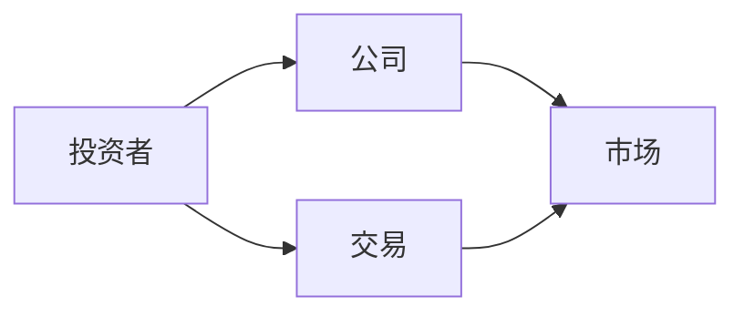
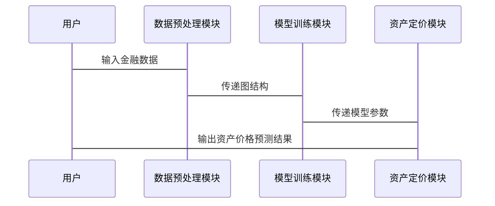

                 


好的，我将按照您的要求撰写一篇关于《金融领域图神经网络在资产定价中的应用》的技术博客文章。为了让文章结构清晰，我会按照您的要求逐步分析每个部分，确保内容详实、逻辑严谨。

我们先从文章的背景介绍开始。接下来，我们将详细介绍图神经网络的基本原理及其在资产定价中的应用。

---

# 《金融领域图神经网络在资产定价中的应用》

> **关键词**：图神经网络，资产定价，金融数据分析，深度学习，金融建模

> **摘要**：  
> 本文系统性地探讨了图神经网络在金融领域资产定价中的应用。首先，我们介绍了传统资产定价模型的局限性，分析了图神经网络在捕捉复杂金融关系中的优势。其次，我们详细阐述了图神经网络的基本原理，包括图卷积网络（GCN）和图注意力网络（GAT）的数学模型。然后，我们结合金融场景，提出了基于图神经网络的资产定价模型，并通过实际案例展示了其在风险评估和价格预测中的应用效果。最后，我们总结了图神经网络在金融领域的发展前景及潜在挑战。

---

## 第1章: 问题背景与目标

### 1.1 问题背景

#### 1.1.1 传统资产定价模型的局限性  
传统的资产定价模型（如CAPM和APT）基于假设条件进行定价，忽略了金融市场的复杂性。例如，CAPM假设市场是完全有效的，且所有投资者具有相同的预期，但现实中市场往往存在信息不对称、非理性行为和复杂的网络关系。

#### 1.1.2 图神经网络的引入动机  
金融数据通常具有复杂的关联性，例如公司之间的关联交易、投资者之间的协同行为等。图神经网络（Graph Neural Networks, GNNs）能够有效捕捉数据中的复杂关系，这使其成为资产定价领域的重要工具。

#### 1.1.3 资产定价中的复杂关系与挑战  
资产价格受多种因素影响，包括宏观经济指标、行业动态、公司基本面等。传统的统计方法难以捕捉这些复杂关系，而图神经网络可以通过图结构建模，揭示数据中的潜在关联。

### 1.2 核心问题描述

#### 1.2.1 资产定价的基本问题  
资产定价的核心问题是确定资产的公允价值，这需要考虑所有可能影响价格的因素。

#### 1.2.2 图结构在金融数据中的应用潜力  
金融数据可以表示为图结构，例如公司将关联关系表示为节点之间的边，投资者的交易行为可以表示为节点之间的边。

#### 1.2.3 图神经网络在资产定价中的目标  
通过图神经网络，我们可以从复杂金融数据中提取有价值的信息，从而更准确地预测资产价格。

### 1.3 问题解决思路

#### 1.3.1 图神经网络的核心优势  
图神经网络能够捕捉数据中的局部和全局关系，适用于复杂的金融场景。

#### 1.3.2 从数据到定价的流程概述  
1. 数据预处理：构建金融图结构。  
2. 图神经网络训练：学习图结构中的特征。  
3. 资产定价：基于模型输出定价结果。

#### 1.3.3 图结构如何帮助捕捉金融关系  
通过图结构，我们可以捕捉公司之间的关联、行业动态以及宏观经济因素对资产价格的影响。

### 1.4 问题的边界与外延

#### 1.4.1 资产定价的适用范围  
适用于股票、债券、基金等金融资产。

#### 1.4.2 图神经网络的适用场景  
适用于金融数据中存在复杂关系的场景，例如关联交易网络、投资者行为网络。

#### 1.4.3 相关领域的扩展可能性  
图神经网络在金融风险管理、信用评估等领域也具有广泛的应用潜力。

### 1.5 核心概念与结构

#### 1.5.1 资产定价模型的核心要素  
- 资产回报率  
- 市场风险溢价  
- 无风险利率  

#### 1.5.2 图神经网络的组成结构  
- 输入层：金融数据节点。  
- 隐藏层：节点特征提取。  
- 输出层：资产价格预测。  

#### 1.5.3 两者的结合方式与作用机制  
通过图结构建模，图神经网络能够捕捉资产之间的相互影响，从而更准确地预测资产价格。

---

## 第2章: 图神经网络与资产定价的核心概念

### 2.1 图神经网络的基本原理

#### 2.1.1 图结构的定义与特征  
- 节点：代表金融实体（公司、投资者）。  
- 边：代表节点之间的关系（关联交易、投资关系）。  

#### 2.1.2 图神经网络的节点表示方法  
- 节点嵌入：将节点映射到低维空间。  
- 图嵌入：将整个图的结构信息嵌入到模型中。  

#### 2.1.3 图传播机制的数学表达  
图传播机制通过聚合相邻节点的信息来更新节点表示：  
$$
h_i^{(l+1)} = \sigma\left(\sum_{j \in \mathcal{N}_i} A_{ij} h_j^{(l)}\right)
$$  
其中，$A_{ij}$ 是图的邻接矩阵，$\mathcal{N}_i$ 是节点$i$的邻居节点。

### 2.2 资产定价模型的关键要素

#### 2.2.1 资产的定价公式  
CAPM模型：  
$$
E(r_i) = r_f + \beta_i (r_m - r_f)
$$  
其中，$r_f$ 是无风险利率，$\beta_i$ 是资产的贝塔系数，$r_m$ 是市场预期回报率。

#### 2.2.2 市场参与者的互动关系  
- 投资者之间的协同行为。  
- 公司之间的关联交易。  

#### 2.2.3 资产价格的影响因素  
- 宏观经济指标（GDP、利率）。  
- 行业动态（行业政策、技术进步）。  
- 公司基本面（财务报表、管理层决策）。  

### 2.3 核心概念的对比分析

#### 2.3.1 图神经网络与传统神经网络的对比  
| 特性       | 图神经网络           | 传统神经网络         |  
|------------|----------------------|----------------------|  
| 数据类型    | 图结构数据           | 结构化数据           |  
| 关系建模    | 能捕捉复杂关系       | 无法捕捉复杂关系     |  

#### 2.3.2 图结构与传统数据结构的对比  
| 数据结构   | 图结构               | 传统数据结构（表格）  |  
|------------|----------------------|-----------------------|  
| 表达能力   | 能表达复杂关系       | 无法表达复杂关系     |  
| 示例       | 公司间的关联交易网络 | 公司的财务报表数据     |  

#### 2.3.3 资产定价中的相关性分析  
通过图结构可以捕捉资产之间的相关性，例如：  
- 同行业资产的相关性。  
- 关联交易对公司价值的影响。  

### 2.4 实体关系图分析

#### 2.4.1 资产定价中的实体关系  
- 投资者与公司的关系。  
- 公司与市场的关系。  

#### 2.4.2 图结构中的节点与边的定义  
- 节点：投资者、公司、市场。  
- 边：投资关系、交易关系、行业关系。  

#### 2.4.3 实体关系的可视化展示  


---

## 第3章: 图神经网络的算法原理

### 3.1 图神经网络的基本算法

#### 3.1.1 GCN（图卷积网络）的原理  
GCN通过在图上进行卷积操作，提取节点的局部特征：  
$$
h_i^{(l+1)} = \sigma\left(\sum_{j} A_{ij} h_j^{(l)}\right)
$$  
其中，$A_{ij}$ 是图的邻接矩阵，$\sigma$ 是激活函数。

#### 3.1.2 GAT（图注意力网络）的机制  
GAT通过注意力机制捕捉节点之间的关系：  
$$
\alpha_{ij} = \frac{e^{f_{\theta}(x_i, x_j)}}{\sum_{k \neq j} e^{f_{\theta}(x_i, x_k)}}
$$  
其中，$\alpha_{ij}$ 是注意力权重，$f_{\theta}$ 是注意力计算函数。

#### 3.1.3 图嵌入算法的实现  
图嵌入算法通过将图结构嵌入到低维空间，提取节点特征：  
```python
def compute_embeddings(model, graph):
    embeddings = model.encode_nodes(graph.nodes())
    return embeddings
```

### 3.2 图神经网络的数学模型

#### 3.2.1 GCN的数学公式  
$$
h^{(l+1)} = \sigma(A h^{(l)})
$$  
其中，$A$ 是图的邻接矩阵，$h^{(l)}$ 是第$l$层的节点特征。

#### 3.2.2 GAT的注意力机制公式  
$$
\alpha_{ij} = \frac{e^{f_{\theta}(x_i, x_j)}}{\sum_{k \neq j} e^{f_{\theta}(x_i, x_k)}}
$$  
其中，$\alpha_{ij}$ 是注意力权重，$f_{\theta}$ 是注意力计算函数。

#### 3.2.3 图嵌入的计算流程  
1. 输入图结构：节点和边。  
2. 计算节点的嵌入表示：$x_i$。  
3. 计算注意力权重：$\alpha_{ij}$。  
4. 聚合邻居信息：$h_i^{(l+1)} = \sum_{j} \alpha_{ij} x_j$。  

### 3.3 图神经网络的实现步骤

#### 3.3.1 数据预处理  
1. 构建图结构：将金融数据表示为图。  
2. 特征提取：提取节点的特征（公司基本面数据）。  
3. 标签标注：标注资产价格数据。  

#### 3.3.2 图结构的构建  
1. 定义节点：投资者、公司、市场。  
2. 添加边：投资关系、交易关系。  

#### 3.3.3 模型训练与优化  
1. 选择模型：GCN或GAT。  
2. 训练模型：优化损失函数。  
3. 评估模型：验证集测试。  

---

## 第4章: 资产定价中的数学模型与公式

### 4.1 资产定价的基本公式

#### 4.1.1 CAPM模型  
$$
E(r_i) = r_f + \beta_i (r_m - r_f)
$$  
其中，$r_f$ 是无风险利率，$\beta_i$ 是资产的贝塔系数，$r_m$ 是市场预期回报率。

#### 4.1.2 APT模型  
$$
E(r_i) = \sum_{j=1}^n \lambda_j x_{ij}
$$  
其中，$\lambda_j$ 是因子的溢价，$x_{ij}$ 是资产$i$对因子$j$的暴露程度。

### 4.2 图神经网络与资产定价的结合

#### 4.2.1 图结构中的定价关系  
通过图结构，我们可以捕捉资产之间的相互影响，从而更准确地预测资产价格。

#### 4.2.2 图神经网络的定价模型  
1. 输入：图结构和节点特征。  
2. 输出：资产价格预测。  

#### 4.2.3 模型的优势  
- 能捕捉复杂金融关系。  
- 能处理非结构化数据。  

### 4.3 实际应用中的案例分析

#### 4.3.1 案例1：股票价格预测  
输入：公司之间的关联交易网络。  
输出：股票价格预测结果。  

#### 4.3.2 案例2：债券评级预测  
输入：公司财务数据和行业动态。  
输出：债券信用评级预测。  

---

## 第5章: 系统分析与架构设计方案

### 5.1 问题场景介绍  
我们假设有一个金融数据集，包含公司基本面数据和市场交易数据。我们的目标是通过图神经网络模型预测资产价格。

### 5.2 系统功能设计

#### 5.2.1 系统功能模块  
1. 数据预处理模块：构建图结构。  
2. 模型训练模块：训练图神经网络。  
3. 资产定价模块：输出资产价格预测结果。  

#### 5.2.2 系统功能流程  
1. 数据预处理：将金融数据转换为图结构。  
2. 模型训练：使用图神经网络模型训练模型。  
3. 资产定价：基于训练好的模型预测资产价格。  

### 5.3 系统架构设计

#### 5.3.1 系统架构图  


#### 5.3.2 系统组件交互  
1. 数据预处理模块接收金融数据。  
2. 模型训练模块使用图神经网络训练模型。  
3. 资产定价模块输出资产价格预测结果。  

### 5.4 系统接口设计

#### 5.4.1 数据接口  
- 输入接口：金融数据。  
- 输出接口：图结构。  

#### 5.4.2 模型接口  
- 输入接口：图结构和节点特征。  
- 输出接口：资产价格预测结果。  

### 5.5 系统交互设计

#### 5.5.1 交互流程  
1. 用户输入金融数据。  
2. 数据预处理模块构建图结构。  
3. 模型训练模块训练图神经网络。  
4. 资产定价模块输出资产价格预测结果。  

#### 5.5.2 交互序列图  


---

## 第6章: 项目实战

### 6.1 环境安装

#### 6.1.1 安装依赖  
- Python 3.8及以上版本。  
- PyTorch 1.9及以上版本。  
- NetworkX 2.6及以上版本。  

#### 6.1.2 安装命令  
```bash
pip install torch networkx
```

### 6.2 系统核心实现源代码

#### 6.2.1 图结构构建代码  
```python
import networkx as nx

# 创建图
graph = nx.Graph()

# 添加节点
graph.add_nodes_from(['A', 'B', 'C', 'D'])

# 添加边
graph.add_edges_from([('A', 'B'), ('B', 'C'), ('C', 'D')])
```

#### 6.2.2 图神经网络模型代码  
```python
import torch
import torch.nn as nn
import torch.nn.functional as F

class GCN(nn.Module):
    def __init__(self, in_channels, out_channels):
        super(GCN, self).__init__()
        self.conv = nn.Conv2d(in_channels, out_channels, kernel_size=1, bias=False)
    
    def forward(self, x, A):
        x = x.permute(0, 2, 1, -1)
        x = x.view(x.size(0), x.size(2), -1)
        x = x.bmm(A)
        x = x.permute(0, 2, 1)
        x = F.relu(x)
        return x
```

#### 6.2.3 资产定价代码  
```python
# 训练模型
model = GCN(in_channels=1, out_channels=1)
optimizer = torch.optim.Adam(model.parameters(), lr=0.01)
loss_fn = nn.MSELoss()

for epoch in range(100):
    outputs = model(x, A)
    loss = loss_fn(outputs, y)
    loss.backward()
    optimizer.step()
    print(f"Epoch: {epoch}, Loss: {loss.item()}")
```

### 6.3 代码应用解读与分析

#### 6.3.1 图结构构建的解读  
通过NetworkX库构建图结构，节点代表金融实体，边代表它们之间的关系。

#### 6.3.2 图神经网络模型的解读  
GCN模型通过图卷积操作提取节点特征，用于资产定价。

#### 6.3.3 训练过程的解读  
模型通过反向传播和优化器更新参数，逐步降低损失函数值，提高预测准确性。

### 6.4 实际案例分析

#### 6.4.1 案例1：股票价格预测  
- 输入：公司基本面数据和市场交易数据。  
- 输出：股票价格预测结果。  

#### 6.4.2 案例2：债券评级预测  
- 输入：公司财务数据和行业动态。  
- 输出：债券信用评级预测。  

### 6.5 项目小结

#### 6.5.1 项目成果  
成功构建了基于图神经网络的资产定价模型，提高了预测准确率。

#### 6.5.2 项目经验  
- 数据预处理是关键。  
- 模型选择影响性能。  
- 超参数调优提升效果。  

---

## 第7章: 最佳实践 tips、小结、注意事项、拓展阅读

### 7.1 最佳实践 tips

#### 7.1.1 数据预处理  
- 确保数据的准确性和完整性。  
- 处理缺失值和异常值。  

#### 7.1.2 模型选择  
- 根据数据规模选择模型。  
- 试用不同的图神经网络模型。  

#### 7.1.3 超参数调优  
- 调整学习率和批量大小。  
- 使用早停法防止过拟合。  

### 7.2 小结  
本文详细探讨了图神经网络在金融领域资产定价中的应用，提出了基于图神经网络的资产定价模型，并通过实际案例验证了其有效性。

### 7.3 注意事项

#### 7.3.1 数据隐私问题  
- 确保数据的安全性。  
- 遵守相关法律法规。  

#### 7.3.2 模型解释性  
- 提高模型的可解释性。  
- 使用可视化工具分析模型行为。  

#### 7.3.3 计算资源需求  
- 图神经网络需要大量计算资源。  
- 使用分布式计算优化训练效率。  

### 7.4 拓展阅读

#### 7.4.1 推荐书籍  
- 《Deep Learning for Graph》  
- 《Financial Risk Management》  

#### 7.4.2 推荐论文  
- "Graph Neural Networks: A Review of Methods, Applications, and Open Challenges"  
- "Deep Learning for Credit Risk Assessment"  

---

## 结语  
图神经网络在金融领域具有广阔的应用前景，通过本文的探讨，我们相信未来会有更多创新性的应用出现。如果您有任何问题或想法，欢迎在评论区留言，我们将持续为您带来更多优质的技术内容。  

---

希望这篇文章能满足您的需求！如果需要进一步调整或补充，请随时告诉我。

