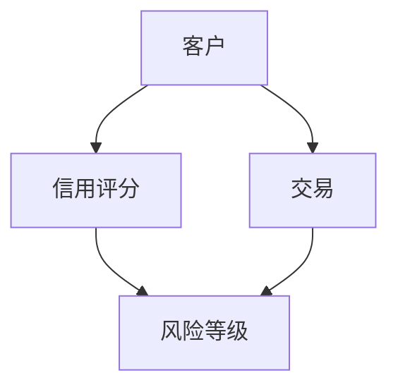
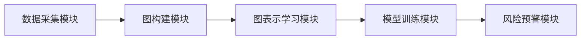

                 


# 《金融领域图表示学习在信用网络中的应用》

## 关键词：图表示学习、信用网络、金融风险、信用评估、深度学习

## 摘要：  
本文系统地探讨了图表示学习在金融领域信用网络中的应用，重点分析了图表示学习的核心概念、算法原理及其在信用评估和风险控制中的实际应用。通过构建信用网络的图结构，结合深度学习技术，提出了一种优化的信用评分模型，并通过案例分析展示了其在金融风险预警中的优势。本文还详细介绍了系统的架构设计、数学模型和实际项目实现，为读者提供了从理论到实践的全面指导。

---

## 第1章: 图表示学习与信用网络的概述

### 1.1 图表示学习的基本概念

#### 1.1.1 图的基本概念与属性  
图（Graph）是由节点（Vertex）和边（Edge）组成的数学结构，节点代表实体，边代表实体之间的关系。在金融领域，节点可以是客户、交易或机构，边可以是交易金额、借贷关系或投资关系。

#### 1.1.2 图表示学习的定义与特点  
图表示学习（Graph Representation Learning）是将图结构中的节点或边嵌入到低维空间中，同时保留图的拓扑结构和语义信息。其特点包括：  
1. **非线性关系**：图结构中的关系通常是复杂的非线性关系。  
2. **全局性**：图表示学习能够捕捉到整个图的全局信息。  
3. **可解释性**：通过嵌入向量，可以直观地理解节点或边的特征。

#### 1.1.3 信用网络在金融领域的应用背景  
信用网络是金融领域的重要组成部分，用于表示客户之间的信用关系。通过图表示学习，可以更好地分析信用网络的结构，从而优化信用评估和风险控制。

---

### 1.2 信用网络的构建与特点

#### 1.2.1 信用网络的构建方法  
信用网络的构建通常基于客户交易数据和信用评分数据。通过数据清洗、特征提取和图构建等步骤，可以形成一个完整的信用网络。

#### 1.2.2 信用网络的特征分析  
信用网络的特征包括节点的度数、中心性、社区结构等。这些特征可以帮助识别高风险客户和潜在的信用风险。

#### 1.2.3 信用网络在金融风险控制中的作用  
信用网络可以帮助识别系统性风险，评估客户的信用风险，并优化信用评分模型。

---

### 1.3 图表示学习在信用网络中的应用价值

#### 1.3.1 提升信用评估的准确性  
通过图表示学习，可以捕捉到信用网络中的复杂关系，从而提高信用评估的准确性。

#### 1.3.2 优化金融风险预警系统  
图表示学习可以帮助识别潜在的金融风险，从而优化风险预警系统。

#### 1.3.3 支持信用评分模型的改进  
通过图表示学习，可以提取更丰富的特征，从而改进信用评分模型。

---

## 第2章: 图表示学习的核心概念与联系

### 2.1 图表示学习的核心原理

#### 2.1.1 图的表示方法  
图的表示方法包括节点嵌入、边嵌入和图嵌入。节点嵌入表示单个节点的特征，边嵌入表示节点之间的关系，图嵌入表示整个图的特征。

#### 2.1.2 节点嵌入与边嵌入的定义  
节点嵌入：通过深度学习技术将节点映射到低维空间中的向量。  
边嵌入：通过考虑节点的嵌入向量，表示边的特征。

#### 2.1.3 图嵌入的数学模型  
图嵌入的数学模型通常基于图的邻接矩阵和拉普拉斯矩阵，通过矩阵分解或图卷积操作提取特征。

---

### 2.2 核心概念的属性特征对比

#### 2.2.1 节点与边的属性对比  
节点属性：节点的特征，如客户的信用评分、交易金额等。  
边属性：边的特征，如交易金额、借贷关系等。

#### 2.2.2 图结构与传统数据结构的对比  
图结构：复杂的非线性关系，可以捕捉全局信息。  
传统数据结构（如表格）：线性关系，难以捕捉全局信息。

#### 2.2.3 图表示学习与传统机器学习的对比  
图表示学习：可以捕捉图的复杂关系，适合处理金融网络中的非线性问题。  
传统机器学习：难以处理复杂的非线性关系。

---

### 2.3 ER实体关系图架构



---

## 第3章: 图表示学习的算法原理

### 3.1 常见的图表示学习算法

#### 3.1.1 Node2Vec算法  
Node2Vec是一种基于随机游走的节点嵌入算法，通过生成节点的上下文向量来表示节点的特征。

#### 3.1.2 GraphSAGE算法  
GraphSAGE是一种基于归纳式图卷积网络的算法，通过聚合邻居节点的特征来生成节点的嵌入向量。

#### 3.1.3 GCN（图卷积网络）  
GCN是一种基于图卷积操作的算法，通过邻接矩阵和拉普拉斯矩阵进行特征提取。

---

### 3.2 算法原理的数学模型

#### 3.2.1 Node2Vec的数学模型  
Node2Vec的目标是最小化节点的上下文概率，通过负采样方法优化模型。

#### 3.2.2 GraphSAGE的数学模型  
GraphSAGE的聚合函数可以是平均值、最大值或加权和，具体取决于聚合策略。

#### 3.2.3 GCN的数学模型  
GCN的图卷积操作可以表示为：  
$$ H^{(l+1)} = \text{ReLu}(A H^{(l)} H^{(l)} ) $$  

---

### 3.3 算法实现的代码示例

```python
import tensorflow as tf
from tensorflow.keras import layers

def graph_conv_layer(inputs, num_nodes, embedding_size):
    # 输入图的邻接矩阵和节点特征
    adjacency = inputs[0]
    features = inputs[1]
    
    # 图卷积操作
    conv = tf.keras.layers.Conv2D(filters=embedding_size, kernel_size=1, activation='relu')(adjacency)
    output = tf.keras.layers.Dense(num_nodes)(conv)
    
    return output
```

---

## 第4章: 数学模型与公式

### 4.1 图的邻接矩阵与拉普拉斯矩阵

#### 4.1.1 邻接矩阵的定义  
邻接矩阵是一个对称矩阵，表示节点之间的连接关系。

#### 4.1.2 拉普拉斯矩阵的定义  
拉普拉斯矩阵是邻接矩阵的归一化形式，用于图卷积操作。

### 4.2 图卷积网络的数学模型

#### 4.2.1 图卷积操作的定义  
图卷积操作可以表示为：  
$$ H^{(l+1)} = \text{AGC}(A, H^{(l)}) $$  
其中，AGC表示聚合操作，A是邻接矩阵，\( H^{(l)} \)是输入特征矩阵。

#### 4.2.2 图卷积网络的损失函数  
图卷积网络的损失函数可以采用交叉熵损失：  
$$ \mathcal{L} = -\sum_{i=1}^{N} y_i \log(p_i) + (1-y_i)\log(1-p_i) $$  

---

## 第5章: 系统分析与架构设计方案

### 5.1 系统功能设计

#### 5.1.1 系统模块划分  
系统模块包括数据采集、图构建、图表示学习、模型训练和风险预警。

#### 5.1.2 系统功能流程  
数据采集 → 图构建 → 图表示学习 → 模型训练 → 风险预警。

---

### 5.2 系统架构设计



---

## 第6章: 项目实战

### 6.1 环境安装

#### 6.1.1 安装依赖库  
安装TensorFlow、Keras、NetworkX等库。

### 6.2 系统核心实现源代码

```python
import networkx as nx
from tensorflow.keras import layers

def build_graph(adj_matrix):
    G = nx.Graph()
    for i in range(len(adj_matrix)):
        for j in range(len(adj_matrix[i])):
            if adj_matrix[i][j] > 0:
                G.add_edge(i, j)
    return G
```

---

## 第7章: 总结与展望

### 7.1 总结

图表示学习在信用网络中的应用具有重要的理论和实践意义。通过构建信用网络的图结构，可以更好地分析信用关系，优化信用评估和风险控制。

### 7.2 展望

未来的研究方向包括优化图表示学习算法、结合时间序列数据、探索多模态数据的融合等。

---

通过以上内容，读者可以系统地了解图表示学习在金融领域信用网络中的应用，从理论到实践，逐步掌握相关知识和技能。

