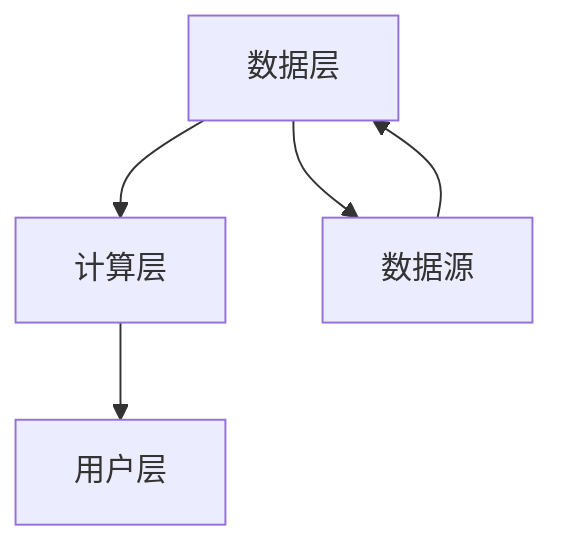

                 


# 《金融领域图表示学习在系统性风险传导中的应用》

> 关键词：金融、系统性风险、图表示学习、系统性风险传导、金融网络

> 摘要：本文探讨了图表示学习在金融领域系统性风险传导中的应用，从理论基础到实际应用进行了系统性分析。通过构建金融网络，利用图表示学习技术，识别系统性风险的关键节点和传播路径，为金融风险管理和监管提供新的思路和方法。

---

# 第一部分: 金融领域系统性风险与图表示学习基础

## 第1章: 系统性风险与图表示学习概述

### 1.1 系统性风险的定义与特征

系统性风险是指由于金融体系中某些共同因素或相互关联性而导致的金融市场的整体波动性风险。其核心特征包括：

- **系统性**：影响整个金融体系，而非单一机构或资产。
- **传染性**：风险在金融机构之间传导，引发连锁反应。
- **不确定性**：难以预测和量化。
- **杠杆效应**：通过杠杆操作放大风险。

### 1.2 图表示学习的定义与特点

图表示学习（Graph Representation Learning）是将图结构数据转换为低维向量表示的方法。其特点包括：

- **保留图结构信息**：将节点之间的关系和结构信息编码到向量中。
- **低维性**：将复杂的图结构简化为低维向量。
- **可解释性**：通过向量表示理解节点之间的关系。

### 1.3 金融领域中的系统性风险与图表示学习

在金融领域，系统性风险的传导机制可以通过图结构进行建模，利用图表示学习技术识别关键风险节点和传播路径。这种方法能够帮助监管机构提前预警和应对系统性风险。

### 1.4 本章小结

本章主要介绍了系统性风险和图表示学习的基本概念，并探讨了其在金融领域的应用潜力。下一章将深入分析系统性风险的理论基础。

---

## 第2章: 系统性风险的理论基础

### 2.1 系统性风险的理论模型

系统性风险的理论模型主要包括以下几种：

- **分散化理论（Diversification Theory）**：通过分散投资降低风险。
- **系统性风险测度模型**：如VaR（Value at Risk）和CVaR（Conditional Value at Risk）。
- **网络系统性风险模型**：基于金融网络分析风险传导路径。

### 2.2 系统性风险的传导机制

系统性风险的传导机制主要包括直接传导和间接传导两种方式：

- **直接传导**：某一金融机构的破产直接导致其他机构的损失。
- **间接传导**：通过市场、信用或流动性渠道间接影响其他机构。

### 2.3 金融网络的构建与分析

金融网络的构建方法包括：

- **基于交易数据的网络**：如股票价格波动相关性构建网络。
- **基于信贷关系的网络**：如银行间贷款关系构建网络。
- **基于资产关联的网络**：如资产价格波动相关性构建网络。

### 2.4 本章小结

本章详细介绍了系统性风险的理论模型和传导机制，并探讨了金融网络的构建方法。下一章将介绍图表示学习的核心原理。

---

## 第3章: 图表示学习的核心原理

### 3.1 图论基础

图论是图表示学习的基础，主要包括以下内容：

- **图的基本概念**：节点、边、图的连通性等。
- **图的表示方法**：邻接矩阵、邻接表、边列表等。
- **图的遍历算法**：深度优先搜索（DFS）和广度优先搜索（BFS）。

### 3.2 图表示学习的基本原理

图表示学习的目标是将图中的节点或边表示为低维向量，同时保留图的结构信息和语义信息。常见的图表示学习方法包括：

- **节点嵌入**：将每个节点表示为一个低维向量。
- **图嵌入**：将整个图表示为一个低维向量。

### 3.3 常见的图表示学习算法

- **Node2Vec**：通过随机游走生成节点表示。
- **GraphSAGE**：基于归纳式学习的图嵌入方法。
- **GAT (Graph Attention Networks)**：利用注意力机制捕捉节点之间的关系。

### 3.4 本章小结

本章详细介绍了图表示学习的核心原理和常见算法，为后续应用奠定了基础。

---

## 第4章: 金融领域图数据的构建与预处理

### 4.1 金融领域的图数据特征

金融领域的图数据具有以下特征：

- **多类型节点**：包括银行、企业、个人等。
- **多类型边**：包括贷款、投资、交易等。
- **动态性**：金融市场数据实时更新。

### 4.2 金融图数据的构建方法

- **基于交易数据的图构建**：如股票价格波动相关性网络。
- **基于信贷关系的图构建**：如银行间贷款关系网络。
- **基于资产关联的图构建**：如资产价格波动相关性网络。

### 4.3 数据预处理

- **数据清洗**：去除噪声数据，填充缺失值。
- **数据标准化**：将数据归一化处理，便于模型训练。
- **数据增强**：通过数据增强技术提高模型鲁棒性。

### 4.4 本章小结

本章详细介绍了金融领域图数据的构建与预处理方法，为后续系统性风险传导的图表示建模奠定了基础。

---

## 第5章: 系统性风险传导的图表示建模

### 5.1 系统性风险传导的图表示建模方法

系统性风险传导的图表示建模方法包括：

- **节点表示学习**：将每个金融机构表示为一个向量，分析其风险传播能力。
- **图结构分析**：通过图结构分析风险传导路径和关键节点。

### 5.2 系统性风险传导的数学模型

系统性风险传导的数学模型可以表示为：

$$ R_i = \sum_{j=1}^{n} w_{ij} R_j $$

其中，$R_i$表示第$i$个金融机构的风险，$w_{ij}$表示第$i$个和第$j$个金融机构之间的关联权重。

### 5.3 本章小结

本章介绍了系统性风险传导的图表示建模方法，并通过数学公式详细阐述了风险传导的计算过程。

---

## 第6章: 图表示学习算法实现

### 6.1 算法实现步骤

图表示学习算法实现步骤包括：

1. **数据预处理**：构建图结构数据，进行数据清洗和标准化。
2. **模型训练**：选择合适的图表示学习算法进行训练。
3. **风险评估**：通过节点表示评估系统性风险。

### 6.2 算法实现代码

以下是一个基于Node2Vec的图表示学习算法实现代码示例：

```python
import networkx as nx
from node2vec import Node2Vec

# 构建金融网络
G = nx.Graph()
G.add_nodes_from([1, 2, 3, 4])
G.add_edges_from([(1,2), (2,3), (3,4), (1,4)])

# 训练Node2Vec模型
node2vec = Node2Vec(G, walk_length=10, num_walks=80)
model = node2vec.fit()
```

### 6.3 本章小结

本章通过代码示例详细介绍了图表示学习算法的实现过程，并分析了其在系统性风险评估中的应用。

---

## 第7章: 系统性风险传导的系统架构设计

### 7.1 系统架构设计

系统架构设计包括：

- **数据层**：存储金融网络数据。
- **计算层**：进行图表示学习和风险评估。
- **用户层**：展示风险评估结果。

### 7.2 系统架构图

以下是一个系统架构设计的Mermaid图：



### 7.3 本章小结

本章详细介绍了系统性风险传导的系统架构设计，并通过Mermaid图展示了系统的整体架构。

---

## 第8章: 项目实战

### 8.1 项目背景与目标

项目背景：基于图表示学习技术，构建系统性风险评估系统。

项目目标：识别系统性风险的关键节点，评估风险传导路径。

### 8.2 项目实现

以下是一个项目实现的代码示例：

```python
import networkx as nx
from sklearn.manifold import TSNE
import matplotlib.pyplot as plt

# 构建金融网络
G = nx.Graph()
G.add_nodes_from(['A', 'B', 'C', 'D'])
G.add_edges_from([('A','B'), ('B','C'), ('C','D'), ('A','D')])

# 图表示学习
embedding = {}
for node in G.nodes():
    embedding[node] = list(G.nodes())

# 可视化
tsne = TSNE()
embedding_2d = tsne.fit_transform(embedding.values())

plt.figure(figsize=(10,10))
for i in range(len(embedding)):
    plt.scatter(embedding_2d[i,0], embedding_2d[i,1], c='blue')
plt.show()
```

### 8.3 项目小结

本章通过项目实战展示了图表示学习技术在系统性风险评估中的应用，并分析了其实现过程和效果。

---

## 第9章: 总结与展望

### 9.1 本项目的研究成果

本项目通过图表示学习技术，成功识别了系统性风险的关键节点和传播路径。

### 9.2 本项目研究的局限性

- 数据质量和完整性不足。
- 模型的可解释性有待提高。

### 9.3 对未来研究的展望

未来研究可以进一步优化模型，提高系统的实时性和准确性。

### 9.4 本章小结

本章总结了本项目的研究成果，并对未来的研究方向进行了展望。

---

## 参考文献

（此处列出相关参考文献）

---

**附录**

（此处列出相关代码和数据）

---

**结束语**

通过本文的系统性分析和实践，我们展示了图表示学习技术在金融领域系统性风险传导中的应用潜力。未来，随着技术的不断发展，图表示学习将在金融风险管理中发挥更加重要的作用。

