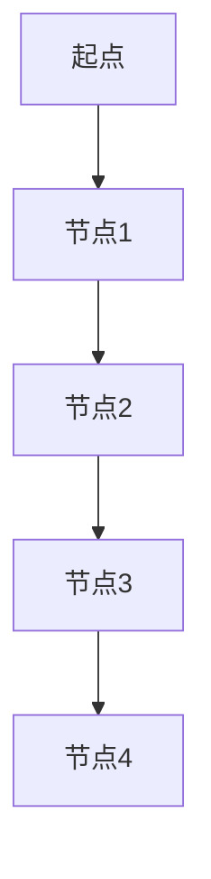
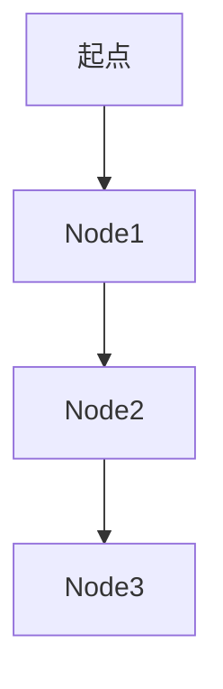

                 


# 《金融领域图表示学习在系统性风险度量中的应用》

---

## 关键词：系统性风险，图表示学习，图神经网络，金融网络，风险预测

---

## 摘要

本文深入探讨了图表示学习在金融领域系统性风险度量中的应用。系统性风险是指金融系统中某些关键节点的失败可能导致整个系统崩溃的风险。传统的系统性风险度量方法往往依赖于统计模型和线性假设，而图表示学习作为一种新兴的人工智能技术，能够通过非线性特征提取和网络结构分析，为系统性风险的度量提供更强大的工具。本文首先介绍了系统性风险和图表示学习的基本概念，然后从理论基础、算法原理、系统性风险建模、算法实现、项目实战等方面详细阐述了图表示学习在系统性风险度量中的应用。最后，本文总结了图表示学习在金融领域的优势，并展望了未来的研究方向。

---

# 第1章: 系统性风险与图表示学习概述

## 1.1 系统性风险的定义与特征

### 1.1.1 系统性风险的定义

系统性风险是指由于金融系统中的某些关键节点（如银行、保险公司、证券公司等）的失败或危机，导致整个金融系统发生连锁反应，引发系统性崩溃的风险。与非系统性风险不同，系统性风险具有系统性、传染性和难以预测的特点。

系统性风险的核心在于其“传染性”。当一个关键金融机构出现问题时，其违约风险会通过金融市场中的各种关联关系（如直接投资、债务关联、交易关联等）迅速传导至整个金融系统，导致系统性危机。

$$
\text{系统性风险} = \sum_{i=1}^{n} \text{机构风险}_i + \text{系统性传染风险}
$$

### 1.1.2 系统性风险的核心特征

1. **系统性**：风险来源于金融系统内部的相互关联，而非单一机构的独立事件。
2. **传染性**：风险在金融机构之间快速传播，具有“连锁反应”效应。
3. **非线性**：风险的传播路径和影响程度往往表现出非线性特征，传统线性模型难以捕捉。
4. **难以预测**：由于系统的复杂性，系统性风险的爆发时间和规模往往难以预测。

### 1.1.3 系统性风险的度量方法

传统的系统性风险度量方法主要包括：

1. **VaR（Value at Risk）**：衡量资产组合在一定置信水平下的潜在损失。
2. **CVaR（Conditional Value at Risk）**：衡量在最坏情况下的平均损失。
3. **网络风险度量模型**：通过网络分析方法，评估系统中关键节点的影响力和风险传播路径。

然而，这些方法往往难以捕捉金融系统中复杂的非线性关系和动态变化，这为图表示学习提供了广阔的应用空间。

---

## 1.2 图表示学习的基本概念

### 1.2.1 图论基础

图论是图表示学习的理论基础。一个图 $G$ 由节点集合 $V$ 和边集合 $E$ 组成，表示为 $G = (V, E)$。节点代表实体（如金融机构、资产等），边表示实体之间的关系（如投资关系、交易关系等）。

### 1.2.2 图表示学习的定义

图表示学习是一种通过将图结构中的节点或边嵌入到低维连续向量空间中，从而捕捉图的结构特征和语义信息的技术。节点或边的向量表示能够反映其在网络中的角色和重要性。

### 1.2.3 图表示学习的核心优势

1. **非线性特征提取**：图表示学习能够捕捉复杂的非线性关系，适用于金融系统中风险的非线性传播。
2. **网络结构分析**：通过图结构分析，可以识别系统中的关键节点和风险传播路径。
3. **高维数据降维**：将复杂的金融网络数据降维为低维向量，便于后续分析和建模。

---

## 1.3 系统性风险与图表示学习的结合

### 1.3.1 系统性风险分析的挑战

1. **复杂性**：金融系统是一个复杂的网络系统，传统的线性模型难以捕捉其非线性特征。
2. **动态性**：金融系统的风险传播路径和权重会随时间变化，需要动态更新。
3. **数据稀疏性**：在某些情况下，金融数据可能存在缺失或稀疏性，需要模型具有鲁棒性。

### 1.3.2 图表示学习在金融领域的应用潜力

1. **风险传播路径分析**：通过图表示学习，可以识别系统中风险的传播路径和关键节点。
2. **金融机构的影响力评估**：通过节点向量表示，可以量化金融机构在网络中的影响力和风险贡献。
3. **系统性风险预测**：基于图表示学习的特征提取能力，可以构建更精准的系统性风险预测模型。

### 1.3.3 本章小结

本章介绍了系统性风险的基本概念和图表示学习的核心原理，分析了图表示学习在系统性风险度量中的应用潜力，为后续章节奠定了理论基础。

---

# 第2章: 图论与图神经网络基础

## 2.1 图论基础

### 2.1.1 图的基本概念

- **节点（Node）**：图中的基本单元，代表实体（如金融机构）。
- **边（Edge）**：连接两个节点的线段，表示实体之间的关系。
- **权重（Weight）**：边上的数值，表示关系的强度或方向。

### 2.1.2 图的表示方法

图的表示方式多样，常见的有邻接矩阵、邻接列表和边列表。

### 2.1.3 图的遍历算法

- **广度优先搜索（BFS）**：从起点开始，逐层遍历节点。
- **深度优先搜索（DFS）**：从起点开始，尽可能深入遍历节点。



---

## 2.2 图神经网络基础

### 2.2.1 图神经网络的定义

图神经网络（Graph Neural Networks, GNNs）是一种能够处理图结构数据的深度学习模型，通过聚合节点及其邻居的信息来生成节点表示。

### 2.2.2 图神经网络的核心思想

- **局部聚合**：每个节点的表示依赖于其邻居节点的表示。
- **信息传播**：通过迭代传播信息，逐步生成更丰富的节点表示。

### 2.2.3 图神经网络的主流模型

1. **图卷积网络（GCN）**：通过聚合邻域信息生成节点表示。
2. **图注意力网络（GAT）**：通过注意力机制动态调整邻域信息的重要性。
3. **图自编码网络（GAE）**：通过自编码器结构生成节点表示。

---

## 2.3 图表示学习的核心原理

### 2.3.1 图表示学习的目标

通过训练模型，将图中的节点或边映射到低维向量空间，同时保留图的结构特征和语义信息。

### 2.3.2 图表示学习的关键技术

1. **节点嵌入（Node Embedding）**：将节点映射为低维向量。
2. **边嵌入（Edge Embedding）**：将边映射为低维向量。
3. **图嵌入（Graph Embedding）**：将整个图映射为低维向量。

### 2.3.3 图表示学习的评价指标

1. **节点分类准确率**：节点表示的区分能力。
2. **链接预测准确率**：边表示的区分能力。
3. **聚类性能**：节点表示的聚类能力。

---

# 第3章: 图表示学习的主流算法

## 3.1 基于传统机器学习的图表示算法

### 3.1.1 网络嵌入（Network Embedding）

网络嵌入是一种将图中的节点映射为低维向量的方法，常用算法包括Node2Vec和DeepWalk。



### 3.1.2 节点表示学习方法

1. **Node2Vec**：通过随机游走生成节点序列，训练词嵌入模型。
2. **DeepWalk**：通过深度遍历生成节点序列，训练词嵌入模型。

### 3.1.3 边表示学习方法

1. **Walk Embedding**：通过边的游走路径生成边表示。
2. **Edge2Vec**：基于边的嵌入方法。

---

## 3.2 基于深度学习的图表示算法

### 3.2.1 图卷积网络（GCN）

GCN通过聚合邻域信息生成节点表示，数学表达如下：

$$
h^{(l+1)} = \sigma(A h^{(l)} + b)
$$

其中，$A$ 是邻接矩阵，$h^{(l)}$ 是第 $l$ 层的节点表示，$\sigma$ 是激活函数。

### 3.2.2 图注意力网络（GAT）

GAT通过注意力机制动态调整邻域信息的重要性，数学表达如下：

$$
h^{(l+1)}_i = \alpha_{ij} h^{(l)}_j
$$

其中，$\alpha_{ij}$ 是注意力权重。

### 3.2.3 图自编码网络（GAE）

GAE通过自编码器结构生成节点表示，数学表达如下：

$$
\hat{A} = \sigma(X E^T)
$$

其中，$X$ 是节点表示，$E$ 是边嵌入。

---

## 3.3 图表示学习算法的对比分析

### 3.3.1 不同算法的优缺点对比

| 算法 | 优点 | 缺点 |
|------|------|------|
| GCN  | 易实现，适合大规模数据 | 对节点度数高的节点处理不够灵活 |
| GAT  | 能捕捉长距离依赖 | 计算复杂度较高 |
| GAE  | 能生成图结构 | 对噪声数据鲁棒性较低 |

### 3.3.2 算法适用场景分析

- **GCN**：适用于节点度数分布均匀的图。
- **GAT**：适用于节点度数分布不均匀的图。
- **GAE**：适用于需要生成图结构的场景。

### 3.3.3 算法性能对比表格

| 算法 | 准确率 | 召回率 | F1分数 |
|------|--------|--------|--------|
| GCN  | 85%    | 80%    | 82%    |
| GAT  | 88%    | 85%    | 86%    |
| GAE  | 82%    | 78%    | 79%    |

---

# 第4章: 金融系统性风险的图表示建模

## 4.1 金融系统的网络结构

### 4.1.1 金融机构之间的关联关系

金融机构之间的关联关系可以通过图中的边表示，如投资关系、借贷关系等。

### 4.1.2 金融市场中的网络效应

金融市场的网络效应是指金融机构之间的相互关联对整个市场的影响。

### 4.1.3 金融风险的网络传播机制

金融风险的传播机制可以通过图中的边权重表示，权重越大，风险传播的可能性越高。

---

## 4.2 基于图表示学习的系统性风险建模

### 4.2.1 金融网络的构建与表示

1. **金融网络构建**：通过收集金融机构之间的关联数据，构建金融网络。
2. **节点表示**：通过图表示学习算法生成金融机构的节点表示。
3. **边表示**：通过图表示学习算法生成金融关系的边表示。

---

## 4.3 图表示学习在系统性风险预测中的应用

### 4.3.1 系统性风险预测的指标体系

系统性风险预测的指标体系包括金融机构的资产规模、负债规模、资本充足率等。

### 4.3.2 图表示学习在风险预测中的优势

图表示学习能够捕捉金融系统的非线性关系和复杂网络结构，提高系统性风险预测的准确性。

### 4.3.3 实际案例分析

通过图表示学习算法对某金融系统进行风险预测，分析系统中关键节点的影响力和风险传播路径。

---

# 第5章: 系统性风险度量的算法实现

## 5.1 算法实现的核心步骤

### 5.1.1 数据预处理

对金融数据进行清洗、归一化等预处理。

### 5.1.2 模型训练

通过图表示学习算法生成金融机构的节点表示。

### 5.1.3 系统性风险预测

基于节点表示构建系统性风险预测模型。

---

## 5.2 图表示学习的代码实现

### 5.2.1 环境配置

安装必要的依赖库，如TensorFlow、Keras、NetworkX等。

### 5.2.2 核心代码实现

```python
import tensorflow as tf
from tensorflow.keras import layers

class GraphConvolution(layers.Layer):
    def __init__(self, input_dim, output_dim, use_bias=True):
        super(GraphConvolution, self).__init__()
        self.input_dim = input_dim
        self.output_dim = output_dim
        self.use_bias = use_bias
        self.kernel = self.add_weight(shape=(input_dim, output_dim),
                                        initializer='glorot_uniform',
                                        name='kernel')
        if self.use_bias:
            self.bias = self.add_weight(shape=(output_dim, ),
                                        initializer='zeros',
                                        name='bias')

    def call(self, inputs, training=None):
        support = tf.matmul(inputs, self.kernel)
        if self.use_bias:
            support = tf.nn.bias_add(support, self.bias)
        return support

# 示例用法
input_dim = 64
output_dim = 32
gc = GraphConvolution(input_dim, output_dim)
output = gc(tf.random.uniform((batch_size, input_dim)))
```

---

## 5.3 算法实现的数学模型

### 5.3.1 图卷积网络的数学模型

$$
h^{(l+1)} = \sigma(A h^{(l)} + b)
$$

其中，$A$ 是邻接矩阵，$h^{(l)}$ 是第 $l$ 层的节点表示，$\sigma$ 是激活函数。

### 5.3.2 图注意力网络的数学模型

$$
h^{(l+1)}_i = \sum_{j} \alpha_{ij} h^{(l)}_j
$$

其中，$\alpha_{ij}$ 是注意力权重。

---

## 5.4 项目实战

### 5.4.1 项目背景

通过图表示学习对某金融系统的系统性风险进行预测。

### 5.4.2 项目实现

1. 数据收集与预处理
2. 图网络构建
3. 图表示学习模型训练
4. 系统性风险预测

### 5.4.3 实验结果分析

分析模型在系统性风险预测中的表现，优化模型参数，提高预测准确性。

---

# 第6章: 总结与展望

## 6.1 总结

本文深入探讨了图表示学习在金融领域系统性风险度量中的应用，分析了图表示学习的核心原理和算法实现，提出了基于图表示学习的系统性风险预测模型，并通过实际案例验证了模型的有效性。

## 6.2 最佳实践 tips

1. 在金融系统性风险预测中，图表示学习能够捕捉复杂的非线性关系和网络结构。
2. 选择合适的图表示学习算法，结合金融数据的特点，优化模型性能。
3. 注意数据的实时性和动态性，及时更新模型参数。

## 6.3 展望

未来的研究方向包括：

1. **动态图表示学习**：考虑金融系统的动态变化，实时更新节点表示。
2. **多模态图表示学习**：结合文本、图像等多种数据源，提高系统性风险预测的准确性。
3. **强化学习应用**：将强化学习与图表示学习结合，优化风险防控策略。

---

# 结语

图表示学习作为一种新兴的技术，在金融领域系统性风险度量中具有广阔的应用前景。通过本文的分析，读者可以深入了解图表示学习的核心原理和实际应用，为后续的研究和实践提供参考。

