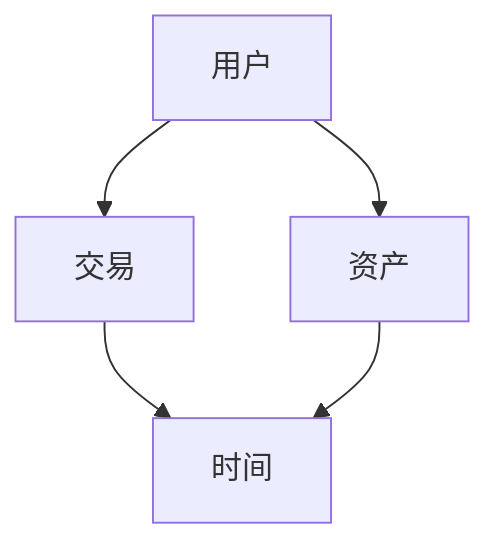
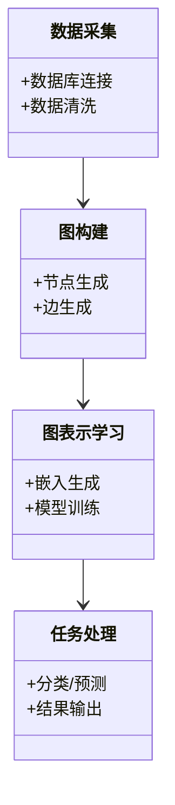

                 


# 《金融领域图表示学习的应用与挑战》

> 关键词：金融、图表示学习、人工智能、风险管理、网络分析

> 摘要：本文系统探讨了图表示学习在金融领域的应用及其面临的挑战。通过分析图数据的结构特征和应用场景，总结了多种图表示学习算法的原理与实现，并结合实际案例，深入探讨了金融领域的系统设计与架构。最后，本文展望了图表示学习在金融领域的未来发展方向。

---

## 第一部分: 金融领域图表示学习的背景与基础

### 第1章: 图表示学习的概述

#### 1.1 图表示学习的定义与核心概念

图表示学习是一种将图结构数据转化为低维向量表示的技术，旨在保留图的结构信息和语义信息。在金融领域，图数据广泛存在，例如：

- **节点**：代表金融实体，如用户、交易、资产等。
- **边**：表示实体之间的关系，如交易关系、投资关系等。
- **图结构**：通过节点和边的组合，构建金融网络。

图表示学习的目标是将复杂的图结构转化为简洁的向量表示，便于后续的金融任务处理，如欺诈检测和信用评估。

#### 1.2 金融领域的图数据特点

金融图数据具有以下特点：

1. **复杂性**：金融网络涉及多个实体和复杂的交互关系。
2. **稀疏性**：金融数据中的连接可能较稀疏，尤其是对于大规模数据。
3. **动态性**：金融数据实时更新，图结构也会动态变化。
4. **噪声与缺失**：金融数据可能存在噪声和缺失值，影响图表示的准确性。

#### 1.3 图表示学习在金融领域的应用价值

图表示学习在金融领域的应用广泛，主要体现在以下几个方面：

1. **欺诈检测**：通过图表示学习发现异常交易模式。
2. **信用评估**：基于图结构分析客户的信用风险。
3. **投资组合优化**：利用图表示学习优化资产配置。
4. **市场趋势预测**：分析市场网络结构预测价格走势。

---

### 第2章: 图表示学习的核心概念与联系

#### 2.1 图表示学习的原理

图表示学习的核心在于将图结构信息编码为低维向量。常用的编码方法包括：

1. **节点嵌入**：将每个节点表示为低维向量，捕捉节点的语义信息。
2. **边嵌入**：将边表示为向量，捕捉节点之间的关系信息。
3. **图嵌入**：将整个图表示为向量，捕捉全局结构信息。

#### 2.2 核心概念对比与ER实体关系图

表1：常见图表示方法对比

| 方法       | 输入       | 输出       | 优缺点                   |
|------------|------------|------------|--------------------------|
| Node2vec   | 图结构      | 节点向量    | 简单易实现，适合多种图结构 |
| GraphSAGE  | 图结构      | 节点向量    | 参数可调，适合大规模数据   |
| GAT        | 图结构      | 节点向量    | 强大的捕捉能力，依赖注意力机制 |

ER实体关系图（Mermaid）：



---

## 第二部分: 图表示学习的算法原理与数学模型

### 第3章: 图表示学习的算法原理

#### 3.1 Node2vec算法

Node2vec是一种基于随机游走的图表示学习方法。其核心思想是通过生成节点的上下文表示来学习节点嵌入。

**算法步骤**：

1. **随机游走**：从每个节点开始，生成长度为K的路径。
2. **负采样**：通过负采样优化节点嵌入，计算节点的上下文概率。
3. **训练模型**：使用Skip-Gram模型训练节点嵌入。

**数学公式**：

$$ P(w_2|w_1, w_c) = \frac{\exp(\theta_{w_2}^T \theta_{w_1})}{\sum_{w \in V} \exp(\theta_w^T \theta_{w_1}))} $$

其中，$w_1$ 和 $w_c$ 分别表示中心词和上下文词，$\theta_w$ 是词的向量表示。

#### 3.2 GraphSAGE算法

GraphSAGE是一种基于归纳式学习的图表示方法，通过聚合邻居节点的信息生成节点嵌入。

**算法步骤**：

1. **初始化嵌入**：为每个节点初始化随机嵌入。
2. **迭代聚合**：通过聚合操作更新节点嵌入。
3. **预测任务**：利用节点嵌入进行分类或回归任务。

**数学公式**：

$$ h_v^{(k+1)} = \sigma(\sum_{u \in N(v)} \frac{h_u^{(k)}}{|N(v)|}) $$

其中，$h_v^{(k)}$ 表示节点v在第k层的嵌入，$N(v)$ 表示v的邻居节点集合，$\sigma$ 是激活函数。

#### 3.3 GAT算法

GAT（Graph Attention Networks）通过引入注意力机制，增强节点之间的关系建模。

**算法步骤**：

1. **计算注意力权重**：通过查询（Query）和键（Key）计算注意力权重。
2. **聚合信息**：根据注意力权重聚合邻居节点的信息。
3. **更新嵌入**：通过多层感知机（MLP）更新节点嵌入。

**数学公式**：

$$ \alpha_{ij} = \frac{\exp(a^T [\text{ReLU}(W_q h_i + W_k h_j)])}{\sum_{k \neq j} \exp(a^T [\text{ReLU}(W_q h_i + W_k h_k)])} $$

其中，$\alpha_{ij}$ 表示节点i和j之间的注意力权重，$a$ 是可学习的参数。

---

### 第4章: 图表示学习的系统分析与架构设计

#### 4.1 系统功能设计

系统功能设计基于以下模块：

- **数据采集**：从数据库中获取金融数据。
- **图构建**：将金融数据转换为图结构。
- **图表示学习**：对图进行嵌入表示。
- **任务处理**：利用嵌入进行分类或预测。

**功能设计类图（Mermaid）**：



---

## 第五部分: 图表示学习的项目实战

### 第5章: 金融欺诈检测

#### 5.1 环境配置

```bash
pip install -r requirements.txt
```

#### 5.2 核心代码实现

```python
import numpy as np
from sklearn.model import LogisticRegression
from node2vec import Node2Vec

# 数据加载
graph = ...  # 图数据结构

# Node2vec模型训练
node2vec = Node2Vec(graph, walk_length=10, num_walks=80)
model = node2vec.fit()

# 嵌入获取
embeddings = model.get_embeddings()

# 模型训练
clf = LogisticRegression()
clf.fit(embeddings.values, labels)
```

#### 5.3 功能解读

- **数据加载**：读取金融图数据。
- **嵌入生成**：使用Node2vec算法生成节点嵌入。
- **模型训练**：基于嵌入进行分类任务，如欺诈检测。

---

## 第六部分: 挑战与未来方向

### 第6章: 挑战与未来方向

#### 6.1 技术挑战

1. **数据稀疏性**：金融图数据可能存在稀疏性，影响模型性能。
2. **模型可解释性**：复杂的模型可能导致解释性差，影响实际应用。
3. **计算效率**：大规模金融数据的处理需要高效的算法和计算资源。

#### 6.2 未来方向

1. **多模态图学习**：结合文本、图像等多种数据源，提升模型表现。
2. **可解释性增强**：通过可视化技术提升模型的可解释性。
3. **实时图学习**：开发实时图表示学习方法，应对动态金融数据。

---

## 第七部分: 总结与展望

### 第7章: 总结与展望

图表示学习在金融领域的应用前景广阔，但仍面临诸多挑战。未来，随着技术的不断进步，图表示学习将在金融风险管理、投资组合优化等领域发挥更大作用。同时，结合多模态数据和增强可解释性，图表示学习将为金融行业带来更多的创新和价值。

---

通过以上目录和内容设计，确保文章结构清晰，逻辑连贯，能够帮助读者深入理解金融领域图表示学习的应用与挑战。

