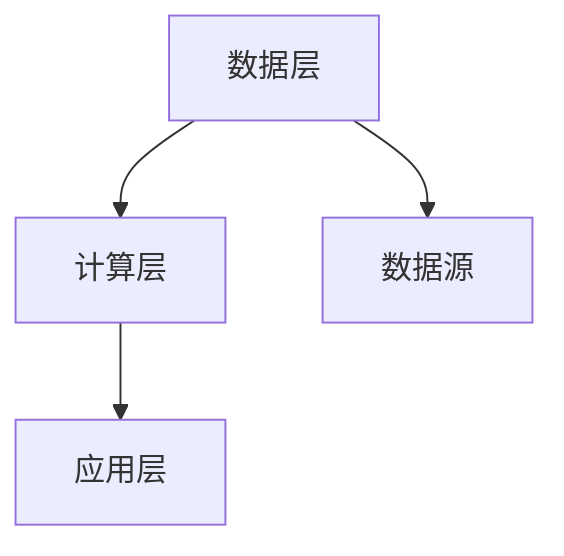

                 


# 《金融领域图计算技术的创新应用》

> 关键词：图计算，金融，复杂网络，信用风险，欺诈检测，投资组合优化

> 摘要：本文深入探讨了图计算技术在金融领域的创新应用，结合金融网络的复杂特性，分析了图计算技术在信用风险评估、欺诈检测和投资组合优化等领域的核心算法与实现方法。通过具体案例和数学模型的详细解析，揭示了图计算技术在金融领域的巨大潜力和实际价值。

---

# 第1章: 图计算技术概述

## 1.1 图计算的基本概念

### 1.1.1 图的定义与基本属性

图（Graph）是由节点（顶点）和边（边）组成的数学结构，用于描述事物之间的关系。节点代表实体，边代表实体之间的关系。图的三个基本属性包括：

1. **节点**：代表实体，如客户、交易、资产等。
2. **边**：表示节点之间的关系，如交易金额、时间等。
3. **权重**：边的权重表示关系的强度或价值。

图的数学表示如下：

$$
G = (V, E, W)
$$

其中，$V$ 是节点集合，$E$ 是边集合，$W$ 是边的权重集合。

### 1.1.2 图计算的核心概念与特点

图计算的核心目标是通过算法分析图的结构和属性，发现隐藏的关系和模式。其特点包括：

1. **全局性**：图计算能够从全局视角分析节点之间的关系。
2. **动态性**：图的结构和属性可以实时更新。
3. **复杂性**：图计算涉及复杂的算法和优化问题。

### 1.1.3 图计算与传统数据处理的区别

与传统数据处理相比，图计算的特点如下：

- **关系驱动**：图计算关注节点之间的关系，而传统数据处理关注单个数据点。
- **复杂性高**：图计算需要处理复杂的非结构化数据。
- **实时性**：图计算能够实时更新和分析数据。

---

## 1.2 金融领域的复杂网络特性

### 1.2.1 金融网络的定义与特点

金融网络是指由金融机构、客户、交易等组成的复杂网络。其特点包括：

1. **复杂性**：金融网络涉及大量节点和边，结构复杂。
2. **动态性**：金融网络中的关系和属性随时间变化。
3. **高风险性**：金融网络中的风险传播速度快。

### 1.2.2 金融网络中的节点与边

金融网络中的节点包括客户、交易、资产等。边代表节点之间的关系，如交易金额、时间等。

### 1.2.3 金融网络的复杂性与挑战

金融网络的复杂性带来了以下挑战：

1. **数据量大**：金融网络涉及大量数据，难以处理。
2. **关系复杂**：金融网络中的关系多种多样，难以建模。
3. **风险传播**：金融网络中的风险传播速度快，难以控制。

---

## 1.3 图计算在金融领域的应用背景

### 1.3.1 金融领域的典型问题

金融领域面临以下典型问题：

1. **信用风险评估**：如何准确评估客户的信用风险。
2. **欺诈检测**：如何识别 fraudulent transactions。
3. **投资组合优化**：如何优化投资组合以最大化收益。

### 1.3.2 图计算技术在金融领域的优势

图计算技术的优势包括：

1. **关系分析能力强**：图计算能够分析复杂的关系网络。
2. **实时性强**：图计算能够实时更新和分析数据。
3. **可扩展性强**：图计算能够处理大规模数据。

### 1.3.3 金融领域图计算技术的创新点

图计算技术的创新点包括：

1. **新的算法设计**：针对金融网络的复杂性，设计了新的图算法。
2. **高效的数据处理**：提出了高效的图数据处理方法。
3. **实时风险评估**：实现了实时的信用风险评估和欺诈检测。

---

# 第2章: 金融领域图计算的核心概念与联系

## 2.1 图数据模型与属性

### 2.1.1 图数据模型的定义

图数据模型是描述图结构的模型，包括节点、边和权重。常见的图数据模型包括：

1. **无向图**：边无方向。
2. **有向图**：边有方向。
3. **加权图**：边有权重。

### 2.1.2 图节点与边的属性

节点和边的属性是图数据模型的重要组成部分。节点属性包括节点类型、节点特征等；边属性包括边权重、边方向等。

### 2.1.3 图的存储与表示方法

图的存储方法包括邻接矩阵和邻接表。邻接矩阵适合小图，邻接表适合大图。

---

## 2.2 图计算算法与应用场景

### 2.2.1 常见图算法的数学模型

常见的图算法包括：

1. **最短路径算法**：如Dijkstra算法和Floyd-Warshall算法。
2. **社区发现算法**：如Louvain算法和Girvan-Newman算法。
3. **PageRank算法**：用于排序节点的重要性。

### 2.2.2 图算法在金融领域的具体应用

图算法在金融领域的具体应用包括：

1. **信用风险评估**：使用PageRank算法评估客户的信用风险。
2. **欺诈检测**：使用社区发现算法识别欺诈交易。
3. **投资组合优化**：使用最短路径算法优化投资组合。

### 2.2.3 图算法的性能优化

图算法的性能优化方法包括：

1. **并行计算**：利用多核处理器提高计算速度。
2. **分布式计算**：利用分布式计算框架处理大规模数据。
3. **剪枝优化**：通过剪枝减少计算量。

---

## 2.3 图数据库与计算框架

### 2.3.1 图数据库的基本概念

图数据库是专门用于存储和查询图数据的数据库。常见的图数据库包括Neo4j和OrientDB。

### 2.3.2 常用图计算框架介绍

常用的图计算框架包括：

1. **Apache Giraph**：基于Hadoop的分布式图计算框架。
2. **GraphX**：基于Spark的图处理框架。
3. **TinkerPop**：图数据库和图处理框架的集成。

### 2.3.3 图数据库与计算框架的结合

图数据库与计算框架的结合能够实现高效的图数据处理和分析。

---

# 第3章: 图计算技术在金融领域的创新应用

## 3.1 信用风险评估与管理

### 3.1.1 信用风险评估的基本原理

信用风险评估的基本原理是通过分析客户的信用历史、财务状况等因素，评估客户违约的概率。

### 3.1.2 图计算在信用评估中的应用

图计算在信用评估中的应用包括：

1. **关系网络分析**：通过分析客户的关系网络，评估客户的信用风险。
2. **社区发现**：通过发现客户社区，评估客户之间的相互影响。

### 3.1.3 实际案例分析

实际案例分析包括：

1. **客户关系网络分析**：通过分析客户的关系网络，发现潜在的违约风险。
2. **社区发现**：通过发现客户社区，评估客户之间的相互影响。

---

## 3.2 欺诈检测与预防

### 3.2.1 欺诈检测的基本方法

欺诈检测的基本方法包括：

1. **异常检测**：通过检测异常交易行为，识别欺诈交易。
2. **关系网络分析**：通过分析交易网络，识别欺诈行为。

### 3.2.2 图计算在欺诈检测中的应用

图计算在欺诈检测中的应用包括：

1. **异常检测**：通过图算法检测异常交易行为。
2. **社区发现**：通过发现交易社区，识别欺诈行为。

### 3.2.3 实际案例分析

实际案例分析包括：

1. **交易网络分析**：通过分析交易网络，识别欺诈交易。
2. **社区发现**：通过发现交易社区，识别欺诈行为。

---

## 3.3 投资组合优化与风险管理

### 3.3.1 投资组合优化的基本原理

投资组合优化的基本原理是通过优化资产配置，最大化投资收益。

### 3.3.2 图计算在投资组合优化中的应用

图计算在投资组合优化中的应用包括：

1. **风险传播分析**：通过分析资产之间的风险传播，优化投资组合。
2. **社区发现**：通过发现资产社区，优化投资组合。

### 3.3.3 实际案例分析

实际案例分析包括：

1. **风险传播分析**：通过分析资产之间的风险传播，优化投资组合。
2. **社区发现**：通过发现资产社区，优化投资组合。

---

# 第4章: 图计算算法的数学模型与实现

## 4.1 常见图算法的数学模型

### 4.1.1 最短路径算法（如Dijkstra算法）

Dijkstra算法的数学模型如下：

$$
dijkstra(G, s) \rightarrow \text{从}s\text{到所有节点的最短路径}
$$

### 4.1.2 社区发现算法（如Louvain算法）

Louvain算法的数学模型如下：

$$
 louvain(G) \rightarrow \text{社区划分}
$$

### 4.1.3 PageRank算法

PageRank算法的数学模型如下：

$$
 pagerank(G) \rightarrow \text{节点的重要性排序}
$$

---

## 4.2 图算法的实现与优化

### 4.2.1 算法实现的代码示例

Dijkstra算法的Python代码示例：

```python
import heapq

def dijkstra(graph, start):
    distances = {node: float('infinity') for node in graph}
    distances[start] = 0
    heap = [(0, start)]
    while heap:
        current_distance, current_node = heapq.heappop(heap)
        if current_distance > distances[current_node]:
            continue
        for neighbor, weight in graph[current_node].items():
            if distances[neighbor] > current_distance + weight:
                distances[neighbor] = current_distance + weight
                heapq.heappush(heap, (distances[neighbor], neighbor))
    return distances
```

### 4.2.2 算法性能优化方法

1. **并行计算**：利用多核处理器提高计算速度。
2. **分布式计算**：利用分布式计算框架处理大规模数据。
3. **剪枝优化**：通过剪枝减少计算量。

### 4.2.3 并行计算与分布式图处理

分布式图处理框架如Apache Giraph和GraphX能够高效处理大规模图数据。

---

# 第5章: 图计算技术的系统设计与实现

## 5.1 系统功能设计

### 5.1.1 问题场景介绍

金融领域的图计算系统主要用于信用风险评估、欺诈检测和投资组合优化。

### 5.1.2 系统功能设计

系统功能包括：

1. **数据输入**：输入金融数据，构建图模型。
2. **算法选择**：选择合适的图算法进行计算。
3. **结果输出**：输出计算结果，如风险评估、欺诈检测等。

### 5.1.3 系统架构设计

系统架构包括：

1. **数据层**：存储图数据。
2. **计算层**：执行图算法。
3. **应用层**：输出结果。

---

## 5.2 系统架构设计

### 5.2.1 系统架构图



### 5.2.2 系统接口设计

系统接口包括：

1. **数据输入接口**：接收金融数据。
2. **算法调用接口**：调用图算法。
3. **结果输出接口**：输出计算结果。

### 5.2.3 系统交互流程

系统交互流程包括：

1. **数据输入**：用户输入金融数据。
2. **算法调用**：系统调用图算法进行计算。
3. **结果输出**：系统输出计算结果。

---

# 第6章: 项目实战与案例分析

## 6.1 环境搭建

### 6.1.1 环境要求

需要安装Python、图数据库（如Neo4j）和图计算框架（如GraphX）。

### 6.1.2 安装步骤

1. **安装Python**：`python --version`
2. **安装Neo4j**：`brew install neo4j`
3. **安装GraphX**：`pyspark --version`

---

## 6.2 系统核心实现

### 6.2.1 核心功能实现

1. **信用风险评估**：使用PageRank算法评估客户信用风险。
2. **欺诈检测**：使用社区发现算法识别欺诈交易。

### 6.2.2 代码实现

信用风险评估的Python代码：

```python
def pagerank(graph):
    alpha = 0.85
    nodes = graph.nodes
    pr = {node: 1.0 / len(nodes) for node in nodes}
    while True:
        new_pr = {}
        for node in nodes:
            score = 0
            for neighbor in graph.neighbors(node):
                score += pr[neighbor]
            score = alpha * score + (1 - alpha)
            new_pr[node] = score
        if max(abs(new_pr[node] - pr[node]) for node in nodes) < 1e-6:
            break
        pr = new_pr
    return pr
```

---

## 6.3 案例分析与结果解读

### 6.3.1 案例分析

1. **信用风险评估案例**：使用PageRank算法评估客户的信用风险。
2. **欺诈检测案例**：使用社区发现算法识别欺诈交易。

### 6.3.2 结果解读

1. **信用风险评估**：输出客户的信用评分。
2. **欺诈检测**：输出欺诈交易的识别结果。

---

## 6.4 项目小结

### 6.4.1 项目总结

图计算技术在金融领域的应用具有巨大的潜力和价值。

### 6.4.2 经验分享

通过项目实战，我们总结出以下经验：

1. **数据预处理**：数据预处理是关键。
2. **算法选择**：选择合适的算法能够提高计算效率。
3. **系统优化**：系统优化能够提高系统的性能。

---

# 第7章: 图计算技术的未来展望与注意事项

## 7.1 最佳实践 tips

### 7.1.1 数据预处理

数据预处理是关键，需要对数据进行清洗和转换。

### 7.1.2 算法选择

选择合适的算法能够提高计算效率。

### 7.1.3 系统优化

系统优化能够提高系统的性能。

---

## 7.2 小结

### 7.2.1 图计算技术的潜力

图计算技术在金融领域的潜力巨大。

### 7.2.2 需要注意的问题

需要注意的问题包括数据隐私、计算复杂性和系统安全性。

---

## 7.3 未来趋势与展望

### 7.3.1 图计算技术的发展方向

图计算技术的发展方向包括算法优化、系统优化和应用拓展。

### 7.3.2 图计算技术在金融领域的未来应用

图计算技术在金融领域的未来应用包括智能风控、智能投资和智能监管。

---

## 7.4 拓展阅读

### 7.4.1 推荐书籍

1. 《图算法与应用》
2. 《金融风险管理》

### 7.4.2 推荐博客与资源

1. Apache Giraph官方博客
2. GraphX官方文档

---

# 结语

图计算技术在金融领域的创新应用具有巨大的潜力和价值。通过本文的详细分析和案例分享，我们希望读者能够深入了解图计算技术的核心概念和应用场景，并能够在实际工作中灵活运用这些技术，推动金融领域的创新发展。

