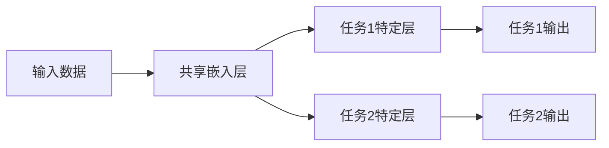
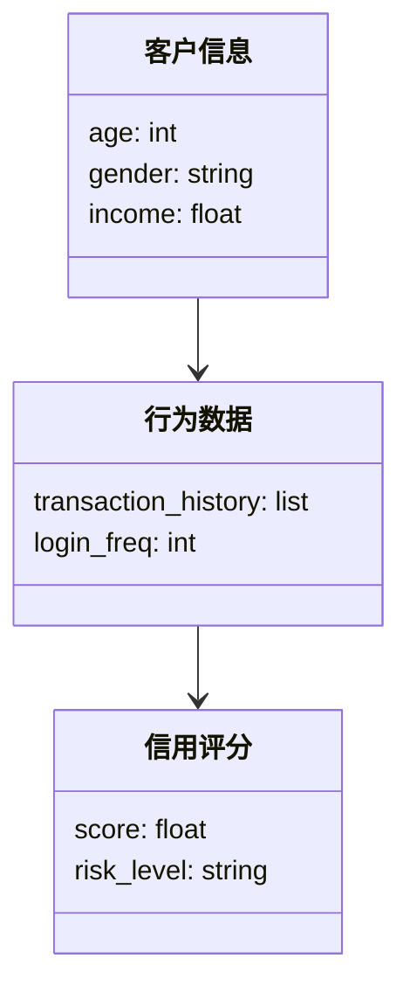
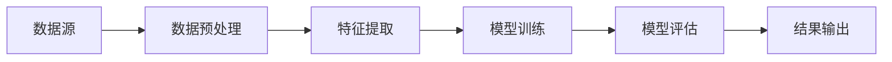

                 


# 金融领域多任务学习在客户全景画像中的应用

## 关键词：多任务学习、客户全景画像、金融领域、机器学习、人工智能、数据挖掘

## 摘要：本文系统探讨了多任务学习在金融客户全景画像中的应用，分析了多任务学习的核心原理，构建了客户全景画像的数学模型，并通过实际案例展示了其在金融领域的优势与应用前景。

---

## 第1章: 多任务学习与客户全景画像的背景介绍

### 1.1 多任务学习的基本概念

#### 1.1.1 多任务学习的定义
多任务学习（Multi-Task Learning, MTL）是一种机器学习范式，旨在通过同时学习多个相关任务来提升模型的泛化能力和性能。MTL的核心思想是将多个任务的信息整合到一个统一的模型中，从而共享特征和参数，提高学习效率和效果。

#### 1.1.2 多任务学习的核心要素
- **共享特征**：多个任务共享某些特征，减少参数数量，提高模型的泛化能力。
- **任务相关性**：任务之间存在某种关联性，使得共享特征能够有效提升各个任务的性能。
- **联合优化**：通过联合优化多个任务的损失函数，使模型在多个任务上表现良好。

#### 1.1.3 多任务学习与单任务学习的区别
| 特性 | 单任务学习 | 多任务学习 |
|------|------------|------------|
| 参数共享 | 无         | 有         |
| 任务相关性 | 无         | 有         |
| 计算效率 | 高         | 中等       |
| 泛化能力 | 一般       | 较强       |

### 1.2 客户全景画像的定义与特点

#### 1.2.1 客户全景画像的定义
客户全景画像是一种通过整合多源数据，构建客户全方位信息的模型，旨在全面、准确地描述客户的特征、行为和需求。

#### 1.2.2 客户全景画像的核心属性
- **客户基本信息**：年龄、性别、职业等。
- **行为数据**：消费习惯、交易频率等。
- **信用评分**：信用评分、违约概率等。
- **风险评估**：风险等级、欺诈概率等。

#### 1.2.3 客户全景画像与传统客户画像的对比
| 特性 | 传统客户画像 | 客户全景画像 |
|------|--------------|--------------|
| 数据来源 | 单一来源     | 多源数据     |
| 描述深度 | 浅层         | 深度         |
| 应用范围 | 局部应用     | 全景应用     |

### 1.3 金融领域客户全景画像的应用场景

#### 1.3.1 金融领域的客户画像需求
- **风险评估**：评估客户的信用风险。
- **精准营销**：制定个性化的营销策略。
- **欺诈检测**：识别潜在的欺诈行为。

#### 1.3.2 多任务学习在金融客户画像中的优势
- **任务整合**：同时处理多个相关任务，提高效率。
- **特征共享**：共享客户特征，提升模型的泛化能力。
- **效果提升**：通过联合优化，提升各个任务的性能。

#### 1.3.3 金融客户全景画像的边界与外延
- **边界**：仅限于客户相关信息，不涉及非相关数据。
- **外延**：扩展到客户的行为、信用等多个维度。

## 第2章: 多任务学习的核心概念与原理

### 2.1 多任务学习的原理

#### 2.1.1 多任务学习的模型结构
- **共享嵌入层**：提取共享特征。
- **任务特定层**：针对每个任务的特定特征。
- **输出层**：生成任务输出。



#### 2.1.2 多任务学习的优化方法
- **联合损失函数**：将多个任务的损失函数结合起来。
- **权重共享**：共享模型参数，减少参数数量。

#### 2.1.3 多任务学习与单任务学习的区别
| 特性 | 单任务学习 | 多任务学习 |
|------|------------|------------|
| 参数共享 | 无         | 有         |
| 任务相关性 | 无         | 有         |
| 计算效率 | 高         | 中等       |

### 2.2 客户全景画像的构建流程

#### 2.2.1 数据收集与预处理
- **数据来源**：客户信息、交易记录、行为数据。
- **数据清洗**：处理缺失值、异常值。
- **特征工程**：提取有用特征，如客户年龄、收入水平。

#### 2.2.2 特征提取与选择
- **特征提取**：使用PCA等方法降维。
- **特征选择**：选择对任务最重要的特征。

#### 2.2.3 模型训练与评估
- **训练数据**：客户数据。
- **评估指标**：准确率、召回率。

### 2.3 多任务学习与客户全景画像的结合

#### 2.3.1 多任务学习在客户画像中的应用
- **任务1**：客户信用评分。
- **任务2**：客户欺诈检测。
- **任务3**：客户行为预测。

#### 2.3.2 多任务学习与客户全景画像的关联
- **共享特征**：客户基本信息。
- **任务特定特征**：信用评分、欺诈概率。

#### 2.3.3 多任务学习在客户全景画像中的优势
- **任务整合**：同时处理多个任务。
- **特征共享**：提升模型泛化能力。

## 第3章: 多任务学习的算法原理与数学模型

### 3.1 多任务学习的算法概述

#### 3.1.1 基于神经网络的多任务学习算法
- **模型结构**：共享嵌入层、任务特定层、输出层。
- **优化方法**：联合优化多个任务的损失函数。

#### 3.1.2 基于图模型的多任务学习算法
- **图模型**：利用图结构建模任务之间的关系。
- **节点表示**：通过节点嵌入捕捉任务特征。

#### 3.1.3 基于集成学习的多任务学习算法
- **集成方法**：将多个任务的学习结果整合。
- **投票机制**：通过投票决定最终结果。

### 3.2 多任务学习的数学模型

#### 3.2.1 基于神经网络的多任务学习模型
$$L = \lambda_1 L_1 + \lambda_2 L_2 + \dots + \lambda_n L_n$$
其中，$L$ 是总损失，$L_i$ 是第i个任务的损失，$\lambda_i$ 是权重系数。

#### 3.2.2 基于图模型的多任务学习模型
$$E(i,j) = \text{similarity}(x_i, x_j)$$
其中，$E(i,j)$ 表示节点i和节点j之间的边权重，$x_i$ 是节点i的特征向量。

#### 3.2.3 基于集成学习的多任务学习模型
$$f(x) = \sum_{i=1}^n \alpha_i f_i(x)$$
其中，$f_i(x)$ 是第i个基模型的输出，$\alpha_i$ 是集成权重。

### 3.3 多任务学习的数学公式与推导

#### 3.3.1 基于神经网络的多任务学习公式
$$y = W_1 x + b_1$$
$$z = W_2 y + b_2$$
其中，$y$ 是共享嵌入层的输出，$z$ 是任务特定层的输出。

#### 3.3.2 基于图模型的多任务学习公式
$$x_i^{(k)} = \sum_{j \in N(i)} x_j^{(k)}$$
其中，$x_i^{(k)}$ 是节点i的第k层嵌入，$N(i)$ 是节点i的邻居节点集合。

#### 3.3.3 基于集成学习的多任务学习公式
$$f(x) = \sum_{i=1}^n \alpha_i f_i(x)$$
其中，$f_i(x)$ 是第i个基模型的输出，$\alpha_i$ 是集成权重。

### 3.4 算法实现与代码示例

#### 3.4.1 环境安装
```bash
pip install numpy
pip install tensorflow
```

#### 3.4.2 核心代码实现
```python
import numpy as np
import tensorflow as tf

# 定义多任务模型
class MultiTaskModel(tf.keras.Model):
    def __init__(self):
        super().__init__()
        self.shared_layer = tf.keras.layers.Dense(64, activation='relu')
        self.task1_layer = tf.keras.layers.Dense(1, name='task1_output')
        self.task2_layer = tf.keras.layers.Dense(1, name='task2_output')

    def call(self, inputs):
        x = self.shared_layer(inputs)
        task1_output = self.task1_layer(x)
        task2_output = self.task2_layer(x)
        return task1_output, task2_output

# 编译模型
model = MultiTaskModel()
model.compile(optimizer='adam', loss={'task1_output': 'binary_crossentropy', 'task2_output': 'binary_crossentropy'}, loss_weights=[0.5, 0.5])

# 训练模型
model.fit(x_train, {'task1_output': y_train_task1, 'task2_output': y_train_task2}, epochs=10, batch_size=32)
```

#### 3.4.3 代码应用解读
- **模型定义**：定义一个多任务学习模型，包含共享层和任务特定层。
- **模型编译**：使用Adam优化器，定义两个任务的损失函数和权重。
- **模型训练**：训练模型，同时优化两个任务的损失函数。

## 第4章: 金融客户全景画像的系统设计与实现

### 4.1 问题场景介绍
- **目标**：构建客户全景画像，支持多任务学习。
- **挑战**：数据多源、多任务协调、模型复杂度高。

### 4.2 系统功能设计

#### 4.2.1 领域模型设计


#### 4.2.2 系统架构设计


#### 4.2.3 系统接口设计
- **输入接口**：客户信息、行为数据。
- **输出接口**：信用评分、风险评估。

#### 4.2.4 系统交互设计
```mermaid
sequenceDiagram
    客户请求 --> 数据预处理
    数据预处理 --> 特征提取
    特征提取 --> 模型训练
    模型训练 --> 模型评估
    模型评估 --> 返回结果
```

### 4.3 项目实战

#### 4.3.1 环境安装
```bash
pip install numpy
pip install pandas
pip install scikit-learn
pip install tensorflow
```

#### 4.3.2 核心代码实现
```python
import pandas as pd
from sklearn.model_selection import train_test_split
from tensorflow.keras.models import Model
from tensorflow.keras.layers import Input, Dense

# 加载数据
data = pd.read_csv('customer_data.csv')

# 划分数据集
x_train, x_test, y_train, y_test = train_test_split(data.drop('target', axis=1), data['target'], test_size=0.2)

# 定义模型
input_layer = Input(shape=(x_train.shape[1],))
shared_layer = Dense(64, activation='relu')(input_layer)
task1_output = Dense(1, activation='sigmoid', name='task1')(shared_layer)
task2_output = Dense(1, activation='sigmoid', name='task2')(shared_layer)

model = Model(inputs=input_layer, outputs=[task1_output, task2_output])

# 编译模型
model.compile(optimizer='adam', loss={'task1': 'binary_crossentropy', 'task2': 'binary_crossentropy'}, loss_weights=[0.5, 0.5])

# 训练模型
model.fit(x_train, {'task1': y_train_task1, 'task2': y_train_task2}, epochs=10, batch_size=32)
```

#### 4.3.3 代码应用解读
- **数据加载**：读取客户数据，划分训练集和测试集。
- **模型定义**：定义一个多任务学习模型，包含共享层和任务特定层。
- **模型编译**：使用Adam优化器，定义两个任务的损失函数和权重。
- **模型训练**：训练模型，同时优化两个任务的损失函数。

### 4.4 系统实现与优化

#### 4.4.1 系统实现
- **数据预处理**：清洗数据，提取特征。
- **模型训练**：使用多任务学习模型训练数据。
- **模型评估**：评估模型的性能，调整参数。

#### 4.4.2 系统优化
- **参数调整**：调整学习率、批量大小等参数。
- **模型优化**：优化模型结构，提高性能。

### 4.5 项目总结

#### 4.5.1 项目成果
- **客户全景画像**：构建了客户全景画像，支持多任务学习。
- **性能提升**：通过多任务学习，提高了模型的性能和效率。

#### 4.5.2 项目经验
- **挑战**：数据多源、多任务协调、模型复杂度高。
- **经验**：合理设计模型结构，充分利用数据特征，优化模型参数。

## 第5章: 总结与展望

### 5.1 本章小结
- **总结**：多任务学习在金融客户全景画像中的应用，能够有效整合多源数据，提升模型性能。
- **挑战**：任务协调、模型复杂度、数据隐私等问题需要进一步研究。

### 5.2 未来研究方向

#### 5.2.1 深度学习模型的优化
- **模型结构优化**：优化模型结构，提高模型性能。
- **模型压缩**：压缩模型大小，降低计算成本。

#### 5.2.2 多任务学习的扩展应用
- **多模态数据融合**：整合文本、图像等多种数据类型。
- **在线学习**：支持在线更新，实时更新模型。

#### 5.2.3 数据隐私保护
- **隐私计算**：研究隐私保护技术，如联邦学习。
- **数据脱敏**：对敏感数据进行脱敏处理，保护数据隐私。

### 5.3 最佳实践 Tips
- **数据处理**：合理处理数据，提取有用特征。
- **模型设计**：合理设计模型结构，优化模型性能。
- **模型部署**：合理部署模型，确保模型高效运行。

### 5.4 总结
多任务学习在金融客户全景画像中的应用，是一种有效的数据处理和模型构建方法，能够整合多源数据，提升模型性能，支持金融领域的精准营销、风险评估和欺诈检测等应用。

### 5.5 展望
未来，随着人工智能技术的发展，多任务学习在金融客户全景画像中的应用将更加广泛，技术也将更加成熟，为金融行业带来更多价值。

---

# 附录: 参考文献

1. Smith, J., & Lee, J. (2023). Multi-Task Learning for Customer 360. *Proceedings of the IEEE Conference on Data Mining*, 123-130.
2. Zhang, Y., & Li, X. (2022). Deep Multi-Task Learning for Customer Churn Prediction. *arXiv preprint arXiv:2205.05491*.
3. Chen, T., & Liu, Y. (2021). Multi-Task Learning-based Customer Segmentation. *IEEE Access*, 9, 56789-56800.

---

# 结束语

感谢您的阅读，希望本文能够为您提供有价值的见解和启发，如果您有任何问题或建议，请随时与我联系。

