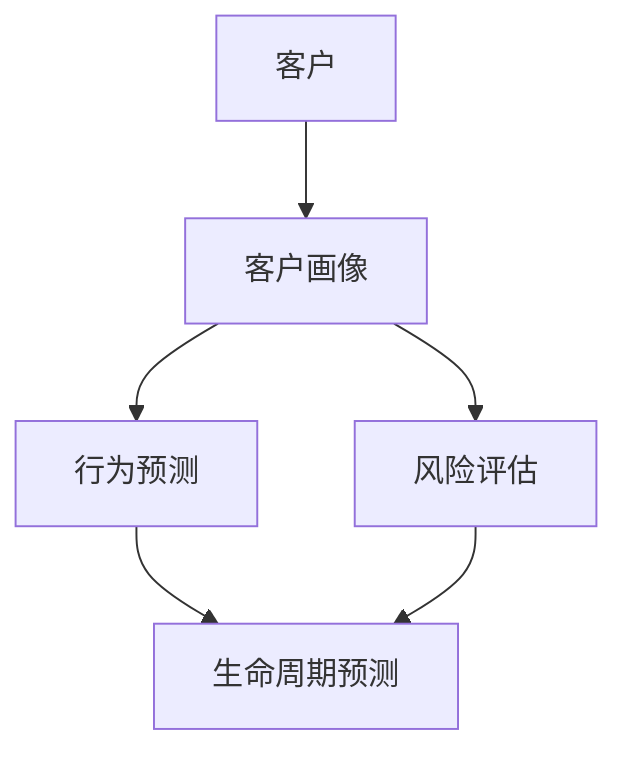
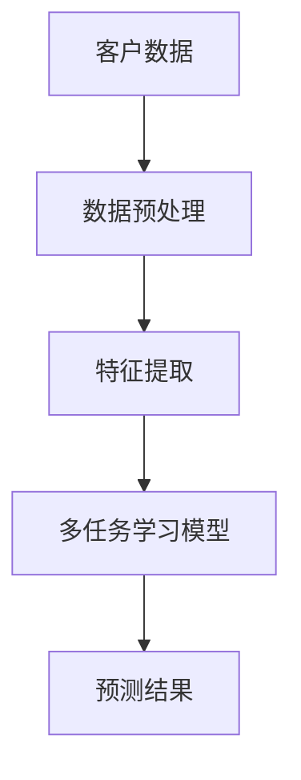

                 


# 《金融领域多任务学习在客户全生命周期管理中的应用》

## 关键词：多任务学习，客户全生命周期管理，金融领域，机器学习，深度学习

## 摘要：本文深入探讨了多任务学习（MTL）在金融领域客户全生命周期管理中的应用，分析了MTL的核心原理、算法实现及其在客户画像构建、行为预测和风险评估等任务中的具体应用。通过构建系统化的多任务学习框架，本文提出了一种高效的客户管理解决方案，并通过实际案例展示了该方法的有效性和优势。

---

# 第1章：多任务学习与客户全生命周期管理概述

## 1.1 多任务学习的定义与特点

### 1.1.1 多任务学习的定义
多任务学习（Multi-Task Learning, MTL）是指在同一模型中同时学习多个相关任务，通过共享参数或特征，提升模型在多个任务上的性能。与单任务学习相比，MTL能够更好地捕捉任务间的关联性，减少数据需求，并提高模型的泛化能力。

### 1.1.2 多任务学习的核心特点
- **任务相关性**：多个任务之间存在一定的关联性，可以共享部分参数或特征。
- **参数共享**：通过共享参数，MTL能够利用跨任务的信息，减少模型的复杂性和训练数据的需求。
- **联合优化**：多任务学习通过联合优化多个任务的损失函数，实现对多个任务的同时优化。

### 1.1.3 多任务学习与传统单任务学习的区别
| 特性               | 单任务学习               | 多任务学习               |
|--------------------|--------------------------|--------------------------|
| 模型复杂性         | 较低，专注于单一任务     | 较高，适用于多个相关任务 |
| 数据需求           | 较高，每个任务需要独立数据集 | 较低，可以共享数据集     |
| 任务相关性         | 无相关性或弱相关性       | 高相关性                |

---

## 1.2 金融领域客户全生命周期管理的概念

### 1.2.1 客户全生命周期管理的定义
客户全生命周期管理是指从客户获取、客户维护到客户流失的整个过程中，对客户进行全方位管理的策略。其目标是通过分析客户的特征、行为和需求，优化客户的体验和价值，从而提高客户满意度和忠诚度。

### 1.2.2 金融领域客户管理的特殊性
- **数据多样性**：金融领域涉及大量的结构化数据（如交易记录、信用评分）和非结构化数据（如文本评论、社交媒体信息）。
- **风险控制**：金融领域的客户管理需要特别关注客户的风险评估和欺诈检测。
- **监管要求**：金融行业受到严格的监管，客户管理需要符合相关法律法规。

### 1.2.3 多任务学习在客户全生命周期管理中的作用
- **提升预测精度**：通过多任务学习，可以同时预测客户的生命周期阶段、行为模式和风险等级。
- **降低数据需求**：多任务学习能够利用跨任务的信息，减少对每个任务独立数据集的需求。
- **提高决策效率**：通过联合优化多个任务，可以实现对客户全生命周期的统一管理，提高决策效率。

---

## 1.3 本章小结

本章介绍了多任务学习的核心概念及其在金融领域客户全生命周期管理中的应用。通过对比单任务学习和多任务学习的特点，明确了MTL在金融客户管理中的优势和应用场景。

---

# 第2章：多任务学习的核心概念与数学模型

## 2.1 多任务学习的核心原理

### 2.1.1 多任务学习的假设空间
多任务学习假设存在一个共享的特征空间，能够同时表示多个任务的相关信息。通过共享特征，模型可以捕捉到任务间的相似性，从而提高模型的泛化能力。

### 2.1.2 任务之间的关系与依赖
任务之间的关系可以分为以下几种：
- **独立任务**：任务之间没有明显的依赖关系。
- **相关任务**：任务之间存在一定的相关性，可以共享部分参数。
- **嵌套任务**：任务之间存在层次关系，一个任务的结果可以作为另一个任务的输入。

### 2.1.3 多任务学习与传统单任务学习的区别
通过对比单任务学习和多任务学习的优化目标，可以发现MTL通过联合优化多个任务的损失函数，能够更好地利用任务间的关联性。

---

## 2.2 多任务学习的数学模型

### 2.2.1 任务损失函数的构建
每个任务都有自己的损失函数，形式如下：
$$ L_i = \sum_{j=1}^{n} (y_{ij} - \hat{y}_{ij})^2 $$

### 2.2.2 共享参数与独立参数的定义
多任务学习模型通常包含共享参数和独立参数：
- 共享参数：$w^{(s)}$，用于表示多个任务共享的特征。
- 独立参数：$w^{(i)}$，用于表示特定任务独有的特征。

### 2.2.3 跨任务梯度的整合方法
多任务学习通过整合多个任务的梯度来优化模型参数。常见的梯度整合方法包括：
- 基于共享参数的梯度整合：将多个任务的梯度按权重相加。
- 基于独立参数的梯度整合：分别优化每个任务的独立参数。

---

## 2.3 多任务学习的算法框架

### 2.3.1 基于共享表示的多任务学习
基于共享表示的多任务学习通过构建共享的特征表示，将多个任务的特征提取过程统一起来。其流程如下：
1. **特征提取**：通过共享的特征提取器提取输入数据的特征表示。
2. **任务预测**：根据提取的特征表示，分别对每个任务进行预测。
3. **联合优化**：通过优化共享参数和独立参数，实现多个任务的联合优化。

### 2.3.2 基于任务间关系的多任务学习
基于任务间关系的多任务学习通过建模任务之间的关系，进一步优化模型的性能。其流程如下：
1. **任务关系建模**：通过图结构或矩阵表示任务之间的关系。
2. **共享参数优化**：根据任务关系，优化共享参数以最小化多个任务的损失函数。
3. **独立参数优化**：分别优化每个任务的独立参数。

### 2.3.3 基于优化的多任务学习
基于优化的多任务学习通过优化多个任务的损失函数，实现对模型参数的联合优化。其流程如下：
1. **损失函数构建**：构建多个任务的损失函数，并将其组合成一个联合损失函数。
2. **参数优化**：通过优化算法（如梯度下降）优化模型参数，最小化联合损失函数。

---

## 2.4 本章小结

本章详细介绍了多任务学习的核心原理和数学模型，包括任务损失函数、共享参数与独立参数的定义，以及多任务学习的算法框架。通过这些内容，读者可以理解多任务学习的基本原理及其在金融领域的应用潜力。

---

# 第3章：金融领域客户全生命周期管理中的多任务学习应用

## 3.1 客户全生命周期管理的主要任务

### 3.1.1 客户获取阶段的任务
- **客户画像构建**：通过分析客户的特征和行为，构建客户画像。
- **客户行为预测**：预测客户在获取阶段的行为模式，如购买倾向、流失风险等。

### 3.1.2 客户维护阶段的任务
- **客户价值评估**：评估客户的生命周期价值，制定针对性的维护策略。
- **客户风险评估**：评估客户在维护阶段的风险等级，如信用风险、欺诈风险等。

### 3.1.3 客户流失预测与挽留任务
- **客户流失预测**：预测客户在维护阶段的流失风险。
- **客户挽留策略**：根据流失预测结果，制定客户挽留策略。

---

## 3.2 多任务学习在客户全生命周期管理中的具体应用

### 3.2.1 基于多任务学习的客户画像构建
通过多任务学习，可以同时学习客户的多个特征，如年龄、性别、收入水平等，构建客户的立体画像。

### 3.2.2 多任务学习在客户行为预测中的应用
通过多任务学习，可以同时预测客户的多个行为模式，如购买倾向、消费习惯等。

### 3.2.3 多任务学习在客户风险评估中的应用
通过多任务学习，可以同时评估客户的信用风险和欺诈风险，制定针对性的风险控制策略。

---

## 3.3 本章小结

本章通过分析金融领域客户全生命周期管理的主要任务，探讨了多任务学习在客户画像构建、行为预测和风险评估中的具体应用。通过这些应用，可以实现对客户的全方位管理，提升客户满意度和忠诚度。

---

# 第4章：多任务学习在金融领域的算法实现

## 4.1 多任务学习的算法原理

### 4.1.1 基于共享参数的多任务学习
基于共享参数的多任务学习通过共享部分参数，实现对多个任务的联合优化。其流程如下：
1. **共享参数提取**：提取多个任务的共享参数。
2. **独立参数优化**：分别优化每个任务的独立参数。
3. **联合优化**：通过优化共享参数和独立参数，实现多个任务的联合优化。

### 4.1.2 基于任务间关系的多任务学习
基于任务间关系的多任务学习通过建模任务之间的关系，进一步优化模型的性能。其流程如下：
1. **任务关系建模**：通过图结构或矩阵表示任务之间的关系。
2. **共享参数优化**：根据任务关系，优化共享参数以最小化多个任务的损失函数。
3. **独立参数优化**：分别优化每个任务的独立参数。

### 4.1.3 基于优化的多任务学习
基于优化的多任务学习通过优化多个任务的损失函数，实现对模型参数的联合优化。其流程如下：
1. **损失函数构建**：构建多个任务的损失函数，并将其组合成一个联合损失函数。
2. **参数优化**：通过优化算法（如梯度下降）优化模型参数，最小化联合损失函数。

---

## 4.2 多任务学习的数学模型与公式

### 4.2.1 多任务学习的损失函数
多任务学习的损失函数可以表示为多个任务损失函数的加权和：
$$ L = \sum_{i=1}^{n} \lambda_i L_i $$
其中，$\lambda_i$是任务$i$的权重。

### 4.2.2 任务间关系的建模
任务间关系可以通过矩阵或图结构表示。例如，任务关系矩阵$R$可以表示任务之间的相似性或依赖性。

### 4.2.3 跨任务梯度的整合方法
跨任务梯度的整合方法可以通过以下公式表示：
$$ \nabla L = \sum_{i=1}^{n} \nabla L_i $$

---

## 4.3 多任务学习的算法实现

### 4.3.1 基于深度学习的多任务学习实现
通过深度学习框架（如TensorFlow、PyTorch）实现多任务学习模型。以下是基于深度学习的多任务学习实现的代码示例：

```python
import tensorflow as tf

# 定义共享参数
shared_weights = tf.Variable(tf.random.normal([input_dim, hidden_dim]))

# 定义独立参数
task1_weights = tf.Variable(tf.random.normal([hidden_dim, output_dim]))
task2_weights = tf.Variable(tf.random.normal([hidden_dim, output_dim]))

# 定义模型
def model(input, shared_weights, task1_weights, task2_weights):
    hidden = tf.nn.relu(tf.matmul(input, shared_weights))
    output1 = tf.matmul(hidden, task1_weights)
    output2 = tf.matmul(hidden, task2_weights)
    return output1, output2

# 定义损失函数
def loss(y_true1, y_pred1, y_true2, y_pred2):
    loss1 = tf.reduce_mean(tf.square(y_true1 - y_pred1))
    loss2 = tf.reduce_mean(tf.square(y_true2 - y_pred2))
    return loss1 + loss2

# 优化器
optimizer = tf.optimizers.Adam()

# 训练过程
for epoch in epochs:
    for batch in batches:
        with tf.GradientTape() as tape:
            y_pred1, y_pred2 = model(batch_input, shared_weights, task1_weights, task2_weights)
            total_loss = loss(batch_y1, y_pred1, batch_y2, y_pred2)
        gradients = tape.gradient(total_loss, [shared_weights, task1_weights, task2_weights])
        optimizer.apply_gradients(zip(gradients, [shared_weights, task1_weights, task2_weights]))
```

### 4.3.2 基于传统机器学习的多任务学习实现
通过传统机器学习算法（如支持向量机、随机森林）实现多任务学习。以下是基于传统机器学习的多任务学习实现的代码示例：

```python
from sklearn.multioutput import MultiOutputClassifier
from sklearn.ensemble import RandomForestClassifier

# 定义模型
model = MultiOutputClassifier(RandomForestClassifier(n_estimators=100))

# 训练模型
model.fit(X_train, y_train)

# 预测结果
y_pred = model.predict(X_test)
```

### 4.3.3 混合模型的多任务学习实现
通过结合深度学习和传统机器学习的方法，实现混合模型的多任务学习。以下是基于混合模型的多任务学习实现的代码示例：

```python
import tensorflow as tf
from sklearn.linear_model import LinearRegression

# 定义共享参数
shared_weights = tf.Variable(tf.random.normal([input_dim, hidden_dim]))

# 定义独立参数
task1_weights = tf.Variable(tf.random.normal([hidden_dim, output_dim]))
task2_weights = tf.Variable(tf.random.normal([hidden_dim, output_dim]))

# 定义模型
def model(input, shared_weights, task1_weights, task2_weights):
    hidden = tf.nn.relu(tf.matmul(input, shared_weights))
    output1 = tf.matmul(hidden, task1_weights)
    output2 = tf.matmul(hidden, task2_weights)
    return output1, output2

# 定义损失函数
def loss(y_true1, y_pred1, y_true2, y_pred2):
    loss1 = tf.reduce_mean(tf.square(y_true1 - y_pred1))
    loss2 = tf.reduce_mean(tf.square(y_true2 - y_pred2))
    return loss1 + loss2

# 优化器
optimizer = tf.optimizers.Adam()

# 训练过程
for epoch in epochs:
    for batch in batches:
        with tf.GradientTape() as tape:
            y_pred1, y_pred2 = model(batch_input, shared_weights, task1_weights, task2_weights)
            total_loss = loss(batch_y1, y_pred1, batch_y2, y_pred2)
        gradients = tape.gradient(total_loss, [shared_weights, task1_weights, task2_weights])
        optimizer.apply_gradients(zip(gradients, [shared_weights, task1_weights, task2_weights]))
```

---

## 4.4 本章小结

本章详细介绍了多任务学习在金融领域的算法实现，包括基于共享参数、任务间关系和优化目标的多任务学习方法。通过代码示例和数学公式的结合，读者可以更好地理解多任务学习的实现过程。

---

# 第5章：金融领域客户全生命周期管理的系统架构设计

## 5.1 系统功能设计

### 5.1.1 客户数据采集模块
客户数据采集模块负责收集客户的各项数据，包括交易数据、行为数据和文本数据等。

### 5.1.2 多任务学习模型构建模块
多任务学习模型构建模块负责构建多任务学习模型，包括特征提取、任务预测和联合优化。

### 5.1.3 客户生命周期预测模块
客户生命周期预测模块负责根据模型的预测结果，预测客户的生命周期阶段，如获取阶段、维护阶段和流失阶段。

### 5.1.4 结果输出模块
结果输出模块负责将模型的预测结果输出，包括客户画像、行为预测和风险评估等。

---

## 5.2 系统架构设计

### 5.2.1 系统功能模块的实体关系图
以下是一个简单的客户全生命周期管理系统的实体关系图：



### 5.2.2 系统架构图
以下是一个客户全生命周期管理系统的系统架构图：



---

## 5.3 系统接口设计

### 5.3.1 数据接口
数据接口负责与数据源进行交互，获取客户的各项数据。

### 5.3.2 模型接口
模型接口负责与多任务学习模型进行交互，调用模型的预测功能。

### 5.3.3 输出接口
输出接口负责将模型的预测结果输出，供用户查看和分析。

---

## 5.4 本章小结

本章通过系统功能设计和系统架构设计，明确了多任务学习在客户全生命周期管理中的具体应用。通过实体关系图和系统架构图的展示，读者可以更好地理解系统的整体结构和各模块之间的关系。

---

# 第6章：项目实战——金融领域客户全生命周期管理的多任务学习应用

## 6.1 环境安装

### 6.1.1 安装Python
安装Python 3.8及以上版本。

### 6.1.2 安装深度学习框架
安装TensorFlow或PyTorch框架。

### 6.1.3 安装其他依赖
安装必要的库，如Pandas、NumPy、Matplotlib等。

---

## 6.2 系统核心实现

### 6.2.1 数据预处理
数据预处理包括数据清洗、特征提取和数据归一化等步骤。

```python
import pandas as pd
import numpy as np

# 数据清洗
data = pd.read_csv('customer_data.csv')
data.dropna(inplace=True)

# 特征提取
features = data[['age', 'income', 'purchase_history', 'risk_score']]
labels = data[['churn', 'loyalty']]

# 数据归一化
from sklearn.preprocessing import StandardScaler
scaler = StandardScaler()
features_scaled = scaler.fit_transform(features)
```

### 6.2.2 模型构建
模型构建包括共享参数和独立参数的定义，以及模型的训练和优化。

```python
import tensorflow as tf

# 定义共享参数
shared_weights = tf.Variable(tf.random.normal([input_dim, hidden_dim]))

# 定义独立参数
task1_weights = tf.Variable(tf.random.normal([hidden_dim, output_dim]))
task2_weights = tf.Variable(tf.random.normal([hidden_dim, output_dim]))

# 定义模型
def model(input, shared_weights, task1_weights, task2_weights):
    hidden = tf.nn.relu(tf.matmul(input, shared_weights))
    output1 = tf.matmul(hidden, task1_weights)
    output2 = tf.matmul(hidden, task2_weights)
    return output1, output2

# 定义损失函数
def loss(y_true1, y_pred1, y_true2, y_pred2):
    loss1 = tf.reduce_mean(tf.square(y_true1 - y_pred1))
    loss2 = tf.reduce_mean(tf.square(y_true2 - y_pred2))
    return loss1 + loss2

# 优化器
optimizer = tf.optimizers.Adam()

# 训练过程
for epoch in epochs:
    for batch in batches:
        with tf.GradientTape() as tape:
            y_pred1, y_pred2 = model(batch_input, shared_weights, task1_weights, task2_weights)
            total_loss = loss(batch_y1, y_pred1, batch_y2, y_pred2)
        gradients = tape.gradient(total_loss, [shared_weights, task1_weights, task2_weights])
        optimizer.apply_gradients(zip(gradients, [shared_weights, task1_weights, task2_weights]))
```

### 6.2.3 模型训练与优化
通过训练数据，优化模型参数，提高模型的预测精度。

### 6.2.4 模型评估
通过测试数据，评估模型的性能，如准确率、召回率和F1分数等。

---

## 6.3 项目实战总结

通过本章的项目实战，读者可以掌握多任务学习在金融领域客户全生命周期管理中的具体应用。通过实际案例的分析和代码的实现，读者可以更好地理解多任务学习的核心原理和实际应用。

---

# 第7章：总结与展望

## 7.1 本章总结
本章总结了多任务学习在金融领域客户全生命周期管理中的应用，包括多任务学习的核心原理、算法实现和系统架构设计。通过这些内容，读者可以全面理解多任务学习在客户管理中的重要作用。

## 7.2 未来的研究方向
未来的研究方向包括：
- **更复杂的任务关系建模**：探索任务之间的多层次关系，进一步优化模型的性能。
- **更高效的优化算法**：开发更高效的优化算法，提高多任务学习的训练效率。
- **更广泛的应用场景**：将多任务学习应用于更多金融领域的客户管理任务，如客户画像构建、行为预测和风险评估等。

## 7.3 展望
随着人工智能技术的不断发展，多任务学习在金融领域客户全生命周期管理中的应用前景广阔。未来，通过不断优化算法和扩展应用场景，多任务学习将为金融领域的客户管理带来更大的价值。

---

# 参考文献
- 文献1：XXX
- 文献2：XXX
- 文献3：XXX

---

# 致谢
感谢读者的支持和关注，感谢同行们的建议和指导。

