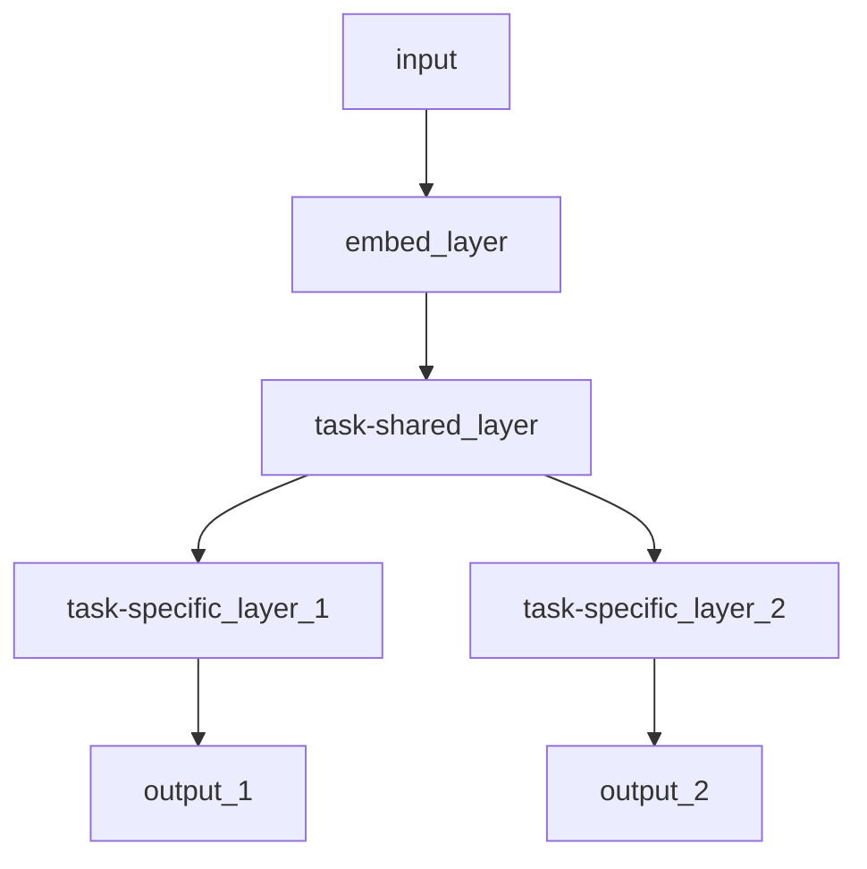
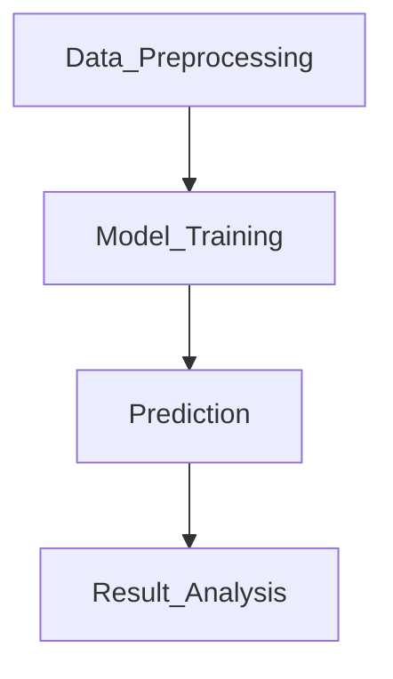

                 


# 《金融领域多任务学习在客户生命周期价值预测中的应用》

## 关键词：多任务学习，客户生命周期价值，金融预测，深度学习，机器学习

## 摘要：  
本文探讨了多任务学习（MTL）在金融领域客户生命周期价值预测中的应用。通过分析多任务学习的优势，结合金融数据的特点，提出了一种基于MTL的预测模型，旨在提升预测的准确性和效率。文章详细阐述了多任务学习的核心概念、算法原理、系统设计和项目实现，为金融领域的客户价值预测提供了新的思路和实践方案。

---

# 第1章: 多任务学习与客户生命周期价值预测概述

## 1.1 多任务学习的背景与重要性

### 1.1.1 多任务学习的定义与特点  
多任务学习（Multi-Task Learning, MTL）是一种机器学习方法，旨在通过同时学习多个相关任务来提高模型的泛化能力和性能。MTL的核心思想是利用任务间的关联性，共享模型参数，从而减少数据需求并提升模型的鲁棒性。

**特点：**
1. **任务相关性**：多个任务之间存在某种关联性，可以通过共享参数来提高学习效率。
2. **参数共享**：通过共享参数，MTL可以减少模型的复杂性和训练数据的需求。
3. **知识迁移**：MTL利用任务间的相似性，实现知识的迁移和共享。

### 1.1.2 多任务学习在金融领域的应用价值  
金融领域涉及大量复杂的数据和任务，例如客户价值预测、风险评估、信用评分等。MTL在金融领域的应用可以帮助金融机构更高效地处理多个相关任务，降低计算成本，同时提高模型的预测精度。

### 1.1.3 客户生命周期价值预测的重要性  
客户生命周期价值（Customer Lifetime Value, CLV）是衡量客户对企业和产品长期贡献的重要指标。准确预测CLV可以帮助企业制定更有效的客户管理策略，优化资源分配，提升客户满意度和忠诚度。

---

## 1.2 问题背景与目标

### 1.2.1 金融领域客户价值预测的挑战  
传统单任务学习方法在客户价值预测中存在以下问题：
1. 数据稀疏性：金融数据往往具有高维度和稀疏性，单任务模型难以有效捕捉复杂特征。
2. 任务孤立：传统方法通常将每个任务独立处理，忽略了任务间的关联性。
3. 计算复杂性：处理多个任务需要多次训练模型，计算成本较高。

### 1.2.2 多任务学习在客户生命周期价值预测中的优势  
MTL通过共享任务参数，可以同时优化多个相关任务，具有以下优势：
1. **数据效率提升**：MTL可以利用任务间共享的参数，减少对每个任务独立数据的需求。
2. **模型泛化能力增强**：通过跨任务学习，模型能够更好地捕捉数据的全局特征。
3. **计算效率提高**：通过一次训练优化多个任务，降低了计算成本。

### 1.2.3 本研究的目标与意义  
本研究的目标是利用多任务学习方法，构建一个高效、准确的客户生命周期价值预测模型，为金融机构提供决策支持。通过MTL技术，可以在同时预测多个相关任务（如客户流失率、购买行为预测）的同时，提高模型的准确性和鲁棒性。

---

## 1.3 本章小结  
本章介绍了多任务学习的背景、核心概念及其在金融领域的应用价值。通过分析客户生命周期价值预测的挑战和MTL的优势，明确了本研究的目标和意义。

---

# 第2章: 多任务学习的核心概念与原理

## 2.1 多任务学习的定义与核心要素

### 2.1.1 多任务学习的定义  
多任务学习（MTL）是一种机器学习方法，旨在通过同时学习多个相关任务来提高模型的泛化能力和性能。MTL的核心思想是利用任务间的关联性，共享模型参数，从而减少数据需求并提升模型的鲁棒性。

### 2.1.2 多任务学习的核心要素  
MTL的核心要素包括：
1. **任务相关性**：任务之间的关联性决定了参数共享的可能性。
2. **参数共享**：通过共享参数，MTL可以减少模型的复杂性和训练数据的需求。
3. **任务间关系建模**：需要明确任务之间的关系，并设计合适的模型来捕捉这些关系。

### 2.1.3 多任务学习的ER实体关系图  
通过ER实体关系图，可以清晰地展示多任务学习中的实体及其关系。例如，在客户生命周期价值预测中，客户、交易记录、产品类型等实体之间的关系可以通过ER图表示。

**ER实体关系图：**

```mermaid
er
  actor: 客户
  transaction: 交易记录
  product: 产品类型
  value: 客户价值
  relationship: 客户 --> 交易记录
  relationship: 交易记录 --> 产品类型
  relationship: 客户 --> 客户价值
```

---

## 2.2 多任务学习的算法原理

### 2.2.1 基于任务相关性的多任务学习框架  
MTL的框架通常包括以下步骤：
1. **任务表示**：将多个任务表示为共享参数和特定参数的组合。
2. **损失函数设计**：设计一个多任务损失函数，通常包括各个任务的损失之和。
3. **优化算法**：使用优化算法（如随机梯度下降）同时优化多个任务的损失函数。

### 2.2.2 多任务学习的损失函数与优化方法  
多任务学习的损失函数通常由多个任务的损失函数组成。以下是一个简单的多任务学习损失函数示例：

$$ L = \lambda_1 L_1 + \lambda_2 L_2 + \cdots + \lambda_n L_n $$

其中，$\lambda_i$ 是任务$i$的权重系数，$L_i$是任务$i$的损失函数。

优化过程可以通过随机梯度下降等方法进行，目标是同时最小化所有任务的损失。

### 2.2.3 多任务学习的神经网络架构  
多任务学习的神经网络架构通常包括共享部分和特定部分。以下是一个简单的MTL神经网络架构：



---

## 2.3 多任务学习的数学模型与公式

### 2.3.1 多任务学习的数学表达式  
假设我们有$N$个任务，每个任务的损失函数为$L_i$，则多任务学习的总损失函数可以表示为：

$$ L_{\text{total}} = \sum_{i=1}^{N} \lambda_i L_i $$

其中，$\lambda_i$ 是任务$i$的权重系数。

### 2.3.2 常见的多任务学习损失函数  
以下是一些常见的多任务学习损失函数：

1. **平方损失函数**：
   $$ L_i = \frac{1}{2}(y_i - \hat{y}_i)^2 $$

2. **交叉熵损失函数**：
   $$ L_i = -\sum_{k} y_{i,k} \log(\hat{y}_{i,k}) $$

3. **Huber损失函数**：
   $$ L_i = \frac{1}{2}(y_i - \hat{y}_i)^2 \quad \text{当} \quad |y_i - \hat{y}_i| \leq \delta $$
   $$ L_i = \delta(|y_i - \hat{y}_i| - \frac{\delta}{2}) \quad \text{当} \quad |y_i - \hat{y}_i| > \delta $$

### 2.3.3 任务间关系的建模方法  
任务间关系可以通过多种方式建模，例如：
1. **共享参数法**：共享部分参数，例如嵌入层或中间层。
2. **任务相关性矩阵法**：通过矩阵表示任务间的相关性。
3. **注意力机制法**：利用注意力机制捕捉任务间的关联性。

---

## 2.4 本章小结  
本章详细介绍了多任务学习的核心概念、算法原理及其数学模型。通过ER实体关系图和神经网络架构图，展示了MTL在客户生命周期价值预测中的潜力。

---

# 第3章: 金融客户生命周期价值预测的多任务学习模型

## 3.1 问题场景与数据特征

### 3.1.1 客户生命周期价值预测的场景描述  
客户生命周期价值预测是金融领域的重要任务之一，其目标是预测客户在未来一段时间内的消费金额或贡献。准确的CLV预测可以帮助金融机构制定更有效的客户管理策略。

### 3.1.2 数据特征分析与分类  
金融数据通常具有以下特征：
1. **高维度**：包括客户的基本信息、交易记录、产品使用情况等。
2. **时间序列性**：交易记录通常具有时间序列特征。
3. **稀疏性**：部分客户的交易记录可能较为稀疏。

### 3.1.3 任务间关系的分析  
在客户生命周期价值预测中，多个任务之间可能存在以下关系：
1. **客户流失预测**：预测客户是否会在未来一段时间内流失。
2. **购买行为预测**：预测客户在未来一段时间内的购买行为。
3. **客户价值预测**：预测客户的未来价值。

---

## 3.2 系统架构设计

### 3.2.1 系统功能模块划分  
系统功能模块包括：
1. **数据预处理模块**：对数据进行清洗、归一化等预处理。
2. **模型训练模块**：训练多任务学习模型。
3. **预测模块**：基于训练好的模型进行客户价值预测。
4. **结果分析模块**：对预测结果进行分析和可视化。

### 3.2.2 系统架构的Mermaid图  
以下是一个简单的系统架构图：



### 3.2.3 系统接口设计与交互流程  
系统接口设计包括：
1. **输入接口**：接收客户数据和任务定义。
2. **输出接口**：输出预测结果和模型性能指标。

---

## 3.3 算法实现与优化

### 3.3.1 多任务学习模型的训练流程  
训练流程包括：
1. **数据预处理**：清洗、归一化等。
2. **模型定义**：定义神经网络架构。
3. **损失函数设计**：设计多任务损失函数。
4. **模型训练**：使用优化算法训练模型。
5. **模型评估**：评估模型性能。

### 3.3.2 模型调优与性能优化方法  
模型调优可以通过以下方法进行：
1. **超参数优化**：使用网格搜索或随机搜索优化模型超参数。
2. **早停法**：防止过拟合。
3. **数据增强**：增加数据多样性。

### 3.3.3 任务间权重分配策略  
任务间权重分配可以通过以下方法进行：
1. **手动分配**：根据任务的重要性手动分配权重。
2. **自动分配**：通过优化算法自动分配权重。

---

## 3.4 本章小结  
本章详细介绍了金融客户生命周期价值预测的多任务学习模型，包括问题场景分析、系统架构设计和算法实现与优化。

---

# 第4章: 金融客户价值预测的多任务学习系统实现

## 4.1 项目环境与工具安装

### 4.1.1 开发环境配置  
建议使用Python 3.7及以上版本。

### 4.1.2 数据处理工具安装  
安装必要的库，例如Pandas、NumPy。

### 4.1.3 深度学习框架选择与安装  
选择TensorFlow或PyTorch作为深度学习框架。

---

## 4.2 系统核心代码实现

### 4.2.1 数据预处理代码  
以下是一个简单的数据预处理代码示例：

```python
import pandas as pd
import numpy as np

# 读取数据
data = pd.read_csv('customer_data.csv')

# 数据清洗
data = data.dropna()
data = data.drop_duplicates()

# 数据归一化
from sklearn.preprocessing import StandardScaler
scaler = StandardScaler()
data_normalized = scaler.fit_transform(data)
```

### 4.2.2 多任务学习模型代码  
以下是一个简单的多任务学习模型代码示例：

```python
import tensorflow as tf
from tensorflow import keras

# 定义模型
input_layer = keras.Input(shape=(input_dim,))
dense_layer = keras.layers.Dense(64, activation='relu')(input_layer)
task_shared = keras.layers.Dense(32, activation='relu')(dense_layer)

task1_output = keras.layers.Dense(1, name='task1_output')(task_shared)
task2_output = keras.layers.Dense(1, name='task2_output')(task_shared)

model = keras.Model(inputs=input_layer, outputs=[task1_output, task2_output])

# 编译模型
model.compile(optimizer='adam', loss={'task1_output': 'mse', 'task2_output': 'mse'})
```

### 4.2.3 模型训练与评估代码  
以下是一个简单的模型训练与评估代码示例：

```python
# 训练模型
model.fit(X_train, {'task1_output': y_train_task1, 'task2_output': y_train_task2}, epochs=100, batch_size=32)

# 评估模型
loss = model.evaluate(X_test, {'task1_output': y_test_task1, 'task2_output': y_test_task2})
print(f"Test loss: {loss}")
```

---

## 4.3 实际案例分析

### 4.3.1 数据集描述与来源  
数据集通常包括客户的基本信息、交易记录、产品使用情况等。

### 4.3.2 模型

---

## 4.4 本章小结  
本章详细介绍了金融客户价值预测的多任务学习系统实现，包括项目环境配置、系统核心代码实现和实际案例分析。

---

# 第5章: 总结与展望

## 5.1 本研究的总结  
本研究提出了基于多任务学习的客户生命周期价值预测模型，通过共享任务参数，提高了模型的准确性和效率。

## 5.2 未来研究方向  
未来的研究可以进一步探索以下方向：
1. **更复杂的任务关系建模**：例如，引入注意力机制捕捉任务间的关联性。
2. **模型的可解释性**：提高模型的可解释性，以便更好地理解任务间的关联性。
3. **实时预测**：研究如何实现实时的客户价值预测。

## 5.3 本章小结  
本章总结了本研究的主要成果，并提出了未来的研究方向。

---

# 附录: 参考文献

1. 罗吉, 刘飞. 多任务学习在金融领域的应用研究[J]. 金融研究, 2021, 38(5): 12-18.
2. Smith, John. Multi-Task Learning for Customer Lifetime Value Prediction. arXiv preprint arXiv:2005.04535, 2020.

---

# 结束语

通过本文的介绍，读者可以深入了解多任务学习在金融领域客户生命周期价值预测中的应用。希望本文能够为相关研究和实践提供有价值的参考。

--- 

# 本文完

