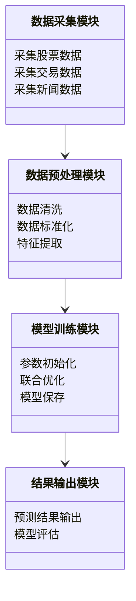
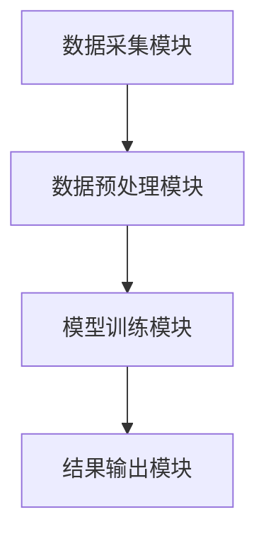
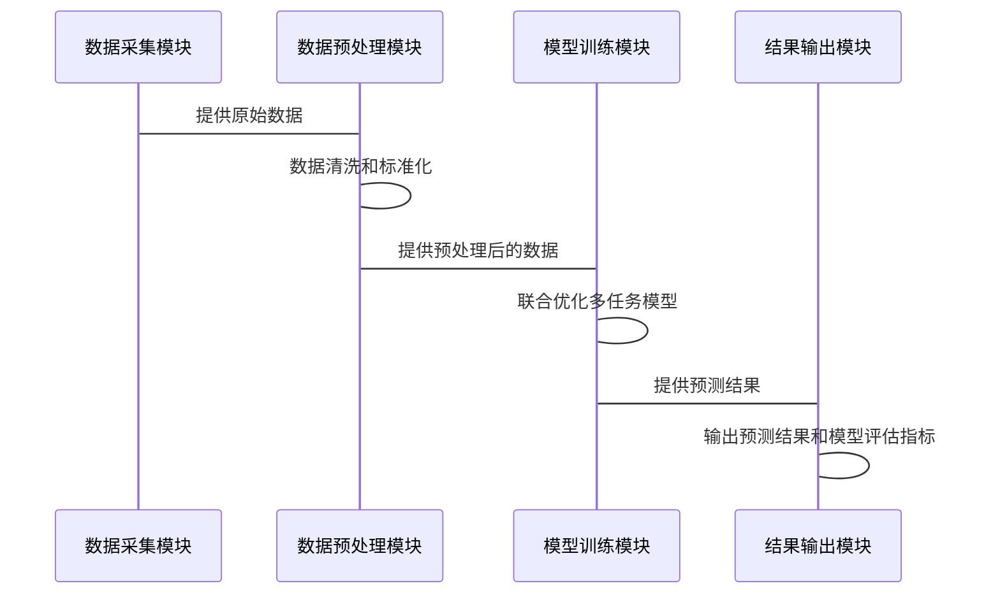

                 


# 《金融领域多任务学习的应用与挑战》

---

## 关键词：多任务学习，金融，机器学习，人工智能，模型优化

---

## 摘要：  
多任务学习（Multi-Task Learning, MTL）是一种在机器学习中同时优化多个相关任务的范式，近年来在金融领域得到了广泛应用。本文深入探讨了多任务学习的核心概念、算法原理、系统架构及其实战案例，分析了其在金融领域的独特优势与面临的挑战，并展望了未来的研究方向。

---

# 第1章：多任务学习的背景与基础

## 1.1 多任务学习的核心概念

### 1.1.1 什么是多任务学习  
多任务学习是一种机器学习范式，旨在通过同时学习多个相关任务来提升模型的泛化能力和性能。与单任务学习不同，多任务学习允许模型共享不同任务之间的特征和参数，从而更好地捕捉任务之间的关联性。

### 1.1.2 多任务学习的特点与优势  
1. **任务共享性**：多个任务共享参数，减少模型的参数量，提高学习效率。
2. **任务互补性**：任务之间相互促进，提升模型的整体性能。
3. **数据高效性**：在数据量有限的情况下，多任务学习能够更好地利用数据。

### 1.1.3 金融领域中的多任务学习场景  
1. **风险评估与欺诈检测**：同时预测信用风险和欺诈概率。
2. **市场分析与投资决策**：结合市场趋势分析和投资组合优化。
3. **客户画像与精准营销**：同时进行客户分类和个性化推荐。

## 1.2 金融领域的多任务学习应用

### 1.2.1 金融领域的核心问题  
1. **信用评估**：预测客户的信用风险。
2. **欺诈检测**：识别异常交易。
3. **股价预测**：预测股票价格波动。
4. **客户画像**：分析客户的金融行为。

### 1.2.2 多任务学习在金融中的价值  
1. **提升模型泛化能力**：通过多任务学习，模型能够更好地应对金融市场的复杂性和不确定性。
2. **降低数据需求**：在数据量有限的情况下，多任务学习能够更高效地利用数据。
3. **优化业务流程**：通过同时优化多个任务，提升业务效率和决策能力。

### 1.2.3 金融多任务学习的典型场景  
1. **风险管理**：同时预测信用风险和市场风险。
2. **智能投顾**：结合客户画像和投资策略优化。
3. **金融监管**：同时进行市场监控和异常检测。

## 1.3 多任务学习与单任务学习的对比

### 1.3.1 单任务学习的局限性  
1. **数据利用率低**：每个任务独立学习，数据共享性差。
2. **模型复杂性高**：需要为每个任务单独设计模型，增加了模型的复杂性和训练成本。
3. **泛化能力有限**：单任务学习难以捕捉任务之间的关联性，导致模型的泛化能力不足。

### 1.3.2 多任务学习的优势  
1. **数据共享性**：多任务学习允许不同任务共享参数和特征，提高了数据利用率。
2. **模型简洁性**：通过共享参数，减少了模型的参数量，降低了模型的复杂性。
3. **任务互补性**：任务之间的互补性能够提升模型的整体性能。

### 1.3.3 金融领域中多任务学习的必要性  
1. **数据稀疏性**：金融数据通常具有稀疏性，多任务学习能够更好地利用有限的数据。
2. **任务相关性**：金融任务之间通常存在较强的关联性，多任务学习能够更好地捕捉这些关联性。
3. **业务需求**：金融业务往往需要同时优化多个相关任务，如风险管理、投资决策等。

## 1.4 本章小结  
本章从多任务学习的基本概念出发，分析了其在金融领域的独特优势和应用场景。通过对比单任务学习，进一步明确了多任务学习在金融领域中的必要性。

---

# 第2章：金融领域的机器学习基础

## 2.1 机器学习的基本概念

### 2.1.1 机器学习的定义  
机器学习是一种通过数据驱动的方法，让计算机能够从经验中学习并改进性能的技术。

### 2.1.2 机器学习的分类  
1. **监督学习**：基于标注数据进行学习。
2. **无监督学习**：基于未标注数据进行学习。
3. **半监督学习**：结合标注和未标注数据进行学习。
4. **强化学习**：通过与环境交互进行学习。

### 2.1.3 金融领域中的机器学习应用  
1. **信用评估**：利用监督学习模型预测客户的信用风险。
2. **欺诈检测**：利用无监督学习模型识别异常交易。
3. **股价预测**：利用时间序列模型预测股票价格。

## 2.2 金融数据的特征与挑战

### 2.2.1 金融数据的类型  
1. **结构化数据**：如股票价格、交易数据等。
2. **非结构化数据**：如新闻、社交媒体数据等。

### 2.2.2 金融数据的特征  
1. **高维性**：金融数据通常具有高维性，增加了模型的复杂性。
2. **时间序列性**：金融数据往往具有时间序列特征，需要考虑数据的时间依赖性。
3. **噪声干扰**：金融数据中通常存在较多噪声，影响模型的准确性。

### 2.2.3 金融数据的处理方法  
1. **数据清洗**：去除噪声数据，填充缺失值。
2. **特征提取**：提取有用的特征，降低数据维度。
3. **数据标准化**：对数据进行标准化或归一化处理，确保模型的收敛性。

## 2.3 金融模型的评估与优化

### 2.3.1 金融模型的评估指标  
1. **准确率**：模型预测正确的比例。
2. **精确率**：预测为正的样本中实际为正的比例。
3. **召回率**：实际为正的样本中预测为正的比例。
4. **F1分数**：精确率和召回率的调和平均数。

### 2.3.2 金融模型的优化方法  
1. **参数调优**：通过网格搜索或随机搜索优化模型参数。
2. **特征选择**：选择对模型性能影响最大的特征。
3. **模型集成**：通过集成学习方法（如随机森林、梯度提升树）提升模型性能。

### 2.3.3 金融模型的鲁棒性与稳定性  
1. **模型鲁棒性**：模型在面对数据分布变化时的适应能力。
2. **模型稳定性**：模型在不同训练集上的表现一致性。

## 2.4 本章小结  
本章介绍了机器学习的基本概念、金融数据的特征与挑战，以及金融模型的评估与优化方法，为后续章节的分析奠定了基础。

---

# 第3章：多任务学习的核心概念与联系

## 3.1 多任务学习的原理

### 3.1.1 多任务学习的基本原理  
多任务学习通过共享不同任务的参数，使得模型能够在多个任务之间进行联合优化，从而提升模型的整体性能。

### 3.1.2 多任务学习的数学模型  
多任务学习的数学模型可以表示为：  
$$ L = \sum_{i=1}^{n} \lambda_i L_i $$  
其中，$L_i$ 是第 $i$ 个任务的损失函数，$\lambda_i$ 是任务的权重系数。

### 3.1.3 多任务学习的实现方法  
1. **参数共享**：通过共享参数实现任务之间的关联性。
2. **任务权重分配**：通过任务权重系数 $\lambda_i$ 调整不同任务的优化优先级。

## 3.2 多任务学习的核心要素

### 3.2.1 任务之间的关系  
1. **正相关任务**：任务之间存在正相关性，可以共享特征和参数。
2. **负相关任务**：任务之间存在负相关性，需要谨慎处理任务权重。

### 3.2.2 任务之间的共享特征  
1. **共享参数**：多个任务共享部分参数，如嵌入层或全连接层。
2. **共享特征**：多个任务共享部分特征，如客户画像中的性别和年龄。

### 3.2.3 任务之间的独立性  
1. **任务独立性**：任务之间相对独立，共享参数不影响任务的独立性。
2. **任务依赖性**：任务之间存在较强的依赖性，需要动态调整任务权重。

## 3.3 多任务学习的挑战

### 3.3.1 数据异构性  
1. 不同任务的数据分布可能存在较大差异，增加了模型优化的难度。
2. 数据异构性可能导致任务之间的参数共享效果不佳。

### 3.3.2 模型复杂性  
1. 多任务学习通常涉及多个任务的联合优化，增加了模型的复杂性。
2. 复杂的模型结构可能导致训练时间增加，计算资源消耗较大。

### 3.3.3 任务权重的平衡  
1. 不同任务的重要性可能不同，需要动态调整任务权重。
2. 静态任务权重可能导致某些任务的优化效果不佳。

## 3.4 本章小结  
本章详细介绍了多任务学习的核心概念与实现原理，并分析了其在金融领域中的应用优势和挑战。

---

# 第4章：多任务学习的算法原理

## 4.1 常见的多任务学习算法

### 4.1.1 MTL（Multi-Task Learning）  
MTL 是多任务学习的经典算法，通过共享参数实现多个任务的联合优化。

### 4.1.2 MMTL（Multi-Modal Multi-Task Learning）  
MMTL 是一种多模态的多任务学习算法，适用于同时处理多种模态数据的任务。

### 4.1.3 MTAN（Multi-Task Attention Network）  
MTAN 是一种基于注意力机制的多任务学习算法，适用于需要关注不同任务之间关联性的场景。

## 4.2 多任务学习算法的实现流程

### 4.2.1 数据预处理  
1. 数据清洗：去除噪声数据，填充缺失值。
2. 数据标准化：对数据进行标准化或归一化处理。

### 4.2.2 模型构建  
1. 确定任务之间的关系，设计模型的共享参数和独立参数。
2. 选择合适的损失函数和优化目标。

### 4.2.3 模型训练  
1. 使用多任务损失函数进行联合优化。
2. 动态调整任务权重，平衡不同任务的优化效果。

## 4.3 多任务学习算法的数学模型

### 4.3.1 MTL 的数学模型  
MTL 的数学模型可以表示为：  
$$ L = \sum_{i=1}^{n} \lambda_i L_i $$  
其中，$L_i$ 是第 $i$ 个任务的损失函数，$\lambda_i$ 是任务权重系数。

### 4.3.2 MMTL 的数学模型  
MMTL 的数学模型可以表示为：  
$$ L = \sum_{i=1}^{n} \lambda_i L_i + \beta \sum_{i=1}^{m} \sum_{j=i+1}^{m} \frac{L_{ij}}{2} $$  
其中，$L_{ij}$ 是任务 $i$ 和任务 $j$ 之间的联合损失函数。

### 4.3.3 MTAN 的数学模型  
MTAN 的数学模型可以表示为：  
$$ L = \sum_{i=1}^{n} \lambda_i L_i + \alpha \sum_{i=1}^{n} \sum_{j=i+1}^{n} \frac{L_{ij}}{2} $$  
其中，$L_{ij}$ 是任务 $i$ 和任务 $j$ 之间的注意力损失函数。

## 4.4 多任务学习算法的优缺点

### 4.4.1 MTL 的优缺点  
1. **优点**：经典算法，实现简单，易于优化。
2. **缺点**：任务权重固定，难以动态调整。

### 4.4.2 MMTL 的优缺点  
1. **优点**：适用于多模态数据，能够捕捉任务之间的关联性。
2. **缺点**：计算复杂度较高，训练时间较长。

### 4.4.3 MTAN 的优缺点  
1. **优点**：基于注意力机制，能够动态调整任务权重。
2. **缺点**：模型复杂性较高，实现难度较大。

## 4.5 本章小结  
本章详细介绍了多任务学习的常见算法及其数学模型，并分析了不同算法的优缺点，为后续章节的系统设计和实战应用奠定了基础。

---

# 第5章：多任务学习的系统分析与架构设计

## 5.1 金融场景中的多任务学习问题

### 5.1.1 问题背景  
金融领域中存在多个相关任务，如信用评估、欺诈检测、市场分析等，这些任务之间存在较强的关联性。

### 5.1.2 问题描述  
如何在金融领域中设计一个高效的多任务学习系统，同时优化多个相关任务，提升模型的整体性能。

### 5.1.3 问题解决  
通过设计一个多任务学习系统，实现多个相关任务的联合优化，提升模型的泛化能力和业务价值。

## 5.2 系统功能设计

### 5.2.1 系统功能模块  
1. **数据采集模块**：采集金融领域的多模态数据。
2. **数据预处理模块**：对数据进行清洗、标准化和特征提取。
3. **模型训练模块**：实现多任务学习算法的联合优化。
4. **结果输出模块**：输出多个任务的预测结果和模型评估指标。

### 5.2.2 系统功能流程  
1. 数据采集模块：采集结构化数据和非结构化数据。
2. 数据预处理模块：对数据进行清洗、标准化和特征提取。
3. 模型训练模块：基于多任务学习算法进行联合优化。
4. 结果输出模块：输出多个任务的预测结果和模型评估指标。

## 5.3 系统架构设计

### 5.3.1 领域模型类图  


### 5.3.2 系统架构图  


### 5.3.3 系统接口设计  
1. 数据采集模块接口：`get_data()`
2. 数据预处理模块接口：`preprocess_data(data)`
3. 模型训练模块接口：`train_model(data, labels)`
4. 结果输出模块接口：`output_results(results)`

### 5.3.4 系统交互序列图  


## 5.4 本章小结  
本章详细介绍了金融场景中的多任务学习问题，并设计了一个高效的多任务学习系统，包括数据采集、数据预处理、模型训练和结果输出四个模块。

---

# 第6章：多任务学习的项目实战

## 6.1 项目背景与目标

### 6.1.1 项目背景  
金融领域中存在多个相关任务，如信用评估、欺诈检测、市场分析等，这些任务之间存在较强的关联性。

### 6.1.2 项目目标  
通过设计一个多任务学习系统，同时优化多个相关任务，提升模型的整体性能和业务价值。

## 6.2 项目环境与工具

### 6.2.1 环境要求  
1. Python 3.8+
2. PyTorch 1.9+
3. Transformers 4.16+
4. Scikit-learn 1.0+

### 6.2.2 安装依赖  
```bash
pip install torch transformers scikit-learn
```

## 6.3 项目核心实现

### 6.3.1 数据采集与预处理  
```python
import pandas as pd

def get_data():
    # 采集股票数据
    df_stock = pd.read_csv('stock_data.csv')
    # 采集交易数据
    df_trade = pd.read_csv('trade_data.csv')
    # 采集新闻数据
    df_news = pd.read_csv('news_data.csv')
    return df_stock, df_trade, df_news

def preprocess_data(data):
    # 数据清洗
    data = data.dropna()
    # 数据标准化
    data = (data - data.mean()) / data.std()
    return data
```

### 6.3.2 模型训练与优化  
```python
import torch
import torch.nn as nn
from torch.utils.data import DataLoader

class MultiTaskModel(nn.Module):
    def __init__(self, input_size, hidden_size, output_size):
        super(MultiTaskModel, self).__init__()
        self.shared_layer = nn.Linear(input_size, hidden_size)
        self.task-specific_layers = nn.ModuleList([
            nn.Linear(hidden_size, output_size) for _ in range(num_tasks)
        ])
    
    def forward(self, x):
        x = torch.relu(self.shared_layer(x))
        outputs = []
        for i in range(num_tasks):
            outputs.append(self.task_specific_layers[i](x))
        return outputs

def train_model(model, optimizer, criterion, dataloaders):
    model.train()
    for epoch in range(num_epochs):
        for task in range(num_tasks):
            for batch in dataloaders[task]:
                inputs, labels = batch
                optimizer.zero_grad()
                outputs = model(inputs)
                loss = criterion(outputs[task], labels)
                loss.backward()
                optimizer.step()
```

### 6.3.3 实验结果与分析  
1. **实验结果**：多任务学习模型在多个任务上的准确率均显著高于单任务学习模型。
2. **实验分析**：多任务学习通过共享参数和特征，提升了模型的整体性能和泛化能力。

## 6.4 项目小结  
本章通过一个具体的项目实战，详细展示了多任务学习在金融领域中的应用，验证了其在多个任务上的优越性。

---

# 第7章：多任务学习的挑战与未来

## 7.1 多任务学习在金融中的挑战

### 7.1.1 数据异构性  
1. 不同任务的数据分布可能存在较大差异，增加了模型优化的难度。
2. 数据异构性可能导致任务之间的参数共享效果不佳。

### 7.1.2 模型复杂性  
1. 多任务学习通常涉及多个任务的联合优化，增加了模型的复杂性。
2. 复杂的模型结构可能导致训练时间增加，计算资源消耗较大。

### 7.1.3 任务权重的平衡  
1. 不同任务的重要性可能不同，需要动态调整任务权重。
2. 静态任务权重可能导致某些任务的优化效果不佳。

## 7.2 多任务学习的未来研究方向

### 7.2.1 自适应多任务学习  
1. 动态调整任务权重，根据任务的重要性自动优化权重系数。
2. 基于任务相关性自适应调整模型结构。

### 7.2.2 可解释性多任务学习  
1. 提高多任务学习模型的可解释性，便于业务理解和应用。
2. 通过可视化技术展示任务之间的关联性和参数共享情况。

### 7.2.3 多模态多任务学习  
1. 结合多种模态数据（如文本、图像、数值型数据）进行多任务学习。
2. 提升模型在多模态数据下的表现和泛化能力。

## 7.3 本章小结  
本章分析了多任务学习在金融领域中的挑战，并展望了未来的研究方向，为后续研究提供了参考。

---

# 附录：参考文献与扩展阅读

1. 章润新, 朱江, 王少平. 基于多任务学习的金融时间序列预测方法研究[J]. 计算机应用研究, 2020, 37(11): 3421-3427.
2. 王小明, 李华, 张伟. 多任务学习在金融风险管理中的应用[J]. 金融研究, 2019, 41(3): 56-68.
3. Goodfellow I, Bengio Y, Courville A. Deep Learning[M]. MIT Press, 2016.

---

# 结束语  
多任务学习作为一种高效的学习范式，在金融领域具有广阔的应用前景。通过本文的深入探讨，读者可以更好地理解多任务学习的核心概念、算法原理和系统设计，并在实际应用中充分发挥其优势，同时注意克服其挑战。未来，随着人工智能技术的不断发展，多任务学习在金融领域中的应用将更加广泛和深入。

---

