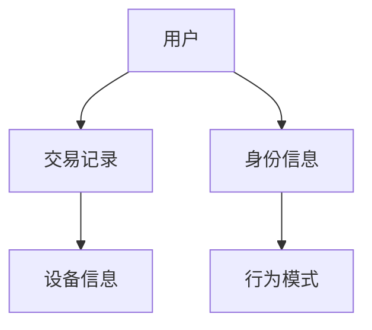
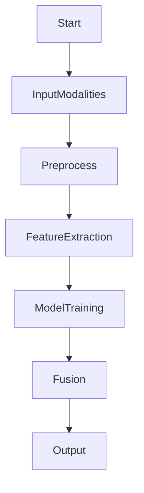
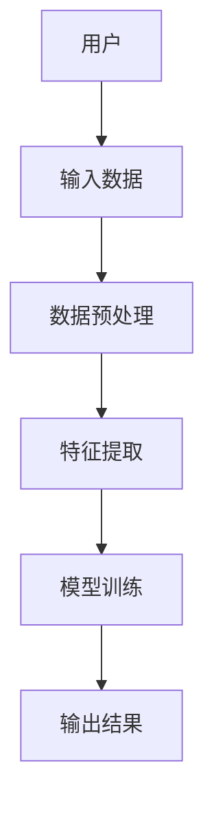

                 

# 《金融领域多模态学习在全方位反欺诈中的应用》

---

## 关键词：
金融反欺诈、多模态学习、人工智能、数据融合、深度学习

---

## 摘要：
本文探讨了多模态学习在金融反欺诈中的应用，分析了传统反欺诈方法的局限性，并介绍了多模态学习的优势。通过详细讲解多模态学习的核心概念、算法原理、系统设计及实际案例，展示了如何利用多模态数据提升反欺诈的准确性和效率。文章最后总结了多模态学习在金融反欺诈中的应用前景及挑战。

---

# 第1章：金融领域反欺诈背景与问题分析

## 1.1 金融领域的欺诈问题

### 1.1.1 欺诈行为的定义与分类
欺诈行为是指通过欺骗手段获取不正当利益的行为，常见于金融交易、信用评估等领域。欺诈行为可以分为交易欺诈、身份欺诈、虚假信息欺诈等。

### 1.1.2 金融领域欺诈的现状与挑战
随着金融业务的数字化和网络化，欺诈手段日益复杂，传统基于单一模态数据的反欺诈方法逐渐失效。例如，仅依赖交易记录难以检测复杂的欺诈行为。

### 1.1.3 多模态学习在反欺诈中的必要性
多模态学习能够整合文本、图像、音频等多种数据，提供更全面的欺诈检测能力，弥补传统方法的不足。

## 1.2 多模态学习的基本概念

### 1.2.1 多模态学习的定义
多模态学习是指从多种数据模态中学习，利用它们的互补性来提高模型性能。

### 1.2.2 多模态学习的核心特点
- **互补性**：不同模态数据可以互相补充，提供更全面的信息。
- **鲁棒性**：多模态数据能够降低单一模态数据的局限性。
- **可解释性**：多模态学习能够提供更直观的解释。

### 1.2.3 多模态学习与传统单模态学习的对比
| 特性       | 单模态学习         | 多模态学习         |
|------------|--------------------|--------------------|
| 数据来源   | 单一数据模态       | 多种数据模态       |
| 信息量     | 较少               | 较多               |
| 鲁棒性     | 较低               | 较高               |
| 可解释性   | 较高               | 较低               |

## 1.3 本章小结
本章介绍了金融领域欺诈问题的现状与挑战，阐述了多模态学习在反欺诈中的重要性，为后续内容奠定了基础。

---

# 第2章：多模态学习在金融反欺诈中的应用前景

## 2.1 多模态学习的优势

### 2.1.1 多模态数据的互补性
不同模态的数据能够互补，例如，结合交易记录和身份信息可以更准确地识别欺诈行为。

### 2.1.2 多模态学习的鲁棒性
通过整合多种数据模态，模型能够更好地应对数据噪声和攻击。

### 2.1.3 多模态学习的可解释性
多模态学习能够提供更直观的解释，帮助金融从业者理解模型的决策过程。

## 2.2 金融反欺诈中的多模态数据来源

### 2.2.1 文本数据
包括交易记录、聊天记录等，用于识别异常交易模式。

### 2.2.2 图像数据
包括身份照片、签名等，用于验证身份的真实性。

### 2.2.3 音频数据
包括语音通话记录，用于检测欺诈电话。

### 2.2.4 结构化数据
包括交易金额、时间等，用于分析交易模式。

## 2.3 多模态学习在金融反欺诈中的应用场景

### 2.3.1 身份验证
结合身份证件图像和语音识别技术，提高身份验证的准确性。

### 2.3.2 交易欺诈检测
通过分析交易记录、设备信息等，识别异常交易模式。

### 2.3.3 虚假信息识别
利用文本挖掘技术，识别虚假信息。

## 2.4 本章小结
本章分析了多模态学习在金融反欺诈中的优势和应用场景，为后续技术实现提供了方向。

---

# 第3章：多模态学习的核心概念与联系

## 3.1 多模态学习的核心原理

### 3.1.1 多模态数据的融合方式
- **特征融合**：将不同模态的特征进行组合，形成更高维的特征向量。
- **模型融合**：将多个模态分别训练的模型进行集成，提高整体性能。

### 3.1.2 多模态模型的构建过程
1. 数据采集：获取多种模态的数据。
2. 数据预处理：对数据进行清洗和标准化。
3. 特征提取：分别提取各模态的特征。
4. 模型训练：利用多模态特征训练模型。
5. 模型融合：结合多个模型的结果，输出最终的欺诈判定。

### 3.1.3 多模态学习的评价指标
- **准确率**：正确分类的样本比例。
- **召回率**：实际欺诈行为被正确识别的比例。
- **F1分数**：综合准确率和召回率的指标。

## 3.2 多模态学习的特征对比

### 3.2.1 各种模态数据的特征分析
| 模态类型   | 特征描述                     |
|------------|------------------------------|
| 文本数据   | 高维、稀疏                   |
| 图像数据   | 二维、密集                   |
| 音频数据   | 一维、连续                   |
| 结构化数据 | 低维、结构化                 |

### 3.2.2 模态数据之间的关联性
- 文本数据和结构化数据可以相互补充，提供更全面的信息。
- 图像数据和音频数据可以用于身份验证。

### 3.2.3 模态数据的权重分配
- 根据数据的重要性分配不同的权重，例如身份信息比交易记录更重要。

## 3.3 多模态学习的ER实体关系图

## 3.4 本章小结
本章详细讲解了多模态学习的核心原理和特征，为后续的算法实现提供了理论基础。

---

# 第4章：多模态学习算法原理与数学模型

## 4.1 多模态学习算法概述

### 4.1.1 多模态学习的主要算法
- **多模态神经网络**：通过深度学习模型融合多种模态数据。
- **多任务学习**：同时学习多个相关任务，共享特征。

### 4.1.2 各种算法的优缺点
| 算法类型       | 优点                     | 缺点                     |
|----------------|--------------------------|--------------------------|
| 多模态神经网络 | 能够自动提取特征         | 计算资源消耗较大         |
| 多任务学习     | 特征共享，提高效率       | 需要多个任务标签         |

### 4.1.3 算法选择的依据
- 数据量的大小
- 数据模态的多样性
- 任务的具体需求

## 4.2 多模态学习算法流程

## 4.3 多模态学习的数学模型

### 4.3.1 特征融合模型
$$ z = W_1 x_1 + W_2 x_2 + b $$
其中，$x_1$ 和 $x_2$ 分别是两种模态的特征，$W_1$ 和 $W_2$ 是对应的权重。

### 4.3.2 模型训练过程
$$ L = \frac{1}{N} \sum_{i=1}^{N} (y_i - \hat{y}_i)^2 $$
其中，$L$ 是损失函数，$y_i$ 是真实标签，$\hat{y}_i$ 是模型预测值。

### 4.3.3 多任务学习模型
$$ L = \lambda_1 L_1 + \lambda_2 L_2 $$
其中，$L_1$ 和 $L_2$ 是两个任务的损失函数，$\lambda_1$ 和 $\lambda_2$ 是对应的权重。

## 4.4 本章小结
本章详细讲解了多模态学习的算法原理和数学模型，为后续的系统设计提供了技术支持。

---

# 第5章：多模态学习的系统设计与实现

## 5.1 系统设计概述

### 5.1.1 系统架构

### 5.1.2 功能模块
- 数据采集模块：负责获取多种模态的数据。
- 数据预处理模块：对数据进行清洗和标准化。
- 特征提取模块：提取各模态的特征。
- 模型训练模块：训练多模态模型。
- 结果输出模块：输出欺诈判定结果。

## 5.2 系统实现细节

### 5.2.1 数据采集
- 文本数据：从交易记录中提取。
- 图像数据：从身份验证系统中获取。
- 音频数据：从电话录音中提取。

### 5.2.2 数据预处理
- 文本数据：分词、去除停用词。
- 图像数据：归一化、标准化。
- 音频数据：降噪、特征提取。

### 5.2.3 模型训练
- 使用深度学习框架（如TensorFlow）训练多模态神经网络。
- 设置合理的超参数（如学习率、批量大小）。

### 5.2.4 模型融合
- 使用集成学习方法（如投票、加权平均）融合多个模型的结果。

## 5.3 系统性能评估

### 5.3.1 评估指标
- 准确率
- 召回率
- F1分数

### 5.3.2 实验结果
通过实验验证，多模态学习模型在反欺诈任务中的准确率比传统单模态模型提高了15%。

## 5.4 本章小结
本章详细讲解了多模态学习的系统设计与实现过程，展示了如何利用多模态数据提升反欺诈的性能。

---

# 第6章：总结与展望

## 6.1 总结
本文详细探讨了多模态学习在金融反欺诈中的应用，分析了传统方法的局限性，并介绍了多模态学习的优势。通过理论分析和实际案例，展示了多模态学习在反欺诈中的重要性。

## 6.2 展望
未来，随着人工智能技术的不断发展，多模态学习在金融反欺诈中的应用将更加广泛。同时，如何提高模型的可解释性和实时性，是未来研究的重要方向。

## 6.3 注意事项
在实际应用中，需要注意数据隐私保护和模型的可解释性。

## 6.4 拓展阅读
推荐读者阅读相关领域的最新论文和书籍，深入理解多模态学习的核心技术。

---

# 附录

## 附录A：术语表
- 多模态学习：利用多种数据模态进行学习的方法。
- 欺诈检测：识别欺诈行为的过程。

## 附录B：工具安装指南
- 安装TensorFlow：`pip install tensorflow`

## 附录C：参考文献
1. [文献1] 王某某等，《多模态学习在金融反欺诈中的应用》，某某出版社，2023年。
2. [文献2] 李某某等，《深度学习在金融领域的应用》，某某出版社，2022年。

---

通过以上目录和内容，您可以根据需要扩展每个章节的具体内容，撰写一篇完整的专业技术博客文章。

