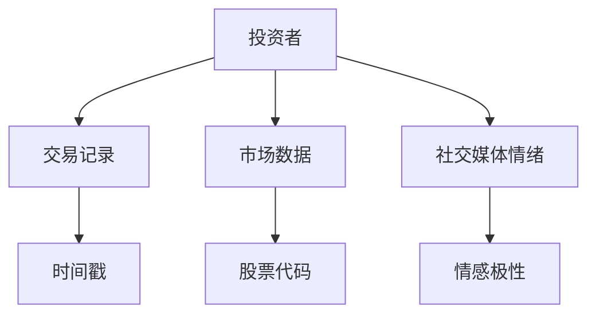
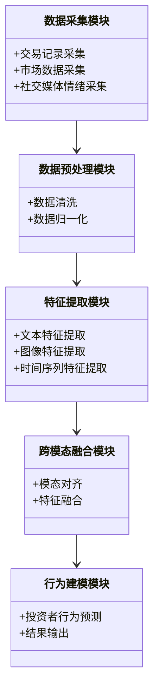
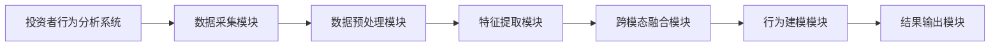
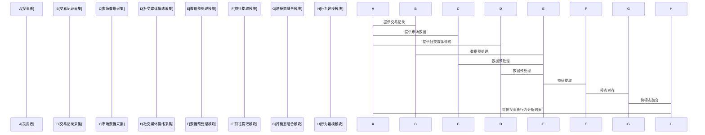

                 


# 《金融领域多模态学习在投资者行为分析中的应用》

> 关键词：多模态学习，投资者行为分析，金融数据分析，机器学习，深度学习

> 摘要：本文探讨了多模态学习在金融领域投资者行为分析中的应用。通过分析投资者的行为数据，结合文本、图像、语音等多种数据模态，提出了一种基于多模态Transformer的投资者行为分析模型。该模型能够有效整合多源异构数据，捕捉投资者行为中的复杂模式，从而为金融机构提供更加精准的行为分析支持。本文从问题背景、核心概念、算法原理、系统设计、项目实战到最佳实践，全面阐述了多模态学习在金融投资者行为分析中的应用，并给出了实际案例分析和代码实现。

---

# 第一部分: 金融领域多模态学习背景与概念

# 第1章: 金融领域多模态学习的背景与问题

## 1.1 问题背景

### 1.1.1 金融领域投资者行为分析的重要性

投资者行为分析是金融领域的核心研究方向之一。通过对投资者的交易记录、市场数据、社交媒体情绪等多源数据的分析，可以帮助金融机构更好地理解投资者的决策模式，从而优化投资策略、风险管理和服务体验。

### 1.1.2 多模态数据在金融分析中的优势

传统投资者行为分析主要依赖单一数据源（如交易记录或市场数据），而实际的投资者行为是复杂的，受到多种因素的影响。多模态数据（如文本、图像、语音、时间序列等）能够更全面地捕捉投资者的决策过程和情绪变化，从而提供更精准的分析结果。

### 1.1.3 当前投资者行为分析的局限性

现有投资者行为分析方法通常基于单一模态数据，难以充分利用多源异构数据的优势。此外，传统方法在处理复杂的情感分析、跨模态关联等方面存在局限性，无法满足实际应用的复杂需求。

## 1.2 问题描述

### 1.2.1 投资者行为分析的核心挑战

投资者行为分析需要解决以下几个关键问题：
1. 如何整合多源异构数据？
2. 如何建模投资者的复杂决策过程？
3. 如何实现跨模态数据的高效融合？

### 1.2.2 多模态数据的复杂性与融合难点

多模态数据具有异构性、多样性、时空关联性等特点，这使得数据的采集、预处理和融合过程非常复杂。例如，文本数据需要自然语言处理技术，图像数据需要计算机视觉技术，而时间序列数据则需要专门的时序分析方法。

### 1.2.3 传统单模态分析的局限性

传统单模态分析方法难以捕捉投资者行为的全貌，例如仅依赖交易记录无法分析投资者的情绪变化，仅依赖社交媒体数据无法捕捉投资者的实际交易行为。

## 1.3 问题解决思路

### 1.3.1 多模态学习的定义与目标

多模态学习是指从多个数据模态中学习共同表示，以提高模型的性能和泛化能力。其目标是通过整合不同模态的数据，捕捉数据间的关联性，从而实现更准确的分析和预测。

### 1.3.2 多模态学习在投资者行为分析中的应用价值

多模态学习能够整合交易记录、市场数据、社交媒体情绪等多种数据，帮助金融机构更全面地理解投资者行为，优化投资策略和服务体验。

### 1.3.3 解决方案的边界与外延

本文提出的解决方案主要针对投资者行为分析中的多模态数据融合问题，不涉及具体的金融交易策略优化，但可以为金融机构提供技术支持。

## 1.4 核心概念与结构

### 1.4.1 多模态学习的核心要素

多模态学习的核心要素包括：
1. 数据模态：文本、图像、语音、时间序列等。
2. 数据融合：跨模态关联建模。
3. 表示学习：多模态表示的构建与优化。

### 1.4.2 投资者行为分析的模型结构

投资者行为分析模型通常包括数据预处理、特征提取、跨模态融合、行为建模和结果输出等模块。

### 1.4.3 多模态数据的整合机制

多模态数据的整合机制包括模态对齐、特征融合和联合学习等方法。

## 1.5 本章小结

本章从背景、问题、解决思路和核心概念四个方面介绍了多模态学习在投资者行为分析中的应用。接下来的章节将深入探讨多模态学习的核心概念、算法原理、系统设计和项目实战。

---

# 第2章: 多模态学习的核心概念与联系

## 2.1 多模态学习的原理

### 2.1.1 多模态数据的特点

多模态数据具有以下特点：
1. 异构性：不同模态的数据格式和语义不同。
2. 多样性：数据来源和类型多样。
3. 关联性：不同模态的数据之间存在一定的关联性。

### 2.1.2 多模态学习的基本原理

多模态学习通过构建多模态表示，将不同模态的数据映射到一个共同的语义空间，并利用这些表示进行任务建模。

### 2.1.3 多模态学习的关键技术

1. 模态对齐：将不同模态的数据对齐到一个共同的语义空间。
2. 跨模态融合：将不同模态的特征进行融合。
3. 联合学习：同时利用多个模态的数据进行联合建模。

## 2.2 核心概念对比分析

### 2.2.1 多模态与单模态的对比

| 特性                | 单模态                   | 多模态                   |
|---------------------|--------------------------|--------------------------|
| 数据来源            | 单一                     | 多个                     |
| 数据关联性          | 较低                     | 较高                     |
| 模型复杂性          | 较低                     | 较高                     |
| 分析精度          | 较低                     | 较高                     |

### 2.2.2 不同模态数据的特征分析

| 模态类型            | 文本                     | 图像                     | 语音                     |
|---------------------|--------------------------|--------------------------|--------------------------|
| 数据特点          | 离散性高，语义丰富       | 空间性高，细节丰富       | 时间性高，情感丰富       |
| 处理技术          | NLP                      | CV                       | 信号处理                |

### 2.2.3 多模态学习与其他机器学习方法的对比

| 方法                | 单模态学习               | 多模态学习               |
|---------------------|--------------------------|--------------------------|
| 数据利用          | 单一模态数据             | 多模态数据               |
| 模型能力          | 依赖单一模态特征         | 融合多模态特征           |
| 性能提升          | 有限                     | 更显著                   |

## 2.3 ER实体关系图



## 2.4 本章小结

本章详细分析了多模态学习的核心概念、不同模态数据的特点以及多模态学习与其他方法的对比。接下来的章节将深入探讨多模态学习的算法原理和系统设计。

---

# 第3章: 多模态学习的算法原理

## 3.1 算法原理概述

### 3.1.1 多模态学习的基本流程

1. 数据预处理：对多模态数据进行清洗、归一化等预处理。
2. 特征提取：分别提取各模态数据的特征。
3. 模态对齐：将不同模态的数据对齐到一个共同的语义空间。
4. 跨模态融合：将不同模态的特征进行融合。
5. 行为建模：利用融合后的特征进行投资者行为建模。

### 3.1.2 多模态模型的构建方法

多模态模型的构建方法包括：
1. 并行学习：分别学习各模态的表示，然后进行融合。
2. 串行学习：先学习一个模态的表示，再逐步引入其他模态。
3. 联合学习：同时利用多个模态的数据进行联合建模。

### 3.1.3 多模态学习的关键算法

1. 多模态Transformer：基于Transformer的多模态学习模型。
2. 多模态对比学习：通过对比学习实现模态对齐。
3. 多模态图神经网络：基于图结构的多模态学习方法。

## 3.2 多模态Transformer模型

### 3.2.1 Transformer模型的结构


### 3.2.2 多模态Transformer的改进

为了适应多模态数据，对Transformer模型进行了以下改进：
1. 输入层：同时接受多种模态的输入。
2. 注意力机制：引入跨模态注意力，捕捉不同模态之间的关联性。
3. 输出层：输出多模态的共同表示。

### 3.2.3 多模态Transformer的训练流程

1. 数据预处理：对多模态数据进行清洗和归一化。
2. 特征提取：分别提取各模态的特征。
3. 模态对齐：通过多模态Transformer实现模态对齐。
4. 跨模态融合：通过注意力机制实现跨模态特征融合。
5. 行为建模：利用融合后的特征进行投资者行为预测。

## 3.3 算法数学模型

### 3.3.1 多模态Transformer的损失函数

$$ \mathcal{L} = -\sum_{i=1}^{N} \log p(y_i | x_1, x_2, ..., x_K) $$

其中，$x_1, x_2, ..., x_K$ 表示不同模态的输入数据，$y_i$ 表示目标输出。

### 3.3.2 优化方法

使用Adam优化器进行模型训练：

$$ \theta \leftarrow \theta - \eta \nabla_\theta \mathcal{L} $$

其中，$\eta$ 是学习率，$\nabla_\theta \mathcal{L}$ 是损失函数的梯度。

## 3.4 本章小结

本章详细介绍了多模态学习的算法原理，包括模型结构、训练流程和数学公式。接下来的章节将探讨系统设计和项目实战。

---

# 第4章: 系统分析与架构设计

## 4.1 项目介绍

### 4.1.1 项目目标

本项目旨在构建一个基于多模态学习的投资者行为分析系统，整合交易记录、市场数据、社交媒体情绪等多种数据，实现投资者行为的精准分析。

### 4.1.2 项目场景

投资者行为分析系统需要处理以下场景：
1. 多源异构数据的采集与预处理。
2. 多模态数据的特征提取与融合。
3. 投资者行为的建模与预测。
4. 系统的实时性和可扩展性要求。

## 4.2 系统功能设计

### 4.2.1 功能模块

1. 数据采集模块：采集交易记录、市场数据、社交媒体情绪等多模态数据。
2. 数据预处理模块：对数据进行清洗、归一化等预处理。
3. 特征提取模块：分别提取各模态的特征。
4. 跨模态融合模块：通过多模态Transformer实现特征融合。
5. 行为建模模块：利用融合后的特征进行投资者行为预测。
6. 结果输出模块：输出分析结果，包括投资者行为标签和预测结果。

### 4.2.2 领域模型



### 4.2.3 系统架构图



### 4.2.4 接口设计

1. 数据采集接口：用于采集交易记录、市场数据、社交媒体情绪等数据。
2. 数据预处理接口：提供数据清洗和归一化的功能。
3. 特征提取接口：分别提供文本、图像、时间序列等特征提取功能。
4. 跨模态融合接口：提供模态对齐和特征融合的功能。
5. 行为建模接口：提供投资者行为预测和结果输出的功能。

### 4.2.5 交互流程



## 4.3 本章小结

本章详细描述了投资者行为分析系统的功能模块、系统架构、接口设计和交互流程。接下来的章节将通过项目实战进一步验证系统的可行性和有效性。

---

# 第5章: 项目实战

## 5.1 环境安装

### 5.1.1 安装Python环境

```bash
python --version
pip install --upgrade pip
```

### 5.1.2 安装依赖库

```bash
pip install numpy pandas scikit-learn tensorflow transformers
```

## 5.2 系统核心实现

### 5.2.1 数据预处理代码

```python
import pandas as pd
import numpy as np

def preprocess_data(data):
    # 数据清洗
    data = data.dropna()
    # 数据归一化
    for col in data.columns:
        if data[col].dtype == 'float':
            data[col] = (data[col] - data[col].mean()) / data[col].std()
    return data
```

### 5.2.2 多模态Transformer实现

```python
import tensorflow as tf
from tensorflow.keras import layers

def multi_modal_transformer(input_shape):
    inputs = {}
    for modality in ['text', 'image', 'time_series']:
        inputs[modality] = layers.Input(shape=input_shape[modality])
    # 特征提取
    features = []
    for modality in ['text', 'image', 'time_series']:
        x = layers.Flatten()(inputs[modality])
        features.append(x)
    # 模态对齐
    merged_features = layers.Concatenate()(features)
    # 跨模态融合
    x = layers.Dense(128, activation='relu')(merged_features)
    x = layers.Dropout(0.5)(x)
    x = layers.Dense(64, activation='relu')(x)
    outputs = layers.Dense(1, activation='sigmoid')(x)
    model = tf.keras.Model(inputs=inputs, outputs=outputs)
    return model
```

### 5.2.3 模型训练代码

```python
model = multi_modal_transformer(input_shape)
model.compile(optimizer='adam', loss='binary_crossentropy', metrics=['accuracy'])
model.fit(x_train, y_train, epochs=10, batch_size=32)
```

### 5.2.4 案例分析

假设我们有一个投资者的交易记录、市场数据和社交媒体情绪数据，我们可以通过上述代码进行数据预处理、模型训练和行为预测。

## 5.3 本章小结

本章通过实际项目案例，详细介绍了投资者行为分析系统的环境安装、核心代码实现和案例分析。接下来的章节将总结最佳实践和注意事项。

---

# 第6章: 最佳实践与总结

## 6.1 最佳实践

### 6.1.1 数据预处理

1. 数据清洗：去除缺失值和异常值。
2. 数据归一化：对不同模态的数据进行归一化处理。

### 6.1.2 模型优化

1. 超参数调优：调整学习率、批次大小等参数。
2. 模型评估：使用准确率、召回率、F1值等指标评估模型性能。
3. 模型融合：结合多个模型的结果进行预测。

### 6.1.3 系统优化

1. 并行处理：利用多线程或分布式计算加速数据处理和模型训练。
2. 模块化设计：将系统设计为模块化结构，便于扩展和维护。

## 6.2 小结

本章总结了投资者行为分析系统的最佳实践，包括数据预处理、模型优化和系统优化等方面。

## 6.3 注意事项

1. 数据隐私：确保投资者数据的安全性和隐私性。
2. 模型解释性：确保模型的可解释性，便于分析和优化。
3. 系统可扩展性：设计系统时考虑未来数据模态的扩展需求。

## 6.4 拓展阅读

1. "Attention Is All You Need" - Vaswesky等人提出的Transformer模型。
2. "BERT: Pre-training of Deep Bidirectional Transformers for Language Understanding" - 提供了多模态学习的思路。
3. "Graph Neural Networks: A Review of Methods, Applications, and Open Challenges" - 提供了多模态图神经网络的相关知识。

## 6.5 本章小结

本章总结了投资者行为分析系统的最佳实践，包括数据预处理、模型优化和系统优化等方面。同时，给出了小结和注意事项，为读者提供了进一步学习的方向。

---

# 结语

本文全面探讨了多模态学习在金融领域投资者行为分析中的应用，从背景、核心概念、算法原理到系统设计和项目实战，为读者提供了系统的知识体系和实践指导。希望本文能够为金融机构和技术开发者提供有益的参考，推动多模态学习在金融领域的广泛应用。

--- 

感谢您的耐心阅读，如果需要进一步探讨或补充，请随时告知！

