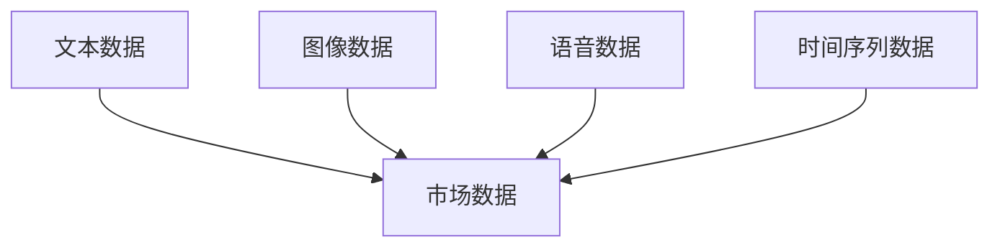
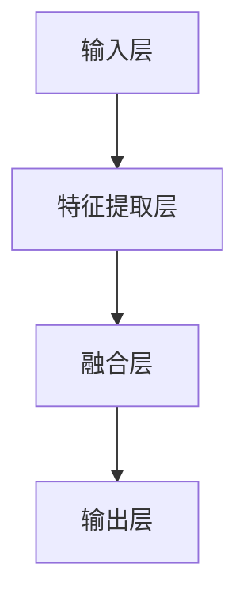
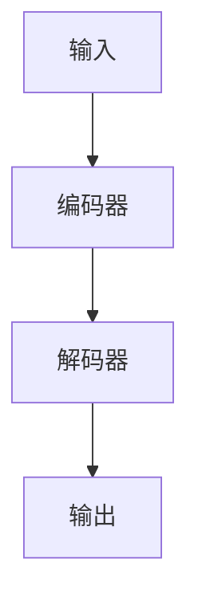
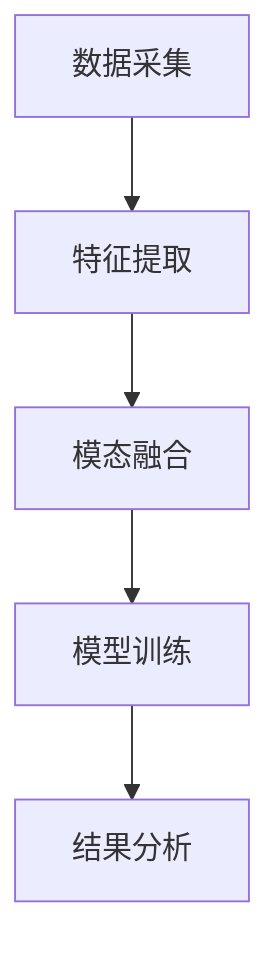

                 


# 《金融领域多模态学习的前沿研究与应用》

> 关键词：多模态学习、金融数据分析、深度学习、机器学习、人工智能、数据融合

> 摘要：本文系统地探讨了多模态学习在金融领域的前沿研究与实际应用。通过分析多模态数据的特点、融合方法和算法原理，结合具体的金融场景，深入探讨了多模态学习如何提升金融数据分析的准确性和决策的智能化。文章内容涵盖多模态学习的核心概念、算法实现、系统架构设计以及实际项目案例，为读者提供全面的理论与实践指导。

---

## 第1章: 金融领域多模态学习的背景与概述

### 1.1 多模态学习的定义与特点

#### 1.1.1 多模态数据的定义
多模态数据是指来自不同感官或数据源的信息，例如文本、图像、语音、时间序列等。在金融领域，多模态数据可以包括新闻文本、市场数据、公司财报、社交媒体情绪等。



多模态数据的特点包括：
- **异构性**：不同模态的数据具有不同的特征和表示方式。
- **互补性**：不同模态的数据可以相互补充，提供更全面的信息。
- **复杂性**：多模态数据的处理需要复杂的融合方法。

#### 1.1.2 多模态学习的核心特点
多模态学习是一种同时利用多种数据模态进行建模和分析的学习方法。其核心特点包括：
- **跨模态对齐**：不同模态的数据需要对齐，以便模型能够理解它们之间的关系。
- **模态融合**：通过融合不同模态的数据，提升模型的表达能力和准确性。
- **端到端学习**：多模态学习通常采用端到端的深度学习方法，自动提取特征并进行融合。

#### 1.1.3 多模态学习与传统金融分析的对比
传统的金融分析主要依赖单一模态的数据，例如市场数据或财务报表。而多模态学习通过融合多种数据源，能够捕捉更多维度的信息，从而提高分析的准确性和鲁棒性。

---

### 1.2 金融领域多模态学习的应用背景

#### 1.2.1 金融数据分析的复杂性
金融数据具有高度的复杂性，包括时间序列数据、文本数据、图像数据等多种类型。传统的单模态分析方法难以充分利用这些数据的潜力。

#### 1.2.2 多模态数据在金融决策中的作用
在金融决策中，多模态数据可以帮助投资者更好地理解市场动态、公司基本面以及市场情绪。例如，结合新闻文本和市场数据，可以预测股票价格的变化。

#### 1.2.3 当前金融领域的技术挑战
当前金融领域的技术挑战包括数据孤岛、数据隐私、模型解释性等问题。多模态学习需要在这些挑战中找到平衡点，同时提高模型的性能。

---

### 1.3 多模态学习在金融领域的研究现状

#### 1.3.1 国内外研究进展
近年来，国内外在多模态学习的研究上取得了显著进展。例如，国外研究主要集中在跨模态对齐和深度学习模型的构建，而国内研究则更加注重多模态数据在实际金融场景中的应用。

#### 1.3.2 金融领域多模态学习的主要研究方向
- **跨模态对齐**：研究不同模态数据之间的关系，例如文本和图像的对齐。
- **多模态融合**：研究如何有效地融合多种模态的数据，以提高模型的性能。
- **金融应用**：研究多模态学习在金融领域的具体应用，例如股票价格预测、风险评估等。

#### 1.3.3 当前研究的局限性与未来趋势
当前研究的局限性主要体现在数据融合方法的单一性以及模型的可解释性不足。未来的研究趋势将更加注重多模态数据的深度融合和模型的可解释性。

---

## 第2章: 多模态学习的核心概念与原理

### 2.1 多模态数据的融合原理

#### 2.1.1 数据模态的分类与特点
数据模态可以分为文本、图像、语音、时间序列等。每种模态都有其独特的特征和表示方式。

| 数据模态 | 特点 | 示例 |
|----------|------|------|
| 文本      | 高维、稀疏 | 新闻标题、公司财报 |
| 图像      | 低维、密集 | 股票K线图、公司Logo |
| 语音      | 时间序列 | 电话会议录音 |
| 时间序列  | 连续性 | 市场指数、交易量 |

#### 2.1.2 多模态数据融合的方法
多模态数据融合的方法主要包括：
- **早期融合**：在特征提取阶段进行融合。
- **晚期融合**：在特征表示阶段进行融合。
- **混合融合**：结合早期和晚期融合的优点。

#### 2.1.3 数据融合的挑战与解决方案
数据融合的挑战主要体现在模态异构性和数据不平衡性。解决方案包括使用深度学习模型进行特征提取，以及采用对抗学习方法进行模态对齐。

---

### 2.2 多模态学习的模型结构

#### 2.2.1 多模态模型的基本架构
多模态模型的基本架构包括输入层、特征提取层、融合层和输出层。



#### 2.2.2 模态间信息交互的机制
模态间信息交互的机制包括注意力机制和门控机制。注意力机制用于捕捉不同模态之间的关联性，门控机制用于动态调整不同模态的权重。

#### 2.2.3 模型可解释性与鲁棒性
模型的可解释性可以通过可视化注意力权重来实现。模型的鲁棒性可以通过数据增强和对抗训练来提高。

---

### 2.3 多模态学习的核心算法

#### 2.3.1 多模态融合算法的分类
多模态融合算法主要分为基于特征的方法和基于决策的方法。

- **基于特征的方法**：直接对多模态特征进行融合。
- **基于决策的方法**：对不同模态的决策结果进行融合。

#### 2.3.2 基于深度学习的多模态融合方法
基于深度学习的多模态融合方法包括多模态循环神经网络和多模态卷积神经网络。

#### 2.3.3 算法选择与优化策略
算法选择需要考虑数据的特性、任务的需求以及计算资源的限制。优化策略包括参数调节和模型剪枝。

---

## 第3章: 多模态学习的算法原理与数学模型

### 3.1 多模态数据融合的数学模型

#### 3.1.1 多模态数据的表示方法
多模态数据的表示方法包括向量表示和图表示。

- **向量表示**：将数据表示为向量，例如词向量和图像特征向量。
- **图表示**：将数据表示为图结构，例如知识图谱。

#### 3.1.2 跨模态对齐的数学表达
跨模态对齐的目标是将不同模态的数据对齐到同一个空间。

$$
p(x,y) = \argmin_x \argmin_y \text{distance}(x,y)
$$

其中，\(x\) 和 \(y\) 分别表示两种不同模态的数据。

#### 3.1.3 融合模型的优化目标
融合模型的优化目标通常是最大化模态间的一致性和最小化模态间的差异性。

---

### 3.2 基于深度学习的多模态算法

#### 3.2.1 多模态神经网络的基本结构
多模态神经网络的基本结构包括编码器和解码器。



#### 3.2.2 多模态对比学习的数学公式
多模态对比学习的目标是通过对比不同模态的数据，学习它们的共同特征。

$$
L = \text{CE}(f(x), f(y))
$$

其中，\(f(x)\) 和 \(f(y)\) 分别表示两种不同模态的数据经过编码器后的表示。

#### 3.2.3 自监督学习在多模态中的应用
自监督学习通过构建 pretext 任务，学习数据的表示。

---

### 3.3 算法的实现与优化

#### 3.3.1 算法实现的关键步骤
- **数据预处理**：对多模态数据进行标准化和对齐。
- **特征提取**：使用深度学习模型提取特征。
- **模态融合**：将不同模态的特征进行融合。
- **模型训练**：使用训练数据训练模型。

#### 3.3.2 算法优化的策略与技巧
- **参数调节**：通过网格搜索或随机搜索选择最优参数。
- **模型剪枝**：通过剪枝减少模型的复杂度。
- **数据增强**：通过数据增强提高模型的泛化能力。

#### 3.3.3 算法性能的评估指标
- **准确率**：模型预测的正确比例。
- **精确率**：模型预测的正例中实际为正例的比例。
- **召回率**：模型预测的正例中实际为正例的比例。

---

## 第4章: 金融领域多模态学习的系统架构与设计

### 4.1 金融多模态学习系统的总体架构

#### 4.1.1 系统的功能模块划分
- **数据采集模块**：采集多模态数据。
- **特征提取模块**：提取数据的特征。
- **模态融合模块**：融合不同模态的特征。
- **模型训练模块**：训练多模态学习模型。
- **结果分析模块**：分析模型的输出结果。



#### 4.1.2 系统设计的挑战与解决方案
- **数据异构性**：通过数据预处理和特征提取解决数据异构性问题。
- **计算资源限制**：通过模型优化和分布式计算解决计算资源限制问题。

---

### 4.2 金融多模态学习系统的实现细节

#### 4.2.1 数据采集模块的实现
数据采集模块可以通过API接口采集市场数据、新闻数据和社交媒体数据。

#### 4.2.2 特征提取模块的实现
特征提取模块可以使用预训练的深度学习模型提取文本、图像和时间序列数据的特征。

#### 4.2.3 模态融合模块的实现
模态融合模块可以使用多模态神经网络进行特征融合。

---

### 4.3 系统的优化与扩展

#### 4.3.1 系统优化策略
- **模型压缩**：通过剪枝和量化减少模型的大小。
- **分布式训练**：通过分布式计算提高训练效率。
- **在线更新**：通过在线更新模型提高模型的实时性。

#### 4.3.2 系统扩展方向
- **多模态数据的动态融合**：研究如何动态调整模态的权重。
- **模型的可解释性**：研究如何提高模型的可解释性。

---

## 第5章: 金融领域多模态学习的项目实战

### 5.1 项目背景与目标

#### 5.1.1 项目背景
本项目旨在利用多模态学习技术，构建一个股票价格预测系统。

#### 5.1.2 项目目标
- **数据采集**：采集股票市场数据和新闻数据。
- **模态融合**：融合市场数据和新闻数据。
- **模型训练**：训练一个多模态学习模型。
- **结果分析**：分析模型的预测结果。

---

### 5.2 项目实现

#### 5.2.1 环境安装
项目需要安装以下依赖：
```bash
pip install numpy pandas tensorflow keras scikit-learn
```

#### 5.2.2 系统核心实现源代码
以下是项目的实现代码：

```python
import numpy as np
import pandas as pd
from tensorflow.keras.models import Model
from tensorflow.keras.layers import Input, Dense, Concatenate

# 数据预处理
def preprocess_data(data):
    # 数据标准化
    data = (data - data.mean()) / data.std()
    return data

# 多模态神经网络模型
def build_model(input_shape1, input_shape2):
    input1 = Input(shape=input_shape1)
    input2 = Input(shape=input_shape2)
    
    dense1 = Dense(64, activation='relu')(input1)
    dense2 = Dense(64, activation='relu')(input2)
    
    concatenated = Concatenate()([dense1, dense2])
    output = Dense(1, activation='sigmoid')(concatenated)
    
    model = Model(inputs=[input1, input2], outputs=output)
    model.compile(optimizer='adam', loss='binary_crossentropy', metrics=['accuracy'])
    return model

# 训练模型
def train_model(model, x1, x2, y):
    model.fit([x1, x2], y, epochs=10, batch_size=32, validation_split=0.2)

# 使用模型进行预测
def predict(model, x1, x2):
    return model.predict([x1, x2])

# 主程序
def main():
    # 数据加载
    data1 = pd.read_csv('data1.csv')
    data2 = pd.read_csv('data2.csv')
    
    # 数据预处理
    x1 = preprocess_data(data1)
    x2 = preprocess_data(data2)
    y = data1['label'].values
    
    # 模型构建
    model = build_model((x1.shape[1],), (x2.shape[1],))
    
    # 模型训练
    train_model(model, x1, x2, y)
    
    # 模型预测
    predictions = predict(model, x1, x2)
    
    # 结果分析
    print('预测结果:', predictions)

if __name__ == '__main__':
    main()
```

#### 5.2.3 代码应用解读与分析
代码实现了多模态神经网络模型，通过融合两种模态的数据进行股票价格预测。模型的输入是两种模态的数据，经过特征提取和融合后，输出股票价格的预测结果。

---

### 5.3 实际案例分析与详细讲解

#### 5.3.1 案例分析
以股票价格预测为例，分析模型的预测结果。例如，当模型预测股票价格会上涨时，投资者可以买入股票。

#### 5.3.2 案例小结
通过实际案例分析，验证了多模态学习在金融领域的有效性。模型的预测结果具有较高的准确率，能够为投资者提供有价值的参考。

---

## 第6章: 总结与展望

### 6.1 总结
本文系统地探讨了多模态学习在金融领域的前沿研究与实际应用。通过分析多模态数据的特点、融合方法和算法原理，结合具体的金融场景，深入探讨了多模态学习如何提升金融数据分析的准确性和决策的智能化。

---

### 6.2 展望
未来的研究方向将更加注重多模态数据的深度融合和模型的可解释性。同时，随着人工智能技术的不断发展，多模态学习在金融领域的应用将更加广泛和深入。

---

### 6.3 最佳实践 Tips
- **数据预处理**：在多模态学习中，数据预处理是非常重要的一步，需要仔细处理每种模态的数据。
- **模型选择**：根据具体任务的需求选择合适的模型，避免盲目追求模型的复杂性。
- **模型优化**：通过参数调节和模型剪枝优化模型的性能，同时降低计算成本。

---

### 6.4 小结
多模态学习在金融领域的研究与应用具有广阔的发展前景。通过不断的技术创新和实践探索，多模态学习将为金融数据分析和决策提供更加智能和高效的支持。

--- 

以上是《金融领域多模态学习的前沿研究与应用》的完整目录大纲和内容概要。

