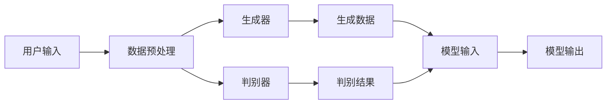
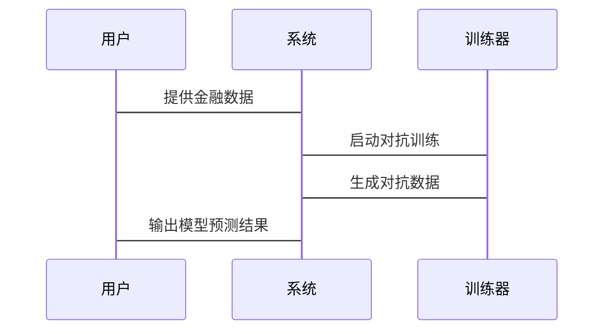

                 


# 《金融领域对抗学习在模型鲁棒性增强中的应用》

> 关键词：金融领域，对抗学习，模型鲁棒性，机器学习，风险管理

> 摘要：本文探讨了对抗学习在金融领域的应用，特别是如何通过对抗训练增强模型的鲁棒性。文章从基础概念、数学模型、系统架构到项目实战，全面分析了对抗学习在金融数据处理、风险评估和欺诈检测中的潜力和挑战。

---

## 第1章: 对抗学习的基本概念与背景

### 1.1 对抗学习的定义与核心概念

#### 1.1.1 对抗学习的定义
对抗学习是一种机器学习技术，通过两个模型（生成器和判别器）的对抗训练来生成逼真数据或区分真实数据。这种竞争机制使模型在不断对抗中提升性能。

#### 1.1.2 对抗学习的核心要素
- **生成器（Generator）**：试图生成与真实数据相似的数据。
- **判别器（Discriminator）**：识别数据是否为真实数据。
- **损失函数**：定义生成器和判别器的优化目标。
- **对抗训练**：通过交替优化生成器和判别器参数，使生成器欺骗判别器。

#### 1.1.3 对抗学习与传统机器学习的对比
| 特性 | 传统机器学习 | 对抗学习 |
|------|---------------|----------|
| 数据需求 | 需要大量标注数据 | 可以利用未标注数据 |
| 模型训练 | 单一模型优化 | 多模型对抗优化 |
| 模型性能 | 可能过拟合训练数据 | 提高模型泛化能力 |

### 1.2 对抗学习在金融领域的应用背景

#### 1.2.1 金融领域的数据特点
- **数据稀疏性**：某些金融数据样本较少。
- **数据噪声**：金融数据中可能存在异常值。
- **数据不平衡**：如欺诈交易比例低。

#### 1.2.2 金融模型的鲁棒性需求
- **准确性**：在不同市场条件下准确预测。
- **稳定性**：在数据分布变化时保持性能。
- **抗干扰性**：抵抗噪声或恶意数据的影响。

#### 1.2.3 对抗学习在金融中的潜在价值
- 提高模型的泛化能力。
- 增强模型对异常数据的鲁棒性。
- 降低模型在数据分布偏移时的性能下降。

### 1.3 对抗学习与模型鲁棒性的关系

#### 1.3.1 对抗训练的基本原理
通过生成对抗网络（GAN），生成器和判别器在对抗中不断优化，使生成器生成的数据更接近真实数据分布，从而增强判别器的区分能力。

#### 1.3.2 对抗训练如何增强模型鲁棒性
- **数据增强**：生成更多样化的数据，提高模型的泛化能力。
- **对抗训练**：通过对抗迫使模型学习数据的深层特征，增强模型的鲁棒性。
- **防御攻击**：对抗学习可以用于防御对抗攻击，提高模型的安全性。

#### 1.3.3 对抗学习在金融模型中的应用场景
- **金融时间序列预测**：对抗学习可以生成更多样化的数据，提高预测模型的鲁棒性。
- **金融风险评估**：对抗学习可以识别和处理异常数据，提高风险评估模型的准确性。
- **金融欺诈检测**：对抗学习可以识别潜在的欺诈模式，增强检测系统的鲁棒性。

---

## 第2章: 对抗学习的核心概念与数学模型

### 2.1 对抗学习的核心原理

#### 2.1.1 对抗训练的基本框架
对抗训练包括生成器和判别器两个部分，生成器试图生成与真实数据相似的数据，而判别器则试图区分真实数据和生成数据。

#### 2.1.2 对抗网络的组成部分
- **生成器**：通常使用深度神经网络，输入随机噪声，生成与真实数据分布相似的样本。
- **判别器**：同样使用深度神经网络，输入数据（真实或生成），输出判别结果。

#### 2.1.3 对抗学习的目标函数
生成器的目标是最小化判别器输出为假的概率，而判别器的目标是最大化区分真实数据和生成数据的能力。

### 2.2 对抗学习的数学模型

#### 2.2.1 生成对抗网络（GAN）的数学公式
- **生成器的损失函数**：$\mathcal{L}_G = -\mathbb{E}_{z}[\log(1 - D(G(z)))]$
- **判别器的损失函数**：$\mathcal{L}_D = -\mathbb{E}_{x}[\log(D(x))] - \mathbb{E}_{z}[\log(1 - D(G(z)))]$

#### 2.2.2 对抗训练的优化过程
对抗训练通常采用交替优化策略，先优化生成器，再优化判别器，直到达到平衡状态。

#### 2.2.3 对抗学习的收敛性分析
对抗训练可能存在收敛困难，通常使用Wasserstein GAN等变体来解决收敛问题。

### 2.3 对抗学习的核心算法

#### 2.3.1 GAN的变体
- **Wasserstein GAN（WGAN）**：使用Wasserstein距离作为损失函数，改善模型的稳定性。
- **CycleGAN**：用于无监督学习，无需配对数据。
- **Denoising GAN（DCGAN）**：用于去噪任务。

#### 2.3.2 对抗训练的优化策略
- **学习率调整**：使用Adam优化器，适当调整学习率。
- **对抗平衡**：避免生成器或判别器一方过于强大，保持两者平衡。
- **正则化技术**：如谱归一化，防止判别器过于强大。

---

## 第3章: 对抗学习在金融领域的应用现状

### 3.1 金融领域的数据挑战

#### 3.1.1 数据不平衡问题
金融数据中，正常交易远多于异常交易，导致模型难以有效识别异常。

#### 3.1.2 数据噪声与异常值
金融数据中可能存在噪声和异常值，影响模型的性能。

#### 3.1.3 数据分布偏移
模型在实际应用中可能面临数据分布的变化，导致性能下降。

### 3.2 对抗学习在金融模型中的应用

#### 3.2.1 金融时间序列预测
- **问题背景**：金融时间序列数据具有复杂性，传统模型可能表现不佳。
- **对抗学习的应用**：生成更多样化的数据，提高预测模型的鲁棒性。

#### 3.2.2 金融风险评估
- **问题背景**：风险评估需要准确识别高风险客户，对抗学习可以识别潜在风险。
- **对抗学习的应用**：通过对抗训练，提高模型对异常数据的鲁棒性。

#### 3.2.3 金融欺诈检测
- **问题背景**：欺诈交易比例低，传统模型可能漏检。
- **对抗学习的应用**：识别潜在的欺诈模式，增强检测系统的鲁棒性。

---

## 第4章: 对抗学习在金融领域的系统架构设计

### 4.1 问题场景介绍

#### 4.1.1 金融风险管理
- **目标**：评估客户的信用风险。
- **挑战**：数据分布偏移，模型容易过拟合。

#### 4.1.2 金融欺诈检测
- **目标**：识别欺诈交易。
- **挑战**：数据不平衡，模型容易误判。

### 4.2 系统功能设计

#### 4.2.1 数据预处理
- **数据清洗**：去除噪声和异常值。
- **数据增强**：通过对抗生成更多样化的数据。

#### 4.2.2 对抗训练模块
- **生成器**：生成与真实数据相似的样本。
- **判别器**：区分真实数据和生成数据。

#### 4.2.3 模型优化
- **优化目标**：提高模型的鲁棒性和准确性。
- **优化策略**：结合对抗训练和正则化技术。

### 4.3 系统架构设计

#### 4.3.1 系统架构图


#### 4.3.2 系统接口设计
- **输入接口**：接收原始金融数据。
- **输出接口**：输出模型预测结果和对抗训练数据。

#### 4.3.3 系统交互流程


---

## 第5章: 对抗学习在金融领域的项目实战

### 5.1 项目介绍

#### 5.1.1 项目目标
通过对抗学习提高金融模型的鲁棒性，增强模型的泛化能力和抗干扰能力。

#### 5.1.2 项目环境
- **硬件**：高性能计算服务器。
- **软件**：Python 3.8，TensorFlow 2.4，Keras 2.4.3。

### 5.2 系统核心实现

#### 5.2.1 对抗训练代码实现
```python
import tensorflow as tf
from tensorflow import keras

# 定义生成器
def generator():
    model = keras.Sequential([
        keras.layers.Dense(256, activation='relu'),
        keras.layers.Dense(128, activation='relu'),
        keras.layers.Dense(1, activation='sigmoid')
    ])
    return model

# 定义判别器
def discriminator():
    model = keras.Sequential([
        keras.layers.Dense(128, activation='relu'),
        keras.layers.Dense(64, activation='relu'),
        keras.layers.Dense(1, activation='sigmoid')
    ])
    return model

# 定义对抗训练
def对抗训练(生成器, 判别器):
    判别器.compile(loss='binary_crossentropy', optimizer='adam', metrics=['accuracy'])
    生成器.compile(loss='binary_crossentropy', optimizer='adam')

    # 生成器输入
    z = keras.Input(shape=(1,))
    生成器输出 = 生成器(z)

    # 判别器输入
    判别器输入_real = keras.Input(shape=(1,))
    判别器输入_fake = keras.Input(shape=(1,))

    判别器输出_real = 判别器(判别器输入_real)
    判别器输出_fake = 判别器(判别器输入_fake)

    # 训练生成器
    判别器.trainable = False
    判别器输出_fake = 判别器(生成器(z))
    生成器_loss = keras.losses.binary_crossentropy( tf.ones_like(判别器输出_fake), 判别器输出_fake)

    # 训练判别器
    判别器.trainable = True
    real_labels = tf.ones_like(判别器输出_real)
    fake_labels = tf.zeros_like(判别器输出_fake)
    判别器_loss = keras.losses.binary_crossentropy(real_labels, 判别器输出_real) + keras.losses.binary_crossentropy(fake_labels, 判别器输出_fake)

    # 优化器
    optimizer_gen = keras.optimizers.Adam(learning_rate=0.0002)
    optimizer_disc = keras.optimizers.Adam(learning_rate=0.0002)

    # 训练循环
    for _ in range(epochs):
        # 训练生成器
        判别器.trainable = False
        判别器_loss_gen = model.fit(z, tf.ones_like(生成器输出), epochs=1, verbose=0)
        # 训练判别器
        判别器.trainable = True
        判别器_loss_disc = model.fit([real_data, fake_data], [real_labels, fake_labels], epochs=1, verbose=0)
```

#### 5.2.2 对抗训练的数学模型
- **生成器的损失函数**：$\mathcal{L}_G = -\mathbb{E}_{z}[\log(1 - D(G(z)))]$
- **判别器的损失函数**：$\mathcal{L}_D = -\mathbb{E}_{x}[\log(D(x))] - \mathbb{E}_{z}[\log(1 - D(G(z)))]$

#### 5.2.3 项目实现的详细步骤
1. **数据准备**：收集和预处理金融数据。
2. **模型定义**：定义生成器和判别器的神经网络结构。
3. **对抗训练**：实现生成器和判别器的交替优化。
4. **模型评估**：评估模型的鲁棒性和准确性。

### 5.3 项目小结

#### 5.3.1 项目实现的关键点
- 对抗训练的数学模型和优化策略。
- 生成器和判别器的网络结构设计。
- 数据预处理和对抗训练的数据生成。

#### 5.3.2 项目实现的意义
- 提高金融模型的鲁棒性。
- 增强模型的泛化能力。
- 为金融领域的对抗学习应用提供参考。

---

## 第6章: 对抗学习在金融领域的总结与展望

### 6.1 总结

#### 6.1.1 对抗学习的核心价值
- 提高模型的鲁棒性。
- 增强模型的泛化能力。
- 降低模型对数据分布偏移的敏感性。

#### 6.1.2 本文的主要工作
- 探讨了对抗学习在金融领域的应用。
- 分析了对抗学习在模型鲁棒性增强中的潜力。
- 提出了对抗学习在金融领域的系统架构设计。

### 6.2 展望

#### 6.2.1 当前的挑战
- 对抗训练的收敛性问题。
- 对抗学习在金融领域的适用性问题。
- 对抗训练的计算成本问题。

#### 6.2.2 未来的方向
- 研究更高效的对抗训练算法。
- 探索对抗学习在更多金融场景中的应用。
- 提高对抗学习的计算效率和模型解释性。

### 6.3 最佳实践 Tips

#### 6.3.1 对抗学习的注意事项
- 数据预处理：确保数据质量，去除噪声和异常值。
- 模型选择：选择合适的生成器和判别器结构。
- 超参数调整：合理设置学习率和批量大小。

#### 6.3.2 对抗学习的误区
- 过度依赖对抗训练，忽视数据质量。
- 忽略模型的可解释性，导致难以诊断问题。
- 未考虑计算成本，导致训练时间过长。

#### 6.3.3 对抗学习的未来研究方向
- 研究对抗学习与其他技术的结合，如强化学习和图神经网络。
- 探索对抗学习在解释性模型中的应用，提高模型的透明度。
- 研究对抗学习在多模态数据中的应用，增强模型的泛化能力。

---

## 结语

对抗学习在金融领域的应用前景广阔，通过对抗训练可以显著提高模型的鲁棒性和准确性。本文从理论基础到实际应用，详细探讨了对抗学习在金融领域的潜力和挑战，并提出了系统的解决方案。未来，随着技术的不断发展，对抗学习将在金融领域发挥更大的作用。

--- 

**END**

