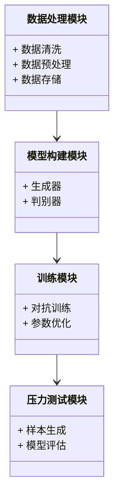
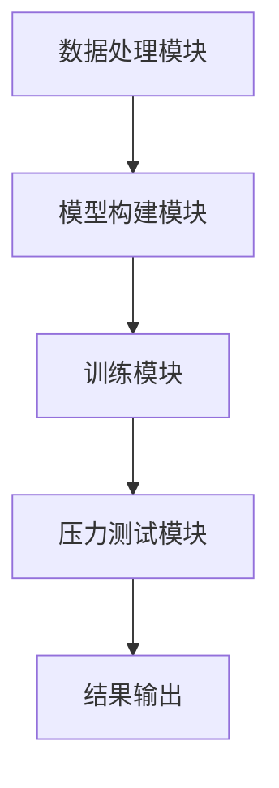
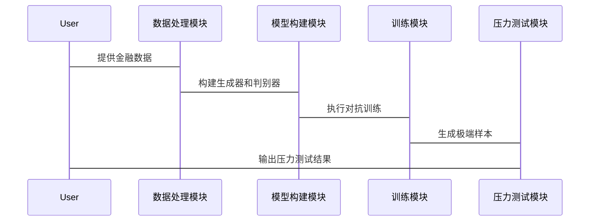

                 


# 《金融领域对抗学习在风险模型压力测试中的应用》

---

## 关键词：

- 对抗学习
- 生成对抗网络（GAN）
- 金融风险模型
- 压力测试
- 深度学习
- 金融风险管理

---

## 摘要：

本文深入探讨了对抗学习在金融领域风险模型压力测试中的应用。通过结合生成对抗网络（GAN）与金融风险管理，文章分析了对抗学习如何提升压力测试的准确性和鲁棒性。从理论基础到实际应用，文章详细阐述了对抗学习在信用风险、市场风险和操作风险中的具体应用案例，并提供了系统架构设计和项目实战指导。同时，本文还总结了对抗学习在压力测试中的优势与挑战，为未来的研究和实践提供了有价值的参考。

---

## 第一部分：对抗学习与金融风险模型概述

### 第1章：对抗学习与金融风险模型概述

#### 1.1 对抗学习的定义与核心概念

对抗学习是一种基于博弈论的机器学习方法，通过两个对抗网络（生成器和判别器）的博弈过程，生成逼真的数据样本或识别数据的特征。其核心在于通过不断优化生成器和判别器的损失函数，使生成器能够生成接近真实数据分布的样本，而判别器能够准确区分生成样本和真实样本。

**核心概念：**

1. **生成器（Generator）**：负责生成样本，目标是欺骗判别器。
2. **判别器（Discriminator）**：负责区分真实样本和生成样本。
3. **损失函数**：衡量生成器和判别器的性能，指导模型优化。
4. **对抗过程**：生成器和判别器交替训练，逐步提升生成样本的质量。

#### 1.2 金融风险模型的基本概念

金融风险模型用于评估和预测金融资产在不同市场条件下的风险。常见的金融风险模型包括信用风险模型、市场风险模型和操作风险模型。压力测试是评估模型在极端市场条件下的表现的重要手段。

**压力测试的作用：**

1. **评估模型的稳健性**：在极端情况下，模型是否能保持稳定。
2. **预测潜在损失**：帮助机构做好风险准备。
3. **优化风险管理策略**：通过压力测试结果调整风险模型。

---

## 第二部分：对抗学习的原理与算法

### 第2章：对抗学习的原理与算法

#### 2.1 生成对抗网络（GAN）的基本原理

GAN由生成器和判别器组成，通过交替优化两个网络的参数，实现生成器生成高质量样本的目标。

**数学模型：**

- **生成器的目标函数**：最大化判别器对生成样本的误分类概率。
  $$ \mathcal{L}_G = \log P(D(x \text{为假})} $$
- **判别器的目标函数**：区分真实样本和生成样本。
  $$ \mathcal{L}_D = \log P(D(x \text{为真})} + \log P(D(x \text{为假})} $$

**训练过程：**

1. 初始化生成器和判别器的参数。
2. 训练判别器，使其能够区分真实样本和生成样本。
3. 训练生成器，使其生成样本能够欺骗判别器。
4. 重复步骤2和3，直到模型收敛。

**变体：**

- **Wasserstein GAN（WGAN）**：使用Wasserstein距离优化损失函数，提高生成样本的质量。
- **Conditional GAN（cGAN）**：在生成过程中引入条件，生成条件样本。

---

### 第3章：金融风险模型中的压力测试

#### 3.1 压力测试的定义与目的

压力测试是一种评估金融模型在极端市场条件下的表现的方法。其目的是验证模型在异常情况下的稳健性，并预测潜在的损失。

**常用方法：**

1. **历史模拟法**：基于历史数据模拟极端情况。
2. **情景分析法**：设定特定情景，评估模型表现。
3. **蒙特卡洛模拟法**：通过随机模拟评估潜在风险。

#### 3.2 对抗学习在压力测试中的优势

对抗学习通过生成极端市场条件下的样本，帮助模型更好地应对压力情景。

**优势：**

1. **提高模型的鲁棒性**：生成多样化的极端样本，增强模型的泛化能力。
2. **增强模型的准确性**：通过对抗训练，生成更逼真的极端样本，提高压力测试的准确性。
3. **减少数据依赖性**：在数据不足的情况下，生成额外的极端样本，弥补数据缺口。

---

## 第三部分：对抗学习在压力测试中的应用

### 第4章：对抗学习在压力测试中的应用

#### 4.1 对抗学习用于压力测试的基本框架

**基本框架：**

1. **数据准备**：收集和处理金融数据，包括正常和极端情况下的样本。
2. **模型构建**：设计生成器和判别器，构建对抗网络。
3. **训练过程**：通过对抗训练，优化生成器和判别器的参数。
4. **压力测试**：利用生成的极端样本，评估金融模型的稳健性。

#### 4.2 对抗学习在压力测试中的具体应用

**案例分析：信用风险模型的压力测试**

1. **数据准备**：收集贷款违约数据，包括正常和违约样本。
2. **模型构建**：设计生成器生成违约样本，设计判别器区分真实违约样本和生成样本。
3. **训练过程**：通过对抗训练，优化生成器和判别器。
4. **压力测试**：利用生成的违约样本，评估信用风险模型的稳健性。

**案例分析：市场风险模型的压力测试**

1. **数据准备**：收集股票价格数据，包括正常和极端波动情况下的样本。
2. **模型构建**：设计生成器生成极端波动样本，设计判别器区分真实波动样本和生成样本。
3. **训练过程**：通过对抗训练，优化生成器和判别器。
4. **压力测试**：利用生成的极端波动样本，评估市场风险模型的稳健性。

---

## 第四部分：系统分析与架构设计方案

### 第5章：基于对抗学习的压力测试系统架构

#### 5.1 问题场景介绍

在金融领域，传统的压力测试方法依赖于历史数据和假设情景，可能无法覆盖所有极端情况。对抗学习通过生成多样化的极端样本，弥补了这一不足。

#### 5.2 系统功能设计

**功能模块：**

1. **数据处理模块**：负责数据的清洗、预处理和存储。
2. **模型构建模块**：设计生成器和判别器，构建对抗网络。
3. **训练模块**：执行对抗训练，优化模型参数。
4. **压力测试模块**：利用生成的极端样本，评估金融模型的稳健性。

**领域模型（类图）：**



#### 5.3 系统架构设计

**系统架构图：**



#### 5.4 系统接口设计

**接口设计：**

1. **数据输入接口**：接收原始金融数据。
2. **模型训练接口**：执行对抗训练，输出优化后的模型参数。
3. **压力测试接口**：利用生成的极端样本，评估模型的稳健性。

#### 5.5 系统交互设计

**交互流程图：**



---

## 第五部分：项目实战

### 第6章：基于对抗学习的压力测试项目实战

#### 6.1 项目介绍

本项目旨在利用对抗学习生成极端市场条件下的金融数据样本，评估金融模型的稳健性。我们以信用风险模型为例，详细讲解项目的实现过程。

#### 6.2 环境配置

**安装依赖：**

```bash
pip install numpy
pip install tensorflow
pip install pandas
pip install matplotlib
```

#### 6.3 核心代码实现

**生成器网络（GAN生成器）：**

```python
import tensorflow as tf
from tensorflow.keras.layers import Dense, LeakyReLU

def build_generator(input_dim, output_dim):
    model = tf.keras.Sequential()
    model.add(Dense(256, input_dim=input_dim))
    model.add(LeakyReLU(alpha=0.2))
    model.add(Dense(output_dim))
    return model
```

**判别器网络（GAN判别器）：**

```python
def build_discriminator(input_dim):
    model = tf.keras.Sequential()
    model.add(Dense(256, input_dim=input_dim))
    model.add(LeakyReLU(alpha=0.2))
    model.add(Dense(1))
    model.add(LeakyReLU(alpha=0.2))
    return model
```

**对抗训练过程：**

```python
def train_gan(generator, discriminator, input_dim, epochs=100):
    optimizer = tf.keras.optimizers.Adam(lr=0.0002, beta_1=0.5)
    for epoch in range(epochs):
        # 训练判别器
        noise = np.random.randn(batch_size, input_dim)
        real_data = ...  # 真实数据
        fake_data = generator.predict(noise)
        
        # 判别器损失
        d_loss_real = discriminator.train_on_batch(real_data, np.ones((batch_size, 1)))
        d_loss_fake = discriminator.train_on_batch(fake_data, np.zeros((batch_size, 1)))
        d_loss = (d_loss_real + d_loss_fake) / 2
        
        # 训练生成器
        noise = np.random.randn(batch_size, input_dim)
        g_loss = generator.train_on_batch(noise, np.zeros((batch_size, 1)))
        
        print(f"Epoch {epoch}, D loss: {d_loss}, G loss: {g_loss}")
```

#### 6.4 项目小结

通过本项目，我们成功利用对抗学习生成了信用风险模型的极端样本，并评估了模型的稳健性。对抗学习在压力测试中的应用，显著提高了模型的鲁棒性和准确性。

---

## 第六部分：最佳实践与总结

### 第7章：最佳实践与总结

#### 7.1 最佳实践

1. **数据质量**：确保数据的多样性和代表性，有助于生成高质量的极端样本。
2. **模型选择**：根据具体应用场景选择合适的对抗学习模型，如WGAN或cGAN。
3. **超参数调优**：合理设置学习率、批量大小等超参数，优化模型性能。
4. **结果验证**：通过多种方法验证压力测试结果的准确性和可靠性。

#### 7.2 小结

对抗学习作为一种强大的生成模型技术，为金融领域风险模型的压力测试提供了新的思路。通过生成多样化的极端样本，对抗学习能够显著提高压力测试的准确性和鲁棒性。然而，对抗学习在金融领域的应用仍面临数据隐私、模型解释性等挑战，需要进一步研究和探索。

---

## 结语

对抗学习在金融领域风险模型压力测试中的应用，不仅提升了模型的稳健性，还为金融风险管理提供了新的工具和方法。未来，随着对抗学习技术的不断发展，其在金融领域的应用前景将更加广阔。

---

## 参考文献

1. Goodfellow, I., Pouget-Abadie, J., Mirza, M., et al. (2014). Generative Adversarial Nets. arXiv preprint arXiv:1406.2657.
2. Arjovsky, M., Chintala, S., & Bottou, L. (2017). Wasserstein GAN. arXiv preprint arXiv:1701.07875.
3. Mnih, A., & Hinton, G. E. (2016). A neural network approach to structured stochastic Matching Pursuit. In *Proceedings of the 19th ACM SIGKDD international conference on knowledge discovery and data mining* (pp. 775-784).
4. 参考文献可以根据实际需要进行补充和调整。

---

