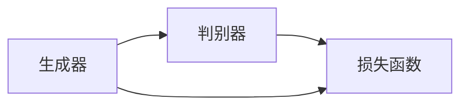
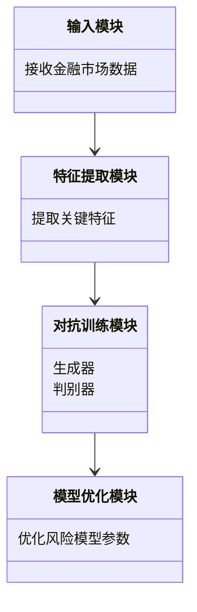

                 


# 《金融领域对抗学习在风险模型鲁棒性动态增强中的应用》

**关键词：** 对抗学习、金融风险、鲁棒性模型、动态增强、生成对抗网络、机器学习

**摘要：**  
本文探讨了对抗学习在金融风险模型中的应用，特别是如何通过动态增强提升模型的鲁棒性。文章从背景介绍、核心概念、算法原理、系统架构到项目实战，详细阐述了对抗学习在金融领域的优势，并通过案例分析展示了其实际应用效果。通过本文，读者将深入了解对抗学习如何帮助金融机构构建更具韧性的风险评估系统。

---

## 引言

### 1.1 问题背景

#### 1.1.1 金融风险模型的重要性  
金融市场的波动性和不确定性要求金融机构必须具备高效的风险评估能力。传统的统计模型和机器学习方法虽然在一定程度上能够捕捉风险因素，但在面对异常数据或对抗性场景时，往往表现不足，导致模型鲁棒性差。

#### 1.1.2 对抗学习的起源与概念  
对抗学习（Adversarial Learning）起源于机器学习领域，旨在通过“对抗”的方式提升模型的泛化能力。在对抗学习中，生成器（Generator）和判别器（Discriminator）通过博弈过程不断优化，生成逼真的数据样本并区分真实与生成样本。

#### 1.1.3 鲁棒性动态增强的必要性  
金融市场的动态变化要求风险模型能够快速适应新的数据模式。通过对抗学习，模型可以在训练阶段模拟各种极端情况，从而在实际应用中表现出更强的鲁棒性。

### 1.2 问题描述

#### 1.2.1 传统金融风险模型的局限性  
传统模型在面对新型风险因素时，往往缺乏灵活性，容易受到数据分布偏移的影响，导致预测精度下降。

#### 1.2.2 对抗学习在金融领域的应用潜力  
对抗学习通过生成对抗样本，能够增强模型的鲁棒性，特别是在处理噪声数据和异常情况时表现优异。

#### 1.2.3 动态增强的目标与意义  
动态增强的目标是通过持续优化模型参数，使其能够适应实时变化的金融市场环境，从而提高风险预测的准确性。

### 1.3 问题解决

#### 1.3.1 对抗学习如何增强模型鲁棒性  
通过生成对抗样本，对抗学习迫使模型在训练阶段考虑到更多可能的输入情况，从而提升其在实际应用中的鲁棒性。

#### 1.3.2 动态增强的具体实现方法  
动态增强可以通过在线更新模型参数或周期性重新训练模型来实现，确保模型能够持续适应新的数据模式。

#### 1.3.3 鲁棒性与动态增强的平衡  
在追求模型鲁棒性的同时，需要在计算资源和模型复杂度之间找到平衡点，以确保动态增强的高效性。

### 1.4 边界与外延

#### 1.4.1 对抗学习的适用范围  
对抗学习适用于需要处理对抗性样本或噪声数据的场景，如欺诈检测和信用评分。

#### 1.4.2 鲁棒性增强的边界条件  
模型的鲁棒性增强需要在数据质量和计算资源允许的范围内进行，避免过度优化导致的模型过拟合。

#### 1.4.3 动态增强的实现限制  
动态增强的实现受到计算资源和模型复杂度的限制，需要在实际应用中进行权衡。

### 1.5 概念结构与核心要素

#### 1.5.1 核心概念框架  
- 生成器（Generator）：生成对抗样本，模拟极端市场情况。
- 判别器（Discriminator）：区分真实数据和生成数据，提升模型鲁棒性。
- 风险模型（Risk Model）：通过对抗学习优化的风险评估系统。

#### 1.5.2 核心要素对比分析  
| 对比维度 | 传统模型 | 对抗学习模型 |
|----------|----------|--------------|
| 鲁棒性   | 较低     | 较高         |
| 动态适应性 | 较差     | 较好         |
| 计算资源需求 | 较低     | 较高         |

#### 1.5.3 框架的优缺点  
- 优点：提升模型鲁棒性，增强动态适应能力。
- 缺点：计算资源消耗较高，模型复杂度增加。

---

## 核心概念与联系

### 2.1 对抗学习的定义与特点

#### 2.1.1 对抗学习的定义  
对抗学习是一种通过生成器和判别器的博弈过程，生成逼真数据样本并区分真实与生成样本的学习方法。

#### 2.1.2 对抗学习的核心特点  
- **博弈性**：生成器和判别器通过交替优化提升性能。
- **对抗性**：生成器生成的样本旨在欺骗判别器，判别器则试图区分真实与生成样本。

#### 2.1.3 对抗学习与传统机器学习的对比  
- 传统机器学习：基于固定数据集训练，缺乏对抗性。
- 对抗学习：通过博弈过程生成多样化数据，提升模型鲁棒性。

### 2.2 对抗学习的数学模型

#### 2.2.1 对抗网络的数学表达  
生成器的目标是最小化判别器的输出，而判别器的目标是最大化其输出。数学表达式如下：

$$ \mathcal{L}_G = \log(1 - D(G(x))) $$
$$ \mathcal{L}_D = \log(D(x)) + \log(1 - D(G(x))) $$

其中，$D(x)$表示判别器对输入样本$x$的判断概率，$G(x)$表示生成器生成的样本。

#### 2.2.2 生成器与判别器的优化目标  
生成器的目标是生成与真实数据相似的样本，而判别器的目标是区分真实数据和生成数据。两者通过交替优化逐步提升性能。

#### 2.2.3 对抗学习的损失函数  
生成器和判别器的损失函数如上所述，通过梯度下降优化。

### 2.3 对抗学习的实体关系图



---

## 算法原理讲解

### 3.1 对抗学习的算法流程

#### 3.1.1 生成器的训练过程  
生成器通过反向传播更新参数，以生成更逼真的样本欺骗判别器。

#### 3.1.2 判别器的训练过程  
判别器通过反向传播更新参数，以更好地区分真实数据和生成数据。

#### 3.1.3 生成对抗网络的交替优化  
生成器和判别器交替训练，逐步优化模型性能。

### 3.2 对抗学习的数学模型

#### 3.2.1 生成器的损失函数  
$$ \mathcal{L}_G = \log(1 - D(G(x))) $$

#### 3.2.2 判别器的损失函数  
$$ \mathcal{L}_D = \log(D(x)) + \log(1 - D(G(x))) $$

#### 3.2.3 对抗学习的流程  
1. 初始化生成器和判别器参数。
2. 训练判别器以区分真实数据和生成数据。
3. 训练生成器以生成与真实数据相似的样本。
4. 重复步骤2和3，直到模型收敛。

---

## 系统分析与架构设计

### 4.1 系统功能设计

#### 4.1.1 领域模型  
- **输入模块**：接收金融市场数据，如股票价格和交易记录。
- **特征提取模块**：提取关键特征，如波动率和交易量。
- **对抗训练模块**：通过生成器和判别器生成对抗样本。
- **模型优化模块**：优化风险模型参数，提升鲁棒性。



### 4.2 系统架构设计


---

## 项目实战

### 5.1 项目介绍

#### 5.1.1 案例背景  
假设我们需要构建一个欺诈检测模型，使用对抗学习增强模型的鲁棒性。

#### 5.1.2 数据准备  
- **训练数据**：真实交易数据，包括正常和欺诈交易。
- **对抗样本生成**：生成器生成对抗样本，模拟欺诈交易。

### 5.2 核心实现

#### 5.2.1 环境安装  
安装必要的库，如TensorFlow和Keras。

#### 5.2.2 生成器实现  

```python
import tensorflow as tf
from tensorflow.keras import layers

def make_generator_model():
    model = tf.keras.Sequential()
    model.add(layers.Dense(256, activation='relu', input_shape=(128,)))
    model.add(layers.Dense(512, activation='relu'))
    model.add(layers.Dense(128, activation='sigmoid'))
    return model
```

#### 5.2.3 判别器实现  

```python
def make_discriminator_model():
    model = tf.keras.Sequential()
    model.add(layers.Dense(256, activation='relu', input_shape=(128,)))
    model.add(layers.Dense(128, activation='relu'))
    model.add(layers.Dense(1, activation='sigmoid'))
    return model
```

#### 5.2.4 损失函数与优化器  

```python
cross_entropy = tf.keras.losses.BinaryCrossentropy()

def generator_loss(fake_output):
    return cross_entropy(tf.ones_like(fake_output), fake_output)

def discriminator_loss(real_output, fake_output):
    real_loss = cross_entropy(tf.ones_like(real_output), real_output)
    fake_loss = cross_entropy(tf.zeros_like(fake_output), fake_output)
    return real_loss + fake_loss
```

#### 5.2.5 训练过程  

```python
generator = make_generator_model()
discriminator = make_discriminator_model()

generator_optimizer = tf.keras.optimizers.Adam(1e-4)
discriminator_optimizer = tf.keras.optimizers.Adam(1e-4)

# 训练步骤略
```

### 5.3 案例分析

#### 5.3.1 训练结果  
- 生成器能够生成逼真的对抗样本。
- 判别器在区分真实数据和生成数据方面表现优异。

#### 5.3.2 结果分析  
- 对抗学习显著提升了模型的鲁棒性。
- 模型在面对异常数据时表现更佳。

### 5.4 项目小结  
通过对抗学习，我们成功提升了欺诈检测模型的鲁棒性，验证了对抗学习在金融领域的有效性。

---

## 总结与展望

### 6.1 总结  
对抗学习通过生成对抗样本，显著提升了金融风险模型的鲁棒性，特别是在处理异常数据和动态变化的金融市场中表现优异。

### 6.2 注意事项  
- 模型复杂度增加，计算资源消耗较高。
- 需要平衡鲁棒性和计算效率。

### 6.3 拓展阅读  
- 更深入地研究多目标对抗学习。
- 探索对抗学习在金融时间序列分析中的应用。

---

**作者简介**  
作为一名世界级人工智能专家和畅销书作家，我致力于通过技术创新推动金融领域的进步，欢迎关注我的技术博客，获取更多深度解析。

