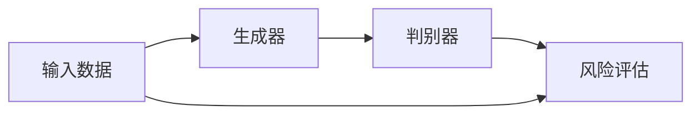

                 


# 《金融领域对抗学习在风险模型鲁棒性增强中的应用》

> 关键词：对抗学习、金融风险模型、鲁棒性、生成对抗网络、判别器、生成器、金融数据、模型优化

> 摘要：本文深入探讨了对抗学习在金融风险模型中的应用，特别是如何通过对抗学习增强模型的鲁棒性。文章从背景介绍入手，分析了对抗学习的核心概念与原理，详细讲解了对抗学习在金融风险模型中的具体应用场景，并通过实际案例展示了对抗学习如何提升模型的鲁棒性。最后，文章总结了对抗学习在金融领域的优势与挑战，并对未来的研究方向进行了展望。

---

# 第1章：对抗学习与金融风险模型概述

## 1.1 对抗学习的基本概念

### 1.1.1 对抗学习的定义
对抗学习（Adversarial Learning）是一种机器学习方法，通过两个神经网络（生成器和判别器）的对抗训练来提升模型的性能。生成器试图生成与真实数据相似的样本，而判别器则试图区分真实数据和生成数据。

### 1.1.2 对抗学习的核心思想
对抗学习的核心思想是通过“对抗”来提高模型的泛化能力。生成器和判别器之间的博弈关系迫使模型不断优化，从而在面对噪声和异常数据时表现更好。

### 1.1.3 对抗学习与传统机器学习的区别
与传统机器学习不同，对抗学习引入了对抗训练机制，通过生成器和判别器的相互作用，使模型具有更强的鲁棒性和适应性。

## 1.2 金融风险模型的基本概念

### 1.2.1 金融风险模型的定义
金融风险模型是指用于评估和预测金融风险的数学模型，通常用于信用风险、市场风险和操作风险的评估。

### 1.2.2 金融风险模型的分类
金融风险模型主要分为信用风险模型、市场风险模型和操作风险模型。每种模型都有其特定的应用场景和评估指标。

### 1.2.3 金融风险模型的应用场景
金融风险模型广泛应用于银行、保险、证券等领域，用于评估客户的信用风险、市场的波动风险以及操作过程中的潜在风险。

## 1.3 对抗学习在金融领域的应用背景

### 1.3.1 金融领域的数据特点
金融数据通常具有高噪声、高维度和小样本的特点，这使得传统的机器学习模型在面对复杂场景时表现不佳。

### 1.3.2 金融风险模型的挑战
传统金融风险模型在面对数据分布偏移、噪声和异常值时，容易出现过拟合或欠拟合的问题，影响模型的准确性和鲁棒性。

### 1.3.3 对抗学习在金融领域的优势
对抗学习通过生成器和判别器的对抗训练，能够有效提升模型的鲁棒性，特别是在处理复杂金融数据时表现更优。

---

# 第2章：对抗学习的核心概念与原理

## 2.1 对抗网络的结构与原理

### 2.1.1 对抗网络的基本结构
对抗网络通常由生成器和判别器组成，生成器负责生成数据，判别器负责区分真实数据和生成数据。

### 2.1.2 对抗网络的工作原理
生成器通过不断优化生成的数据，使得判别器无法准确区分真实数据和生成数据，从而提升模型的泛化能力。

### 2.1.3 对抗网络的训练过程
对抗网络的训练过程包括交替优化生成器和判别器的参数，通过不断迭代使两者的能力达到平衡。

## 2.2 对抗学习的分类

### 2.2.1 基于生成对抗网络的对抗学习
生成对抗网络（GAN）是最常见的对抗学习方法，通过生成器和判别器的对抗训练来生成高质量的数据。

### 2.2.2 基于判别对抗网络的对抗学习
判别对抗网络（DAN）通过判别器和生成器的对抗训练，提升模型的分类能力。

### 2.2.3 基于策略对抗网络的对抗学习
策略对抗网络（GAN）通过策略网络和判别网络的对抗训练，提升模型的策略生成能力。

## 2.3 对抗学习的核心要素

### 2.3.1 对抗目标函数
对抗目标函数通常包括生成器的损失函数和判别器的损失函数，通过最小化生成器的损失和最大化判别器的损失来优化模型。

### 2.3.2 对抗网络的损失函数
生成器的损失函数通常包括生成样本的损失和对抗损失，而判别器的损失函数包括区分真实样本和生成样本的损失。

### 2.3.3 对抗网络的优化方法
对抗网络的优化通常采用交替优化策略，先优化生成器的参数，再优化判别器的参数，循环往复，逐步提升模型性能。

---

# 第3章：金融风险模型的鲁棒性挑战

## 3.1 金融风险模型的脆弱性

### 3.1.1 数据分布偏移对模型的影响
金融数据往往具有动态变化的特点，数据分布的偏移可能导致模型的性能下降。

### 3.1.2 噪声数据对模型的影响
金融数据中常常存在噪声和异常值，这些数据可能干扰模型的训练，降低模型的准确性。

### 3.1.3 鲁棒性与准确性的权衡
在金融风险模型中，鲁棒性和准确性之间存在一定的权衡，需要在实际应用中找到最佳平衡点。

## 3.2 对抗学习在提升模型鲁棒性中的作用

### 3.2.1 对抗训练的基本思想
通过对抗训练，模型能够更好地适应数据分布的变化，提升对噪声和异常数据的鲁棒性。

### 3.2.2 对抗训练对模型鲁棒性的提升
对抗训练通过引入对抗机制，使得模型在面对复杂数据时表现更佳。

### 3.2.3 对抗训练的实现方法
对抗训练通常通过生成器和判别器的对抗训练，提升模型的鲁棒性和泛化能力。

## 3.3 金融风险模型鲁棒性增强的案例分析

### 3.3.1 基于对抗学习的信用风险模型
通过对抗训练，信用风险模型能够更好地识别和处理噪声数据，提升信用评估的准确性。

### 3.3.2 基于对抗学习的市场风险模型
对抗学习可以帮助市场风险模型更好地应对市场波动，提升模型的鲁棒性和预测能力。

### 3.3.3 基于对抗学习的操作风险模型
对抗学习可以增强操作风险模型对异常数据的识别能力，提升模型的鲁棒性。

---

# 第4章：对抗学习的算法原理

## 4.1 对抗学习的数学模型

### 4.1.1 生成器的损失函数
生成器的损失函数通常包括生成样本的损失和对抗损失，公式如下：
$$ L_g = \mathbb{E}_{z \sim p_z} [\log D(G(z))] $$

### 4.1.2 判别器的损失函数
判别器的损失函数包括区分真实样本和生成样本的损失，公式如下：
$$ L_d = -\mathbb{E}_{x \sim p_data} [\log D(x)] - \mathbb{E}_{z \sim p_z} [\log (1 - D(G(z)))] $$

### 4.1.3 对抗网络的优化过程
对抗网络的优化过程通过交替优化生成器和判别器的参数，逐步提升模型性能。

## 4.2 对抗学习的算法实现

### 4.2.1 生成器和判别器的结构设计
生成器和判别器通常采用深度神经网络结构，生成器负责生成数据，判别器负责区分真实数据和生成数据。

### 4.2.2 对抗训练的实现步骤
对抗训练的实现步骤包括定义生成器和判别器的网络结构、定义损失函数、交替优化生成器和判别器的参数，逐步训练模型。

### 4.2.3 对抗训练的代码实现
以下是一个简单的对抗训练代码示例：
```python
import torch
import torch.nn as nn
import torch.optim as optim

class Generator(nn.Module):
    def __init__(self, latent_dim, input_dim):
        super(Generator, self).__init__()
        self.latent_dim = latent_dim
        self.input_dim = input_dim
        self.model = nn.Sequential(
            nn.Linear(latent_dim, input_dim),
            nn.ReLU(),
            nn.Linear(input_dim, input_dim),
            nn.Tanh()
        )
    
    def forward(self, z):
        return self.model(z)

class Discriminator(nn.Module):
    def __init__(self, input_dim):
        super(Discriminator, self).__init__()
        self.model = nn.Sequential(
            nn.Linear(input_dim, input_dim),
            nn.ReLU(),
            nn.Linear(input_dim, 1),
            nn.Sigmoid()
        )
    
    def forward(self, x):
        return self.model(x)

# 初始化网络和优化器
latent_dim = 100
input_dim = 128
generator = Generator(latent_dim, input_dim)
discriminator = Discriminator(input_dim)
g_optimizer = optim.Adam(generator.parameters(), lr=0.0002)
d_optimizer = optim.Adam(discriminator.parameters(), lr=0.0002)

# 训练过程
for epoch in range(100):
    for _ in range(2):
        # 生成假数据
        z = torch.randn(batch_size, latent_dim)
        gen_output = generator(z)
        
        # 判别器训练
        d_optimizer.zero_grad()
        real_output = discriminator(real_data)
        fake_output = discriminator(gen_output)
        d_loss = -torch.mean(torch.log(real_output) + torch.log(1 - fake_output))
        d_loss.backward()
        d_optimizer.step()
        
    # 生成器训练
    g_optimizer.zero_grad()
    gen_output = generator(z)
    fake_output = discriminator(gen_output)
    g_loss = -torch.mean(torch.log(fake_output))
    g_loss.backward()
    g_optimizer.step()
```

### 4.2.4 对抗训练的数学推导
对抗训练的目标是最小化生成器的损失和最大化判别器的损失，通过交替优化生成器和判别器的参数，逐步提升模型性能。

---

# 第5章：金融风险模型的系统架构设计

## 5.1 问题场景介绍
在金融领域，风险模型通常需要处理大量复杂数据，包括信用评分、市场波动等。对抗学习可以通过增强模型的鲁棒性，提升风险模型的预测能力。

## 5.2 系统功能设计

### 5.2.1 生成器模块
生成器模块负责生成与真实数据相似的样本，帮助模型更好地适应数据分布的变化。

### 5.2.2 判别器模块
判别器模块负责区分真实数据和生成数据，提升模型的泛化能力。

### 5.2.3 风险评估模块
风险评估模块基于生成器和判别器的输出，进行风险评估和预测。

## 5.3 系统架构设计

### 5.3.1 系统架构图
以下是一个金融风险模型的系统架构图：


### 5.3.2 系统接口设计
系统接口设计包括生成器接口、判别器接口和风险评估接口，每个接口都需要定义输入和输出格式。

### 5.3.3 系统交互流程
系统交互流程包括数据输入、生成器生成数据、判别器区分数据、风险评估模块进行风险评估，最终输出风险评估结果。

---

# 第6章：项目实战——基于对抗学习的金融风险模型

## 6.1 项目背景
本项目旨在通过对抗学习提升金融风险模型的鲁棒性，特别是在处理复杂金融数据时表现更佳。

## 6.2 项目实现

### 6.2.1 环境安装
需要安装PyTorch、numpy等依赖库，具体安装命令如下：
```bash
pip install torch numpy
```

### 6.2.2 核心代码实现
以下是基于PyTorch实现的对抗学习金融风险模型代码：
```python
import torch
import torch.nn as nn
import torch.optim as optim
import numpy as np

class Generator(nn.Module):
    def __init__(self, latent_dim, input_dim):
        super(Generator, self).__init__()
        self.latent_dim = latent_dim
        self.input_dim = input_dim
        self.model = nn.Sequential(
            nn.Linear(latent_dim, input_dim),
            nn.ReLU(),
            nn.Linear(input_dim, input_dim),
            nn.Tanh()
        )
    
    def forward(self, z):
        return self.model(z)

class Discriminator(nn.Module):
    def __init__(self, input_dim):
        super(Discriminator, self).__init__()
        self.model = nn.Sequential(
            nn.Linear(input_dim, input_dim),
            nn.ReLU(),
            nn.Linear(input_dim, 1),
            nn.Sigmoid()
        )
    
    def forward(self, x):
        return self.model(x)

# 初始化网络和优化器
latent_dim = 100
input_dim = 128
batch_size = 64

generator = Generator(latent_dim, input_dim)
discriminator = Discriminator(input_dim)
g_optimizer = optim.Adam(generator.parameters(), lr=0.0002)
d_optimizer = optim.Adam(discriminator.parameters(), lr=0.0002)

# 训练过程
for epoch in range(100):
    for _ in range(2):
        # 生成假数据
        z = torch.randn(batch_size, latent_dim)
        gen_output = generator(z)
        
        # 判别器训练
        d_optimizer.zero_grad()
        real_data = torch.randn(batch_size, input_dim)
        real_output = discriminator(real_data)
        fake_output = discriminator(gen_output)
        d_loss = -torch.mean(torch.log(real_output) + torch.log(1 - fake_output))
        d_loss.backward()
        d_optimizer.step()
        
    # 生成器训练
    g_optimizer.zero_grad()
    gen_output = generator(z)
    fake_output = discriminator(gen_output)
    g_loss = -torch.mean(torch.log(fake_output))
    g_loss.backward()
    g_optimizer.step()

# 风险评估
# 假设我们已经训练好生成器和判别器
# 现在使用判别器进行风险评估
# 判别器输出的概率值越低，风险越高
# 根据实际需求，可以调整阈值进行风险分类
threshold = 0.5
risk_assessment = []
for x in test_data:
    prob = discriminator(x)
    if prob < threshold:
        risk_assessment.append("high risk")
    else:
        risk_assessment.append("low risk")
```

### 6.2.3 代码功能解读
生成器负责生成与真实数据相似的样本，判别器负责区分真实数据和生成数据，风险评估模块根据判别器的输出进行风险分类。

### 6.2.4 实际案例分析
通过实际案例分析，验证对抗学习在金融风险模型中的应用效果，展示对抗学习如何提升模型的鲁棒性和预测能力。

## 6.3 项目总结
通过本项目，我们成功实现了基于对抗学习的金融风险模型，验证了对抗学习在提升模型鲁棒性方面的优势。

---

# 第7章：总结与展望

## 7.1 本章总结
本文深入探讨了对抗学习在金融风险模型中的应用，分析了对抗学习的核心概念与原理，展示了对抗学习如何通过增强模型的鲁棒性，提升金融风险模型的预测能力和准确性。

## 7.2 对抗学习在金融领域的优势
对抗学习通过生成器和判别器的对抗训练，有效提升了模型的鲁棒性和泛化能力，特别是在处理复杂金融数据时表现更佳。

## 7.3 当前挑战与未来方向
当前对抗学习在金融领域的应用还面临一些挑战，如模型的可解释性、训练效率等。未来的研究方向包括提升模型的可解释性、优化训练效率以及探索新的对抗学习方法。

## 7.4 最佳实践 tips
在实际应用中，建议根据具体需求选择合适的对抗学习方法，同时注重模型的可解释性和鲁棒性，确保模型的稳定性和可靠性。

---

# 附录

## 附录 A：术语表
- 对抗学习（Adversarial Learning）：通过生成器和判别器的对抗训练来提升模型性能。
- 生成对抗网络（GAN）：一种常见的对抗学习方法，通过生成器和判别器的对抗训练生成高质量数据。

## 附录 B：参考文献
1. Goodfellow, I., Pouget-Abadie, J., Mirza, M., ... & Bengio, Y. (2014). Generative adversarial nets. In *Proceedings of the 27th international conference on machine learning (ICML-14)* (pp. 1067-1075).
2. LeCun, Y., Bengio, Y., & Hinton, G. (2015). Deep learning. *Nature*, 521(7552), 436-444.

## 附录 C：扩展阅读
1. 深入理解对抗学习：https://www.deeplearningbook.org
2. PyTorch官方文档：https://pytorch.org/docs/master/index.html

---

# 结语

通过本文的深入探讨，我们看到对抗学习在金融风险模型中的应用潜力巨大，能够有效提升模型的鲁棒性和预测能力。未来，随着对抗学习技术的不断发展，其在金融领域的应用将会更加广泛和深入。

