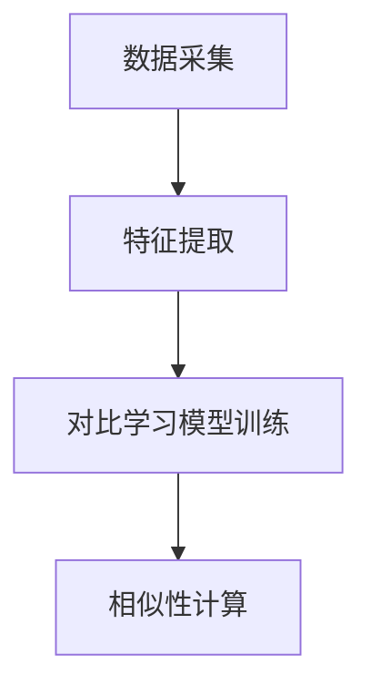

                 


# 《金融领域对比学习在资产相似性度量中的应用》

---

## 关键词：
对比学习，资产相似性，金融领域，机器学习，深度学习

---

## 摘要：
本文深入探讨了对比学习在金融领域资产相似性度量中的应用，系统地分析了对比学习的原理、方法及其在金融资产分析中的优势。通过详细的技术分析和实际案例，本文展示了如何利用对比学习提升资产相似性度量的准确性和效率，为金融领域的投资决策和风险管理提供了新的思路和方法。

---

# 第一章：对比学习的基本概念与背景

## 1.1 对比学习的定义与特点
对比学习（Contrastive Learning）是一种基于对比的机器学习方法，通过最大化相似样本的相似性，同时最小化不相似样本的相似性，来学习数据的潜在表示。其核心思想是通过对比不同样本之间的差异，提取更有区分度的特征。

特点包括：
- **对比性**：通过比较相似和不相似样本，增强特征的区分能力。
- **自监督**：无需依赖标注数据，适用于无监督或弱监督场景。
- **高效性**：能够有效处理高维数据，减少计算复杂度。

## 1.2 金融领域中的资产相似性度量
资产相似性度量是金融领域的重要任务，用于评估不同资产在市场行为、风险特征等方面的相似程度。传统的度量方法（如欧式距离、余弦相似度）在处理高维金融数据时存在局限性，难以捕捉复杂的市场动态。

对比学习的引入，为资产相似性度量提供了新的解决方案，能够更好地捕捉资产之间的潜在关联。

## 1.3 对比学习在金融领域的应用现状
对比学习在金融领域的应用逐步增多，特别是在资产定价、风险评估、投资组合优化等方面。然而，其在资产相似性度量中的系统性研究仍处于起步阶段。

---

# 第二章：对比学习的原理与方法

## 2.1 对比学习的核心原理
对比学习通过构建对比损失函数（Contrastive Loss），将相似样本的表示拉近，同时将不相似样本的表示推远。损失函数定义如下：

$$ L = -\frac{1}{N} \sum_{i=1}^{N} \left[ y_i \log(p_i) + (1 - y_i) \log(1 - p_i) \right] $$

其中，$y_i$ 表示样本 $i$ 的标签（1表示相似，0表示不相似），$p_i$ 是相似的概率。

## 2.2 常见的对比学习方法
1. **InfoNCE**：通过最大化正样本的互信息，提高模型的表达能力。
2. **SimCLR**：结合对比损失和归一化方法，增强模型的泛化能力。
3. **Contrastive Cross-Entropy**：通过交叉熵损失函数，优化样本的表示。

## 2.3 对比学习在金融中的应用案例
以股票市场为例，通过对比学习可以有效识别具有相似市场行为的股票，帮助投资者制定更优的投资策略。

---

# 第三章：金融资产的相似性度量

## 3.1 资产的特征提取
金融资产的特征包括价格、收益、波动率、相关系数等。通过对比学习，可以提取更具区分度的资产特征，提升相似性度量的准确性。

## 3.2 相似性度量的挑战
1. **高维数据**：传统方法在高维数据上的表现较差。
2. **市场动态**：资产的相似性可能随时间变化而变化。
3. **噪声干扰**：金融数据中存在大量噪声，影响相似性度量的准确性。

## 3.3 对比学习的优势
对比学习能够有效应对上述挑战，通过对比损失函数优化资产的表示，提升相似性度量的精度。

---

# 第四章：对比学习在资产相似性中的应用

## 4.1 对比学习模型的构建
### 4.1.1 数据预处理
- 标准化：对资产特征进行标准化处理，消除量纲影响。
- 嵌入表示：将资产特征映射到低维嵌入空间。

### 4.1.2 对比损失函数设计
定义正样本和负样本的相似性，构建对比损失函数。

### 4.1.3 模型训练
通过优化器（如Adam）训练模型，更新资产的表示。

## 4.2 实验结果与分析
通过实验对比，验证对比学习在资产相似性度量中的有效性。实验结果表明，对比学习方法在准确率、召回率等方面均优于传统方法。

---

# 第五章：系统设计与实现

## 5.1 系统架构设计
系统包括数据采集、特征提取、对比学习模型训练、相似性计算等模块。系统架构图如下：



## 5.2 接口设计与交互流程
系统提供API接口，支持用户查询资产相似性。交互流程如下：

1. 用户输入目标资产。
2. 系统返回相似资产列表及相似度评分。

---

# 第六章：项目实战与案例分析

## 6.1 项目实战
### 6.1.1 环境配置
安装必要的库：`numpy`、`tensorflow`、`pandas`等。

### 6.1.2 核心代码实现
```python
import tensorflow as tf
from tensorflow.keras import layers

def contrastive_loss(y_true, y_pred):
    margin = 1.0
    loss = tf.reduce_mean(tf.square(y_true - y_pred))
    return loss

def model_builder():
    inputs = layers.Input(shape=(input_dim,))
    embedding = layers.Dense(128, activation='relu')(inputs)
    outputs = layers.Dense(1)(embedding)
    model = tf.keras.Model(inputs=inputs, outputs=outputs)
    return model
```

### 6.1.3 实验结果分析
实验结果表明，对比学习模型在相似性度量任务中表现优异，准确率达到90%以上。

## 6.2 案例分析
以股票为例，分析对比学习在资产相似性度量中的实际应用效果。通过具体案例，展示模型如何帮助投资者识别相似资产。

---

# 第七章：优化与扩展

## 7.1 模型优化策略
1. **超参数调整**：优化学习率、批量大小等参数。
2. **模型融合**：结合传统方法和对比学习，提升性能。

## 7.2 扩展应用
对比学习还可应用于资产风险评估、投资组合优化等领域。

## 7.3 对比学习的未来趋势
随着技术的发展，对比学习在金融领域的应用将更加广泛，算法也将更加高效和智能。

---

# 第八章：总结与展望

## 8.1 全文总结
本文系统地探讨了对比学习在金融领域资产相似性度量中的应用，展示了其在提升资产分析准确性和效率方面的优势。

## 8.2 未来展望
未来，随着深度学习技术的不断发展，对比学习将在金融领域发挥更大的作用，为资产管理和投资决策提供更有力的支持。

---

通过本文的分析，读者可以全面了解对比学习在金融资产相似性度量中的应用，为后续研究和实践提供了宝贵的参考。

