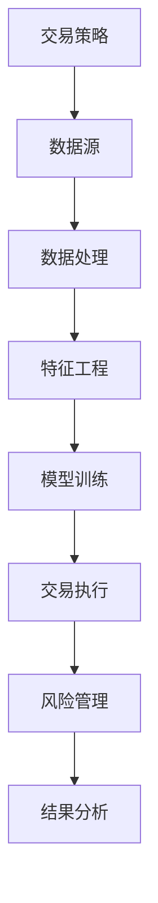
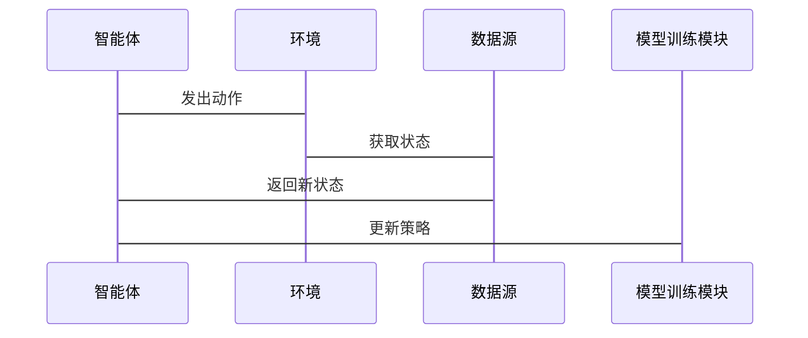

                 


# 《金融领域强化学习在交易策略中的应用》

## 关键词：强化学习，金融交易，交易策略，算法交易，量化投资

## 摘要：  
本文详细探讨了强化学习在金融交易策略中的应用，从基础概念到高级算法，结合实际案例分析，深入剖析强化学习在金融领域的优势与挑战，为读者提供全面的理论与实践指导。

---

## 第一部分: 金融领域强化学习基础概述

### 第1章: 强化学习与金融交易概述

#### 1.1 强化学习的基本概念
##### 1.1.1 强化学习的定义与核心要素
强化学习（Reinforcement Learning，RL）是一种机器学习范式，通过智能体与环境的交互，学习最优策略以最大化累积奖励。核心要素包括：智能体（Agent）、环境（Environment）、动作（Action）、状态（State）、奖励（Reward）和策略（Policy）。

##### 1.1.2 强化学习与金融交易的结合点
金融交易涉及复杂的市场环境和决策过程，强化学习通过模拟交易行为，优化投资策略。其结合点主要体现在动态市场建模、实时决策优化和风险控制等方面。

##### 1.1.3 金融领域强化学习的应用场景
- 股票交易：基于市场数据的买卖决策优化。
- 期货交易：套利策略与市场趋势预测。
- 资产配置：动态调整投资组合。

#### 1.2 金融交易的基本原理
##### 1.2.1 金融市场的基本构成
金融市场由参与者（投资者、交易商）、资产（股票、债券等）和价格机制构成。价格波动受多种因素影响，如供需关系、宏观经济指标等。

##### 1.2.2 交易策略的分类与特点
- **主动策略**：高频交易、算法交易。
- **被动策略**：指数基金、定投策略。
- **量化策略**：基于数学模型的投资决策。

##### 1.2.3 金融数据的特征与处理
金融数据具有高波动性、非线性关系和噪声多等特点。处理数据时，需进行清洗、特征提取和标准化。

#### 1.3 强化学习在金融交易中的优势
##### 1.3.1 强化学习的灵活性与适应性
强化学习能够适应市场变化，动态调整策略。

##### 1.3.2 数据驱动的决策优势
通过大量数据训练，强化学习模型能够发现复杂市场中的潜在规律。

##### 1.3.3 风险控制与收益优化的平衡
强化学习通过奖励函数设计，能够在收益与风险之间找到平衡点。

---

### 第2章: 强化学习的核心算法原理

#### 2.1 Q-learning算法
##### 2.1.1 Q-learning的基本原理
Q-learning是一种值迭代算法，通过更新状态-动作对的Q值，学习最优策略。公式为：
$$ Q(s, a) = r + \gamma \max Q(s', a') $$

##### 2.1.2 Q-learning在金融交易中的应用
适用于简单的交易场景，如单资产买卖决策。

##### 2.1.3 Q-learning的数学模型与公式
状态空间：市场数据特征；动作空间：买入、卖出或持有。

#### 2.2 Deep Q-Networks (DQN)
##### 2.2.1 DQN算法的原理与改进
DQN通过深度神经网络近似Q值函数，解决高维状态空间问题。

##### 2.2.2 DQN在金融交易中的应用
适用于多资产交易和复杂市场环境。

##### 2.2.3 DQN的网络结构与训练过程
使用两个DQN网络，目标网络和策略网络，通过经验回放和渐近式目标更新优化模型。

#### 2.3 Policy Gradient Methods
##### 2.3.1 Policy Gradient的基本原理
通过优化策略直接寻找最优动作分布，公式为：
$$ \nabla \theta \leftarrow \frac{1}{N} \sum_{i=1}^N \nabla \log \pi_\theta(s_i) Q(s_i, a_i) $$

##### 2.3.2 Policy Gradient在金融交易中的应用
适用于连续动作空间的交易策略优化。

##### 2.3.3 Policy Gradient的数学模型与公式
策略网络输出概率分布，通过梯度上升优化奖励期望。

---

### 第3章: 强化学习在金融交易中的数学模型与公式

#### 3.1 状态空间与动作空间的定义
##### 3.1.1 状态空间的构建
将市场数据（如价格、成交量）转化为状态向量。

##### 3.1.2 动作空间的设计
定义可能的交易动作，如买入、卖出或持有。

##### 3.1.3 状态转移的概率模型
基于历史数据，建立状态转移矩阵。

#### 3.2 奖励函数的设计
##### 3.2.1 奖励函数的定义
将收益、风险和交易成本纳入奖励函数。

##### 3.2.2 奖励函数的优化
通过调整权重，平衡短期收益与长期目标。

##### 3.2.3 奖励函数的实现
例如，使用 Sharpe Ratio 或 Sortino Ratio 作为奖励指标。

#### 3.3 动作策略与价值函数的关系
##### 3.3.1 动作策略的优化
通过策略网络优化动作概率分布。

##### 3.3.2 价值函数的计算
通过价值网络评估状态的价值。

##### 3.3.3 动作策略与价值函数的结合
联合优化策略和价值函数，提升模型性能。

---

### 第4章: 系统分析与架构设计方案

#### 4.1 系统功能设计
##### 4.1.1 数据处理模块
- 数据清洗：去除噪声数据。
- 特征工程：提取有用的市场特征。

##### 4.1.2 模型训练模块
- 状态空间：市场数据特征。
- 动作空间：交易决策。
- 奖励函数：收益与风险的综合指标。

##### 4.1.3 回测与优化模块
- 回测策略：验证交易策略的盈利能力。
- 参数优化：调整模型超参数。

##### 4.1.4 风险管理模块
- 风险评估：计算VaR、CVaR等风险指标。
- 风险控制：设置止损和止盈点。

#### 4.2 系统架构设计
##### 4.2.1 系统架构图


##### 4.2.2 系统交互图


#### 4.3 系统接口设计
##### 4.3.1 输入接口
- 数据接口：接收市场数据。
- 参数接口：接收模型超参数。

##### 4.3.2 输出接口
- 交易信号：输出买卖决策。
- 性能指标：输出收益、风险等指标。

---

### 第5章: 项目实战

#### 5.1 环境安装
- Python 3.8+
- TensorFlow 2.0+
- Pandas、NumPy、Scikit-learn

#### 5.2 核心实现源代码
##### 5.2.1 数据处理代码
```python
import pandas as pd
import numpy as np

def process_data(data):
    # 数据清洗
    data = data.dropna()
    # 特征工程
    data['log_return'] = np.log(data['收盘价'].pct_change().add(1))
    return data
```

##### 5.2.2 强化学习模型代码
```python
import tensorflow as tf
from tensorflow.keras import layers

class DQN:
    def __init__(self, state_dim, action_dim):
        self.state_dim = state_dim
        self.action_dim = action_dim
        self.model = self.build_model()
    
    def build_model(self):
        model = tf.keras.Sequential([
            layers.Dense(64, activation='relu', input_dim=self.state_dim),
            layers.Dense(64, activation='relu'),
            layers.Dense(self.action_dim)
        ])
        return model
```

##### 5.2.3 交易策略实现代码
```python
def trading_strategy(data, model):
    state = data[-window_size:].values
    prediction = model.predict(state)
    action = np.argmax(prediction)
    return action
```

#### 5.3 实际案例分析
##### 5.3.1 案例介绍
基于股票数据，训练一个强化学习模型，实现自动交易。

##### 5.3.2 数据分析与特征工程
- 数据来源：历史股票价格。
- 特征提取：log returns、移动平均线等。

##### 5.3.3 模型训练与优化
- 训练数据：历史交易数据。
- 验证数据：独立时间段数据。

##### 5.3.4 交易结果分析
- 回测结果：年化收益、最大回撤。
- 策略优化：调整奖励函数。

#### 5.4 项目小结
强化学习在金融交易中的应用具有巨大潜力，但需注意模型的泛化能力与实际市场的复杂性。

---

### 第6章: 最佳实践与小结

#### 6.1 最佳实践 tips
- 数据清洗与特征工程是关键。
- 模型调参需结合实际市场特征。
- 风险管理是策略优化的重要部分。

#### 6.2 总结
本文从基础概念到实际应用，全面介绍了强化学习在金融交易中的应用。通过理论分析与案例实践，展示了如何利用强化学习优化交易策略。

#### 6.3 注意事项
- 强化学习模型可能过拟合训练数据。
- 金融市场具有不确定性，需谨慎评估模型表现。

#### 6.4 拓展阅读
- 《Reinforcement Learning: Theory and Algorithms》
- 《Advances in Financial Machine Learning》

---

通过以上内容，我们系统地探讨了强化学习在金融交易中的应用，从理论到实践，为读者提供了全面的指导。

