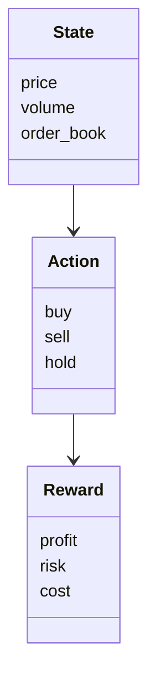
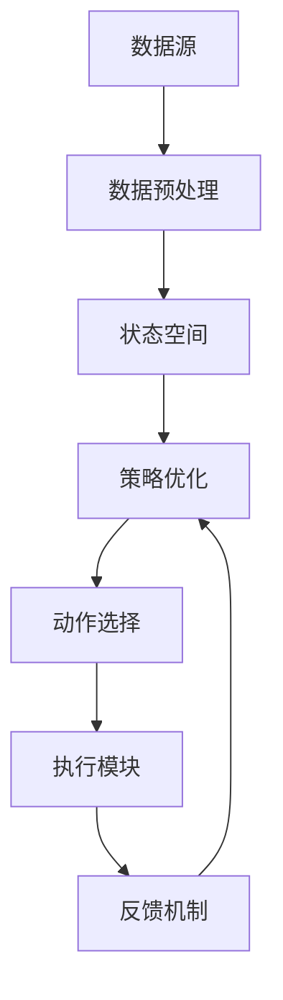

                 


# 《金融领域强化学习在动态最优执行策略中的应用》

## 关键词：
- 强化学习
- 动态最优执行策略
- 金融领域
- 算法交易
- 风险控制

## 摘要：
本文深入探讨了强化学习在金融领域动态最优执行策略中的应用，详细分析了强化学习的基本原理、动态最优执行策略的定义及其在金融中的具体应用案例。通过结合理论与实践，文章介绍了强化学习在算法交易、风险控制和资产配置中的实际应用，详细讲解了相关算法的实现过程，并通过系统架构设计展示了如何将强化学习应用于金融系统中。最后，文章总结了强化学习在金融领域的优势，并提出了未来的发展方向。

---

# 第一部分: 金融领域强化学习背景介绍

## 第1章: 强化学习概述

### 1.1 强化学习的基本概念

#### 1.1.1 什么是强化学习
强化学习（Reinforcement Learning，RL）是一种机器学习范式，其中智能体通过与环境交互来学习策略，以最大化累积的奖励。与监督学习不同，强化学习不需要明确的标签数据，而是通过奖励信号来指导学习过程。

#### 1.1.2 强化学习的核心要素
- **状态（State）**：环境中的当前情况，例如当前的市场数据。
- **动作（Action）**：智能体在给定状态下采取的行动，例如买入或卖出股票。
- **奖励（Reward）**：智能体采取某个动作后获得的反馈，用于评估动作的好坏。
- **策略（Policy）**：智能体选择动作的规则，可以是基于当前状态的概率分布。
- **价值函数（Value Function）**：评估某个状态或状态-动作对的预期累积奖励。

#### 1.1.3 强化学习与监督学习的区别
| 特性         | 监督学习              | 强化学习              |
|--------------|----------------------|-----------------------|
| 数据来源     | 标签数据              | 奖励信号              |
| 反馈机制     | 立即反馈              | 延时反馈              |
| 动作空间     | 离散或连续            | 离散或连续            |
| 应用场景     | 分类、回归            | 控制、游戏、机器人控制 |

### 1.2 强化学习在金融领域的应用

#### 1.2.1 金融领域的动态决策问题
在金融领域，动态决策问题广泛存在，例如算法交易、风险管理和资产配置。这些问题通常涉及高度不确定的环境和复杂的决策过程，适合使用强化学习来解决。

#### 1.2.2 强化学习在金融中的优势
- **适应性强**：能够处理动态变化的市场环境。
- **数据驱动**：不需要大量先验知识，可以基于历史数据进行学习。
- **高效决策**：通过不断试错，找到最优策略。

#### 1.2.3 实际案例分析
例如，在算法交易中，强化学习可以用于优化订单执行策略，以最小化交易成本并最大化收益。

## 第2章: 动态最优执行策略

### 2.1 动态最优执行策略的定义

#### 2.1.1 问题背景
动态最优执行策略是指在不断变化的市场环境中，根据当前的状态和历史信息，制定最优的执行策略，以实现特定目标（如最大化收益或最小化风险）。

#### 2.1.2 问题描述
在金融交易中，动态最优执行策略需要考虑市场深度、订单簿信息、交易成本等因素，实时调整交易策略。

#### 2.1.3 解决方法
使用强化学习算法，如Q-learning或策略梯度，构建动态策略模型，不断优化执行策略。

#### 2.1.4 边界与外延
- **边界条件**：市场深度有限，交易时间窗口有限。
- **外延**：动态策略可以应用于高频交易、算法交易和风险控制等领域。

### 2.2 动态最优执行策略的核心要素

#### 2.2.1 状态空间
- 市场数据：包括价格、成交量、订单簿信息等。
- 时间因素：如当前时间、市场周期等。

#### 2.2.2 行动空间
- 买入、卖出或持有资产。
- 调整仓位或交易量。

#### 2.2.3 奖励函数
- 基于交易收益、风险、交易成本等因素设计奖励函数。

### 2.3 动态最优执行策略的边界与外延

#### 2.3.1 问题的边界条件
- 交易成本有限，市场深度有限。
- 时间窗口有限，策略需要实时更新。

#### 2.3.2 相关概念的扩展
- 动态策略可以与其他技术（如机器学习、统计套利）结合，形成更复杂的交易系统。

---

# 第二部分: 强化学习的核心概念与联系

## 第4章: 强化学习的基本原理

### 4.1 马尔可夫决策过程

#### 4.1.1 定义
马尔可夫决策过程（Markov Decision Process，MDP）是一个用于描述强化学习问题的数学框架，由状态、动作、转移概率和奖励函数组成。

#### 4.1.2 马尔可夫性质
当前状态足以描述未来的状态，无需考虑过去的历史。

#### 4.1.3 MDP的组成部分
- **状态空间（S）**：可能的状态集合。
- **动作空间（A）**：可能的动作集合。
- **转移概率（P(s'|s,a））**：从状态s采取动作a后转移到状态s'的概率。
- **奖励函数（R(s,a)）**：在状态s采取动作a后获得的奖励。

### 4.2 Q-learning算法

#### 4.2.1 算法流程
1. 初始化Q表为零。
2. 在每个时间步，根据当前状态选择动作。
3. 执行动作，观察新状态和奖励。
4. 更新Q表：$Q(s,a) = Q(s,a) + \alpha [r + \gamma \max Q(s',a') - Q(s,a)]$。

#### 4.2.2 示例代码
```python
import numpy as np

class QLearning:
    def __init__(self, state_space_size, action_space_size, alpha=0.1, gamma=0.99):
        self.Q = np.zeros((state_space_size, action_space_size))
        self.alpha = alpha
        self.gamma = gamma

    def get_action(self, state, epsilon=0.1):
        if np.random.random() < epsilon:
            return np.random.randint(0, self.action_space_size)
        return np.argmax(self.Q[state])

    def update_Q(self, state, action, reward, next_state):
        self.Q[state, action] = self.Q[state, action] + self.alpha * (reward + self.gamma * np.max(self.Q[next_state]) - self.Q[state, action])
```

### 4.3 策略梯度

#### 4.3.1 策略梯度的基本原理
策略梯度法通过优化策略的参数，直接最大化累积奖励。常用的方法包括随机梯度上升和动量法。

#### 4.3.2 示例代码
```python
import numpy as np

class PolicyGradient:
    def __init__(self, state_space_size, action_space_size, learning_rate=0.01):
        self.theta = np.random.randn(state_space_size, action_space_size)
        self.learning_rate = learning_rate

    def get_action(self, state):
        probs = np.exp(self.theta[state]) / np.sum(np.exp(self.theta[state]))
        action = np.random.choice(range(len(probs)), p=probs)
        return action

    def update_theta(self, state, action, reward):
        probs = np.exp(self.theta[state]) / np.sum(np.exp(self.theta[state]))
        loss = -reward * np.log(probs[action])
        d_theta = probs[action] * (1 - probs[action])  # 简化梯度计算
        self.theta[state, action] += self.learning_rate * (reward * d_theta)
```

---

## 第5章: 强化学习在金融中的具体应用

### 5.1 算法交易中的强化学习

#### 5.1.1 算法交易的基本概念
算法交易是指通过算法自动执行交易决策，以利用市场中的短期机会。

#### 5.1.2 强化学习在算法交易中的应用
- **动态策略优化**：根据市场变化实时调整交易策略。
- **订单簿分析**：利用订单簿信息进行高频交易。

#### 5.1.3 典型案例分析
例如，使用强化学习优化订单执行策略，以最小化交易成本并最大化收益。

### 5.2 风险控制中的强化学习

#### 5.2.1 风险控制的基本概念
风险控制是指在投资过程中，通过分散投资、对冲风险等手段，降低投资组合的风险。

#### 5.2.2 强化学习在风险控制中的应用
- **动态风险模型**：根据市场变化动态调整风险参数。
- **情景分析**：模拟不同市场条件下投资组合的风险。

#### 5.2.3 典型案例分析
例如，使用强化学习构建动态风险控制系统，实时监控和调整投资组合。

### 5.3 资产配置中的强化学习

#### 5.3.1 资产配置的基本概念
资产配置是指将资金分配到不同的资产类别中，以实现投资目标。

#### 5.3.2 强化学习在资产配置中的应用
- **动态资产分配**：根据市场变化调整资产配置比例。
- **多目标优化**：在收益和风险之间找到最佳平衡点。

#### 5.3.3 典型案例分析
例如，使用强化学习优化资产配置策略，以实现风险可控下的最大收益。

---

# 第三部分: 强化学习的算法原理讲解

## 第6章: 强化学习的数学模型

### 6.1 Q-learning算法的数学模型

#### 6.1.1 Q-learning的更新公式
$$ Q(s,a) = Q(s,a) + \alpha [r + \gamma \max Q(s',a') - Q(s,a)] $$

#### 6.1.2 示例解释
假设当前状态s的动作a导致状态s'，奖励r=1，γ=0.9，α=0.1。如果Q(s',a')的最大值为2，则新的Q(s,a)为：
$$ Q(s,a) = Q(s,a) + 0.1 [1 + 0.9 \times 2 - Q(s,a)] $$

### 6.2 策略梯度算法的数学模型

#### 6.2.1 策略函数的优化目标
最大化累积奖励的期望：
$$ \max_{\theta} \mathbb{E}[R] $$

#### 6.2.2 梯度上升公式
$$ \theta_{t+1} = \theta_t + \alpha \nabla_\theta \log \pi(a|s; \theta) \cdot R $$

---

# 第四部分: 系统分析与架构设计

## 第7章: 金融动态最优执行策略系统架构设计

### 7.1 问题场景介绍

#### 7.1.1 高频交易中的动态策略优化
- **目标**：优化订单执行策略，减少交易成本。
- **挑战**：市场环境瞬息万变，需要实时调整策略。

### 7.2 系统功能设计

#### 7.2.1 领域模型


### 7.3 系统架构设计

#### 7.3.1 系统架构图


---

# 第五部分: 项目实战

## 第8章: 强化学习在金融动态最优执行策略中的实战应用

### 8.1 环境安装与配置

#### 8.1.1 安装Python和相关库
```bash
pip install numpy matplotlib scikit-learn
```

### 8.2 核心代码实现

#### 8.2.1 Q-learning实现
```python
class QLearning:
    def __init__(self, state_space_size, action_space_size):
        self.Q = np.zeros((state_space_size, action_space_size))
```

#### 8.2.2 策略梯度实现
```python
class PolicyGradient:
    def __init__(self, state_space_size, action_space_size):
        self.theta = np.random.randn(state_space_size, action_space_size)
```

### 8.3 案例分析与解读

#### 8.3.1 案例分析
假设我们设计一个高频交易策略，使用Q-learning算法优化订单执行策略。通过历史数据训练Q表，然后在实际交易中实时调整策略。

#### 8.3.2 代码应用解读
训练Q表，然后在实际交易中根据当前状态选择最优动作。

---

# 第六部分: 总结与扩展

## 第9章: 强化学习在金融领域的优势与未来展望

### 9.1 总结

#### 9.1.1 强化学习在金融中的优势
- 高效性：能够在复杂环境中快速决策。
- 灵活性：适用于多种金融场景。

### 9.2 小结

#### 9.2.1 强化学习的局限性
- 对环境的依赖性强。
- 离线数据训练可能无法完全模拟真实市场。

### 9.3 注意事项

#### 9.3.1 风险提示
- 强化学习模型可能无法完全预测市场波动。
- 需要定期更新模型以适应市场变化。

### 9.4 拓展阅读

#### 9.4.1 推荐书目
- 《Reinforcement Learning: Theory and Algorithms》
- 《Algorithmic and High-Frequency Trading》

#### 9.4.2 开源项目
- OpenAI Gym
- FinRL

---

通过以上结构，我们可以清晰地看到强化学习在金融领域动态最优执行策略中的应用，从理论到实践，从概念到代码，全面而深入地探讨了这一主题。未来，随着技术的发展，强化学习在金融中的应用将更加广泛和深入。

