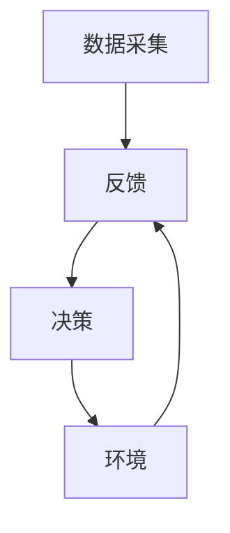

                 


# 金融领域强化学习在多层次流动性管理中的应用

## 关键词：
强化学习，流动性管理，金融，算法，系统架构

## 摘要：
本文探讨了强化学习在金融领域多层次流动性管理中的应用。通过分析强化学习的基本原理、算法实现及系统架构，展示了其在金融流动性管理中的优势。结合实际案例，详细讲解了强化学习在多层次流动性管理中的应用场景和实现细节，为金融机构提供了一种高效、智能的流动性管理解决方案。

---

## 第1章：引言

### 1.1 背景介绍
金融市场的稳定性与流动性管理密切相关，传统的基于规则的流动性管理方法在面对复杂市场环境时显得力不从心。强化学习作为一种先进的机器学习技术，能够通过与环境的交互不断优化决策策略，为流动性管理提供了新的思路。

### 1.2 问题描述
本文旨在探讨强化学习如何应用于金融流动性管理，重点解决以下问题：
- 如何构建强化学习模型以优化流动性管理策略？
- 强化学习在多层次流动性管理中的具体应用方式是什么？
- 如何设计高效的算法和系统架构以支持强化学习的应用？

### 1.3 研究意义
通过引入强化学习，金融机构可以实现更智能化、动态化的流动性管理，提升应对市场波动的能力，降低风险，提高资金使用效率。

---

## 第2章：强化学习基础

### 2.1 核心概念
- **状态（State）**：环境中的当前情况，如市场利率、资产头寸等。
- **动作（Action）**：模型根据状态做出的决策，如买入或卖出资产。
- **奖励（Reward）**：动作带来的反馈，衡量决策的好坏。

### 2.2 常见算法
- **Q-Learning**：通过更新Q值表学习最优策略。
- **Deep Q-Network (DQN)**：结合深度学习，处理高维状态空间。
- **Policy Gradient**：直接优化策略参数，适合复杂环境。

### 2.3 数学模型
Q-Learning的更新公式：
$$ Q(s, a) = Q(s, a) + \alpha (r + \gamma \max Q(s', a') - Q(s, a)) $$

### 2.4 算法流程
1. 初始化Q表。
2. 与环境交互，获取状态和奖励。
3. 更新Q值。
4. 重复直到收敛。

---

## 第3章：金融流动性管理

### 3.1 定义与目标
流动性管理旨在确保资金的灵活性和安全性，避免流动性风险。目标包括维持合理资产配置、应对突发事件等。

### 3.2 多层次结构
- **机构层面**：管理自身资产配置，确保日常运营资金需求。
- **市场层面**：影响整体市场流动性，如央行的公开市场操作。

### 3.3 挑战
- 市场波动大，不确定性高。
- 多目标优化复杂，传统方法难以应对。

---

## 第4章：强化学习在流动性管理中的应用

### 4.1 应用场景
- **资产配置**：动态调整资产组合以优化流动性。
- **风险控制**：实时监控并应对潜在风险。

### 4.2 状态空间设计
- 包括市场利率、资产头寸、历史交易数据等。

### 4.3 动作空间设计
- 资产买卖、调整投资比例等。

### 4.4 奖励机制设计
- 基于流动性覆盖率、净稳定资金比率等指标设计奖励函数。

---

## 第5章：算法原理

### 5.1 Q-Learning在流动性管理中的应用
- 状态：当前流动性状况。
- 动作：买入或卖出某种资产。
- 奖励：流动性改善带来的收益。

### 5.2 DQN算法实现
- 使用深度神经网络近似Q值函数，处理高维状态空间。

### 5.3 算法实现步骤
1. 环境初始化。
2. 状态观测。
3. 动作选择。
4. 环境反馈。
5. Q值更新。

---

## 第6章：系统架构设计

### 6.1 系统组成
- **数据采集模块**：收集市场数据。
- **强化学习模块**：执行决策。
- **反馈机制**：更新模型参数。

### 6.2 系统架构图


### 6.3 接口设计
- 数据接口：与市场数据源对接。
- 操作接口：执行交易指令。

---

## 第7章：项目实战

### 7.1 环境安装
- 安装Python、TensorFlow、Keras等依赖库。

### 7.2 源代码实现
```python
import numpy as np
import gym
from gym import spaces
from gym.utils import seeding

class LiquidityEnv(gym.Env):
    def __init__(self):
        self.state = 0  # 简化状态，实际应更复杂
        self.action_space = spaces.Discrete(2)  # 0: 卖出，1: 买入
        self.observation_space = spaces.Box(low=0, high=1, shape=(1,))
        self.seed()

    def seed(self, seed=None):
        self.np_random, seed = seeding.nprng(seed)
```

### 7.3 案例分析
通过模拟市场环境，训练模型进行资产买卖，优化流动性管理策略。

---

## 第8章：总结与展望

### 8.1 小结
本文详细探讨了强化学习在金融流动性管理中的应用，从算法原理到系统设计，为金融机构提供了新的解决方案。

### 8.2 最佳实践
- 数据质量至关重要。
- 算法选择需结合实际场景。
- 定期更新模型参数。

### 8.3 注意事项
- 风险控制是关键。
- 法律合规性需重视。

### 8.4 拓展阅读
推荐学习强化学习的书籍和相关研究论文。

---

通过本文的探讨，强化学习为金融流动性管理带来了新的可能性。未来，随着技术的发展，强化学习将在金融领域发挥更大的作用。

