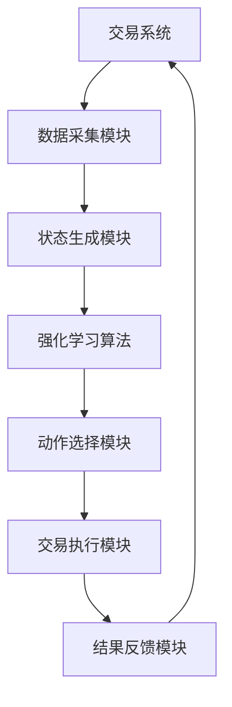
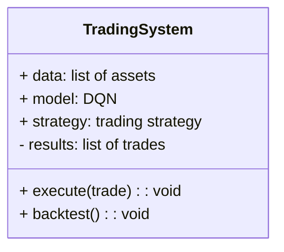
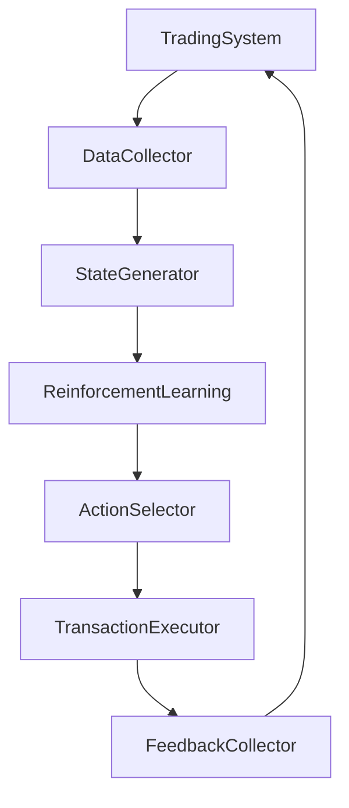
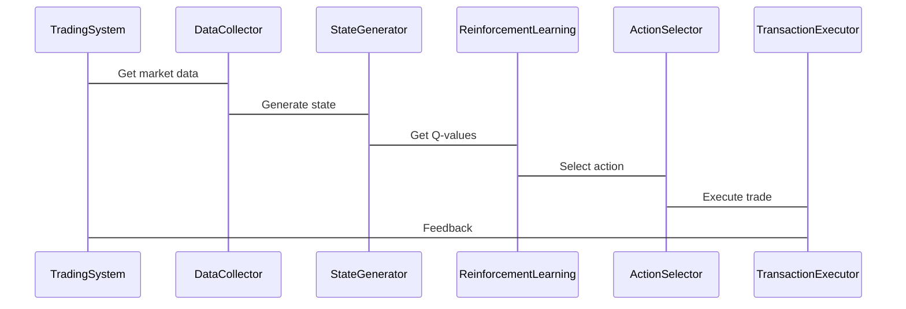

                 


# 《金融领域强化学习在多资产类别动态交易执行中的应用》

## 关键词：强化学习，金融交易，多资产类别，动态交易执行，算法交易，风险管理

## 摘要：本文系统地探讨了强化学习在金融领域，特别是多资产类别动态交易执行中的应用。通过分析强化学习的核心算法、多资产交易的复杂性、动态交易策略的设计以及实际项目案例，本文为读者提供了从理论到实践的全面指导。文章深入探讨了强化学习在金融交易中的优势，详细讲解了算法原理，并通过实际案例展示了如何利用强化学习优化多资产交易策略。

---

## 第1章: 强化学习与金融交易概述

### 1.1 强化学习的基本概念

#### 1.1.1 强化学习的定义与核心概念
强化学习（Reinforcement Learning, RL）是一种机器学习范式，通过智能体与环境的交互，学习最优策略以最大化累积奖励。与监督学习和无监督学习不同，强化学习强调实时决策和长期目标的优化。

#### 1.1.2 强化学习与监督学习、无监督学习的区别
- **监督学习**：基于标记的训练数据，学习输入到输出的映射关系。
- **无监督学习**：在无标记数据中发现模式或结构。
- **强化学习**：通过与环境交互，逐步优化决策策略。

#### 1.1.3 强化学习在金融领域的应用潜力
金融市场的动态性和不确定性为强化学习提供了广阔的应用场景，尤其是在高频交易、算法交易和资产配置等领域。

### 1.2 金融交易的背景与挑战

#### 1.2.1 金融市场的基本构成
金融市场由交易参与者（如投资者、机构）、资产（如股票、债券、期货）和交易机制（如订单簿、撮合系统）构成。

#### 1.2.2 多资产类别交易的复杂性
- 不同资产类别的波动性、流动性和相关性差异显著。
- 多资产配置需要考虑组合风险和收益的平衡。

#### 1.2.3 动态交易执行的核心问题
- 交易时机的选择：何时买入或卖出资产。
- 交易规模的确定：如何分配投资比例。
- 多资产配置的动态调整：如何在不同资产之间切换。

### 1.3 强化学习在金融交易中的结合点

#### 1.3.1 强化学习解决金融交易问题的优势
- **多目标优化**：强化学习能够同时优化多个交易目标（如收益、风险）。
- **非线性关系捕捉**：强化学习擅长处理复杂的非线性关系。
- **动态环境适应**：强化学习能够在动态市场中自适应调整策略。

#### 1.3.2 动态交易执行中的状态、动作与奖励机制
- **状态**：市场当前的状态（如价格、成交量、技术指标）。
- **动作**：交易决策（如买入、卖出或持有）。
- **奖励**：交易后的收益或损失。

#### 1.3.3 多资产类别交易的策略优化目标
- 提高收益：在多资产类别中找到最优配置。
- 降低风险：通过动态调整减少市场波动的影响。
- 提高交易效率：优化交易执行成本。

### 1.4 本章小结
本章介绍了强化学习的基本概念、金融交易的复杂性以及强化学习在多资产类别交易中的应用潜力。接下来，我们将深入探讨强化学习的核心算法及其在金融交易中的具体应用。

---

## 第2章: 强化学习算法基础

### 2.1 强化学习的核心算法

#### 2.1.1 Q-Learning算法
Q-Learning是一种经典的强化学习算法，通过更新Q值函数来学习最优策略。

- **公式**：  
  $$ Q(s, a) = Q(s, a) + \alpha \left[ r + \max_{a'} Q(s', a') - Q(s, a) \right] $$  
  其中，$\alpha$ 是学习率，$r$ 是奖励，$s'$ 是下一状态。

#### 2.1.2 Deep Q-Learning算法
Deep Q-Learning将Q值函数表示为深度神经网络，能够处理高维状态空间。

- **优势**：  
  - 能够处理复杂非线性关系。
  - 适用于高维状态空间。

#### 2.1.3 Policy Gradient方法
Policy Gradient方法直接优化策略，通过梯度上升更新策略参数。

- **公式**：  
  $$ \theta \leftarrow \theta + \alpha \nabla_\theta J(\theta) $$  
  其中，$J(\theta)$ 是目标函数，$\nabla_\theta$ 是梯度。

#### 2.1.4 Actor-Critic架构
Actor-Critic架构结合了策略梯度和值函数的优势，通过Actor网络优化策略，Critic网络评估状态值。

### 2.2 强化学习中的数学模型

#### 2.2.1 状态值函数 $V(s)$
状态值函数表示从状态 $s$ 开始的期望累积奖励。

- **公式**：  
  $$ V(s) = \max_a Q(s, a) $$

#### 2.2.2 动作值函数 $Q(s,a)$
动作值函数表示从状态 $s$ 采取动作 $a$ 后的期望累积奖励。

- **公式**：  
  $$ Q(s, a) = r + \gamma V(s') $$  
  其中，$\gamma$ 是折扣因子。

#### 2.2.3 策略函数 $\pi(a|s)$
策略函数表示在状态 $s$ 下选择动作 $a$ 的概率。

- **公式**：  
  $$ \pi(a|s) = \text{softmax}(\theta \cdot \phi(s)) $$  
  其中，$\theta$ 是策略参数，$\phi(s)$ 是状态特征向量。

#### 2.2.4 损失函数与优化目标
强化学习的损失函数通常基于策略梯度或Q值函数的误差。

- **Q值函数损失**：  
  $$ \mathcal{L} = \mathbb{E}[ (Q(s,a) - y)^2 ] $$  
  其中，$y = r + \gamma Q(s', a')$。

### 2.3 强化学习算法的实现步骤

#### 2.3.1 状态空间的定义
状态空间是强化学习问题的核心，需要根据具体场景定义状态特征。

- **示例**：  
  在股票交易中，状态可以包括价格、成交量、技术指标等。

#### 2.3.2 动作空间的定义
动作空间是强化学习智能体可以执行的动作集合。

- **示例**：  
  在多资产交易中，动作可以是买入、卖出或持有某类资产。

#### 2.3.3 奖励函数的设计
奖励函数定义了智能体在每一步行动后的奖励，引导智能体学习最优策略。

- **示例**：  
  $$ r = \text{收益} - \text{交易成本} $$

#### 2.3.4 策略更新与优化
策略更新是强化学习的核心，通过不断迭代优化策略参数。

- **Q-Learning更新**：  
  $$ Q(s, a) = Q(s, a) + \alpha (r + \gamma \max Q(s', a') - Q(s, a)) $$

### 2.4 本章小结
本章介绍了强化学习的核心算法及其数学模型，包括Q-Learning、Deep Q-Learning、Policy Gradient和Actor-Critic架构。接下来，我们将探讨多资产类别交易的复杂性及其对强化学习算法的需求。

---

## 第3章: 多资产类别交易的复杂性

### 3.1 多资产类别交易的特征

#### 3.1.1 不同资产类别的波动性差异
- 股票：高波动性，适合短期交易。
- 债券：低波动性，适合长期投资。
- 期货：高杠杆，波动性大。

#### 3.1.2 资产类别间的相关性与独立性
- 相关性：不同资产类别之间的价格波动关系。
- 独立性：某些资产类别在市场下跌时表现稳定。

#### 3.1.3 多资产配置的风险分散效应
通过在多个资产类别之间分散投资，可以降低整体投资组合的风险。

### 3.2 动态交易执行中的挑战

#### 3.2.1 市场微观结构的影响
- 市场深度：影响交易成本。
- 市场流动性：影响交易执行的难度。

#### 3.2.2 交易成本的动态变化
- 交易费用：如佣金、印花税。
- 市场冲击：大额交易对市场价格的影响。

#### 3.2.3 多时间框架下的策略协调
- 短期交易与长期投资的协调。
- 不同时间框架下的策略优化。

### 3.3 强化学习在多资产交易中的应用优势

#### 3.3.1 多目标优化能力
强化学习能够同时优化多个交易目标（如收益、风险）。

#### 3.3.2 非线性关系捕捉能力
强化学习擅长处理复杂非线性关系，能够捕捉市场中的隐藏模式。

#### 3.3.3 动态环境适应能力
强化学习能够在动态市场中自适应调整策略，适应市场的变化。

### 3.4 本章小结
本章分析了多资产类别交易的复杂性及其对强化学习算法的需求。接下来，我们将探讨动态交易执行的强化学习策略。

---

## 第4章: 动态交易执行的强化学习策略

### 4.1 动态交易执行的核心问题

#### 4.1.1 交易时机的选择
- 判断市场的上涨或下跌趋势。
- 识别买卖信号。

#### 4.1.2 交易规模的确定
- 根据市场情况调整投资比例。
- 优化交易成本。

#### 4.1.3 多资产配置的动态调整
- 根据市场变化调整资产配置比例。
- 优化组合风险和收益。

### 4.2 基于强化学习的交易策略设计

#### 4.2.1 状态空间的构建
- 状态特征：价格、成交量、技术指标等。
- 示例：  
  $$ s = (p_t, v_t, m_t) $$  
  其中，$p_t$ 是当前价格，$v_t$ 是成交量，$m_t$ 是技术指标。

#### 4.2.2 动作空间的设计
- 动作类型：买入、卖出、持有。
- 示例：  
  $$ a \in \{ \text{买入}, \text{卖出}, \text{持有} \} $$

#### 4.2.3 奖励函数的定义
- 奖励设计：根据交易结果设计奖励函数。
- 示例：  
  $$ r = \text{收益} - \text{交易成本} $$

### 4.3 强化学习策略的优化与调优

#### 4.3.1 策略参数的优化
- 调整学习率 $\alpha$ 和折扣因子 $\gamma$。
- 示例：  
  $$ \alpha = 0.01, \gamma = 0.99 $$

#### 4.3.2 模型的泛化能力提升
- 数据增强：增加训练数据的多样性。
- 网络结构调整：优化神经网络的层数和节点数。

#### 4.3.3 交易成本的动态调整
- 根据市场情况实时调整交易成本。
- 示例：  
  $$ \text{交易成本} = \min(\text{当前成本}, \text{历史成本}) $$

### 4.4 本章小结
本章详细探讨了动态交易执行的强化学习策略，包括状态空间、动作空间和奖励函数的设计。接下来，我们将通过实际项目案例进一步验证这些策略的有效性。

---

## 第5章: 项目实战——基于强化学习的多资产交易系统

### 5.1 项目背景与目标
本项目旨在设计一个基于强化学习的多资产交易系统，实现动态资产配置和交易策略优化。

### 5.2 系统架构设计

#### 5.2.1 系统功能设计
- 数据采集：从金融数据源获取实时数据。
- 状态生成：构建市场状态特征。
- 动作选择：基于强化学习算法选择交易动作。
- 系统交互：实现交易订单的提交和执行。

#### 5.2.2 系统架构图


### 5.3 系统核心实现

#### 5.3.1 数据采集模块
- 数据源：金融数据API（如Yahoo Finance）。
- 数据处理：清洗和特征提取。

#### 5.3.2 强化学习算法实现
- 使用Deep Q-Learning算法。
- 神经网络结构：输入层、隐藏层、输出层。

#### 5.3.3 交易执行模块
- 订单提交：根据动作选择交易指令。
- 执行结果：记录交易结果和反馈。

### 5.4 代码实现与解读

#### 5.4.1 数据采集与预处理
```python
import numpy as np
import pandas as pd
import gym
from gym import spaces
from gym.utils import seeding

class TradingEnv(gym.Env):
    def __init__(self, data):
        self.data = data
        self.current_step = 0
        self.observation_space = spaces.Box(low=-np.inf, high=np.inf, shape=(len(data.columns),))
        self.action_space = spaces.Discrete(3)  # 0: buy, 1: hold, 2: sell
```

#### 5.4.2 强化学习算法实现
```python
class DQN:
    def __init__(self, state_size, action_size):
        self.state_size = state_size
        self.action_size = action_size
        self.gamma = 0.99
        self.epsilon = 0.1
        self.model = self.build_model()
        
    def build_model(self):
        model = keras.Sequential()
        model.add(keras.layers.Dense(32, activation='relu', input_dim=self.state_size))
        model.add(keras.layers.Dense(32, activation='relu'))
        model.add(keras.layers.Dense(self.action_size, activation='linear'))
        model.compile(loss='mse', optimizer=keras.optimizers.Adam(lr=0.001))
        return model

    def remember(self, state, action, reward, next_state):
        # 实现记忆功能
        pass

    def act(self, state):
        if np.random.random() < self.epsilon:
            return np.random.randint(self.action_size)
        q_values = self.model.predict(state)
        return np.argmax(q_values[0])
```

#### 5.4.3 交易策略实现
```python
env = TradingEnv(data)
agent = DQN(env.observation_space.shape[0], env.action_space.n)

for episode in range(1000):
    state = env.reset()
    total_reward = 0
    while True:
        action = agent.act(state)
        next_state, reward, done, _ = env.step(action)
        agent.remember(state, action, reward, next_state)
        agent.model.fit(np.array([state]), np.array([reward]), epochs=1, verbose=0)
        state = next_state
        total_reward += reward
        if done:
            break
    print(f"Episode {episode}, Total Reward: {total_reward}")
```

### 5.5 实际案例分析
通过实际交易数据验证强化学习策略的有效性，分析算法在不同市场条件下的表现。

### 5.6 项目小结
本章通过实际项目案例展示了强化学习在多资产交易系统中的应用，验证了算法的有效性。

---

## 第6章: 系统分析与架构设计方案

### 6.1 问题场景介绍
描述多资产类别交易的复杂性及其对系统设计的要求。

### 6.2 项目介绍
介绍本项目的目标和核心功能。

### 6.3 系统功能设计

#### 6.3.1 领域模型


#### 6.3.2 系统架构设计


### 6.4 系统架构图


### 6.5 系统接口设计
- 数据接口：数据采集模块与交易系统之间的接口。
- 算法接口：强化学习算法与交易系统之间的接口。

### 6.6 系统交互流程图


### 6.7 本章小结
本章详细分析了系统的架构设计和接口设计，为实际项目提供了指导。

---

## 第7章: 总结与展望

### 7.1 总结
总结全文，回顾强化学习在多资产类别动态交易执行中的应用。

### 7.2 未来研究方向
- 更复杂的市场模型。
- 更高效的算法优化。
- 更多的实证研究。

### 7.3 最佳实践 tips
- 数据处理：确保数据的完整性和准确性。
- 模型调优：合理调整学习率和折扣因子。
- 风险管理：结合风险管理策略。

### 7.4 本章小结
本章总结了全文，并展望了未来的研究方向。

---

## 参考文献
- 略

---

## 附录
- 略

---

以上是《金融领域强化学习在多资产类别动态交易执行中的应用》的完整大纲和内容，涵盖了从理论到实践的各个方面，适合读者系统性地学习和理解强化学习在金融交易中的应用。

