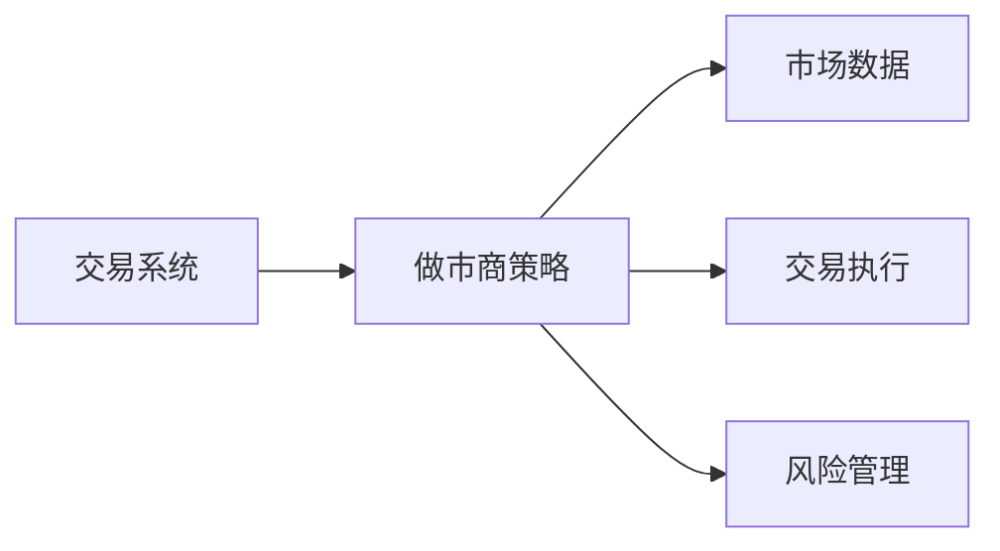

                 


# 《金融领域强化学习在市场做市商策略中的应用》

**关键词**：强化学习，做市商策略，金融市场，机器学习应用，交易算法

**摘要**：本文探讨了强化学习在金融市场做市商策略中的应用。通过分析做市商的挑战，阐述强化学习的优势，构建强化学习框架，并详细讲解算法原理、系统架构设计和项目实战，最后给出最佳实践建议，帮助读者理解如何利用强化学习优化做市商策略。

---

## 第一部分: 强化学习与做市商策略的背景介绍

### 第1章: 强化学习的基本概念

#### 1.1 强化学习的定义与特点

**1.1.1 强化学习的定义**

强化学习（Reinforcement Learning, RL）是一种机器学习方法，通过智能体与环境的交互，逐步优化决策策略，以最大化累积奖励。其核心在于智能体通过试错和奖励机制，学习如何在复杂环境中做出最优决策。

**1.1.2 强化学习的核心特点**

- **试错学习**：智能体通过不断尝试动作，观察结果并调整策略。
- **延迟奖励**：奖励可能在多个动作后才获得，需考虑长期利益。
- **策略优化**：目标是找到最优策略，使累计奖励最大化。
- **环境交互**：智能体与环境动态交互，环境状态影响决策。

**1.1.3 强化学习与监督学习、无监督学习的区别**

| 方法类型 | 数据来源 | 决策方式 | 目标 |
|----------|----------|----------|------|
| 监督学习 | 标签数据 | 预测 | 最小化预测误差 |
| 无监督学习 | 未标记数据 | 发现模式 | 最大化数据结构 |
| 强化学习 | 环境反馈 | 最大化累计奖励 | 优化决策策略 |

**总结**：强化学习的独特之处在于其通过与环境的交互学习，而监督和无监督学习则依赖于已有数据。

#### 1.2 做市商的定义与作用

**1.2.1 做市商的定义**

做市商（Market Maker）是金融市场中提供买入和卖出报价的参与者，旨在维持市场流动性并促进交易。做市商通过同时报价买入和卖出价格，赚取买卖价差。

**1.2.2 做市商在金融市场中的作用**

- 提供流动性：确保买卖双方能够迅速交易。
- 维持价格稳定：通过报价平衡市场供需。
- 促进市场深度：增加市场参与者，提高交易效率。

**1.2.3 做市商策略的基本类型**

- **被动做市商**：根据市场供需变化调整报价。
- **主动做市商**：主动干预市场，影响价格走势。
- **统计套利策略**：基于统计模型进行交易。

#### 1.3 强化学习在金融市场中的应用背景

**1.3.1 金融市场中的复杂性与不确定性**

- **价格波动**：市场价格受多种因素影响，难以预测。
- **高频交易**：需要快速决策和执行。
- **信息不对称**：市场参与者信息获取不均。

**1.3.2 做市商面临的挑战与问题**

- **买卖价差优化**：如何在竞争中保持价差以确保利润。
- **风险管理**：控制市场风险，避免重大损失。
- **策略适应性**：应对市场环境的快速变化。

**1.3.3 强化学习在做市商策略中的应用前景**

- **优化决策速度**：强化学习算法能够快速做出决策，适应高频交易需求。
- **动态调整策略**：根据市场反馈实时调整报价策略。
- **提高盈利能力**：通过优化买卖价差和交易时机，提升利润。

---

## 第2章: 强化学习与做市商策略的结合

### 2.1 强化学习在做市商策略中的核心作用

#### 2.1.1 强化学习如何优化做市商的决策过程

- **实时反馈**：智能体根据每笔交易的结果调整报价策略。
- **动态调整**：根据市场环境变化，实时优化买卖价差。
- **策略多样性**：通过强化学习探索不同的交易策略，提高市场适应性。

#### 2.1.2 做市商策略中的状态、动作与奖励机制

**状态 (State)**：市场价格、买卖深度、市场波动性等影响做市商决策的因素。

**动作 (Action)**：调整买入价、卖出价，或保持当前报价。

**奖励机制 (Reward Mechanism)**：根据买卖价差、交易量、市场影响力等指标，给予正向或负向反馈，指导策略调整。

#### 2.1.3 强化学习模型在做市商策略中的应用

- **Q-learning算法**：用于简单策略优化。
- **Deep Q-learning**：适用于复杂市场环境。
- **策略网络**：直接输出最优动作。

### 2.2 做市商策略中的强化学习框架

#### 2.2.1 强化学习框架的构建

**环境设计**：模拟金融市场环境，包括价格波动、交易量变化等。

**智能体设计**：构建强化学习模型，设计状态、动作空间。

**奖励函数设计**：定义奖励机制，指导策略优化。

**交互过程**：智能体与环境交互，学习优化策略。

#### 2.2.2 强化学习框架的应用场景

- **实时市场响应**：根据市场变化快速调整报价。
- **风险管理**：通过策略优化控制市场风险。
- **提高市场参与度**：通过优化买卖价差吸引更多交易。

---

## 第3章: 强化学习算法在做市商策略中的实现

### 3.1 强化学习算法的数学模型

#### 3.1.1 Q-learning算法

**算法步骤**：

1. 初始化Q表为零。
2. 在每一步选择动作，计算Q值更新。
3. 根据环境反馈更新Q表。
4. 重复步骤，直到达到目标。

**数学公式**：

$$ Q(s, a) \leftarrow Q(s, a) + \alpha [r + \gamma \max Q(s', a') - Q(s, a)] $$

其中，$\alpha$ 是学习率，$\gamma$ 是折扣因子。

#### 3.1.2 Deep Q-learning算法

**神经网络结构**：

- 输入层：接收市场状态信息。
- 隐藏层：处理市场信息，提取特征。
- 输出层：输出每个动作的Q值。

**数学公式**：

$$ Q(s, a) = \theta \cdot \phi(s, a) $$

其中，$\theta$ 是模型参数，$\phi(s, a)$ 是特征函数。

#### 3.1.3 策略网络与价值网络

**策略网络**：直接输出最优动作。

$$ \pi(a|s) = \text{softmax}(Q(s, a)/\tau) $$

**价值网络**：评估状态的价值。

$$ V(s) = \max_a Q(s, a) $$

### 3.2 强化学习算法的实现代码

```python
import numpy as np
import gym

class DQN:
    def __init__(self, state_space, action_space, lr=0.01, gamma=0.99):
        self.state_space = state_space
        self.action_space = action_space
        self.lr = lr
        self.gamma = gamma
        self.model = self._build_model()

    def _build_model(self):
        model = Sequential()
        model.add(Dense(64, activation='relu', input_dim=self.state_space))
        model.add(Dense(32, activation='relu'))
        model.add(Dense(self.action_space, activation='linear'))
        model.compile(optimizer=Adam(lr=self.lr), loss='mean_squared_error')
        return model

    def remember(self, state, action, reward, next_state):
        self.memory.append((state, action, reward, next_state))

    def act(self, state):
        if np.random.random() < 0.1:
            return np.random.randint(self.action_space)
        q_values = self.model.predict(state)
        return np.argmax(q_values[0])

    def replay(self, batch_size):
        mini_batch = random.sample(self.memory, batch_size)
        states = np.array([sample[0] for sample in mini_batch])
        actions = np.array([sample[1] for sample in mini_batch])
        rewards = np.array([sample[2] for sample in mini_batch])
        next_states = np.array([sample[3] for sample in mini_batch])

        target = self.model.predict(states)
        next_q_values = self.model.predict(next_states)
        target[range(batch_size), actions] = rewards + self.gamma * np.max(next_q_values, axis=1)
        self.model.fit(states, target, epochs=1, verbose=0)
```

---

## 第4章: 做市商策略的系统架构设计

### 4.1 系统分析与设计

#### 4.1.1 问题场景介绍

- 市场环境：包括价格波动、交易量、市场深度等。
- 做市商角色：提供买入价和卖出价，赚取买卖价差。

#### 4.1.2 系统功能设计

**核心功能**：

- 实时监控市场状态。
- 动态调整买卖价差。
- 记录交易历史，优化策略。

**系统架构设计**：



#### 4.1.3 系统接口设计

**输入接口**：

- 市场数据接口：接收实时市场数据。
- 策略参数接口：调整策略参数。

**输出接口**：

- 报价接口：发布当前买卖价差。
- 交易记录接口：记录交易历史。

### 4.2 系统实现与优化

#### 4.2.1 系统实现

**核心代码实现**：

```python
class MarketMaker:
    def __init__(self, buy_price, sell_price):
        self.buy_price = buy_price
        self.sell_price = sell_price
        self.trade_history = []

    def quote(self):
        return (self.buy_price, self.sell_price)

    def update_quote(self, new_buy, new_sell):
        self.buy_price = new_buy
        self.sell_price = new_sell

    def record_trade(self, trade):
        self.trade_history.append(trade)
```

---

## 第5章: 项目实战与案例分析

### 5.1 项目实战

#### 5.1.1 环境安装

安装必要的库：

```bash
pip install numpy gym keras-tqdm scikit-learn
```

#### 5.1.2 核心代码实现

**DQN Agent 实现**：

```python
class DQNAgent:
    def __init__(self, state_size, action_size):
        self.state_size = state_size
        self.action_size = action_size
        self.model = self._build_model()
        self.memory = deque(maxlen=1000)
        self.gamma = 0.95
        self.epsilon = 1.0
        self.epsilon_min = 0.01
        self.epsilon_decay = 0.995
        self.batch_size = 32

    def _build_model(self):
        model = Sequential()
        model.add(Dense(64, activation='relu', input_dim=self.state_size))
        model.add(Dense(32, activation='relu'))
        model.add(Dense(self.action_size, activation='linear'))
        model.compile(optimizer=Adam(), loss='mean_squared_error')
        return model

    def remember(self, state, action, reward, next_state):
        self.memory.append((state, action, reward, next_state))

    def act(self, state):
        if np.random.random() < self.epsilon:
            return random.randint(0, self.action_size - 1)
        q_values = self.model.predict(state)
        return np.argmax(q_values[0])

    def replay(self, batch_size):
        if len(self.memory) < batch_size:
            return
        mini_batch = random.sample(self.memory, batch_size)
        states = np.array([x[0] for x in mini_batch])
        actions = np.array([x[1] for x in mini_batch])
        rewards = np.array([x[2] for x in mini_batch])
        next_states = np.array([x[3] for x in mini_batch])

        target = self.model.predict(states)
        next_q_values = self.model.predict(next_states)
        target[range(batch_size), actions] = rewards + self.gamma * np.max(next_q_values, axis=1)
        self.model.fit(states, target, epochs=1, verbose=0)
        self.epsilon = max(self.epsilon_min, self.epsilon * self.epsilon_decay)
```

#### 5.1.3 实际案例分析

**案例分析**：

假设在股票市场中，做市商使用DQN算法优化买卖价差。通过模拟市场环境，算法学习到在不同市场状态下调整报价，从而提高盈利能力。

**交易策略优化**：

- **初始阶段**：随机报价，市场适应期。
- **学习阶段**：根据交易结果调整报价，逐渐优化买卖价差。
- **稳定阶段**：保持稳定报价，维持市场流动性。

---

## 第6章: 最佳实践与总结

### 6.1 最佳实践

- **数据质量**：确保市场数据的准确性和及时性。
- **模型调参**：根据实际情况调整学习率、折扣因子等参数。
- **风险管理**：建立有效的风险控制机制，防止重大损失。

### 6.2 小结

本文详细探讨了强化学习在做市商策略中的应用，从背景介绍到算法实现，再到系统设计和项目实战，全面展示了如何利用强化学习优化做市商策略。通过构建强化学习框架，设计合理的系统架构，并结合实际案例分析，证明了强化学习在金融市场中的有效性。

### 6.3 注意事项

- **模型过拟合**：避免在特定市场环境下过拟合，确保模型的泛化能力。
- **市场环境变化**：及时更新模型参数，适应市场变化。
- **交易成本**：考虑交易成本对买卖价差的影响，优化报价策略。

### 6.4 拓展阅读

- 《Reinforcement Learning: Theory and Algorithms》
- 《Financial Markets and Instrument》
- 《Deep Learning for Financial Markets》

---

**总结**：本文通过系统性的分析和详细的代码实现，展示了强化学习在做市商策略中的应用潜力。未来的研究可以进一步探索更复杂的强化学习算法，如Actor-Critic方法，以及结合其他技术如强化学习与区块链的结合，进一步提升做市商策略的优化能力。

