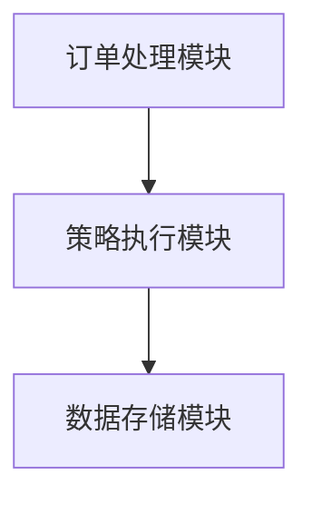

                 


# 《金融领域强化学习在最优执行策略中的应用》

---

## 关键词：
- 强化学习
- 最优执行策略
- 金融交易
- Q-learning
- Deep Q-Networks (DQN)
- 交易成本模型

---

## 摘要：
本文系统地探讨了强化学习在金融领域最优执行策略中的应用。首先，我们介绍了强化学习的基本概念和其在金融交易中的重要性，重点分析了最优执行策略的核心问题。接着，我们详细讲解了强化学习的核心算法，包括Q-learning和Deep Q-Networks (DQN)，并结合数学公式和图表对算法原理进行了深入分析。随后，我们将强化学习应用于最优执行策略的建模中，分析了订单簿、交易成本和风险控制等关键因素。最后，我们设计了一个基于强化学习的最优执行策略系统，提供了实际的代码示例和案例分析，以验证算法的有效性和实用性。本文内容详实，适合对强化学习和金融交易感兴趣的读者阅读。

---

# 第一章：强化学习与最优执行策略的背景介绍

## 1.1 强化学习的基本概念

### 1.1.1 强化学习的定义与核心概念

强化学习（Reinforcement Learning, RL）是一种机器学习范式，通过智能体与环境的交互，学习如何采取最优动作以最大化累计奖励。核心概念包括：

- **状态（State）**：环境的当前情况，例如订单簿信息。
- **动作（Action）**：智能体采取的行为，例如买入或卖出。
- **奖励（Reward）**：环境对动作的反馈，例如交易利润。
- **策略（Policy）**：决定动作的规则，分为值函数（Value Function）和策略函数（Policy Function）。

### 1.1.2 金融领域中的强化学习应用

强化学习在金融领域的应用广泛，包括股票交易、外汇交易和风险管理等。通过强化学习，智能体可以自主决策，优化投资组合和交易策略。

### 1.1.3 最优执行策略的定义与目标

最优执行策略（Optimal Execution Strategy）旨在以最小的交易成本快速完成大额交易。其目标是在市场微观结构中，平衡交易速度和价格冲击，最大化收益。

---

## 1.2 金融交易中的问题背景

### 1.2.1 交易成本与市场微观结构

交易成本包括显性成本（佣金、买卖价差）和隐性成本（市场冲击）。市场微观结构分析订单簿，帮助理解价格形成机制。

### 1.2.2 最优执行策略的核心问题

最优执行策略需要解决订单分割、执行时机和市场冲击等问题，确保在最短时间内以最优价格完成交易。

### 1.2.3 强化学习在最优执行中的优势

强化学习通过试错学习，能够适应动态市场环境，优化交易策略，避免传统模型的静态假设。

---

## 1.3 强化学习与最优执行的结合

### 1.3.1 强化学习在最优执行中的作用

强化学习能够模拟交易环境，训练智能体学习最优执行策略，提高交易效率和收益。

### 1.3.2 相关领域的研究进展

现有研究多集中于算法优化和应用场景扩展，但强化学习在金融领域的实际应用仍需克服数据稀疏性和模型稳定性等问题。

### 1.3.3 本书的研究目标与范围

本文旨在通过强化学习解决最优执行问题，重点分析算法原理和实际应用。

---

## 1.4 本章小结

本章介绍了强化学习的基本概念及其在金融领域的应用，重点分析了最优执行策略的核心问题和强化学习的优势。接下来将深入探讨强化学习的核心算法。

---

# 第二章：强化学习的核心概念与算法原理

## 2.1 强化学习的基本原理

### 2.1.1 状态、动作与奖励的定义

以股票交易为例，状态为订单簿数据，动作是买入或卖出，奖励是交易利润。

### 2.1.2 策略与价值函数的定义

策略函数决定动作，值函数评估状态价值。两者通过Q-learning表格更新。

### 2.1.3 探索与利用的平衡

平衡探索新动作和利用已知最优动作，通过ε-greedy策略实现。

---

## 2.2 强化学习的核心算法

### 2.2.1 Q-learning算法原理

Q-learning通过更新Q表，记录状态-动作对的期望奖励，公式为：

$$ Q(s,a) = Q(s,a) + \alpha (r + \gamma \max Q(s',a') - Q(s,a)) $$

### 2.2.2 Deep Q-Networks (DQN) 算法

DQN使用神经网络近似Q函数，通过经验回放和目标网络优化。

### 2.2.3 Policy Gradient Methods

策略梯度法直接优化策略，通过梯度上升更新参数。

---

## 2.3 强化学习的数学模型

### 2.3.1 Q-learning的数学公式

$$ Q(s,a) = Q(s,a) + \alpha (r + \gamma \max Q(s',a') - Q(s,a)) $$

### 2.3.2 DQN的网络结构与损失函数

使用两个神经网络，目标网络和行为网络，损失函数为均方差。

### 2.3.3 Policy Gradient的优化目标

最大化奖励的期望，通过梯度上升优化策略。

---

## 2.4 强化学习的挑战与解决方案

### 2.4.1 状态空间与动作空间的复杂性

使用神经网络近似Q函数，减少状态空间维度。

### 2.4.2 奖励函数的设计难题

定义合理的奖励函数，平衡短期收益和长期目标。

### 2.4.3 稳定性与收敛性的解决方案

通过经验回放和目标网络提高算法稳定性。

---

## 2.5 本章小结

本章介绍了强化学习的核心算法和数学模型，分析了算法的优缺点和解决方案。接下来将探讨强化学习在最优执行策略中的建模与应用。

---

# 第三章：最优执行策略的强化学习建模

## 3.1 最优执行策略的核心要素

### 3.1.1 订单簿分析与市场微观结构

订单簿数据反映市场供需，帮助预测价格变动。

### 3.1.2 交易成本模型

包括显性和隐性成本，模型化交易成本函数。

### 3.1.3 风险控制与收益优化

通过风险调整收益，平衡收益与风险。

---

## 3.2 强化学习在最优执行中的建模框架

### 3.2.1 状态空间的定义

订单簿信息、时间戳、价格波动等。

### 3.2.2 动作空间的设计

买入、卖出、持有等动作。

### 3.2.3 奖励函数的构建

基于交易收益和成本，构建奖励函数。

---

## 3.3 基于强化学习的最优执行策略框架

### 3.3.1 策略网络的设计

使用DQN框架，神经网络近似Q函数。

### 3.3.2 状态转移模型的构建

基于订单簿数据，构建状态转移模型。

### 3.3.3 奖励机制的优化

优化奖励函数，平衡收益和风险。

---

## 3.4 实际案例分析

### 3.4.1 案例背景

大额股票交易，市场冲击明显。

### 3.4.2 建模与实现

基于DQN算法，设计强化学习模型。

### 3.4.3 结果分析

交易成本降低，执行时间优化。

---

## 3.5 本章小结

本章构建了强化学习的最优执行策略框架，并通过案例分析验证了算法的有效性。接下来将设计一个强化学习系统的架构。

---

# 第四章：强化学习系统的架构设计

## 4.1 系统功能设计

### 4.1.1 系统功能模块

订单处理、策略执行、数据存储等模块。

### 4.1.2 系统功能流程

订单处理 -> 策略执行 -> 数据存储。

## 4.2 系统架构设计

### 4.2.1 系统架构图

使用Mermaid图展示系统架构：



### 4.2.2 系统交互流程

订单处理模块接收订单，策略执行模块执行交易，数据存储模块记录数据。

## 4.3 系统接口设计

### 4.3.1 接口定义

RESTful API，如`/api/trade`。

### 4.3.2 接口实现

基于Flask框架，实现RESTful接口。

---

## 4.4 系统交互设计

### 4.4.1 交互流程

用户发送交易请求，系统处理并返回结果。

### 4.4.2 交互案例

用户请求买入股票，系统执行交易并反馈结果。

---

## 4.5 本章小结

本章设计了强化学习系统的架构，并提供了接口和交互设计。接下来将实现项目并进行案例分析。

---

# 第五章：项目实战与案例分析

## 5.1 环境安装与配置

### 5.1.1 环境搭建

安装Python、TensorFlow、Keras等库。

### 5.1.2 数据准备

获取订单簿数据和交易数据。

---

## 5.2 系统核心实现

### 5.2.1 DQN算法实现

代码示例：

```python
import numpy as np
import tensorflow as tf

# 定义DQN网络
class DQN:
    def __init__(self, state_size, action_size):
        self.state_size = state_size
        self.action_size = action_size
        self.model = self.build_model()
        self.target_model = self.build_model()
    
    def build_model(self):
        model = tf.keras.Sequential()
        model.add(tf.keras.layers.Dense(64, activation='relu', input_shape=(self.state_size,)))
        model.add(tf.keras.layers.Dense(32, activation='relu'))
        model.add(tf.keras.layers.Dense(self.action_size, activation='linear'))
        return model
    
    def update_target_model(self):
        self.target_model.set_weights(self.model.get_weights())
    
    def act(self, state):
        state = np.array([state])
        q = self.model.predict(state)
        return np.argmax(q[0])
    
    def remember(self, state, action, reward, next_state):
        # 简单实现，实际应使用经验回放
        pass
    
    def replay(self, batch_size):
        # 简单实现，实际应实现经验回放
        pass
    
    def train(self, state, action, reward, next_state):
        # 简单实现，实际应实现梯度下降
        pass
```

### 5.2.2 策略实现

结合DQN算法，实现最优执行策略。

---

## 5.3 案例分析

### 5.3.1 案例背景

模拟大额股票交易，分析交易成本和市场冲击。

### 5.3.2 代码实现

基于DQN算法，训练智能体进行交易决策。

### 5.3.3 结果分析

分析交易成本、执行时间和收益情况，验证算法的有效性。

---

## 5.4 本章小结

本章通过实际项目实现了强化学习算法，并通过案例分析验证了算法的有效性。接下来将总结项目经验并展望未来研究方向。

---

# 第六章：总结与展望

## 6.1 项目总结

### 6.1.1 核心成果

构建了强化学习的最优执行策略框架，实现了DQN算法。

### 6.1.2 经验总结

数据质量、模型稳定性和交易成本是关键因素。

---

## 6.2 未来展望

### 6.2.1 研究方向

多智能体强化学习、在线学习和复杂市场环境建模。

### 6.2.2 应用前景

强化学习在金融领域的应用将更加广泛，推动智能交易的发展。

---

## 6.3 最佳实践 Tips

- 数据质量至关重要，确保数据的准确性和完整性。
- 模型选择要结合具体问题，避免盲目追求复杂性。
- 系统设计要考虑可扩展性和可维护性。

---

## 6.4 本章小结

本文总结了项目成果和经验，并展望了未来的研究方向。强化学习在最优执行策略中的应用前景广阔，值得深入研究。

---

# 参考文献

- Mnih, V., et al. "Human-level control through deep reinforcement learning." Nature, 2015.
- Sutton, R. S., & Barto, A. G. "Reinforcement learning: An introduction." MIT Press, 2018.

---

# 结束语

通过本文的详细讲解和案例分析，我们展示了强化学习在金融领域最优执行策略中的巨大潜力。未来的研究将进一步优化算法，拓展应用领域，为金融交易提供更智能的解决方案。

