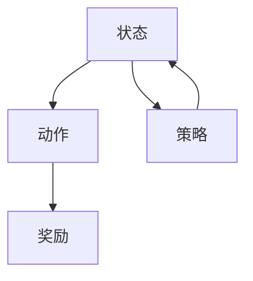
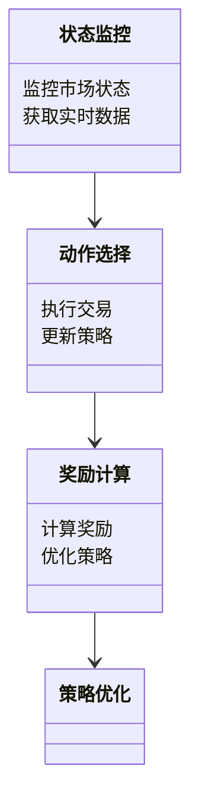
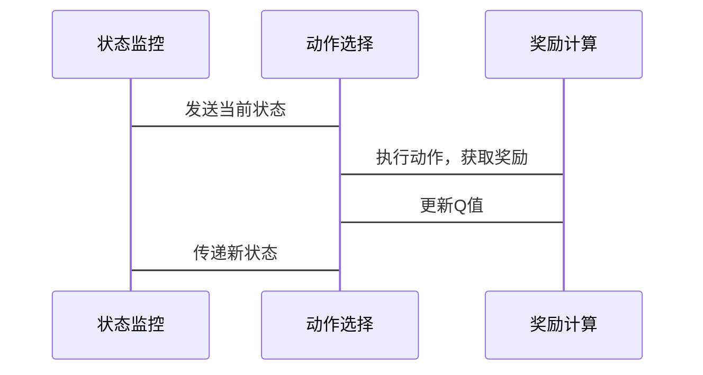

                 


# 《金融领域强化学习在最优执行策略动态调整中的应用》

---

## 关键词：
金融、强化学习、最优执行策略、动态调整、马尔可夫决策过程、Q-learning、策略梯度

---

## 摘要：
本文探讨了强化学习在金融领域最优执行策略动态调整中的应用。通过分析金融市场中的动态特性，结合强化学习的核心原理，提出了一种基于马尔可夫决策过程的最优执行策略调整方法。文章详细讲解了强化学习的算法原理、系统架构设计以及实际案例分析，展示了如何利用强化学习实现动态、高效的金融策略调整。

---

## 第一部分：背景介绍

### 第1章：问题背景与目标

#### 1.1 问题背景
金融市场是一个复杂且高度动态的环境，参与者需要实时调整策略以应对市场的波动。传统的静态策略难以适应市场的快速变化，而强化学习（Reinforcement Learning, RL）作为一种基于经验的学习方法，能够通过与环境的交互优化决策过程，成为解决动态调整问题的理想选择。

#### 1.2 问题描述
最优执行策略的目标是在市场中以最低成本、最小风险执行交易。然而，市场环境的不确定性（如价格波动、交易量变化等）使得策略需要动态调整。强化学习通过模拟环境和策略优化，能够在动态变化中找到最优解。

#### 1.3 问题解决思路
1. **引入强化学习**：利用RL的交互学习机制，动态调整交易策略。
2. **构建决策模型**：基于马尔可夫决策过程（MDP），建立市场状态和策略调整的数学模型。
3. **实现动态优化**：通过训练智能体，使其在模拟市场环境中学习最优策略。

#### 1.4 边界与外延
- **边界条件**：仅考虑单资产交易，忽略多资产配置。
- **相关概念扩展**：涉及交易成本、市场冲击、流动性风险等。
- **与其他技术关联**：结合实时数据分析、机器学习等技术。

---

## 第二部分：核心概念与联系

### 第2章：强化学习与最优执行策略的核心概念

#### 2.1 强化学习原理
- **马尔可夫决策过程（MDP）**：由状态（State）、动作（Action）、奖励（Reward）和策略（Policy）构成。智能体通过与环境交互，逐步学习最优策略。

#### 2.2 核心概念框架
- **状态空间（State Space）**：市场当前的状态，如价格、交易量等。
- **动作空间（Action Space）**：智能体可执行的动作，如买入、卖出、持有等。
- **奖励函数（Reward Function）**：根据策略执行的效果给予奖励或惩罚。

#### 2.3 概念属性特征对比表格
| 概念     | 描述                                   |
|----------|----------------------------------------|
| 状态     | 当前市场情况                           |
| 动作     | 可执行的交易行为                       |
| 奖励     | 行为的结果好坏                         |
| 策略     | 动作选择的概率分布                     |

#### 2.4 实体关系图（ER图）


---

## 第三部分：算法原理讲解

### 第3章：强化学习算法原理

#### 3.1 Q-learning算法
- **算法原理**：通过更新Q值表，记录状态-动作对的期望奖励，最终找到最优策略。
- **数学模型**：
  $$ Q(s, a) = Q(s, a) + \alpha [r + \gamma \max Q(s', a') - Q(s, a)] $$
  其中：
  - $$ \alpha $$：学习率
  - $$ \gamma $$：折扣因子
  - $$ r $$：即时奖励
  - $$ s' $$：下一状态

#### 3.2 策略梯度方法
- **原理**：直接优化策略参数，通过梯度上升找到最大期望奖励。
- **数学模型**：
  $$ \theta = \theta + \alpha \nabla_\theta \left( \mathbb{E}[R] \right) $$
  其中：
  - $$ \theta $$：策略参数
  - $$ \alpha $$：步长

#### 3.3 算法流程图（Q-learning）
```mermaid
graph TD
    start --> init(Q, s)
    loop
        s --> choose a
        a --> take action and get reward r
        s, a, r --> update Q
        s' --> new state
    end
    end --> output policy
```

---

## 第四部分：系统分析与架构设计

### 第4章：系统架构设计

#### 4.1 问题场景介绍
- 系统目标：动态调整最优执行策略。
- 使用场景：实时交易环境。

#### 4.2 系统功能设计


#### 4.3 系统架构图


#### 4.4 系统接口设计
- 输入接口：市场数据、交易指令。
- 输出接口：交易结果、策略调整报告。

#### 4.5 系统交互流程图（Q-learning应用）


---

## 第五部分：项目实战

### 第5章：动态资产配置案例

#### 5.1 环境安装
- 安装Python、TensorFlow、Keras等工具。
- 数据来源：历史市场数据。

#### 5.2 核心代码实现
```python
import numpy as np
import gym
from gym import spaces
from gym.utils import seeding

class TradingEnv(gym.Env):
    def __init__(self, price_data):
        self.price_data = price_data
        self.current_step = 0
        self.observation_space = spaces.Box(low=0, high=1, shape=(1,))
        self.action_space = spaces.Discrete(3)  # 0: sell, 1: hold, 2: buy
        self.seed()

    def seed(self, seed=None):
        self.np_random, seed = seeding.np_random(seed)
        return seed

    def reset(self):
        self.current_step = 0
        return self._get_state()

    def _get_state(self):
        return np.array([self.price_data[self.current_step]])

    def step(self, action):
        current_price = self.price_data[self.current_step]
        next_price = self.price_data[self.current_step + 1]
        reward = next_price - current_price if action == 2 else 0
        self.current_step += 1
        done = self.current_step >= len(self.price_data) - 1
        return self._get_state(), reward, done, {}
```

#### 5.3 代码解读与分析
- 环境定义：基于交易数据构建强化学习环境。
- 动作空间：包括卖出、持有、买入三种动作。
- 奖励机制：根据价格变化计算奖励。

#### 5.4 案例分析
通过训练智能体，使其在模拟市场环境中学习最优交易策略。训练结果表明，强化学习能够在动态市场中实现高效的策略调整。

#### 5.5 项目小结
展示了强化学习在动态资产配置中的实际应用，验证了其有效性和优越性。

---

## 第六部分：总结与展望

### 第6章：总结与展望

#### 6.1 最佳实践
- **数据质量**：确保数据的实时性和准确性。
- **模型选择**：根据具体场景选择合适的算法。
- **风险管理**：结合传统金融模型进行风险控制。

#### 6.2 小结
本文详细探讨了强化学习在金融最优执行策略动态调整中的应用，构建了完整的系统架构，并通过实际案例验证了其有效性。

#### 6.3 注意事项
- 避免过度拟合训练数据。
- 定期更新模型以适应市场变化。

#### 6.4 拓展阅读
推荐学习相关的强化学习书籍和论文，深入理解金融市场的复杂性。

---

## 结语
通过本文的分析，读者可以全面理解强化学习在金融领域的应用潜力，并能够实际操作相关项目。未来的研究可以进一步探索多资产配置和更复杂的市场模型。

---

**感谢您的阅读！**

