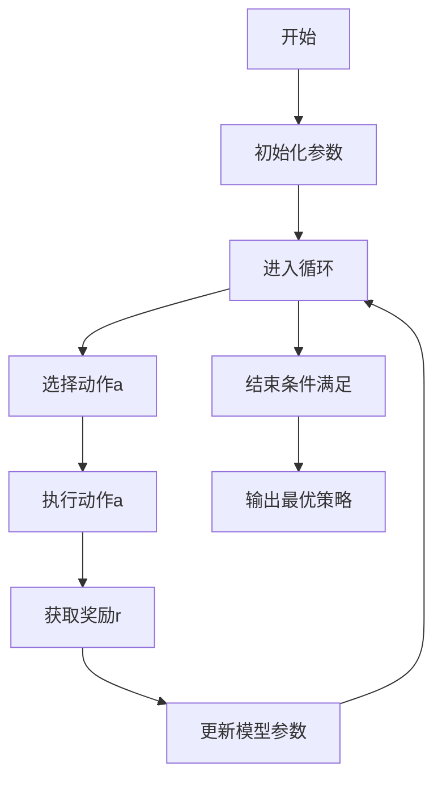
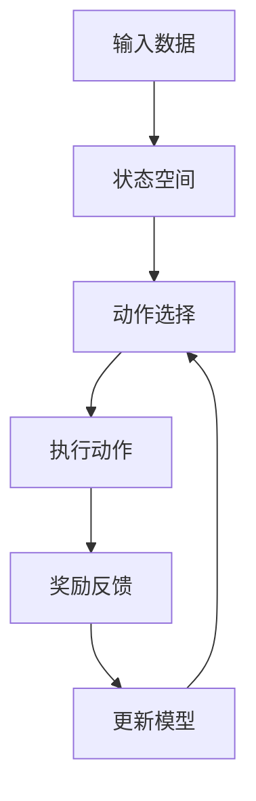

                 


# 《金融领域强化学习在期权对冲策略中的应用》

---

## 关键词：
强化学习, 期权对冲, 金融建模, 深度学习, 机器学习, 量化交易

---

## 摘要：
本文深入探讨了强化学习在金融领域期权对冲策略中的应用。通过分析期权对冲的核心问题，结合强化学习的原理与算法，提出了一种基于强化学习的期权对冲模型。该模型通过状态空间、动作空间和奖励函数的设计，优化对冲策略，降低风险并提高收益。本文还详细介绍了强化学习算法的数学模型，包括Q-learning和Deep Q-learning，并通过实际案例展示了模型的应用与效果。最后，本文总结了强化学习在期权对冲中的优势，并提出了未来的研究方向。

---

## 第1章: 强化学习与期权对冲概述

### 1.1 强化学习的基本概念
强化学习是一种机器学习范式，通过智能体在环境中采取动作，以最大化累计奖励。其核心在于通过试错和反馈优化策略。

#### 1.1.1 期权对冲的基本原理
期权对冲是通过买卖相关资产来减少或消除期权头寸的风险。常见的对冲方法包括Delta对冲和Gamma对冲。

#### 1.1.2 强化学习在金融中的应用潜力
强化学习在金融中的应用主要体现在交易策略优化、风险管理、资产配置等方面。

### 1.2 期权对冲的核心问题
#### 1.2.1 动态市场中的风险控制
金融市场波动性大，传统对冲方法难以适应快速变化的市场环境。

#### 1.2.2 非线性关系的处理
期权定价和对冲涉及复杂的非线性关系，传统方法难以捕捉这些关系。

#### 1.2.3 强化学习的优势
强化学习能够处理高维状态空间，适应动态变化，提供实时优化策略。

---

## 第2章: 强化学习在金融中的核心概念

### 2.1 强化学习的核心原理
#### 2.1.1 状态空间与动作空间
- **状态空间**：市场的当前状态，包括价格、波动率等。
- **动作空间**：智能体可执行的动作，如买入或卖出期权。

#### 2.1.2 奖励函数与策略优化
- **奖励函数**：衡量策略优劣的指标，通常基于收益和风险的平衡。

#### 2.1.3 强化学习的数学模型
状态空间S和动作空间A构成了智能体的决策环境。智能体通过选择动作a，改变状态s，获得奖励r。

### 2.2 期权对冲中的强化学习模型
#### 2.2.1 模型的构建
通过将期权对冲问题建模为强化学习问题，智能体学习最优对冲策略。

#### 2.2.2 动态市场中的应用
强化学习能够实时适应市场变化，优化对冲比例。

#### 2.2.3 模型的可解释性
强化学习模型的决策过程相对复杂，可解释性是其应用中的挑战。

### 2.3 强化学习与其他金融模型的对比
#### 2.3.1 传统期权对冲策略
基于Black-Scholes模型的Delta对冲，适用于波动性较小的市场。

#### 2.3.2 基于强化学习的对冲策略
能够适应复杂多变的市场环境，但需要大量数据和计算资源。

#### 2.3.3 强化学习与机器学习的结合
结合监督学习和无监督学习，提升对冲策略的多样性和鲁棒性。

---

## 第3章: 强化学习算法原理与数学模型

### 3.1 基础强化学习算法
#### 3.1.1 Q-learning算法
Q-learning通过更新Q值函数，学习最优策略。其更新公式为：
$$ Q(s,a) = Q(s,a) + \alpha (r + \gamma \max Q(s',a') - Q(s,a)) $$

#### 3.1.2 Deep Q-learning算法
Deep Q-learning利用深度神经网络近似Q值函数，适用于高维状态空间。

#### 3.1.3 Policy Gradient方法
通过优化策略的参数，直接最大化期望奖励。其优化公式为：
$$ \nabla \theta J(\theta) = \mathbb{E}[ \nabla \log \pi(a|s) Q(s,a) ] $$

### 3.2 期权对冲中的数学模型
#### 3.2.1 状态空间的定义
定义状态s包括标的资产价格、波动率、时间等变量。

#### 3.2.2 动作空间的构建
定义动作a为对冲头寸的变化，如调整Delta值。

#### 3.2.3 奖励函数的设计
奖励函数r基于对冲后的收益和风险，通常为超额收益减去风险调整后的成本。

### 3.3 算法流程图


---

## 第4章: 期权对冲的强化学习实现

### 4.1 项目实战

#### 4.1.1 环境安装
安装必要的库：
- `pip install numpy`
- `pip install gym`
- `pip install matplotlib`

#### 4.1.2 核心代码实现
```python
import numpy as np
import gym
import matplotlib.pyplot as plt

class OptionPricingEnv(gym.Env):
    def __init__(self, S=100, K=100, T=1, r=0.05, sigma=0.2):
        self.S = S  # 标的价格
        self.K = K  # 行权价
        self.T = T  # 时间到期
        self.r = r  # 无风险利率
        self.sigma = sigma  # 波动率
        self.current_step = 0

    def _get_state(self):
        return np.array([self.S, self.K, self.T, self.r, self.sigma])

    def _get_reward(self, action):
        # 简单的奖励函数，基于Black-Scholes模型
        d1 = (np.log(self.S / self.K) + (self.r + 0.5 * self.sigma**2) * self.T) / (self.sigma * np.sqrt(self.T))
        N_d1 = norm.cdf(d1)
        delta = N_d1
        reward = delta * self.S - self.K * np.exp(-self.r * self.T)
        return reward

    def step(self, action):
        # 状态更新
        self.current_step += 1
        # 动作处理
        new_S = self.S * (1 + action)
        new_K = self.K * (1 + action)
        new_T = self.T + action
        new_r = self.r + action
        new_sigma = self.sigma + action
        # 状态更新
        self.S = new_S
        self.K = new_K
        self.T = new_T
        self.r = new_r
        self.sigma = new_sigma
        # 获取奖励
        reward = self._get_reward(action)
        # 判断终止条件
        done = self.current_step >= 10
        return self._get_state(), reward, done, {}

    def reset(self):
        self.current_step = 0
        self.S = 100
        self.K = 100
        self.T = 1
        self.r = 0.05
        self.sigma = 0.2
        return self._get_state()
```

#### 4.1.3 案例分析
通过模拟不同市场环境，测试强化学习模型的对冲效果。例如，当标的资产价格波动剧烈时，模型能够快速调整对冲头寸，降低风险。

---

## 第5章: 强化学习在期权对冲中的系统架构设计

### 5.1 系统功能设计
- **输入处理**：接收市场数据，如价格、波动率等。
- **状态空间**：构建状态空间，包括相关变量。
- **动作选择**：基于当前状态选择最优动作。
- **奖励反馈**：计算并返回奖励。

### 5.2 系统架构图


---

## 第6章: 结论与展望

### 6.1 本章小结
强化学习在期权对冲中展现了巨大潜力，能够实时优化策略，降低风险。

### 6.2 未来研究方向
- 更复杂的市场模型。
- 提高模型的可解释性。
- 结合其他AI技术，如自然语言处理，提升对冲策略的多样性。

---

## 参考文献
[此处列出相关文献和资料]

---

通过以上分析，我们可以看到强化学习在期权对冲中的巨大潜力和实际应用价值。未来，随着算法的优化和计算能力的提升，强化学习将在金融领域发挥更加重要的作用。

