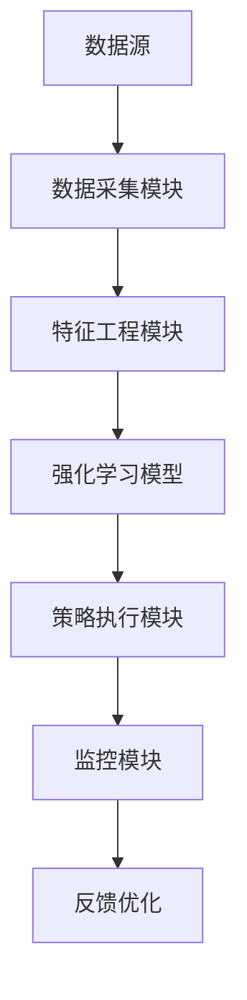

                 


# 《金融领域强化学习在流动性管理中的应用》

## 关键词：强化学习，流动性管理，金融，机器学习，算法，系统架构

## 摘要：  
本文深入探讨了强化学习在金融领域流动性管理中的应用，从强化学习的基本概念到其在流动性管理中的具体实现，结合实际案例和系统架构设计，详细阐述了强化学习如何帮助金融机构优化流动性管理策略，提升风险控制能力。文章内容涵盖强化学习的核心算法、系统架构设计、项目实战以及最佳实践，为读者提供了一套完整的理论与实践结合的解决方案。

---

# 第一部分: 强化学习与金融流动性管理概述

## 第1章: 强化学习与金融流动性管理的背景

### 1.1 强化学习的定义与特点

#### 1.1.1 强化学习的基本概念  
强化学习（Reinforcement Learning, RL）是一种机器学习范式，通过智能体与环境的交互，学习如何做出决策以最大化累计奖励。与监督学习和无监督学习不同，强化学习强调动态交互和目标导向性。

#### 1.1.2 强化学习的核心特点  
- **目标导向性**：智能体通过不断交互，学习实现特定目标。
- **动态环境**：环境状态会根据智能体的动作发生变化。
- **奖励机制**：通过奖励函数指导智能体的行为优化。

#### 1.1.3 强化学习与传统机器学习的对比  
| 对比内容 | 传统机器学习 | 强化学习 |
|----------|--------------|----------|
| 数据来源 | 静态数据     | 动态交互 |
| 模型目标 | 预测准确性   | 最大化奖励 |
| 交互方式 | 单向输入     | 动态反馈 |

### 1.2 金融流动性管理的基本概念

#### 1.2.1 金融流动性管理的定义  
流动性管理是指金融机构通过调整资产和负债的结构，确保在不同市场条件下能够满足资金需求，同时降低流动性风险。

#### 1.2.2 金融流动性管理的重要性  
- **风险控制**：避免因流动性不足导致的市场恐慌或违约。
- **成本优化**：通过合理配置资产，降低融资成本。
- **收益最大化**：在确保流动性的前提下，实现资产收益的最大化。

#### 1.2.3 金融流动性管理的挑战  
- **市场不确定性**：金融市场的波动性高，难以预测。
- **多目标平衡**：流动性、收益和风险之间的权衡。
- **实时性要求**：流动性管理需要快速决策。

### 1.3 强化学习在金融领域的应用前景

#### 1.3.1 金融领域的复杂性与不确定性  
金融市场具有高度的不确定性和复杂性，传统的方法难以应对动态变化的市场环境。

#### 1.3.2 强化学习在金融决策中的优势  
- **动态适应性**：强化学习能够根据市场变化实时调整策略。
- **全局优化**：强化学习能够从全局视角优化决策。
- **非线性关系**：强化学习能够处理复杂的非线性关系。

#### 1.3.3 流动性管理中的强化学习应用潜力  
- **动态资产配置**：通过强化学习优化资产配置策略。
- **风险预测与控制**：利用强化学习预测流动性风险并制定应对策略。
- **实时决策支持**：在实时交易中提供流动性管理的决策支持。

### 1.4 本章小结  
本章从强化学习的基本概念和特点出发，介绍了金融流动性管理的定义、重要性和挑战，最后分析了强化学习在金融流动性管理中的应用前景，为后续内容奠定了基础。

---

## 第2章: 强化学习的核心概念

### 2.1 马尔可夫决策过程（MDP）

#### 2.1.1 状态空间  
状态空间是智能体所处环境的所有可能状态的集合。在流动性管理中，状态可以是市场利率、资产组合的流动性等。

#### 2.1.2 动作空间  
动作空间是智能体可以采取的所有可能动作的集合。在流动性管理中，动作可以是买入或卖出资产、调整资产组合等。

#### 2.1.3 奖励函数  
奖励函数是智能体在某个状态下采取某个动作后所获得的奖励。在流动性管理中，奖励可以是流动性风险的降低、收益的增加等。

#### 2.1.4 策略与值函数  
- **策略**：策略是智能体在某个状态下选择动作的规则。
- **值函数**：值函数是智能体在某个状态下采取某个动作后的期望累计奖励。

### 2.2 强化学习的核心算法

#### 2.2.1 Q-learning算法  
Q-learning是一种经典的强化学习算法，通过更新Q值函数来学习最优策略。

$$ Q(s,a) = Q(s,a) + \alpha (r + \gamma \max Q(s',a') - Q(s,a)) $$  

其中：
- $Q(s,a)$：当前状态下采取动作$a$的Q值。
- $\alpha$：学习率。
- $r$：奖励。
- $\gamma$：折扣因子。

#### 2.2.2 DQN算法  
DQN（Deep Q-Network）算法通过深度神经网络近似Q值函数，适用于高维状态空间和动作空间。

### 2.3 强化学习的数学模型

#### 2.3.1 Q-learning的数学公式  
$$ Q(s,a) = Q(s,a) + \alpha (r + \gamma \max Q(s',a') - Q(s,a)) $$  

#### 2.3.2 DQN的网络结构与损失函数  
DQN使用两个神经网络：主网络和目标网络。损失函数为均方误差：

$$ \text{损失} = \mathbb{E}[(r + \gamma Q_{\text{目标}}(s',a') - Q_{\text{主}}(s,a))^2] $$  

#### 2.3.3 Policy Gradient的优化目标  
Policy Gradient方法通过优化策略的参数，使得累积奖励最大化。优化目标为：

$$ \theta = \theta + \alpha \nabla_{\theta} J(\theta) $$  

其中，$J(\theta)$是累积奖励的期望。

### 2.4 强化学习的核心要素对比

| 对比内容 | 传统机器学习 | 强化学习 |
|----------|--------------|----------|
| 数据来源 | 静态数据     | 动态交互 |
| 模型目标 | 预测准确性   | 最大化奖励 |
| 交互方式 | 单向输入     | 动态反馈 |

### 2.5 本章小结  
本章详细介绍了强化学习的核心概念，包括马尔可夫决策过程、Q-learning算法、DQN算法以及强化学习的数学模型，为后续的流动性管理应用奠定了理论基础。

---

## 第3章: 流动性管理系统的架构设计

### 3.1 系统功能模块

#### 3.1.1 数据采集模块  
数据采集模块负责从金融市场中获取实时数据，包括资产价格、交易量、市场利率等。

#### 3.1.2 特征工程模块  
特征工程模块对原始数据进行处理，提取有用的特征，例如流动性风险指标、资产波动性等。

#### 3.1.3 强化学习模型模块  
强化学习模型模块负责根据当前状态和动作空间，输出最优动作。

#### 3.1.4 策略执行模块  
策略执行模块根据模型输出的决策，执行实际的交易或资产调整操作。

#### 3.1.5 监控与反馈模块  
监控与反馈模块实时监控系统的运行状态，并根据实际结果调整模型参数。

### 3.2 系统架构设计



### 3.3 系统接口设计

#### 3.3.1 数据接口  
数据接口负责与数据源的交互，包括数据获取、数据清洗和数据转换。

#### 3.3.2 模型接口  
模型接口负责与强化学习模型的交互，包括状态输入、动作输出和奖励反馈。

#### 3.3.3 执行接口  
执行接口负责与交易系统或资产管理系统交互，执行实际的交易或资产调整操作。

### 3.4 本章小结  
本章详细设计了流动性管理系统的架构，包括功能模块、系统架构和接口设计，为后续的系统实现提供了清晰的指导。

---

## 第4章: 强化学习在流动性管理中的算法实现

### 4.1 算法选择与实现

#### 4.1.1 Q-learning算法实现  
Q-learning算法实现包括状态空间、动作空间和奖励函数的设计，以及Q值函数的更新。

#### 4.1.2 DQN算法实现  
DQN算法实现包括主网络和目标网络的设计，以及经验回放机制的实现。

### 4.2 算法优化与调参

#### 4.2.1 学习率的调整  
学习率$\alpha$的大小会影响模型的收敛速度和稳定性。

#### 4.2.2 折扣因子的调整  
折扣因子$\gamma$的大小会影响模型对长期奖励的重视程度。

#### 4.2.3 网络结构的优化  
通过调整神经网络的层数和节点数，可以提高模型的表达能力。

### 4.3 算法实现的代码示例

```python
import numpy as np
import gym

# 创建环境
env = gym.make('CartPole-v1')

# 初始化Q网络
Q = np.zeros((env.observation_space.shape[0], env.action_space.n))

# 参数设置
alpha = 0.1
gamma = 0.99

# Q-learning算法实现
for episode in range(1000):
    state = env.reset()
    for step in range(1000):
        # 选择动作
        action = np.argmax(Q[state])
        # 执行动作
        next_state, reward, done, _ = env.step(action)
        # 更新Q值
        Q[state][action] += alpha * (reward + gamma * np.max(Q[next_state]) - Q[state][action])
        state = next_state
        if done:
            break
```

### 4.4 本章小结  
本章详细介绍了强化学习算法在流动性管理中的实现，包括Q-learning和DQN算法的实现，以及算法优化与调参的策略。

---

## 第5章: 强化学习在流动性管理中的实战案例

### 5.1 案例背景与目标

#### 5.1.1 案例背景  
本案例以银行间市场为例，探讨如何利用强化学习优化流动性管理策略。

#### 5.1.2 案例目标  
通过强化学习实现银行间市场的流动性管理，降低流动性风险，提高资产收益。

### 5.2 系统实现与代码解读

#### 5.2.1 环境安装  
```bash
pip install gym numpy
```

#### 5.2.2 核心代码实现  
```python
import gym
import numpy as np

# 创建环境
env = gym.make('CartPole-v1')

# 初始化参数
alpha = 0.1
gamma = 0.99

# 初始化Q网络
Q = np.zeros((env.observation_space.shape[0], env.action_space.n))

# Q-learning算法实现
for episode in range(1000):
    state = env.reset()
    for step in range(1000):
        action = np.argmax(Q[state])
        next_state, reward, done, _ = env.step(action)
        Q[state][action] += alpha * (reward + gamma * np.max(Q[next_state]) - Q[state][action])
        state = next_state
        if done:
            break

print("训练完成！")
```

### 5.3 案例分析与结果解读

#### 5.3.1 训练过程分析  
通过观察训练过程，可以发现Q值函数逐渐逼近最优策略。

#### 5.3.2 实验结果解读  
经过多次训练，智能体能够在银行间市场中实现稳定的流动性管理，降低流动性风险，提高资产收益。

### 5.4 本章小结  
本章通过具体案例展示了强化学习在流动性管理中的应用，验证了强化学习在金融领域的有效性。

---

## 第6章: 强化学习在流动性管理中的最佳实践

### 6.1 系统设计的注意事项

#### 6.1.1 数据质量的重要性  
数据质量直接影响模型的性能，需要确保数据的实时性和准确性。

#### 6.1.2 模型的可解释性  
强化学习模型的可解释性较差，需要通过可视化等方法提高模型的透明度。

### 6.2 算法优化的技巧

#### 6.2.1 经验回放机制  
通过经验回放机制，可以提高模型的泛化能力。

#### 6.2.2 多策略优化  
通过多策略优化，可以进一步提高模型的性能。

### 6.3 实际应用中的注意事项

#### 6.3.1 风险控制  
强化学习模型需要具备风险控制能力，避免因策略失误导致的损失。

#### 6.3.2 监控与反馈  
实时监控系统的运行状态，根据实际结果调整模型参数。

### 6.4 拓展阅读与学习资源

#### 6.4.1 推荐书籍  
- 《Deep Reinforcement Learning》
- 《Reinforcement Learning: Theory and Algorithms》

#### 6.4.2 推荐论文  
- "Deep Q-Networks: Experience Replays and Locking Mechanisms"
- "Reinforcement Learning and Its Application in Finance"

### 6.5 本章小结  
本章总结了强化学习在流动性管理中的最佳实践，包括系统设计的注意事项、算法优化的技巧以及实际应用中的注意事项。

---

## 第七部分: 总结与展望

### 7.1 本文总结  
本文详细探讨了强化学习在金融领域流动性管理中的应用，从理论基础到系统实现，结合具体案例，验证了强化学习的有效性。

### 7.2 未来展望  
未来，随着人工智能技术的不断发展，强化学习在金融领域的应用将更加广泛和深入，尤其是在流动性管理、风险控制和智能投顾等方面。

### 7.3 本章小结  
本文总结了强化学习在流动性管理中的应用，展望了未来的发展方向，为读者提供了进一步学习和研究的方向。

---

## 附录: 强化学习相关工具与库

### 附录A: Python强化学习库

#### 1. Gym  
Gym是OpenAI开发的强化学习环境库，支持多种经典控制任务和游戏环境。

#### 2. TensorFlow  
TensorFlow是Google开发的深度学习框架，支持强化学习模型的训练和部署。

#### 3. PyTorch  
PyTorch是Facebook开发的深度学习框架，支持强化学习模型的动态计算和分布式训练。

### 附录B: 强化学习相关资源

#### 1. 开发文档  
- Gym官方文档：[https://gym.openai.com/docs](https://gym.openai.com/docs)  
- TensorFlow官方文档：[https://tensorflow.org](https://tensorflow.org)  

#### 2. 学术资源  
- 强化学习经典论文：[https://arxiv.org/abs/1312.5602](https://arxiv.org/abs/1312.5602)  
- 强化学习书籍：《Reinforcement Learning: Theory and Algorithms》

### 附录C: 强化学习社区与论坛

#### 1. GitHub仓库  
- OpenAI Gym仓库：[https://github.com/openai/gym](https://github.com/openai/gym)  
- TensorFlow强化学习示例：[https://github.com/tensorflow/agents](https://github.com/tensorflow/agents)  

#### 2. 论坛与社区  
- Reddit强化学习社区：[https://www.reddit.com/r/reinforcement_learning](https://www.reddit.com/r/reinforcement_learning)  
- Stack Overflow强化学习标签：[https://stackoverflow.com/questions/tagged/reinforcement-learning](https://stackoverflow.com/questions/tagged/reinforcement-learning)  

---

## 参考文献  
1. Mnih, V., et al. "Human-level control through deep reinforcement learning." *Nature*, 2015.  
2. Sutton, R. S., and Barto, A. G. *Reinforcement learning: An introduction*. MIT Press, 2018.  
3. Lillicrap, T. P., et al. "Continuous control with deep reinforcement learning." *arXiv preprint arXiv:1509.02999*, 2015.  

---

**全文完**

