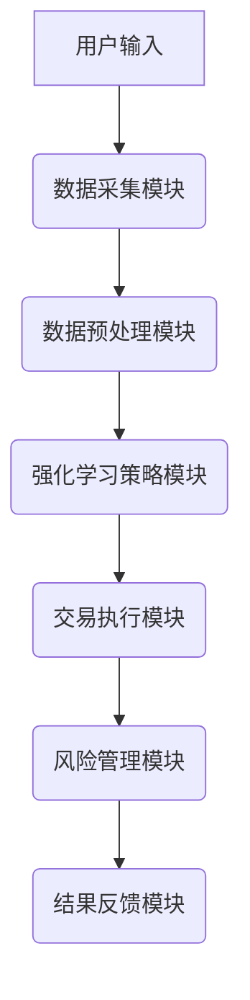
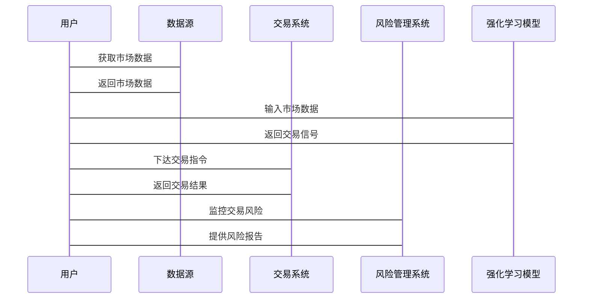

                 


# 《金融领域强化学习在算法交易中的应用》

## 关键词：强化学习、算法交易、金融、Q-learning、Deep Q-Network、数学模型

## 摘要：  
本文探讨了强化学习在算法交易中的应用，从基本概念到数学模型，再到系统设计和项目实战，全面分析了强化学习在金融交易中的潜力和实现方法。文章通过详细讲解Q-learning和Deep Q-Network算法，展示了如何将强化学习应用于交易决策，并设计了一个完整的算法交易系统架构，结合实际案例分析，为读者提供了从理论到实践的全面指导。

---

# 第一部分：强化学习与算法交易概述

## 第1章：强化学习与算法交易的背景

### 1.1 强化学习的基本概念

#### 1.1.1 强化学习的定义与特点  
强化学习（Reinforcement Learning，RL）是一种机器学习范式，通过智能体与环境的交互，学习如何做出决策以最大化累计奖励。其核心特点包括：  
- **自主性**：智能体在没有明确指导的情况下，通过试错学习。  
- **延迟反馈**：奖励通常在多个动作之后才给出。  
- **高维状态空间**：适用于复杂环境中的决策问题。  

#### 1.1.2 强化学习的核心要素  
- **状态（State）**：智能体所处的环境情况，例如金融市场的价格、成交量等。  
- **动作（Action）**：智能体可以执行的操作，例如买入、卖出或持有。  
- **奖励（Reward）**：智能体行为的反馈，通常以利润或损失的形式体现。  

#### 1.1.3 强化学习与监督学习的区别  
| 对比维度 | 监督学习 | 强化学习 |
|----------|----------|----------|
| 数据来源 | 标签数据 | 延迟反馈 |
| 决策依据 | 确定性 | 随机性 |
| 应用场景 | 分类、回归 | 游戏、机器人控制 |

### 1.2 算法交易的基本概念

#### 1.2.1 算法交易的定义与特点  
算法交易（Algorithmic Trading）是指通过计算机算法自动执行交易决策，其特点包括：  
- **高效性**：快速决策和执行。  
- **自动化**：减少人为干预。  
- **数据驱动**：依赖历史数据和市场信号。  

#### 1.2.2 算法交易的主要类型  
- **高频交易**：利用算法在极短时间内完成大量交易。  
- **统计套利**：基于统计模型寻找市场中的套利机会。  
- **机器学习驱动的交易**：利用机器学习模型预测市场走势。  

#### 1.2.3 算法交易在金融领域的重要性  
- 提高交易效率。  
- 发现市场中的非理性定价机会。  
- 降低人为情绪对交易的干扰。  

### 1.3 强化学习在算法交易中的应用前景

#### 1.3.1 强化学习在金融领域的优势  
- **非线性关系建模**：强化学习能够捕捉复杂的市场动态。  
- **自适应性**：能够根据市场变化调整策略。  
- **多目标优化**：可以同时优化收益、风险等多个目标。  

#### 1.3.2 算法交易中强化学习的应用场景  
- **交易策略优化**：通过强化学习训练最优交易策略。  
- **风险管理**：实时监控并调整交易风险。  
- **市场微观结构分析**：理解市场参与者行为。  

#### 1.3.3 强化学习算法交易的挑战与机遇  
- **挑战**：市场非平稳性、高维状态空间、过拟合风险。  
- **机遇**：捕捉市场短期波动、提高交易效率、实现个性化策略。  

---

## 第2章：强化学习与算法交易的核心概念

### 2.1 强化学习的基本原理

#### 2.1.1 状态、动作、奖励的定义  
- **状态（State）**：市场当前的状态，例如价格、成交量、市场情绪等。  
- **动作（Action）**：交易策略，例如买入、卖出或持有。  
- **奖励（Reward）**：交易结果的收益或损失。  

#### 2.1.2 策略与价值函数的定义  
- **策略（Policy）**：智能体选择动作的概率分布。  
- **价值函数（Value Function）**：状态或状态-动作对的期望收益。  

#### 2.1.3 探索与利用的平衡  
- **探索（Exploration）**：尝试新的动作以发现更好的策略。  
- **利用（Exploitation）**：利用已知的最佳动作以最大化收益。  

### 2.2 算法交易中的强化学习模型

#### 2.2.1 简单强化学习模型的构建  
- **输入**：市场数据（价格、成交量等）。  
- **输出**：交易决策（买入、卖出或持有）。  

#### 2.2.2 复杂强化学习模型的构建  
- **输入**：市场数据、技术指标（如RSI、MACD）。  
- **输出**：多策略组合的交易信号。  

#### 2.2.3 强化学习模型的训练过程  
1. 初始化策略参数。  
2. 与环境交互，获取状态、动作和奖励。  
3. 更新策略参数以最大化累计奖励。  

### 2.3 强化学习与算法交易的核心联系

#### 2.3.1 强化学习在交易决策中的应用  
- 利用强化学习训练交易策略，实现自动化决策。  

#### 2.3.2 算法交易中的强化学习优化  
- 通过强化学习优化交易模型，提高收益和风险控制能力。  

#### 2.3.3 强化学习在风险管理中的应用  
- 监控市场风险，实时调整交易策略。  

---

## 第3章：强化学习算法的数学模型与公式

### 3.1 Q-learning算法

#### 3.1.1 Q-learning的基本原理  
Q-learning是一种基于价值函数的强化学习算法，通过更新Q表来学习最优策略。  

#### 3.1.2 Q-learning的数学公式  
$$ Q(s, a) = Q(s, a) + \alpha [r + \gamma \max Q(s', a') - Q(s, a)] $$  
其中：  
- \( Q(s, a) \)：状态-动作对的期望收益。  
- \( \alpha \)：学习率。  
- \( r \)：即时奖励。  
- \( \gamma \)：折扣因子。  
- \( s' \)：下一个状态。  

#### 3.1.3 Q-learning的收敛性分析  
Q-learning在离散状态空间中具有良好的收敛性，能够逼近最优策略。  

### 3.2 Deep Q-Network (DQN)算法

#### 3.2.1 DQN的基本原理  
DQN通过深度神经网络近似Q值函数，解决了高维状态空间的问题。  

#### 3.2.2 DQN的网络结构  
- **输入层**：市场数据（如价格、成交量）。  
- **隐藏层**：多个全连接层，提取特征。  
- **输出层**：各动作的Q值。  

#### 3.2.3 DQN的数学公式  
$$ Q(s, a) = \theta \cdot \phi(s, a) $$  
其中：  
- \( \theta \)：网络参数。  
- \( \phi(s, a) \)：状态-动作对的特征向量。  

#### 3.2.4 DQN的训练过程  
1. 采集经验：与环境交互，存储状态、动作、奖励和下一个状态。  
2. 训练网络：随机采样经验，更新网络参数以最小化损失函数。  
3. 复制权重：定期将主网络权重复制到目标网络。  

### 3.3 强化学习在算法交易中的数学模型

#### 3.3.1 算法交易中的状态空间定义  
- **价格**：股票价格、指数价格。  
- **成交量**：市场成交量、订单簿深度。  
- **技术指标**：RSI、MACD、布林带等。  

#### 3.3.2 动作空间的定义与实现  
- **买入**：执行买入动作。  
- **卖出**：执行卖出动作。  
- **持有**：保持当前持仓。  

#### 3.3.3 奖励函数的设计与优化  
- **收益**：交易收益。  
- **风险**：VaR（在险值）、最大回撤。  
- **流动性风险**：交易对市场流动性的影响。  

---

## 第4章：强化学习在算法交易中的系统架构设计

### 4.1 算法交易系统

#### 4.1.1 系统功能设计  
- **数据采集**：获取市场数据（如K线图、订单簿）。  
- **策略执行**：根据强化学习模型生成交易信号。  
- **风险管理**：监控并管理交易风险。  

#### 4.1.2 系统架构设计  


#### 4.1.3 系统接口设计  
- **数据接口**：与数据源（如交易所API）交互。  
- **交易接口**：与交易系统（如 brokerage）对接。  
- **用户接口**：供用户监控和调整策略。  

#### 4.1.4 系统交互流程  


---

## 第5章：项目实战

### 5.1 环境安装与配置

#### 5.1.1 安装Python环境  
- 使用Anaconda或virtualenv创建独立环境。  

#### 5.1.2 安装依赖库  
- `numpy`、`pandas`、`scikit-learn`、`tensorflow`、`keras`。  

### 5.2 系统核心实现

#### 5.2.1 强化学习模型实现  
```python
import numpy as np
import tensorflow as tf

class DQN:
    def __init__(self, state_size, action_size):
        self.state_size = state_size
        self.action_size = action_size
        self.gamma = 0.99
        self.epsilon = 0.5
        self.model = self.build_model()

    def build_model(self):
        model = tf.keras.Sequential()
        model.add(tf.keras.layers.Dense(64, activation='relu', input_dim=self.state_size))
        model.add(tf.keras.layers.Dense(64, activation='relu'))
        model.add(tf.keras.layers.Dense(self.action_size, activation='linear'))
        model.compile(optimizer='adam', loss='mse')
        return model
```

#### 5.2.2 交易系统实现  
```python
import pandas as pd
import numpy as np

def preprocess_data(data):
    # 数据预处理，如归一化、特征提取
    pass

def get_action(model, state):
    # 根据模型输出选择动作
    return np.argmax(model.predict(state))

def main():
    # 加载数据
    data = pd.read_csv('market_data.csv')
    # 预处理数据
    state = preprocess_data(data)
    # 获取动作
    action = get_action(model, state)
    # 执行交易
    execute_trade(action)

if __name__ == '__main__':
    main()
```

#### 5.2.3 风险管理实现  
```python
def calculate_risk(position):
    # 计算VaR或最大回撤
    pass

def manage_risk(position):
    # 根据风险指标调整头寸
    pass
```

### 5.3 实际案例分析

#### 5.3.1 数据来源与预处理  
- 数据来源：股票价格、指数、期货等。  
- 预处理：归一化、特征选择、滑动窗口等。  

#### 5.3.2 策略实现与测试  
- 训练强化学习模型。  
- 在测试数据上验证策略。  

#### 5.3.3 结果分析与优化  
- 回测结果：收益、风险、胜率等指标。  
- 参数优化：调整学习率、折扣因子等。  

---

## 第6章：最佳实践与小结

### 6.1 最佳实践

#### 6.1.1 系统设计  
- 保持系统模块化，方便扩展和维护。  

#### 6.1.2 数据处理  
- 使用高质量、高频数据。  

#### 6.1.3 模型优化  
- 结合多种算法，如结合监督学习和强化学习。  

### 6.2 小结  
强化学习在算法交易中具有巨大潜力，但实际应用中需要考虑市场非平稳性、数据质量和计算资源等挑战。  

### 6.3 注意事项  
- 避免过度拟合。  
- 定期重新训练模型。  
- 合规性问题：遵守金融监管规定。  

### 6.4 拓展阅读  
- 阅读相关论文，如《Deep Reinforcement Learning for Trading》。  
- 参与开源项目，如使用RLlib或TensorFlow-Agents框架实现交易系统。  

---

通过本文的详细讲解，读者可以系统地了解强化学习在金融领域算法交易中的应用，并能够基于本文的内容，结合实际需求设计和实现自己的算法交易系统。

