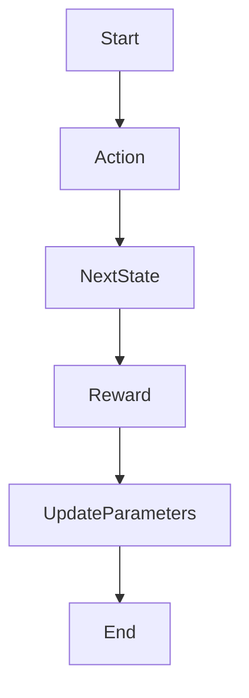
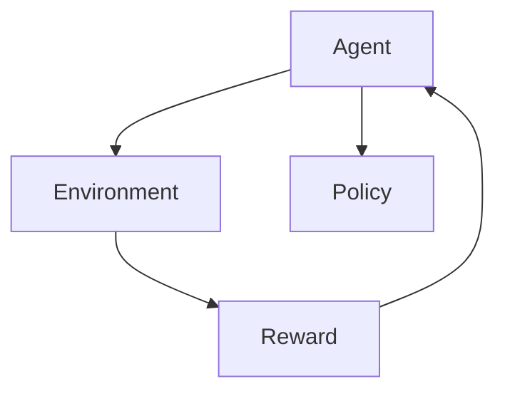
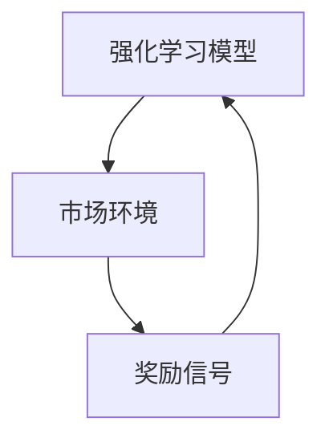
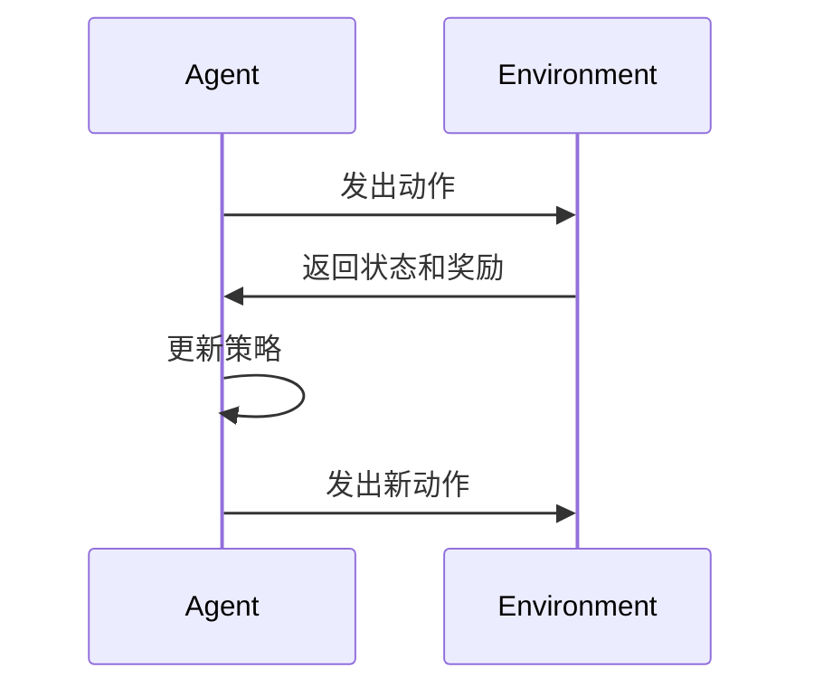

                 


# 《金融领域强化学习在资产定价中的应用》

## 关键词：
- 强化学习
- 资产定价
- 金融建模
- 算法实现
- 系统设计

## 摘要：
本文探讨了强化学习在资产定价中的应用，分析了其核心概念、算法原理、系统架构及实际案例。通过详细讲解强化学习的基本原理和资产定价的理论模型，结合具体的算法实现和系统设计，展示了如何利用强化学习提升资产定价的准确性和效率。

---

## 第1章: 强化学习与资产定价概述

### 1.1 强化学习的基本概念
#### 1.1.1 强化学习的定义与核心概念
强化学习是一种机器学习范式，通过智能体与环境的交互，学习最优策略以最大化累计奖励。其核心概念包括：
- **状态（State）**：环境的当前情况。
- **动作（Action）**：智能体对环境的决策。
- **奖励（Reward）**：智能体行为的价值反馈。
- **策略（Policy）**：决定动作的选择机制。

#### 1.1.2 强化学习与监督学习的区别
| 特性 | 监督学习 | 强化学习 |
|------|----------|----------|
| 数据 | 标签数据 | 环境反馈 |
| 目标 | 最小化误差 | 最大化累计奖励 |
| 交互 | 无 | 有 |

#### 1.1.3 强化学习在金融中的应用前景
金融领域中，强化学习可用于交易策略优化、风险控制和资产配置。其优势在于动态决策和非线性关系建模。

### 1.2 资产定价的基本概念
#### 1.2.1 资产定价的定义与核心要素
资产定价是确定资产公允价值的过程，涉及市场风险、流动性等多因素。

#### 1.2.2 资产定价的常见模型
- **CAPM模型**：单因子模型，用于估计资产的预期收益。
- **APT模型**：多因子模型，基于多个风险因子定价资产。

#### 1.2.3 资产定价的重要性
准确的资产定价有助于投资决策、风险管理和资源配置。

### 1.3 强化学习与资产定价的结合
#### 1.3.1 强化学习在资产定价中的优势
- **动态适应性**：实时调整定价策略。
- **非线性关系**：捕捉复杂市场特征。

#### 1.3.2 应用场景
- **交易策略优化**：基于市场反馈调整买卖决策。
- **风险控制**：通过强化学习模型实时监控市场风险。

#### 1.3.3 挑战
- **高维状态空间**：复杂市场环境导致计算困难。
- **稀疏奖励信号**：市场反馈不明确。

---

## 第2章: 强化学习的核心概念与原理

### 2.1 强化学习的基本原理
#### 2.1.1 马尔可夫决策过程（MDP）
MDP由状态、动作、转移概率和奖励函数组成，是强化学习的基础框架。

#### 2.1.2 贝尔曼方程
贝尔曼方程描述了状态价值函数的递归关系，是强化学习的核心公式：

$$ V(s) = \max_{a} [ r(s,a) + \gamma \sum_{s'} P(s'|s,a) V(s') ] $$

#### 2.1.3 策略与策略梯度
策略梯度方法直接优化策略参数，常用算法如**REINFORCE**：



### 2.2 马尔可夫决策过程（MDP）
#### 2.2.1 MDP的定义与构成
MDP由$(S, A, P, R)$组成，其中$S$是状态集合，$A$是动作集合，$P$是转移概率矩阵，$R$是奖励函数。

#### 2.2.2 MDP与强化学习的关系
强化学习通过与环境交互，学习最优策略以解决MDP问题。

#### 2.2.3 MDP在资产定价中的应用
资产定价问题可建模为MDP，状态为市场状态，动作为定价决策，奖励为收益。

### 2.3 贝尔曼方程与价值迭代
#### 2.3.1 贝尔曼方程的定义与推导
贝尔曼方程将价值函数分解为当前奖励和未来价值之和。

#### 2.3.2 价值迭代算法
价值迭代通过迭代更新价值函数，逼近最优策略：

```mermaid
graph TD
    Initialize V0 --> Update V1
    Update V1 --> Update V2
    ...
    Update Vn --> Optimal Policy
```

#### 2.3.3 贝尔曼方程在资产定价中的应用
通过贝尔曼方程优化定价策略，最大化累计收益。

---

## 第3章: 资产定价的理论与模型

### 3.1 资产定价的基本理论
#### 3.1.1 马科维茨投资组合理论
马科维茨理论通过优化风险-收益 trade-off，确定最优投资组合。

#### 3.1.2 CAPM与APT模型
CAPM基于单因子定价，APT基于多因子定价，两者均为资产定价的重要理论。

### 3.2 强化学习在资产定价中的应用模型
#### 3.2.1 Q-Learning在资产定价中的应用
Q-Learning通过学习状态-动作价值函数，优化定价策略。

#### 3.2.2 DQN在资产定价中的应用
DQN结合深度神经网络和经验回放，提升定价模型的泛化能力。

#### 3.2.3 贝叶斯强化学习在资产定价中的应用
贝叶斯强化学习通过概率推理，适应市场不确定性。

### 3.3 强化学习与传统定价模型的结合
通过强化学习优化传统模型参数，提升定价精度。

---

## 第4章: 强化学习在资产定价中的算法实现

### 4.1 算法实现的基本步骤
#### 4.1.1 环境的设计与构建
定义市场环境，模拟资产价格变化和交易结果。

#### 4.1.2 状态空间与动作空间的定义
- 状态：市场指标（如价格、成交量）。
- 动作：定价决策（如买入、卖出）。

#### 4.1.3 奖励函数的设计与实现
奖励函数反映定价策略的收益和风险。

### 4.2 强化学习算法的实现细节
#### 4.2.1 Q-Learning算法的实现
```python
class QLAgent:
    def __init__(self, state_size, action_size):
        self.q_table = np.zeros((state_size, action_size))
    
    def take_action(self, state):
        return np.argmax(self.q_table[state])
    
    def update_q(self, state, action, reward, next_state, alpha, gamma):
        self.q_table[state, action] = (1 - alpha) * self.q_table[state, action] + alpha * (reward + gamma * max(self.q_table[next_state]))
```

#### 4.2.2 DQN算法的实现
```python
class DQNAgent:
    def __init__(self, state_size, action_size, hidden_size):
        self.model = Sequential([
            Dense(hidden_size, activation='relu'),
            Dense(action_size)
        ])
    
    def get_action(self, state):
        return np.argmax(self.model.predict(state)[0])
    
    def train(self, states, targets):
        self.model.fit(states, targets, epochs=1, verbose=0)
```

#### 4.2.3 贝叶斯强化学习算法的实现
通过概率推理更新策略，适应市场变化。

### 4.3 算法实现的数学模型
Q-Learning的贝尔曼方程：

$$ Q(s, a) = Q(s, a) + \alpha [r + \gamma \max Q(s', a') - Q(s, a)] $$

DQN的目标函数：

$$ \min \sum (y_i - Q(s_i, a_i))^2 $$

---

## 第5章: 系统设计与架构方案

### 5.1 系统设计概述
#### 5.1.1 系统目标与功能需求
- 目标：实现强化学习驱动的资产定价系统。
- 功能：环境模拟、策略学习、结果分析。

#### 5.1.2 系统架构设计


#### 5.1.3 系统接口设计
- 输入接口：市场数据、参数设置。
- 输出接口：定价结果、策略报告。

### 5.2 系统架构图


### 5.3 系统交互图


---

## 第6章: 项目实战

### 6.1 环境搭建
- **工具**：Python、TensorFlow、Keras。
- **数据**：金融时间序列数据（如股票价格）。

### 6.2 核心实现
```python
# 定义强化学习环境
class TradingEnv:
    def __init__(self, data):
        self.data = data
        self.current_step = 0
    
    def reset(self):
        self.current_step = 0
        return self.data[self.current_step]
    
    def step(self, action):
        self.current_step += 1
        next_state = self.data[self.current_step]
        reward = self._calculate_reward(action)
        return next_state, reward
    
    def _calculate_reward(self, action):
        # 简单的收益计算
        return 1  # 示例，实际应根据交易结果计算
```

### 6.3 案例分析
通过实际案例，分析强化学习在资产定价中的效果。

### 6.4 项目小结
总结项目实现过程，指出优化方向。

---

## 第7章: 总结与展望

### 7.1 总结
强化学习为资产定价提供了新的思路，但面临高维状态和稀疏奖励等挑战。

### 7.2 未来展望
- **算法优化**：探索更高效的强化学习算法。
- **多模态数据**：结合文本、图像等多模态数据提升定价精度。

---

## 结语

本文系统介绍了强化学习在资产定价中的应用，从理论到实践，为读者提供了全面的指导。未来，随着技术进步，强化学习将在金融领域发挥更大作用。

