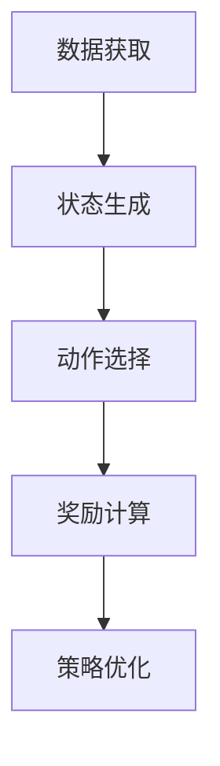
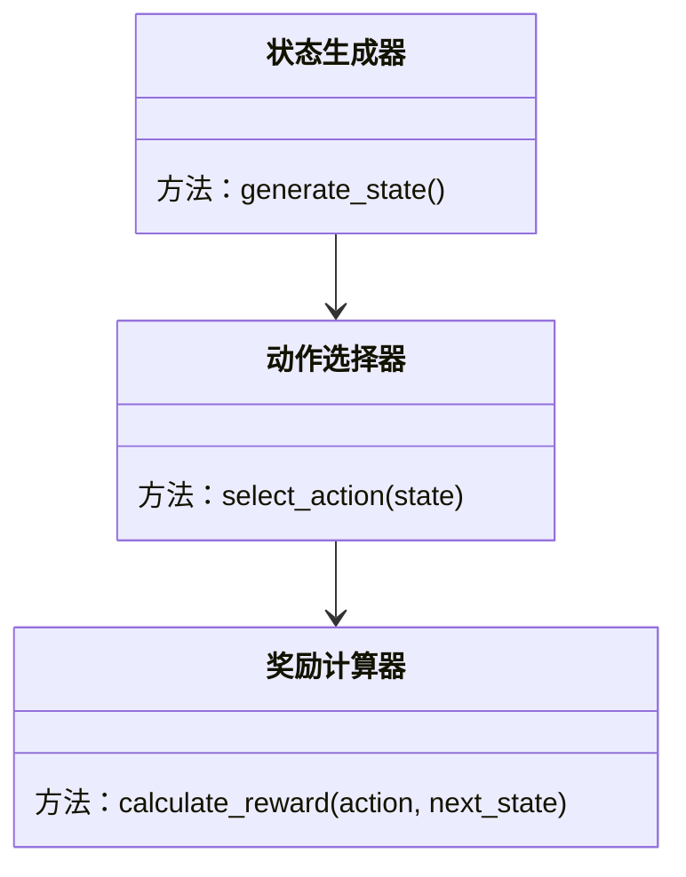

                 


# 《金融领域强化学习在资产定价中的应用》

> **关键词**：强化学习，资产定价，金融交易，机器学习，风险管理，深度学习  
> **摘要**：本文探讨了强化学习在金融资产定价中的应用，分析了其核心概念、数学模型、系统架构，并通过实际案例展示了如何在金融交易中实现资产定价的强化学习模型。文章还总结了当前的研究进展和未来的发展方向。

---

## 第1章: 强化学习与金融资产定价的背景介绍

### 1.1 强化学习的基本概念

#### 1.1.1 强化学习的定义
强化学习（Reinforcement Learning，RL）是一种机器学习范式，通过智能体与环境的交互来学习最优策略。智能体通过执行动作并获得奖励或惩罚，逐步优化其行为以最大化累积奖励。

#### 1.1.2 强化学习的核心要素
- **状态（State）**：环境在某一时刻的描述，例如股票价格、市场波动率等。
- **动作（Action）**：智能体在给定状态下采取的行为，例如买入、卖出或持有。
- **奖励（Reward）**：智能体执行动作后获得的反馈，用于评估动作的好坏。
- **策略（Policy）**：智能体选择动作的规则，可以是确定性的或概率性的。
- **价值函数（Value Function）**：评估某状态下采取某个动作后的预期收益。

#### 1.1.3 强化学习与金融的关系
金融领域中的许多问题，如资产定价、交易策略优化等，都具有明显的马尔可夫决策过程（MDP）特征。强化学习能够通过与环境的交互，动态调整策略，从而在复杂的金融环境中实现高效决策。

---

### 1.2 金融资产定价的基本原理

#### 1.2.1 资产定价的定义
资产定价是指根据资产的风险、收益和市场环境等因素，确定其合理价格的过程。传统资产定价模型（如CAPM和APT）基于静态假设，而强化学习则能够动态适应市场变化。

#### 1.2.2 传统资产定价模型
- **CAPM（资本资产定价模型）**：根据系统性风险（Beta）和无风险利率确定资产的期望收益。
- **APT（套利定价理论）**：基于多个因素（如市场风险、规模风险）确定资产收益。

#### 1.2.3 强化学习在资产定价中的优势
强化学习能够实时适应市场变化，捕捉非线性关系，并在复杂环境中优化决策。通过强化学习模型，可以动态调整资产权重，实现最优资产组合配置。

---

### 1.3 强化学习在金融领域的应用现状

#### 1.3.1 金融交易中的强化学习应用
强化学习被广泛应用于股票交易、外汇交易等领域。通过构建交易策略，智能体能够根据市场状态做出买卖决策。

#### 1.3.2 资产组合管理中的强化学习应用
强化学习用于优化资产组合配置，通过动态调整权重，降低风险并提高收益。

#### 1.3.3 风险管理中的强化学习应用
强化学习帮助机构识别市场风险，制定风险控制策略，例如动态调整保证金和止损点。

---

## 第2章: 强化学习的核心概念与原理

### 2.1 强化学习的数学模型

#### 2.1.1 状态空间与动作空间
- **状态空间**：所有可能的状态集合，例如股票价格、市场指数等。
- **动作空间**：所有可能的动作集合，例如买入、卖出或持有。

#### 2.1.2 奖励函数与价值函数
- **奖励函数**：定义智能体执行动作后的奖励，例如收益或损失。
- **价值函数**：评估某状态下采取某个动作后的预期收益，通常表示为：
  $$ V(s, a) = \max_{\pi} E[R | s, a] $$

#### 2.1.3 贝尔曼方程
贝尔曼方程描述了价值函数的递归关系：
$$ V(s) = \max_{a} \left( r(s, a) + \gamma V(next(s, a)) \right) $$
其中，\( r(s, a) \) 是奖励函数，\( \gamma \) 是折扣因子。

---

### 2.2 基础强化学习算法

#### 2.2.1 Q-learning算法
Q-learning通过更新Q值表来学习最优策略：
$$ Q(s, a) = Q(s, a) + \alpha (r + \gamma \max Q(s', a') - Q(s, a)) $$
其中，\( \alpha \) 是学习率，\( \gamma \) 是折扣因子。

#### 2.2.2 DQN算法
DQN（Deep Q-Network）通过深度神经网络近似Q值函数，解决了Q-learning的离线更新问题。

#### 2.2.3 策略梯度算法
策略梯度算法通过优化策略的参数，直接最大化奖励的期望值：
$$ \theta = \theta + \alpha \nabla_{\theta} J(\theta) $$
其中，\( J(\theta) \) 是奖励的期望值。

---

## 第3章: 强化学习在资产定价中的数学模型与算法

### 3.1 资产定价的强化学习模型

#### 3.1.1 资产定价的马尔可夫决策过程
资产定价问题可以建模为一个马尔可夫决策过程，其中：
- 状态 \( s \) 表示市场环境。
- 动作 \( a \) 表示资产配置策略。
- 奖励 \( r \) 表示收益或损失。

#### 3.1.2 资产定价的价值函数与策略函数
价值函数衡量资产组合在某状态下的预期收益：
$$ V(s) = \max_{a} \left( E[r(s, a)] + \gamma V(next(s, a)) \right) $$

#### 3.1.3 资产定价的贝尔曼方程
通过贝尔曼方程，可以递归地求解最优价值函数：
$$ V(s) = \max_{a} \left( r(s, a) + \gamma V(next(s, a)) \right) $$

---

### 3.2 基于强化学习的资产定价算法

#### 3.2.1 基于Q-learning的资产定价算法
通过Q-learning算法，智能体学习最优资产配置策略：
$$ Q(s, a) = Q(s, a) + \alpha (r + \gamma \max Q(s', a') - Q(s, a)) $$

#### 3.2.2 基于DQN的资产定价算法
DQN通过深度神经网络近似Q值函数，适用于高维状态空间。

#### 3.2.3 基于策略梯度的资产定价算法
策略梯度算法直接优化策略参数，适用于复杂的金融环境。

---

## 第4章: 强化学习在资产定价中的系统分析与架构设计

### 4.1 资产定价系统的功能设计

#### 4.1.1 系统功能模块划分
- 数据获取模块：从金融市场获取实时数据。
- 状态生成模块：生成市场状态。
- 动作选择模块：基于强化学习算法选择动作。
- 奖励计算模块：计算收益或损失。

#### 4.1.2 系统功能流程图
使用mermaid绘制系统功能流程图：


---

### 4.2 资产定价系统的架构设计

#### 4.2.1 系统架构设计概述
系统架构包括数据层、算法层和应用层。

#### 4.2.2 系统架构的类图设计
使用mermaid绘制类图：


---

### 4.3 资产定价系统的接口设计

#### 4.3.1 系统输入接口设计
- 输入股票价格、市场指数等数据。

#### 4.3.2 系统输出接口设计
- 输出最优资产配置策略。

#### 4.3.3 系统交互接口设计
- 提供用户与系统交互的界面。

---

## 第5章: 强化学习在资产定价中的项目实战

### 5.1 项目环境安装与配置

#### 5.1.1 环境搭建
安装Python、TensorFlow、Keras等依赖库。

#### 5.1.2 依赖库安装
使用pip安装相关库：
```bash
pip install numpy pandas tensorflow matplotlib
```

#### 5.1.3 环境配置
配置股票数据源，例如使用Yahoo Finance接口。

---

### 5.2 系统核心实现源代码

#### 5.2.1 Q-learning算法实现
```python
class QLearning:
    def __init__(self, state_space, action_space):
        self.state_space = state_space
        self.action_space = action_space
        self.q_table = np.zeros((state_space, action_space))
    
    def choose_action(self, state):
        return np.argmax(self.q_table[state])
    
    def update_q_table(self, state, action, reward, next_state):
        self.q_table[state][action] += self.alpha * (reward + self.gamma * np.max(self.q_table[next_state]) - self.q_table[state][action])
```

#### 5.2.2 股票价格预测案例分析
```python
import numpy as np
import pandas as pd
import matplotlib.pyplot as plt

# 加载股票数据
data = pd.read_csv('stock_data.csv')
prices = data['Close'].values

# 定义状态、动作和奖励
state = prices[-10:]  # 最近10天的价格
action = 1  # 买入
reward = prices[-1] - prices[-2]  # 收益

# 更新Q值表
ql.update_q_table(state, action, reward, next_state)
```

---

## 第6章: 总结与展望

### 6.1 总结
强化学习在金融资产定价中的应用具有显著优势，能够动态适应市场变化，优化资产配置策略。

### 6.2 未来展望
未来研究方向包括多智能体强化学习、实时交易策略优化以及结合图神经网络的复杂市场建模。

### 6.3 最佳实践 tips
- **数据质量**：确保数据的准确性和完整性。
- **模型调优**：根据市场环境调整算法参数。
- **风险控制**：设置止损点和止盈点。

---

## 附录

### 附录A: 强化学习相关术语表
- **Q值表**：记录状态-动作对的预期收益。
- **折扣因子**：平衡当前奖励与未来奖励的权重。

### 附录B: 代码示例

#### 附录B.1: Q-learning算法实现
```python
class QLearning:
    def __init__(self, state_space, action_space):
        self.state_space = state_space
        self.action_space = action_space
        self.q_table = np.zeros((state_space, action_space))
    
    def choose_action(self, state):
        return np.argmax(self.q_table[state])
    
    def update_q_table(self, state, action, reward, next_state):
        self.q_table[state][action] += self.alpha * (reward + self.gamma * np.max(self.q_table[next_state]) - self.q_table[state][action])
```

---

通过以上步骤，我们可以系统地理解强化学习在金融资产定价中的应用，并通过实际案例展示其优势和挑战。希望本文能够为读者提供有价值的参考和启发。

