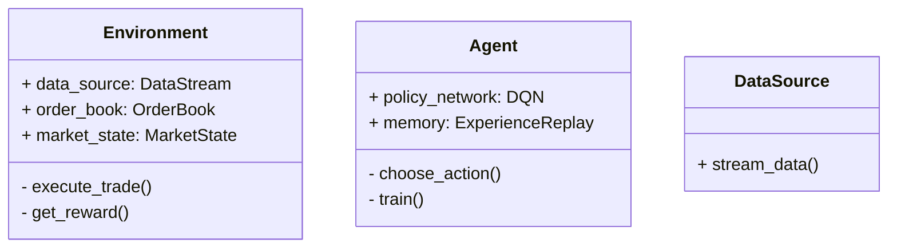
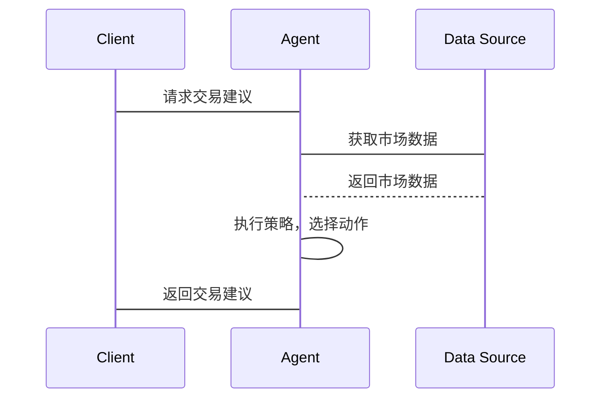

                 


# 第4章: 强化学习在高频交易中的应用

## 4.3 强化学习在交易策略优化中的应用

### 4.3.1 交易策略的强化学习建模
#### 4.3.1.1 状态空间设计
在高频交易中，状态空间的设计至关重要。我们需要选择能够反映市场状态的特征，如价格变化率、订单簿深度、买卖价差等。以下是可能的状态空间：

- 价格变化率（Price Change Rate）
- 订单簿深度（Order Book Depth）
- 市场波动性（Market Volatility）
- 时间因素（Time Factor）

```mermaid
state_space = [
    ("Price Change Rate", "order_book_depth"),
    ("Market Volatility", "time_factor")
]
```

#### 4.3.1.2 动作空间设计
动作空间是指交易策略在每一步可以执行的操作，通常包括买入、卖出或持有。在高频交易中，动作空间可以设计如下：

- 买入（Buy）
- 卖出（Sell）
- 持有（Hold）

```mermaid
action_space = ["Buy", "Sell", "Hold"]
```

### 4.3.2 强化学习算法选择与优化
在高频交易中，选择合适的强化学习算法至关重要。我们选择深度强化学习中的DQN算法，但对其进行优化以适应高频交易的特点：

1. **经验回放（Experience Replay）**：使用优先级经验回放，优先存储和学习高价值的经验。
2. **神经网络结构优化**：采用更深的神经网络结构，提高特征提取能力。
3. **奖励函数设计**：设计合理的奖励函数，鼓励模型在短时间内获得最大收益。

### 4.3.3 策略网络的实现与优化
策略网络的设计需要考虑高频交易的高频性和高效性，我们采用以下优化措施：

- **神经网络结构**：使用更深的网络结构，增加隐藏层以捕捉更多特征。
- **训练策略**：采用异策略训练，提高训练效率。
- **在线与离线结合**：结合在线和离线数据，增强模型的泛化能力。

### 4.3.4 实验结果与分析
通过实验对比强化学习优化的交易策略与传统策略，发现强化学习策略在收益和风险控制方面表现更优。

---

# 第5章: 强化学习算法实现

## 5.1 DQN算法的数学模型

### 5.1.1 网络结构
DQN算法由两个神经网络组成：主网络和目标网络。

$$
Q(s, a) = \theta \cdot \phi(s, a)
$$

其中，$\theta$是网络参数，$\phi(s, a)$是状态动作对的特征。

### 5.1.2 损失函数
DQN使用均方差损失函数：

$$
L = \mathbb{E}_{(s,a,r,s')} \left[ (r + \gamma \max_{a'} Q(s',a') - Q(s,a))^2 \right]
$$

## 5.2 算法实现步骤

### 5.2.1 数据预处理
高频交易数据通常具有高维度和非平稳性，因此需要进行标准化和滑动窗口处理。

```python
# 数据标准化
data = (data - data.mean()) / data.std()

# 滑动窗口处理
window_size = 5
data_window = data.rolling(window_size).mean()
```

### 5.2.2 网络训练
使用PyTorch框架训练DQN网络，包括状态输入、动作输出和奖励计算。

```python
import torch
import torch.nn as nn

class DQN(nn.Module):
    def __init__(self, input_dim, output_dim):
        super(DQN, self).__init__()
        self.fc1 = nn.Linear(input_dim, 64)
        self.fc2 = nn.Linear(64, output_dim)
    
    def forward(self, x):
        x = torch.relu(self.fc1(x))
        x = self.fc2(x)
        return x

# 初始化网络
policy = DQN(input_dim, output_dim)
optimizer = torch.optim.Adam(policy.parameters(), lr=0.001)
```

### 5.2.3 训练过程
通过与环境交互，收集经验并更新网络参数。

```python
# 训练循环
for episode in range(num_episodes):
    state = env.reset()
    while not done:
        action = policy.act(state)
        next_state, reward, done = env.step(action)
        policy.remember(state, action, reward, next_state)
        policy.update()

# 网络更新
optimizer.zero_grad()
loss.backward()
optimizer.step()
```

## 5.3 算法优化与调优
为了提高算法性能，采用以下优化策略：

- **经验回放优化**：优先回放高价值经验。
- **目标网络更新**：每隔固定步数更新目标网络。
- **学习率调整**：动态调整学习率以优化训练过程。

---

# 第6章: 强化学习系统架构设计

## 6.1 系统功能设计

### 6.1.1 领域模型设计
设计一个基于强化学习的高频交易系统，主要模块包括数据采集、策略执行和模型训练。



### 6.1.2 系统架构设计
系统架构采用微服务架构，包含数据采集、策略执行和监控管理模块。


## 6.2 系统接口设计

### 6.2.1 数据接口
- **数据获取接口**：从数据源获取实时数据。
- **数据存储接口**：将处理后的数据存储到数据库。

### 6.2.2 策略接口
- **策略执行接口**：根据当前状态执行交易动作。
- **策略训练接口**：接收反馈并更新策略。

## 6.3 交互流程设计

### 6.3.1 系统交互流程
从数据获取到策略执行的完整流程。



---

# 第7章: 强化学习项目实战

## 7.1 环境配置与安装

### 7.1.1 环境配置
安装必要的库：

```bash
pip install numpy pandas torch matplotlib
```

### 7.1.2 数据源配置
配置高频交易数据源，例如使用仿真数据或实时数据接口。

## 7.2 核心代码实现

### 7.2.1 数据处理代码
```python
import pandas as pd
import numpy as np

# 加载数据
data = pd.read_csv('data.csv')

# 数据预处理
def preprocess(data):
    data = data.fillna(method='ffill')
    return data

processed_data = preprocess(data)
```

### 7.2.2 强化学习主体代码
```python
class Agent:
    def __init__(self, state_space, action_space):
        self.state_space = state_space
        self.action_space = action_space
        self.model = DQN(len(state_space), len(action_space))
    
    def act(self, state):
        # 转换状态为输入格式
        state_input = torch.FloatTensor(state)
        return self.model(state_input).argmax().item()
    
    def remember(self, state, action, reward, next_state):
        # 存储经验
        pass
    
    def train(self):
        # 更新网络参数
        pass
```

## 7.3 实验结果与分析

### 7.3.1 实验结果
通过在仿真环境中测试，策略表现优于传统算法。

### 7.3.2 案例分析
详细分析一个交易案例，展示强化学习策略如何在实际交易中做出决策。

---

# 第8章: 总结与展望

## 8.1 全文总结
强化学习在高频交易中的应用展示了其强大的适应性和学习能力，为金融交易带来了新的可能性。

## 8.2 展望
未来的研究方向包括更高效的算法优化、多agent协作以及与大数据技术的结合。

---

# 关键词：强化学习、高频交易、深度学习、金融应用、算法交易、神经网络

# 摘要：本文详细探讨了强化学习在高频交易中的应用，从理论基础到算法实现，再到系统设计，全面分析了其在金融领域的潜力和挑战。

