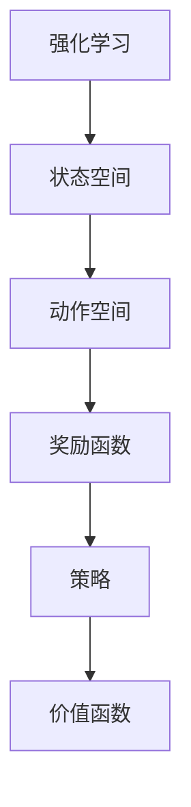

                 


# 《金融领域强化学习的最新进展与应用》

## 关键词：
- 强化学习
- 金融领域
- 最新进展
- 应用案例
- 算法原理
- 交易系统
- 风险控制

## 摘要：
本文系统地探讨了强化学习在金融领域的最新进展与实际应用。首先，文章介绍了强化学习的核心概念与在金融中的适用场景，详细分析了强化学习在量化交易、风险控制、智能投顾等领域的应用边界与外延。接着，深入讲解了强化学习的算法原理，包括Q-learning、深度强化学习（DQN）、策略梯度方法等，并通过数学公式和mermaid流程图进行了直观的展示。随后，文章详细阐述了金融交易平台的系统架构设计，包括领域模型类图、系统架构图和交互序列图。最后，通过具体的项目实战案例，展示了强化学习在股票交易中的实现过程，并分析了实际应用中的效果与挑战。本文旨在为金融领域的技术从业者提供一份全面而深入的指南，帮助他们更好地理解和应用强化学习技术。

---

## 正文：

### 第1章: 强化学习的背景与核心概念

#### 1.1 强化学习的定义与特点

- **1.1.1 强化学习的基本概念**
  强化学习（Reinforcement Learning，简称RL）是一种机器学习范式，通过智能体与环境的交互，学习策略以最大化累计奖励。与监督学习和无监督学习不同，强化学习强调实时决策与动态反馈。

- **1.1.2 强化学习的核心特点**
  - **实时反馈**：智能体通过与环境交互，获得即时奖励或惩罚。
  - **马尔可夫决策过程**：强化学习问题可以建模为马尔可夫决策过程（MDP），即状态、动作、奖励之间的关系是马尔可夫性质的。
  - **长期目标导向**：强化学习的目标是优化长期累计奖励，而非单一动作的优化。

- **1.1.3 强化学习与监督学习、无监督学习的区别**
  - **监督学习**：基于标记数据，学习输入到输出的映射。
  - **无监督学习**：基于未标记数据，发现数据中的隐含模式。
  - **强化学习**：基于与环境的交互，学习最优策略。

#### 1.2 金融领域的强化学习应用背景

- **1.2.1 金融领域的复杂性与不确定性**
  金融市场具有高度的不确定性和复杂性，价格波动、市场情绪、宏观经济因素等都对投资决策产生影响。

- **1.2.2 强化学习在金融中的适用场景**
  - **量化交易**：高频交易、算法交易。
  - **投资组合管理**：动态调整资产配置。
  - **风险控制**：实时监控和管理市场风险。

- **1.2.3 金融领域强化学习的核心问题**
  - **状态空间**：金融市场中的各种指标和数据。
  - **动作空间**：买入、卖出、持有等操作。
  - **奖励函数**：收益、风险、交易成本等。

### 第2章: 强化学习在金融中的应用边界与外延

#### 2.1 强化学习在金融中的应用领域

- **2.1.1 量化交易与投资组合管理**
  - **量化交易**：基于算法的高频交易策略。
  - **投资组合管理**：动态调整资产配置以最大化收益。

- **2.1.2 风险控制与信用评分**
  - **风险控制**：实时监控和管理市场风险。
  - **信用评分**：基于强化学习模型评估信用风险。

- **2.1.3 智能投顾与客户行为预测**
  - **智能投顾**：为客户提供个性化的投资建议。
  - **客户行为预测**：基于客户行为数据预测投资行为。

#### 2.2 强化学习在金融中的核心要素

- **2.2.1 状态、动作、奖励的对比分析**
  - **状态（State）**：当前市场环境和资产价格。
  - **动作（Action）**：买入、卖出或持有某种资产。
  - **奖励（Reward）**：投资收益或损失。

- **2.2.2 Q-learning与DQN的对比**
  - **Q-learning**：基于值函数的强化学习算法。
  - **DQN**：深度强化学习算法，使用神经网络近似值函数。

- **2.2.3 策略与价值函数的对比**
  - **策略（Policy）**：直接决定动作的选择。
  - **价值函数（Value Function）**：评估状态或动作的优劣。

#### 2.3 强化学习的核心概念与联系

- **2.3.1 马尔可夫决策过程（MDP）**
  MDP由状态空间、动作空间、转移概率、奖励函数和终止条件组成。强化学习的目标是找到最优策略，使得累计奖励最大化。

- **2.3.2 动作-价值函数（Q-learning）**
  Q-learning通过更新Q值函数来学习最优策略。Q值表示在给定状态下采取某个动作的期望奖励。

- **2.3.3 策略梯度方法（Policy Gradient）**
  策略梯度方法通过优化策略的参数，使得累计奖励最大化。策略直接决定动作的概率分布。

#### 2.4 强化学习的ER实体关系图



---

### 第3章: 强化学习算法原理

#### 3.1 Q-learning算法

- **3.1.1 Q-learning的基本原理**
  Q-learning通过更新Q值函数来学习最优策略。Q值表示在给定状态下采取某个动作的期望奖励。

- **3.1.2 Q-learning的数学模型**
  $$ Q(s, a) = Q(s, a) + \alpha (r + \gamma \max Q(s', a') - Q(s, a)) $$
  其中，$\alpha$是学习率，$\gamma$是折扣因子。

- **3.1.3 Q-learning的实现步骤**
  1. 初始化Q值表。
  2. 环境提供当前状态。
  3. 根据策略选择动作。
  4. 执行动作，获得奖励和新状态。
  5. 更新Q值表。

#### 3.2 深度强化学习（DQN）算法

- **3.2.1 DQN的算法原理**
  DQN使用神经网络近似值函数，通过经验回放和目标网络来稳定训练过程。

- **3.2.2 DQN的数学模型**
  - **值函数网络**：$Q_\theta(s, a)$
  - **目标网络**：$Q_{\theta'}(s, a)$
  - **损失函数**：$$ \mathcal{L} = \mathbb{E}[(r + \gamma Q_{\theta'}(s', a') - Q_\theta(s, a))^2] $$

- **3.2.3 DQN的实现步骤**
  1. 初始化经验回放池。
  2. 从经验池中随机采样一批经验。
  3. 训练值函数网络。
  4. 更新目标网络。

#### 3.3 策略梯度方法（Policy Gradient）

- **3.3.1 策略梯度的基本原理**
  策略梯度方法通过优化策略的参数，使得累计奖励最大化。

- **3.3.2 策略梯度的数学模型**
  $$ \nabla \theta \left( \mathbb{E}[\mathcal{R}] \right) = \mathbb{E}[\nabla_\theta \log p(a|s) \cdot Q(s, a)] $$

- **3.3.3 策略梯度的实现步骤**
  1. 初始化策略参数。
  2. 采样状态和动作。
  3. 计算梯度并更新参数。

---

### 第4章: 金融交易平台的系统架构设计

#### 4.1 项目介绍

- **4.1.1 项目目标**
  设计一个基于强化学习的量化交易平台，实现股票交易的自动化决策。

- **4.1.2 项目范围**
  系统包括数据采集、策略执行、风险控制和结果分析模块。

#### 4.2 系统功能设计

- **4.2.1 领域模型类图**
  ```mermaid
  classDiagram
  class 状态空间 {
    属性: 当前资产价格
    方法: 获取当前状态
  }
  class 动作空间 {
    属性: 可选动作
    方法: 执行动作
  }
  class 奖励函数 {
    方法: 计算奖励
  }
  class 策略 {
    方法: 选择动作
  }
  class 价值函数 {
    方法: 评估状态
  }
  状态空间 --> 动作空间
  动作空间 --> 奖励函数
  策略 --> 价值函数
  ```

- **4.2.2 系统架构图**
  ```mermaid
  graph TD
  A[数据采集模块] --> B[策略执行模块]
  B --> C[风险控制模块]
  C --> D[结果分析模块]
  ```

- **4.2.3 系统接口设计**
  - 数据接口：获取市场数据。
  - 策略接口：选择动作。
  - 风险控制接口：监控和管理风险。

- **4.2.4 系统交互序列图**
  ```mermaid
  sequenceDiagram
  participant 用户
  participant 系统
  用户->系统: 提交订单
  系统->系统: 执行策略
  系统->用户: 反馈结果
  ```

---

### 第5章: 项目实战

#### 5.1 环境配置

- **5.1.1 环境需求**
  - 操作系统：Linux或Windows。
  - 开发工具：Python、TensorFlow、Keras。
  - 数据源：股票市场数据。

#### 5.2 系统核心实现源代码

- **5.2.1 强化学习算法实现**
  ```python
  import numpy as np

  class DQN:
      def __init__(self, state_space, action_space):
          self.state_space = state_space
          self.action_space = action_space
          # 初始化神经网络
          self.model = self.build_model()

      def build_model(self):
          # 定义神经网络结构
          model = Sequential()
          model.add(Dense(64, activation='relu', input_dim=self.state_space))
          model.add(Dense(32, activation='relu'))
          model.add(Dense(self.action_space, activation='linear'))
          model.compile(optimizer='adam', loss='mse')
          return model
  ```

- **5.2.2 策略实现**
  ```python
  def choose_action(self, state):
      # 根据当前状态选择动作
      q_values = self.model.predict(state)
      return np.argmax(q_values[0])
  ```

#### 5.3 代码应用解读与分析

- **5.3.1 数据预处理**
  - 标准化处理：将历史价格数据标准化为0-1范围。

- **5.3.2 策略训练**
  - 使用经验回放池训练模型，更新神经网络权重。

- **5.3.3 策略执行**
  - 根据当前状态选择动作，执行交易操作。

#### 5.4 实际案例分析

- **5.4.1 案例背景**
  某股票的历史价格数据，目标是实现自动化的买卖决策。

- **5.4.2 策略效果**
  - 收益率对比：强化学习策略 vs 传统策略。
  - 风险控制：最大回撤、波动率等指标。

---

### 第6章: 案例分析与未来展望

#### 6.1 案例分析

- **6.1.1 量化交易案例**
  - 实现基于DQN的量化交易策略，验证其在实际市场中的表现。

- **6.1.2 风险控制案例**
  - 使用强化学习模型实时监控和管理市场风险。

#### 6.2 未来展望

- **6.2.1 强化学习在金融中的趋势**
  - 多智能体协作：多个智能体协同决策。
  - 模型解释性：提高强化学习模型的可解释性。
  - 模型泛化能力：增强模型的泛化能力，适应不同市场环境。

- **6.2.2 对读者的建议**
  - 深入学习强化学习的核心算法。
  - 熟悉金融领域的基础知识。
  - 实践项目：从简单案例入手，逐步扩展到复杂场景。

---

### 第7章: 总结与注意事项

#### 7.1 总结

- 本文系统地探讨了强化学习在金融领域的最新进展与实际应用。
- 通过理论分析、算法实现和项目实战，展示了强化学习在量化交易、风险控制等领域的巨大潜力。

#### 7.2 注意事项

- **数据质量**：强化学习依赖高质量的数据，数据偏差可能影响模型性能。
- **模型鲁棒性**：金融市场具有高度的不确定性，模型需要具备较强的鲁棒性。
- **伦理与合规**：强化学习在金融中的应用需要遵守相关法律法规，避免滥用。

---

### 第8章: 扩展阅读与参考资料

- **8.1 扩展阅读**
  - 建议读者阅读《强化学习入门》、《深度强化学习》等书籍。
  - 关注学术论文，了解最新研究进展。

- **8.2 参考资料**
  - TensorFlow官方文档。
  - Keras官方文档。
  - 量化交易平台接口文档。

---

### 结语

强化学习在金融领域的应用正在快速发展，未来将有更多创新性的应用出现。希望本文能为读者提供有价值的参考，帮助他们在金融领域更好地应用强化学习技术。

