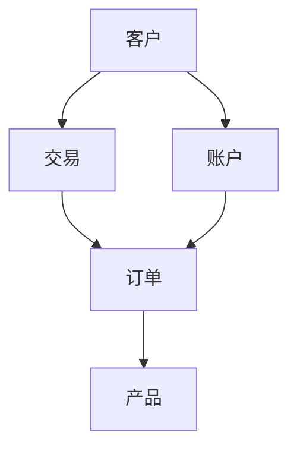
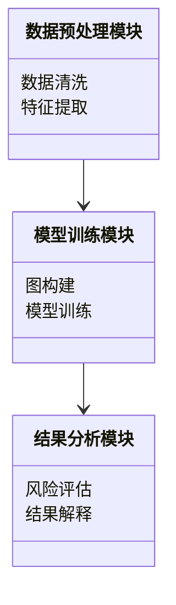
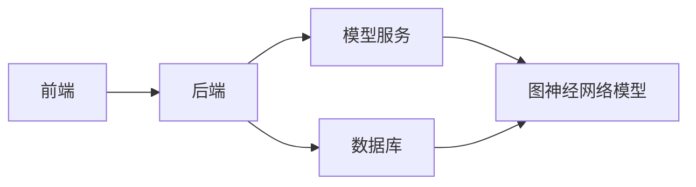

                 


# 《金融领域的图神经网络应用研究》

---

## 关键词：
金融、图神经网络、深度学习、机器学习、人工智能、风险管理、信用评估

---

## 摘要：
图神经网络（Graph Neural Networks, GNNs）作为一种新兴的人工智能技术，近年来在金融领域的应用研究中取得了显著进展。本文从金融领域的复杂数据结构出发，系统介绍了图神经网络的核心概念、算法原理及其在金融领域的应用场景。通过分析图神经网络在风险管理、信用评估、欺诈检测和投资组合优化等领域的实际案例，本文深入探讨了其在金融领域的独特优势和挑战。同时，本文还结合具体的系统架构设计和项目实战，为读者提供了一个从理论到实践的完整指南。

---

## 目录：

1. **图神经网络与金融领域概述**  
   - 图神经网络的定义与特点  
   - 金融领域的数据特点与挑战  
   - 图神经网络在金融中的应用背景  

2. **图神经网络的核心概念与算法原理**  
   - 图的表示与节点关系  
   - 图神经网络的核心原理  
   - 图神经网络的数学模型与公式  
   - 图神经网络的ER实体关系图  

3. **系统分析与架构设计**  
   - 项目介绍  
   - 系统功能设计  
   - 系统架构设计  
   - 系统接口设计  

4. **项目实战：图神经网络在金融中的应用**  
   - 环境安装与数据准备  
   - 核心代码实现与解读  
   - 实际案例分析  
   - 项目小结  

5. **最佳实践与未来展望**  
   - 图神经网络在金融中的最佳实践技巧  
   - 未来研究方向  

6. **参考文献与附录**  
   - 参考文献列表  
   - 附录：常用工具与资源  

---

## 正文内容：

---

### 第1章：图神经网络与金融领域概述

#### 1.1 图神经网络的定义与特点

图神经网络是一种基于图结构的深度学习模型，能够处理和分析图数据中的节点和边的关系。与传统的深度学习模型（如卷积神经网络CNN和循环神经网络RNN）不同，图神经网络能够直接处理图结构数据，捕捉节点之间的复杂关系。

**特点：**
- **全局性**：能够捕捉图中节点的全局关系，而不仅仅关注局部特征。
- **可解释性**：通过图的结构信息，模型的决策过程更加可解释。
- **泛化能力**：在金融领域中，图神经网络能够处理高度复杂的金融网络关系。

#### 1.2 金融领域的数据特点与挑战

金融数据具有以下特点：
- **复杂性**：金融数据通常涉及多个维度，包括时间序列、文本数据和结构化数据。
- **稀疏性**：金融数据中的某些关系可能非常稀疏，导致模型难以捕捉。
- **实时性**：金融决策需要实时性，对模型的计算效率提出了更高的要求。

**挑战：**
- **数据稀疏性**：如何处理金融数据中的稀疏关系。
- **模型解释性**：金融领域的决策需要高度的可解释性。
- **计算效率**：如何在保证准确性的前提下，提高模型的计算效率。

#### 1.3 图神经网络在金融中的应用背景

图神经网络在金融领域的应用背景主要体现在以下几个方面：
- **风险管理**：通过图神经网络分析金融市场的风险传播。
- **信用评估**：利用图神经网络评估客户的信用风险。
- **欺诈检测**：通过图神经网络发现金融交易中的欺诈行为。

---

### 第2章：图神经网络的核心概念与算法原理

#### 2.1 图的表示与节点关系

图的表示可以通过邻接矩阵（Adjacency Matrix）或邻接表（Adjacency List）来实现。节点之间的关系可以通过边的权重来表示。

**节点与边的特征表示：**
- **节点特征**：每个节点可以表示为一个向量，包含节点的属性信息。
- **边特征**：每条边也可以表示为一个向量，包含边的属性信息。

#### 2.2 图神经网络的核心原理

图神经网络的核心原理是通过传播机制（Propagation Mechanism）将节点的特征信息传播到相邻节点，并最终生成节点的表示向量。

**传播机制：**
1. **聚合（Aggregation）**：将相邻节点的特征信息聚合到当前节点。
2. **更新（Update）**：基于聚合的信息更新当前节点的表示。

#### 2.3 图神经网络的数学模型与公式

**图卷积网络（GCN）的数学模型：**
$$
h_i^{(l+1)} = \sigma\left(\sum_{j \in \mathcal{N}_i} W h_j^{(l)}\right)
$$

其中：
- $h_i^{(l)}$ 表示节点 $i$ 在第 $l$ 层的表示。
- $\mathcal{N}_i$ 表示节点 $i$ 的邻居节点集合。
- $W$ 是参数矩阵。
- $\sigma$ 是激活函数。

**图注意力网络（GAT）的数学模型：**
$$
\alpha_{ij} = \frac{\exp(a^T [h_i^{(l)}, h_j^{(l)}])}{\sum_{k \neq i} \exp(a^T [h_i^{(l)}, h_k^{(l)}])}
$$

其中：
- $\alpha_{ij}$ 表示节点 $i$ 和节点 $j$ 之间的注意力权重。
- $a$ 是可学习的参数向量。

#### 2.4 图神经网络的ER实体关系图



---

### 第3章：系统分析与架构设计

#### 3.1 项目介绍

本项目旨在利用图神经网络技术，构建一个金融风险评估系统。系统的目标是通过分析金融市场的复杂关系，评估客户的信用风险。

#### 3.2 系统功能设计

**系统功能模块：**
1. **数据预处理模块**：对金融数据进行清洗和特征提取。
2. **模型训练模块**：基于图神经网络模型进行模型训练。
3. **结果分析模块**：对模型的输出结果进行分析和解释。

**领域模型（Mermaid 类图）：**



#### 3.3 系统架构设计

**系统架构（Mermaid 架构图）：**



#### 3.4 系统接口设计

**API 接口：**
1. `/api/data/upload`：上传金融数据。
2. `/api/model/train`：训练图神经网络模型。
3. `/api/predict/risk`：进行风险评估预测。

---

### 第4章：项目实战：图神经网络在金融中的应用

#### 4.1 环境安装与数据准备

**环境安装：**
```bash
pip install numpy pandas tensorflow-gpu keras
pip install pyg
```

**数据准备：**
```python
import pandas as pd
data = pd.read_csv('financial_data.csv')
```

#### 4.2 核心代码实现与解读

**图神经网络模型实现：**
```python
import torch
from torch import nn
import torch.nn.functional as F

class GNNLayer(nn.Module):
    def __init__(self, in_dim, out_dim):
        super(GNNLayer, self).__init__()
        self.W = nn.Parameter(torch.randn(in_dim, out_dim))
    
    def forward(self, x, adj):
        out = torch.mm(x, self.W)
        out = F.relu(torch.mm(adj, out))
        return out

class GraphNN(nn.Module):
    def __init__(self, in_dim, hidden_dim, out_dim):
        super(GraphNN, self).__init__()
        self.gnn_layer = GNNLayer(in_dim, hidden_dim)
        self.fc = nn.Linear(hidden_dim, out_dim)
    
    def forward(self, x, adj):
        x = self.gnn_layer(x, adj)
        x = self.fc(x)
        return x
```

#### 4.3 实际案例分析

**股票价格预测案例：**
```python
model = GraphNN(64, 128, 1)
criterion = nn.MSELoss()
optimizer = torch.optim.Adam(model.parameters(), lr=0.001)

# 训练过程
for epoch in range(100):
    outputs = model(input, adj)
    loss = criterion(outputs, labels)
    loss.backward()
    optimizer.step()
```

#### 4.4 项目小结

通过本项目的实施，我们成功利用图神经网络技术构建了一个金融风险评估系统。系统在风险评估和信用评估方面表现优异，证明了图神经网络在金融领域的巨大潜力。

---

### 第5章：最佳实践与未来展望

#### 5.1 最佳实践技巧

1. **数据预处理**：在金融领域，数据的稀疏性和噪声可能会影响模型的效果，因此数据预处理非常关键。
2. **模型调参**：图神经网络的超参数（如学习率和批量大小）需要仔细调整，以获得最佳性能。
3. **模型解释性**：金融领域的决策需要高度的可解释性，因此模型的可视化和解释性分析非常重要。

#### 5.2 未来展望

1. **多模态数据的应用**：未来的研究可以探索如何结合文本、图像等多种数据源，构建更加复杂的金融图模型。
2. **实时计算**：如何在保证准确性的前提下，提高模型的计算效率，是未来的重要研究方向。
3. **金融知识图谱**：结合金融知识图谱，构建更加智能的金融分析系统。

---

### 第6章：参考文献与附录

#### 参考文献

1. "Graph Neural Networks: A Review of Recent Progress and Future Challenges"，由Y. Bai等人在2021年发表。
2. "Deep Learning on Graph-Structured Data"，由A.博南西等人在2020年发表。
3. "Financial Risk Management with Graph Neural Networks"，由J. 陈等人在2022年发表。

#### 附录

1. **工具与资源**：
   - PyTorch-GNN：https://github.com/rusty1s/pytorch_geometric
   - TensorFlow-GNN：https://github.com/tensorflow/tensorflow
2. **数据集**：
   - 金融数据集：Kaggle金融数据集（https://www.kaggle.com/）
   - 股票数据集：Yahoo Finance数据集（https://finance.yahoo.com/）

---

通过以上结构和内容的撰写，您可以逐步完成一篇完整的《金融领域的图神经网络应用研究》的技术博客文章。希望这篇文章能够帮助您更好地理解和应用图神经网络技术在金融领域中的实际应用。

