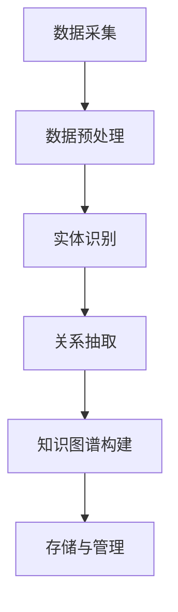
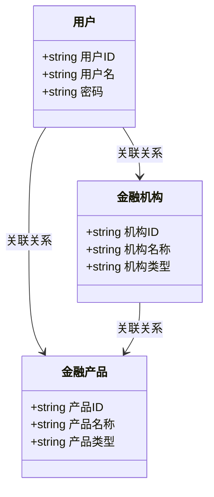
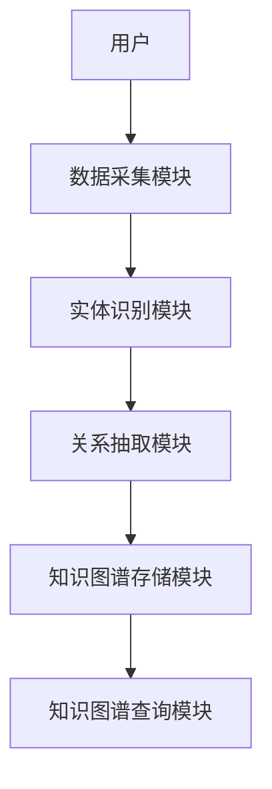
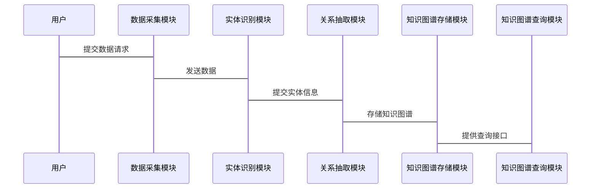

                 


# 《金融领域知识图谱的构建与应用》

> 关键词：知识图谱、金融领域、实体识别、关系抽取、图嵌入、金融数据

> 摘要：金融领域知识图谱的构建与应用是当前人工智能与金融结合的重要研究方向。本文从知识图谱的基本概念出发，详细分析了金融领域知识图谱的构建需求、核心概念与联系、构建算法原理、系统架构设计以及实际项目应用。通过理论与实践结合的方式，深入探讨了知识图谱在金融领域的应用场景，为读者提供了系统性、实用性的指导。

---

# 第一部分: 金融领域知识图谱的构建与应用概述

# 第1章: 知识图谱与金融领域的结合

## 1.1 知识图谱的基本概念
### 1.1.1 知识图谱的定义与特点
知识图谱是一种以图结构形式表示知识的数据模型，由节点（实体）和边（关系）组成，能够描述实体之间的语义关系。知识图谱具有结构化、语义化、网络化的特点，能够支持复杂的语义查询和推理。

### 1.1.2 知识图谱在金融领域的应用背景
金融领域涉及大量的数据，包括公司、产品、市场、交易等实体，以及它们之间的复杂关系。传统的数据处理方式难以满足金融领域对复杂关系分析和语义理解的需求，因此知识图谱在金融领域的应用应运而生。

### 1.1.3 金融知识图谱的核心要素与结构
金融知识图谱的核心要素包括实体（如公司、产品、市场）、属性（如公司注册资本、产品类型）和关系（如“公司发行产品”、“产品属于市场”）。其结构通常采用层次化的方式，便于管理和查询。

## 1.2 金融领域的知识图谱构建需求
### 1.2.1 金融数据的特点与挑战
金融数据具有多样性、复杂性和动态性。数据来源广泛，包括文本、结构化数据和非结构化数据，且数据之间的关联关系复杂。此外，金融数据的实时性和准确性要求较高。

### 1.2.2 知识图谱在金融领域的潜在价值
知识图谱能够帮助金融机构实现数据的深度理解和关联分析，支持智能投顾、风险评估、欺诈检测等应用场景。

### 1.2.3 金融知识图谱的构建目标与边界
构建金融知识图谱的目标是将分散的金融数据整合成一个统一的知识库，支持复杂的语义查询和推理。其边界包括数据采集、实体识别、关系抽取和知识图谱存储与管理。

## 1.3 本章小结
本章介绍了知识图谱的基本概念和金融领域的特点，分析了金融知识图谱的构建需求和潜在价值，明确了构建目标和边界。

---

# 第2章: 金融知识图谱的核心概念与联系

## 2.1 知识图谱的核心概念原理
### 2.1.1 实体与属性的定义
实体是知识图谱的基本单元，表示现实世界中的具体事物。属性是对实体的描述，如公司的注册资本、产品类型等。

### 2.1.2 关系与语义的表达
关系表示实体之间的关联，如“公司发行产品”、“产品属于市场”。语义则是对关系的解释，帮助理解实体之间的关联方式。

### 2.1.3 知识图谱的构建逻辑
知识图谱的构建逻辑包括数据采集、实体识别、关系抽取和知识图谱存储与管理。

## 2.2 核心概念属性特征对比
### 2.2.1 实体与关系的属性对比
| 属性 | 实体 | 关系 |
|------|------|------|
| 类型 | 公司、产品、市场 | 发行、属于、交易 |
| 描述 | 公司注册资本、产品类型 | 公司发行产品、产品属于市场 |

### 2.2.2 知识图谱的节点与边的关系分析
节点表示实体，边表示关系。例如，节点A（公司）与节点B（产品）之间有一条边“发行”，表示公司发行产品。

### 2.2.3 知识图谱的层次化结构特征
知识图谱通常采用层次化结构，便于管理和查询。例如，顶层是公司，下层是产品，再下层是市场。

## 2.3 ER实体关系图架构
```mermaid
erDiagram
    actor 用户 {
        +string 用户ID
        +string 用户名
        +string 密码
    }
    actor 金融机构 {
        +string 机构ID
        +string 机构名称
        +string 机构类型
    }
    actor 金融产品 {
        +string 产品ID
        +string 产品名称
        +string 产品类型
    }
    用户 --> 金融机构 : 关联关系
    用户 --> 金融产品 : 关联关系
    金融机构 --> 金融产品 : 关联关系
```

## 2.4 本章小结
本章详细分析了知识图谱的核心概念，包括实体、属性、关系及其层次化结构，并通过ER图展示了实体之间的关系。

---

# 第3章: 知识图谱构建的算法原理

## 3.1 知识图谱构建的基本流程
### 3.1.1 数据采集与预处理
数据采集包括从结构化数据和非结构化数据中提取信息。预处理包括数据清洗、分词和词干提取。

### 3.1.2 实体识别与抽取
实体识别通过自然语言处理技术，从文本中提取实体。例如，从新闻中提取公司名称和产品名称。

### 3.1.3 关系抽取与构建
关系抽取通过模式匹配或机器学习算法，从文本中抽取实体之间的关系。例如，从新闻中抽取“公司发行产品”。

### 3.1.4 知识图谱的存储与管理
知识图谱通常存储在图数据库中，如Neo4j。存储时需要考虑实体和关系的索引优化。

## 3.2 知识图谱构建算法的数学模型
### 3.2.1 图嵌入算法
图嵌入算法通过将图结构转换为向量表示，便于后续的分析和处理。例如，使用Word2Vec对实体进行嵌入。

### 3.2.2 基于规则的抽取算法
基于规则的抽取算法通过预定义的规则，从文本中抽取实体和关系。例如，使用正则表达式匹配公司名称。

### 3.2.3 基于机器学习的关系抽取算法
基于机器学习的关系抽取算法通过训练模型，从文本中抽取实体和关系。例如，使用双向长短期记忆网络（Bi-LSTM）进行关系抽取。

## 3.3 算法流程图


## 3.4 本章小结
本章详细介绍了知识图谱构建的基本流程和算法原理，包括数据采集、实体识别、关系抽取和知识图谱存储与管理。

---

# 第4章: 金融知识图谱的系统架构设计

## 4.1 项目介绍
### 4.1.1 项目目标
构建一个金融知识图谱，支持智能投顾、风险评估和欺诈检测等应用场景。

### 4.1.2 项目范围
包括数据采集、实体识别、关系抽取和知识图谱存储与管理。

### 4.1.3 项目关键成功因素
数据质量、算法性能和系统架构设计。

## 4.2 系统功能设计
### 4.2.1 领域模型


## 4.3 系统架构设计
### 4.3.1 系统架构图


### 4.3.2 系统接口设计
系统接口包括数据采集接口、实体识别接口、关系抽取接口和知识图谱查询接口。

### 4.3.3 系统交互流程


## 4.4 本章小结
本章详细设计了金融知识图谱的系统架构，包括领域模型、系统架构图和系统交互流程。

---

# 第5章: 项目实战

## 5.1 环境安装
安装Python、数据采集工具、自然语言处理库（如spaCy）和图数据库（如Neo4j）。

## 5.2 系统核心实现源代码
```python
import spacy
from neo4j import GraphDatabase

# 实体识别
nlp = spacy.load("en_core_web_sm")
text = "工商银行发行了新的信用卡产品。"
doc = nlp(text)
entities = [(ent.text, ent.label_) for ent in doc.ents]
print(entities)  # 输出：[('工商银行', 'ORG'), ('信用卡产品', 'PRODUCT')]
```

## 5.3 代码应用解读与分析
上述代码使用spaCy进行实体识别，从文本中提取“工商银行”和“信用卡产品”两个实体。

## 5.4 实际案例分析
以工商银行发行信用卡产品为例，构建知识图谱。节点包括“工商银行”和“信用卡产品”，边为“发行”。

## 5.5 项目小结
本章通过实际案例展示了知识图谱的构建过程，包括环境安装、代码实现和案例分析。

---

# 第6章: 最佳实践与总结

## 6.1 最佳实践
### 6.1.1 数据质量的重要性
确保数据的准确性和完整性。

### 6.1.2 算法选择的策略
根据具体场景选择合适的算法，如使用基于规则的算法处理结构化数据，使用机器学习算法处理非结构化数据。

### 6.1.3 系统架构的优化
通过分层架构设计，提高系统的可扩展性和可维护性。

## 6.2 小结
知识图谱在金融领域的应用具有重要的意义，能够帮助金融机构实现数据的深度理解和关联分析。

## 6.3 注意事项
注意数据隐私和安全问题，确保系统的合规性。

## 6.4 拓展阅读
推荐阅读《知识图谱：概念、方法与应用》和《金融数据分析与挖掘》。

---

# 附录: 参考文献

1. 《知识图谱：概念、方法与应用》
2. 《金融数据分析与挖掘》
3. Neo4j官方文档

---

# 结束语

知识图谱的构建与应用是金融领域的重要研究方向，通过理论与实践结合的方式，我们能够更好地理解和应用知识图谱，为金融业务提供强有力的支持。

