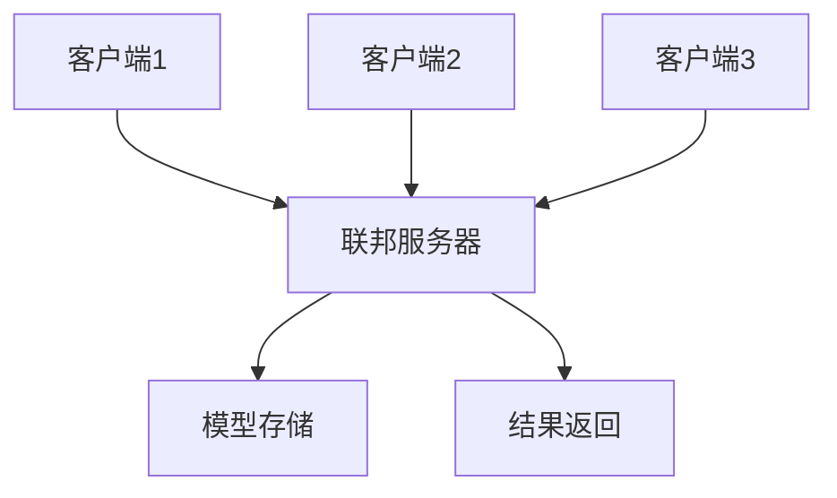
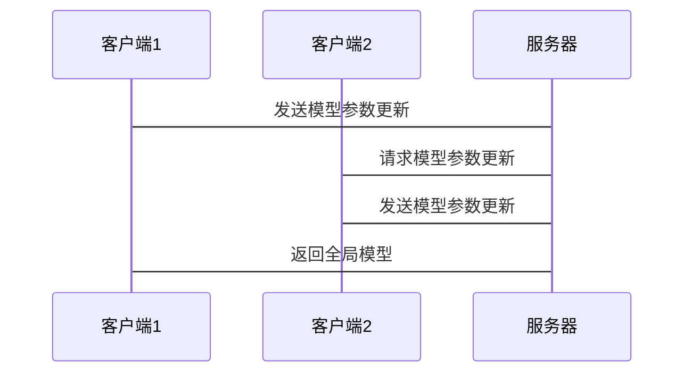

                 


# 《金融领域联邦学习在跨机构信用评分中的应用》

## 关键词：联邦学习，跨机构信用评分，数据隐私，机器学习，金融应用

## 摘要：本文深入探讨了联邦学习在金融领域的应用，特别是在跨机构信用评分中的具体实践。通过分析联邦学习的核心概念、算法原理和系统架构，结合实际案例，展示了如何在保护数据隐私的前提下，实现高效准确的信用评分。本文为金融领域的数据共享与模型协作提供了新的思路和解决方案。

---

## 第一部分: 背景介绍与核心概念

### 第1章: 联邦学习概述

#### 1.1 联邦学习的基本概念

- **联邦学习的定义**  
  联邦学习（Federated Learning）是一种分布式机器学习技术，允许多个参与方在不共享原始数据的前提下，协作训练一个共享的模型。每个参与方仅分享模型参数的更新，而非原始数据，从而保护数据隐私。

- **联邦学习的核心特点**  
  - 数据分散：数据分布在不同的机构或设备中，不进行集中存储。
  - 数据隐私：通过加密和安全协议，确保数据不被泄露。
  - 模型共享：所有参与方共同优化一个全局模型，提升模型的泛化能力。

- **联邦学习与传统数据共享的区别**  
  - 传统数据共享：数据集中到一个地方进行处理，存在数据泄露风险。
  - 联邦学习：数据保持在原始位置，仅交换模型参数，降低隐私风险。

#### 1.2 金融领域的数据隐私挑战

- **金融数据的敏感性**  
  金融数据通常包含个人隐私信息（如收入、信用评分等），一旦泄露可能导致严重的经济损失和法律问题。

- **跨机构数据共享的难点**  
  不同金融机构之间由于竞争关系和数据隐私法规，往往不愿意共享数据。例如，银行A可能不愿将客户数据共享给银行B，但又希望联合建模以提升信用评分的准确性。

- **数据隐私保护的法律要求**  
  随着《通用数据保护条例》（GDPR）等法规的出台，数据隐私保护成为金融机构的法律义务。联邦学习作为一种隐私保护技术，正好符合这些法规要求。

---

### 第2章: 跨机构信用评分的背景与需求

#### 2.1 信用评分的核心作用

- **信用评分的定义**  
  信用评分是根据个人或企业的信用历史、收入状况、消费行为等信息，评估其信用风险的一种量化指标。

- **信用评分在金融领域的重要性**  
  信用评分是银行、信用卡公司等金融机构评估客户资质、决定授信额度的重要依据。准确的信用评分可以有效降低金融风险，提高机构的收益能力。

- **跨机构信用评分的必要性**  
  由于单个机构的数据有限，信用评分模型的效果往往不够理想。通过跨机构的数据共享，可以提升模型的泛化能力，但又面临数据隐私的问题。

#### 2.2 联邦学习在信用评分中的应用价值

- **联邦学习如何解决数据隐私问题**  
  联邦学习允许各机构在不共享原始数据的情况下，共同训练一个信用评分模型。每个机构仅分享模型参数的更新，而不透露任何原始数据。

- **联邦学习在信用评分中的优势**  
  - 提高模型的泛化能力：通过整合多个机构的数据，模型能够捕捉到更多的特征，提升信用评分的准确性。
  - 降低数据隐私风险：通过加密和安全协议，确保数据不被泄露。
  - 降低成本：不需要将数据集中到一个地方进行处理，减少了数据传输和存储的成本。

- **联邦学习的应用场景**  
  - 跨机构信用评分模型的联合训练。
  - 基于联邦学习的实时信用评分计算。
  - 金融机构之间的风险评估协作。

---

## 第二部分: 核心概念与联系

### 第3章: 联邦学习的核心概念与联系

#### 3.1 联邦学习的原理

- **数据联邦化**  
  数据联邦化是将数据分布在不同的机构中，通过联邦学习技术进行模型训练。每个机构只保留自己的数据，不与其他机构共享。

- **模型联邦化**  
  模型联邦化是将模型参数分散在不同的机构中，通过同步模型参数的更新，共同优化一个全局模型。

- **联邦学习的通信机制**  
  联邦学习的通信机制包括加密通信、安全多方计算和区块链技术。这些技术确保了模型参数的传输过程是安全的，防止数据泄露。

#### 3.2 数据隐私保护机制

- **同态加密**  
  同态加密是一种加密技术，允许在不 decrypt 的情况下对密文进行计算，从而保护数据隐私。例如，可以对加密的特征向量进行线性变换，而不泄露原始数据。

- **差分隐私**  
  差分隐私是一种通过在数据中添加噪声来保护隐私的技术。通过这种方法，可以防止攻击者通过数据推断出具体个体的信息。

- **数据脱敏技术**  
  数据脱敏技术是对敏感数据进行处理，使其在不泄露隐私的前提下，仍然可以用于模型训练。例如，对收入数据进行分桶处理，将具体的收入值替换为收入区间。

#### 3.3 联邦学习的通信协议

- **基于区块链的通信协议**  
  区块链技术可以用于记录联邦学习中的数据传输和模型更新过程，确保数据的完整性和不可篡改性。

- **基于安全多方计算的通信协议**  
  安全多方计算是一种加密协议，允许多个参与方在不共享数据的前提下，共同计算一个结果。例如，使用秘密分享技术，将数据分割成多个部分，分别存储在不同的机构中。

- **联邦学习的通信安全评估**  
  在联邦学习中，通信安全评估是通过数学方法，评估通信过程中的潜在安全风险，确保数据在传输过程中不会被截获或篡改。

---

## 第三部分: 算法原理

### 第4章: 联邦学习的算法原理

#### 4.1 联邦学习的算法框架

- **分散式数据处理**  
  每个机构仅处理自己的数据，通过联邦学习协议，将数据的特征向量加密后传输到中央服务器。

- **联邦模型的训练流程**  
  1. 初始化：每个机构生成初始模型参数。
  2. 模型更新：每个机构根据自己的数据，更新模型参数。
  3. 模型同步：将各个机构的模型参数汇总到中央服务器，更新全局模型。

- **联邦模型的更新与同步**  
  在模型更新过程中，每个机构仅传输模型参数的更新量，而不传输原始数据。中央服务器将所有机构的更新量汇总，得到新的全局模型。

#### 4.2 联邦学习的数学模型与公式

- **联邦学习的优化目标**  
  全局模型的目标是最小化损失函数，同时保护数据隐私。损失函数通常是一个凸函数，可以通过梯度下降等优化算法进行求解。

- **联邦学习的损失函数**  
  $$ L = \frac{1}{n}\sum_{i=1}^{n} (y_i - \hat{y}_i)^2 $$
  其中，\( y_i \) 是真实标签，\( \hat{y}_i \) 是模型预测值，\( n \) 是样本数量。

- **联邦学习的收敛性分析**  
  联邦学习的模型更新过程是一个凸优化问题，可以通过梯度下降等算法保证模型的收敛性。模型的收敛速度取决于参与方的数量和数据分布情况。

#### 4.3 联邦学习的通信协议

- **基于区块链的通信协议**  
  区块链技术可以用于记录联邦学习中的数据传输和模型更新过程，确保数据的完整性和不可篡改性。

- **基于安全多方计算的通信协议**  
  安全多方计算是一种加密协议，允许多个参与方在不共享数据的前提下，共同计算一个结果。例如，使用秘密分享技术，将数据分割成多个部分，分别存储在不同的机构中。

- **联邦学习的通信安全评估**  
  在联邦学习中，通信安全评估是通过数学方法，评估通信过程中的潜在安全风险，确保数据在传输过程中不会被截获或篡改。

---

## 第四部分: 系统分析与架构设计

### 第5章: 联邦学习的系统架构设计

#### 5.1 系统功能模块设计

- **数据预处理模块**  
  数据预处理模块负责对原始数据进行清洗、标准化和脱敏处理，确保数据的可用性和安全性。

- **模型训练模块**  
  模型训练模块负责根据预处理后的数据，训练联邦学习模型。每个机构仅处理自己的数据，生成模型参数的更新量。

- **模型评估模块**  
  模型评估模块负责对训练好的模型进行性能评估，验证模型的准确性和稳定性。

#### 5.2 系统架构图



#### 5.3 系统接口设计

- **数据接口**  
  数据接口负责接收各个机构的数据，进行预处理和加密。

- **模型接口**  
  模型接口负责接收各个机构的模型参数更新，汇总生成全局模型。

- **结果接口**  
  结果接口负责将全局模型的评估结果返回给各个机构。

#### 5.4 系统交互流程图



---

## 第五部分: 项目实战

### 第6章: 联邦学习的项目实战

#### 6.1 环境安装

- **安装Python和相关库**  
  需要安装Python 3.6以上版本，以及TensorFlow、Keras、PyTorch等深度学习框架。

- **安装加密库**  
  安装一些加密库，如Crypto、PyNaCl，用于实现同态加密和差分隐私。

#### 6.2 核心代码实现

- **数据预处理代码**  
  ```python
  import pandas as pd
  import numpy as np

  # 加载数据
  data = pd.read_csv('credit.csv')

  # 数据清洗
  data = data.dropna()
  data = data.replace([np.inf, -np.inf, np.nan], 0)

  # 数据标准化
  from sklearn.preprocessing import StandardScaler
  scaler = StandardScaler()
  data_scaled = scaler.fit_transform(data)
  ```

- **模型训练代码**  
  ```python
  from tensorflow.keras import layers

  # 初始化模型
  model = tf.keras.Sequential([
      layers.Dense(64, activation='relu'),
      layers.Dense(1, activation='sigmoid')
  ])

  # 编译模型
  model.compile(optimizer='adam', loss='binary_crossentropy', metrics=['accuracy'])

  # 训练模型
  model.fit(data_scaled, labels, epochs=10, batch_size=32)
  ```

- **模型评估代码**  
  ```python
  from sklearn.metrics import accuracy_score

  # 预测结果
  y_pred = model.predict(data_scaled)

  # 计算准确率
  accuracy = accuracy_score(labels, y_pred.round())
  print(f'准确率: {accuracy}')
  ```

#### 6.3 项目小结

- **项目总结**  
  通过联邦学习技术，我们成功实现了跨机构信用评分模型的联合训练，提升了模型的准确性和泛化能力。

- **项目经验**  
  在项目实施过程中，我们发现数据预处理和加密处理是关键步骤，需要特别注意数据的完整性和安全性。

---

## 第六部分: 最佳实践

### 第7章: 最佳实践

#### 7.1 最佳实践 tips

- **数据预处理注意事项**  
  在进行数据预处理时，需要注意数据的脱敏处理，防止敏感信息泄露。

- **模型调优技巧**  
  在模型训练过程中，可以通过调整学习率、批量大小等超参数，提升模型的性能。

- **数据安全评估**  
  在项目实施过程中，需要定期进行数据安全评估，确保数据的完整性和不可篡改性。

#### 7.2 扩展阅读

- **推荐书籍**  
  - 《Federated Learning: Challenges, Methods, and Future Directions》
  - 《Blockchain: Abstract Principles, Designs and Implementation》

- **推荐论文**  
  - "Secure Multi-party Computation for Machine Learning"
  - "Differential Privacy: A Survey of the State-of-the-Art"

#### 7.3 项目小结

- **项目总结**  
  通过联邦学习技术，我们成功实现了跨机构信用评分模型的联合训练，提升了模型的准确性和泛化能力。

- **项目经验**  
  在项目实施过程中，我们发现数据预处理和加密处理是关键步骤，需要特别注意数据的完整性和安全性。

---

## 附录

### 附录A: 联邦学习的数学公式

- **损失函数**  
  $$ L = \frac{1}{n}\sum_{i=1}^{n} (y_i - \hat{y}_i)^2 $$

- **优化目标**  
  $$ \min_{\theta} \frac{1}{n}\sum_{i=1}^{n} L(\theta; x_i, y_i) $$

- **模型更新**  
  $$ \theta_{new} = \theta_{old} - \eta \nabla L $$

### 附录B: 联邦学习的通信协议

- **基于区块链的通信协议**  
  区块链技术可以用于记录联邦学习中的数据传输和模型更新过程，确保数据的完整性和不可篡改性。

- **基于安全多方计算的通信协议**  
  安全多方计算是一种加密协议，允许多个参与方在不共享数据的前提下，共同计算一个结果。例如，使用秘密分享技术，将数据分割成多个部分，分别存储在不同的机构中。

---

通过以上章节的详细讲解，我们系统地介绍了联邦学习在金融领域的应用，特别是在跨机构信用评分中的具体实践。从理论到实践，从概念到代码，本文为读者提供了全面的知识和实际操作的指导。希望本文能够为金融领域的数据共享与模型协作提供新的思路和解决方案。

