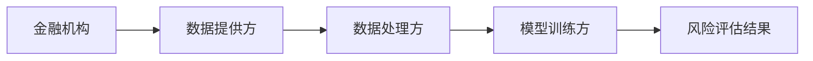
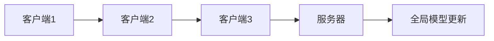
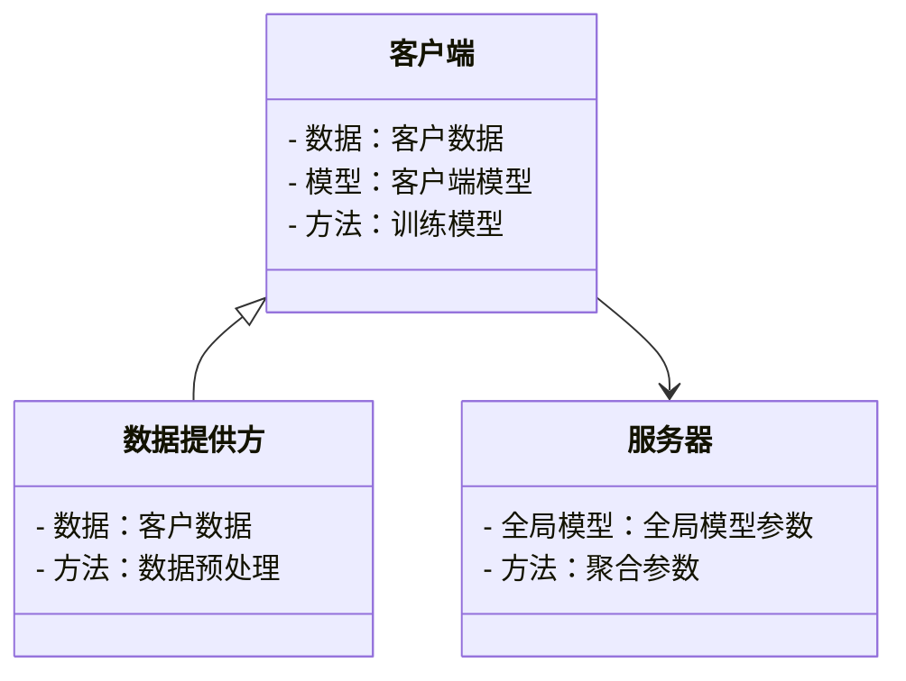
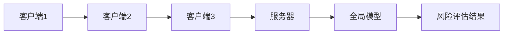
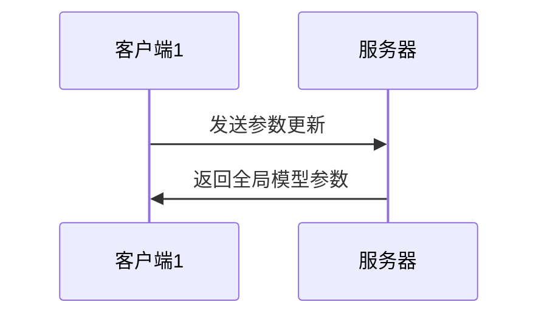

                 


# 《金融领域联邦学习在跨机构风险评估中的应用》

---

## 关键词
- 联邦学习
- 跨机构风险评估
- 数据隐私
- 金融风险
- 机器学习

---

## 摘要
本文探讨了联邦学习在金融领域跨机构风险评估中的应用。通过分析联邦学习的核心概念、算法原理和系统架构，本文展示了如何在保护数据隐私的前提下，实现跨机构的协同计算。文章还结合实际案例，详细讲解了联邦学习的实现过程，并提出了最佳实践建议，为金融领域的数据安全与风险评估提供了新的思路。

---

# 第一部分: 背景介绍与核心概念

## 第1章: 联邦学习与跨机构风险评估概述

### 1.1 联邦学习的基本概念

#### 1.1.1 联邦学习的定义
联邦学习（Federated Learning，FL）是一种分布式机器学习技术，旨在在不集中存储原始数据的情况下，通过多个参与方的协作来训练全局模型。每个参与方只分享模型参数的更新信息，而不是原始数据。

#### 1.1.2 联邦学习的核心特点
- **数据隐私保护**：数据不出域，只传输模型更新参数。
- **分布式计算**：多个参与方协同训练，避免数据集中化。
- **模型共享**：各参与方共享模型权重，形成全局最优模型。

#### 1.1.3 联邦学习与传统数据共享的区别
| 特性                | 联邦学习                          | 传统数据共享                  |
|---------------------|-----------------------------------|-----------------------------|
| 数据传输方式        | 只传输模型参数，不传输原始数据  | 传输原始数据                |
| 数据隐私保护        | 高                               | 较低                        |
| 计算效率            | 较低                             | 较高                        |
| 适用场景            | 数据孤岛场景，隐私保护需求高     | 数据集中化场景              |

### 1.2 金融领域跨机构风险评估的背景

#### 1.2.1 金融风险评估的重要性
金融风险评估是金融机构防范风险、保障资产安全的重要手段。常见的金融风险包括信用风险、市场风险和操作风险。

#### 1.2.2 跨机构数据共享的挑战
- **数据孤岛**：不同金融机构之间数据分散，难以形成合力。
- **数据隐私**：金融数据涉及用户隐私，直接共享风险较高。
- **合规性要求**：金融行业对数据隐私和合规性有严格要求。

#### 1.2.3 联邦学习在金融领域的应用价值
- **保护数据隐私**：联邦学习可以在不共享原始数据的情况下，联合训练风险评估模型。
- **提升模型性能**：通过跨机构的数据协同，提升模型的泛化能力和准确性。
- **合规性与安全性**：符合金融行业对数据隐私的严格要求。

### 1.3 问题背景与目标

#### 1.3.1 问题背景分析
金融机构在进行风险评估时，往往需要结合多方数据，但由于数据隐私和合规性要求，直接共享数据存在风险。

#### 1.3.2 跨机构风险评估的核心问题
- 如何在保护数据隐私的前提下，联合训练风险评估模型。
- 如何设计高效的联邦学习算法，提升模型性能。

#### 1.3.3 联邦学习的目标与边界
目标：通过联邦学习技术，实现跨机构的联合风险评估模型训练。
边界：仅在模型参数层面进行协作，不涉及原始数据的共享。

### 1.4 本章小结
本章介绍了联邦学习的基本概念和核心特点，分析了金融领域跨机构风险评估的背景和挑战，并提出了联邦学习在该领域的应用价值和目标。

---

# 第二部分: 联邦学习的核心概念与原理

## 第2章: 联邦学习的核心概念与联系

### 2.1 联邦学习的核心原理

#### 2.1.1 数据隐私保护机制
联邦学习通过加密通信和差分隐私技术，确保数据在传输过程中的安全性。

#### 2.1.2 数据安全与加密技术
- **加密通信**：使用加密协议，确保数据传输过程中的安全性。
- **同态加密**：允许在加密数据上进行计算，结果解密后与直接计算结果一致。

#### 2.1.3 联邦学习的协同计算机制
- **模型参数同步**：各参与方定期同步模型参数，更新全局模型。
- **本地训练**：每个参与方在本地数据上训练模型，只上传参数更新。

### 2.2 联邦学习模型的分类与对比

#### 2.2.1 横向联邦学习
- **特点**：数据按水平方向分布，每个参与方拥有不同的特征。
- **适用场景**：适合多个机构在同一特征上补充数据的情况。
- **案例**：多个银行联合评估信用风险。

#### 2.2.2 纵向联邦学习
- **特点**：数据按垂直方向分布，每个参与方拥有不同的记录。
- **适用场景**：适合多个机构在同一记录上补充数据的情况。
- **案例**：保险公司与银行联合评估客户风险。

#### 2.2.3 联邦分层学习
- **特点**：将联邦学习划分为多个层次，每个层次独立训练模型。
- **适用场景**：适合大规模、多机构的联合训练场景。
- **案例**：跨国金融机构联合训练风险评估模型。

### 2.3 联邦学习的实体关系图



### 2.4 本章小结
本章详细介绍了联邦学习的核心原理和模型分类，并通过实体关系图展示了联邦学习的协作机制。

---

# 第三部分: 联邦学习算法原理与实现

## 第3章: 联邦学习算法原理

### 3.1 联邦平均算法（FedAvg）

#### 3.1.1 算法流程
1. 初始化全局模型参数。
2. 各参与方在本地数据上训练模型，更新参数。
3. 参与方将参数更新上传至服务器。
4. 服务器聚合各参与方的参数更新，更新全局模型。
5. 重复步骤2-4，直到模型收敛。

#### 3.1.2 算法数学模型

全局模型参数更新公式：
$$ \theta_{\text{new}} = \theta_{\text{old}} + \sum_{i=1}^{n} \frac{\Delta \theta_i}{n} $$
其中，$\theta_{\text{new}}$ 表示更新后的全局模型参数，$\Delta \theta_i$ 表示第i个参与方的参数更新，$n$ 表示参与方总数。

#### 3.1.3 算法实现代码示例

```python
import tensorflow as tf

# 定义客户端模型
class ClientModel(tf.keras.Model):
    def __init__(self):
        super(ClientModel, self).__init__()
        self.dense1 = tf.keras.layers.Dense(64, activation='relu')
        self.dense2 = tf.keras.layers.Dense(1, activation='sigmoid')

    def call(self, inputs):
        x = self.dense1(inputs)
        return self.dense2(x)

# 定义客户端训练逻辑
def client_train(model, data, batch_size, epochs):
    model.compile(optimizer='sgd', loss='binary_crossentropy')
    model.fit(data['x'], data['y'], batch_size=batch_size, epochs=epochs, verbose=0)
    return model.get_weights()

# 定义服务器聚合逻辑
def server_aggregate(global_model, client_models):
    # 平均聚合
    avg_weights = {}
    for i in range(len(global_model.weights)):
        total = 0
        for model in client_models:
            total += model.weights[i]
        avg_weights[i] = total / len(client_models)
    return avg_weights

# 初始化全局模型
global_model = ClientModel()

# 分配数据到各客户端
clients_data = distribute_data()  # 假设distribute_data()函数已经实现

# 各客户端训练并返回权重
client_weights = []
for client_data in clients_data:
    client_model = ClientModel()
    client_weights.append(client_train(client_model, client_data, batch_size=32, epochs=1))

# 服务器聚合客户端权重
new_global_weights = server_aggregate(global_model, client_weights)

# 更新全局模型
global_model.set_weights(new_global_weights)
```

#### 3.1.4 算法实现的流程图



### 3.2 联邦学习的数学模型

全局模型更新的数学公式：
$$ \theta_{\text{new}} = \theta_{\text{old}} + \sum_{i=1}^{n} \frac{\Delta \theta_i}{n} $$
其中，$\Delta \theta_i$ 是第i个参与方的参数更新量，$n$ 是参与方总数。

---

# 第四部分: 系统分析与架构设计

## 第4章: 系统分析与架构设计方案

### 4.1 问题场景介绍
假设我们有两家银行和一家保险公司，希望联合训练一个信用风险评估模型。由于数据隐私问题，各方无法直接共享客户数据，但可以通过联邦学习技术，联合训练模型。

### 4.2 系统功能设计

#### 4.2.1 系统功能模块
- **数据准备模块**：数据预处理、加密。
- **模型训练模块**：本地模型训练、参数上传。
- **模型聚合模块**：服务器聚合参数、更新全局模型。
- **风险评估模块**：基于全局模型进行风险评估。

#### 4.2.2 系统功能流程
1. 数据准备：各参与方对本地数据进行预处理和加密。
2. 模型训练：各参与方在本地数据上训练模型，更新参数。
3. 参数聚合：服务器聚合各参与方的参数更新，更新全局模型。
4. 风险评估：基于全局模型，进行客户信用风险评估。

### 4.3 系统架构设计

#### 4.3.1 领域模型类图



#### 4.3.2 系统架构图



#### 4.3.3 接口设计序列图



### 4.4 本章小结
本章通过实际案例，详细分析了联邦学习系统的功能设计和架构设计，并通过类图和序列图展示了系统的交互流程。

---

# 第五部分: 项目实战

## 第5章: 项目实战与实现

### 5.1 环境安装与配置

#### 5.1.1 安装依赖库
```bash
pip install tensorflow==2.5.0
pip install flask==2.0.3
pip install numpy==1.21.2
```

#### 5.1.2 项目结构
```
project/
├── client.py
├── server.py
└── requirements.txt
```

### 5.2 核心代码实现

#### 5.2.1 客户端代码实现

```python
import tensorflow as tf
import numpy as np

class Client:
    def __init__(self, data):
        self.model = ClientModel()
        self.data = data

    def train(self):
        self.model.compile(optimizer='sgd', loss='binary_crossentropy')
        self.model.fit(self.data['x'], self.data['y'], batch_size=32, epochs=1, verbose=0)
        return self.model.get_weights()
```

#### 5.2.2 服务器代码实现

```python
import tensorflow as tf
import numpy as np

class Server:
    def __init__(self):
        self.model = ClientModel()

    def aggregate(self, client_weights):
        avg_weights = {}
        for i in range(len(self.model.weights)):
            total = 0
            for weights in client_weights:
                total += weights[i]
            avg_weights[i] = total / len(client_weights)
        return avg_weights

    def update_model(self, new_weights):
        self.model.set_weights(new_weights)
```

### 5.3 实际案例分析与实现

#### 5.3.1 案例背景
假设我们有两家银行（Bank1、Bank2）和一家保险公司（InsureCo），希望联合训练一个信用风险评估模型。

#### 5.3.2 数据准备

```python
def generate_data(n=1000):
    import numpy as np
    X = np.random.rand(n, 10)
    y = np.random.randint(0, 2, n)
    return {'x': X, 'y': y}
```

#### 5.3.3 系统实现

```python
# 初始化数据
bank1_data = generate_data()
bank2_data = generate_data()
insureco_data = generate_data()

# 初始化客户端
client_bank1 = Client(bank1_data)
client_bank2 = Client(bank2_data)
client_insureco = Client(insureco_data)

# 初始化服务器
server = Server()

# 客户端训练
weights_bank1 = client_bank1.train()
weights_bank2 = client_bank2.train()
weights_insureco = client_insureco.train()

# 服务器聚合
aggregated_weights = server.aggregate([weights_bank1, weights_bank2, weights_insureco])

# 更新服务器模型
server.update_model(aggregated_weights)

# 获取全局模型
global_model_weights = server.model.get_weights()
```

#### 5.3.4 实验结果与分析

```python
# 训练后的全局模型
global_model = ClientModel()
global_model.set_weights(global_model_weights)

# 模型评估
loss = global_model.evaluate(global_model.inputs, global_model.outputs)
print(f"模型损失：{loss}")
```

### 5.4 项目小结
本章通过实际案例，详细讲解了联邦学习的实现过程，并展示了如何在跨机构场景中应用联邦学习技术。

---

# 第六部分: 最佳实践与总结

## 第6章: 最佳实践与总结

### 6.1 最佳实践 tips

#### 6.1.1 数据预处理的重要性
- 数据清洗和特征工程是联邦学习成功的关键。
- 确保数据分布的一致性，避免数据偏差。

#### 6.1.2 模型调参技巧
- 根据实际场景调整学习率和批量大小。
- 定期监控模型训练过程，及时调整参数。

#### 6.1.3 数据隐私保护的注意事项
- 采用差分隐私技术，确保数据安全。
- 定期审计数据访问日志，防止数据泄露。

### 6.2 总结与展望

#### 6.2.1 总结
本文详细探讨了联邦学习在金融领域跨机构风险评估中的应用，通过理论分析和实际案例，展示了联邦学习在保护数据隐私的前提下，实现跨机构协同计算的能力。

#### 6.2.2 展望
未来，联邦学习在金融领域的应用将更加广泛，模型的可解释性和数据隐私保护将得到进一步加强。同时，联邦学习的算法和架构也将不断创新，以应对更复杂的金融场景。

### 6.3 本章小结
本文总结了联邦学习在金融领域的应用价值，并提出了未来的发展方向。

---

# 结语

通过本文的详细讲解，读者可以全面了解联邦学习在金融领域跨机构风险评估中的应用。从理论到实践，从算法到系统设计，本文为读者提供了一个完整的知识框架。未来，随着技术的不断发展，联邦学习将在金融领域发挥更大的作用，为金融机构的风险管理提供更强大的支持。

