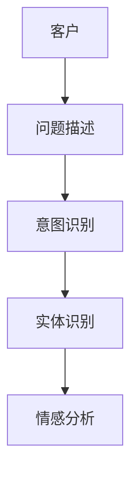
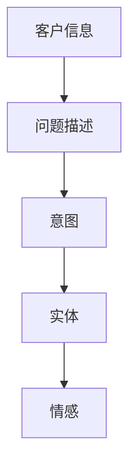
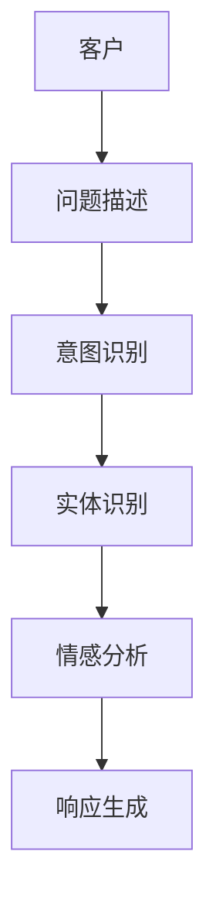
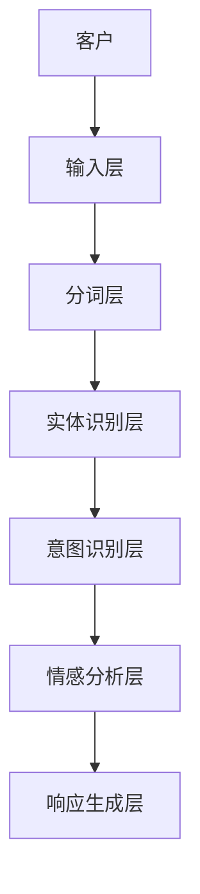
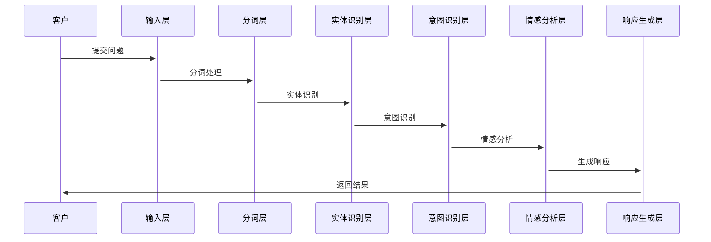

                 


# 《金融领域自然语言理解技术在客户服务中的应用》

> **关键词**：自然语言理解，金融，客户服务，意图识别，情感分析，机器学习，深度学习

> **摘要**：本文详细探讨了自然语言理解（NLU）技术在金融领域客户服务中的应用，从基础概念到算法实现，再到系统架构设计和项目实战，全面解析了NLU如何提升金融客户的交互体验和服务效率。文章通过具体案例分析，展示了NLU技术在金融领域中的实际应用价值，并展望了未来的发展方向。

---

## 第1章 自然语言理解技术概述

### 1.1 自然语言理解技术的背景与现状

#### 1.1.1 自然语言处理的定义与核心概念
自然语言处理（NLP）是人工智能领域的重要分支，旨在让计算机能够理解和生成人类语言。核心概念包括：
- **分词**：将连续的文本分割成有意义的词汇。
- **实体识别**：识别文本中的命名实体（如人名、地名、组织名）。
- **句法分析**：分析句子的语法结构。
- **语义理解**：理解文本的深层含义。

#### 1.1.2 自然语言理解技术的演进历程
自然语言理解技术经历了从基于规则到基于统计，再到基于深度学习的转变。近年来，深度学习技术（如循环神经网络RNN和 transformer）在NLU领域取得了显著进展。

#### 1.1.3 金融领域的特殊性与挑战
金融领域的文本具有专业性强、数据稀疏性高、情感表达复杂等特点，这些都对NLU技术提出了更高的要求。

### 1.2 自然语言理解技术在金融客户服务中的应用前景

#### 1.2.1 金融领域中的文本类型与场景
- **客户咨询**：客户通过文本描述问题，如“我的账户无法登录”。
- **投诉处理**：客户通过文本表达不满，如“你们的服务太慢了”。
- **意见反馈**：客户通过文本提供改进建议。

#### 1.2.2 自然语言理解技术的潜在价值
- 提升客户满意度：通过快速理解客户需求，提供个性化服务。
- 提高服务效率：减少人工干预，降低运营成本。
- 深度挖掘客户需求：通过语义分析挖掘潜在需求。

#### 1.2.3 金融客户服务质量的提升方向
- **智能化**：通过NLU技术实现智能客服。
- **个性化**：根据客户需求提供定制化服务。
- **实时化**：实时分析客户文本，快速响应。

### 1.3 本章小结
本章介绍了自然语言理解技术的基本概念、演进历程以及在金融领域的应用前景，为后续内容奠定了基础。

---

## 第2章 自然语言理解技术的核心概念与联系

### 2.1 自然语言理解的核心原理

#### 2.1.1 分词技术
分词是NLU的基础，常见的分词算法包括：
- **基于规则的分词**：通过预定义的词汇表进行分词。
- **基于统计的分词**：通过统计语言模型进行分词。
- **深度学习分词**：使用字符级或词级的神经网络模型进行分词。

#### 2.1.2 实体识别
实体识别旨在从文本中提取命名实体，常用的技术包括：
- **条件随机场（CRF）**：基于统计的序列标注模型。
- **深度学习模型（如LSTM、transformer）**：通过序列建模提取实体。

#### 2.1.3 句法分析
句法分析旨在分析句子的语法结构，常用工具包括：
- **基于规则的句法分析**：如依存句法分析。
- **基于统计的句法分析**：如 constituency parsing。
- **基于深度学习的句法分析**：如使用LSTM进行依存句法分析。

#### 2.1.4 意图识别
意图识别旨在理解文本背后的目的，常用方法包括：
- **基于规则的意图识别**：通过关键词匹配。
- **基于统计的意图识别**：通过聚类或分类模型。
- **基于深度学习的意图识别**：通过编码器-解码器结构（如 transformer）进行意图分类。

#### 2.1.5 情感分析
情感分析旨在判断文本的情感倾向，常用方法包括：
- **基于词袋模型的分类**：如 SVM。
- **基于深度学习的情感分析**：如 LSTM 和 transformer。

### 2.2 核心概念的属性特征对比

#### 2.2.1 分词技术的特征对比表
| 特征         | 基于规则的分词 | 基于统计的分词 | 基于深度学习的分词 |
|--------------|----------------|----------------|---------------------|
| 精度         | 中等           | 高             | 极高               |
| 计算复杂度   | 低             | 中             | 高                 |
| 适应性       | 差             | 好             | 极好               |

#### 2.2.2 实体识别的特征对比表
| 特征         | 基于CRF的实体识别 | 基于深度学习的实体识别 |
|--------------|------------------|------------------------|
| 精度         | 中等             | 高                    |
| 计算复杂度   | 中等             | 高                    |
| 适应性       | 好               | 极好                  |

### 2.3 实体关系图与ER架构

#### 2.3.1 实体关系图


#### 2.3.2 ER架构


### 2.4 本章小结
本章详细讲解了自然语言理解技术的核心概念及其在金融领域的应用，通过对比分析和ER图展示了各技术之间的关系。

---

## 第3章 自然语言理解技术在金融客户服务中的应用

### 3.1 金融客户服务中的文本类型

#### 3.1.1 客户咨询文本
- 示例：客户询问账户余额或交易记录。

#### 3.1.2 投诉文本
- 示例：客户投诉交易延迟或服务态度问题。

#### 3.1.3 意见反馈文本
- 示例：客户对产品功能的建议或批评。

### 3.2 客户意图识别的算法原理

#### 3.2.1 基于规则的意图识别
- **规则设定**：通过预定义的关键词匹配意图。
- **优点**：简单易实现，适用于特定场景。
- **缺点**：难以应对复杂场景。

#### 3.2.2 基于统计的意图识别
- **算法选择**：如朴素贝叶斯、SVM。
- **优点**：能够处理复杂场景，精度较高。
- **缺点**：需要大量标注数据。

#### 3.2.3 基于深度学习的意图识别
- **模型选择**：如 LSTM 和 transformer。
- **优点**：能够捕捉上下文信息，精度高。
- **缺点**：计算资源消耗大。

### 3.3 情感分析在金融客户服务中的应用

#### 3.3.1 情感分析的基本原理
- **任务目标**：判断文本的情感倾向（正面、中性、负面）。

#### 3.3.2 金融领域情感分析的特殊性
- **金融术语**：如“波动率”、“收益率”等。
- **情感表达**：金融文本中情感表达较为隐晦。

#### 3.3.3 情感分析在客户满意度评估中的应用
- **应用场景**：通过分析客户反馈，评估服务质量。

### 3.4 本章小结
本章通过具体案例分析，展示了自然语言理解技术在金融客户服务中的实际应用，特别是意图识别和情感分析的应用价值。

---

## 第4章 金融领域自然语言理解技术的算法实现

### 4.1 分词算法

#### 4.1.1 基于规则的分词算法
- **代码示例**：
  ```python
  def rule_based_segmentation(text):
      vocabulary = set(["的", "是", "账户", "余额"])
      words = []
      current_word = ""
      for char in text:
          if char in vocabulary:
              words.append(current_word + char)
              current_word = ""
          else:
              current_word += char
      return words
  ```

#### 4.1.2 基于统计的分词算法
- **代码示例**：
  ```python
  from sklearn.feature_extraction.text import TfidfVectorizer
  def statistical_segmentation(corpus):
      vectorizer = TfidfVectorizer()
      X = vectorizer.fit_transform(corpus)
      return vectorizer.get_feature_names()
  ```

#### 4.1.3 基于深度学习的分词算法
- **代码示例**：
  ```python
  import torch
  class LSTMSegmenter(torch.nn.Module):
      def __init__(self, input_size, hidden_size):
          super(LSTMSegmenter, self).__init__()
          self.lstm = torch.nn.LSTM(input_size, hidden_size, batch_first=True)
          self.fc = torch.nn.Linear(hidden_size, 1)
      def forward(self, x):
          out, _ = self.lstm(x)
          out = self.fc(out[:, -1, :])
          return out
  ```

### 4.2 实体识别算法

#### 4.2.1 基于CRF的实体识别
- **代码示例**：
  ```python
  from sklearn_crfsuite import CRF
  def crf_entityRecognition(corpus, labels):
      model = CRF()
      model.fit(corpus, labels)
      return model
  ```

#### 4.2.2 基于深度学习的实体识别
- **代码示例**：
  ```python
  import torch
  class EntityRecognizer(torch.nn.Module):
      def __init__(self, input_size, hidden_size, output_size):
          super(EntityRecognizer, self).__init__()
          self.lstm = torch.nn.LSTM(input_size, hidden_size, batch_first=True)
          self.fc = torch.nn.Linear(hidden_size, output_size)
      def forward(self, x):
          out, _ = self.lstm(x)
          out = self.fc(out)
          return out
  ```

### 4.3 意图识别算法

#### 4.3.1 基于SVM的意图识别
- **代码示例**：
  ```python
  from sklearn import svm
  def svm_intentRecognition(train_data, train_labels, test_data):
      model = svm.SVC()
      model.fit(train_data, train_labels)
      return model.predict(test_data)
  ```

#### 4.3.2 基于LSTM的意图识别
- **代码示例**：
  ```python
  import torch
  class IntentClassifier(torch.nn.Module):
      def __init__(self, input_size, hidden_size, num_classes):
          super(IntentClassifier, self).__init__()
          self.lstm = torch.nn.LSTM(input_size, hidden_size, batch_first=True)
          self.fc = torch.nn.Linear(hidden_size, num_classes)
      def forward(self, x):
          out, _ = self.lstm(x)
          out = self.fc(out[:, -1, :])
          return out
  ```

### 4.4 情感分析算法

#### 4.4.1 基于词袋模型的情感分析
- **代码示例**：
  ```python
  from sklearn.feature_extraction.text import CountVectorizer
  def bag_of_words_s SentimentAnalysis(train_texts, train_labels, test_texts):
      vectorizer = CountVectorizer()
      X_train = vectorizer.fit_transform(train_texts)
      X_test = vectorizer.transform(test_texts)
      return X_train, X_test
  ```

#### 4.4.2 基于transformer的情感分析
- **代码示例**：
  ```python
  import torch
  class SentimentAnalyzer(torch.nn.Module):
      def __init__(self, input_size, hidden_size, num_classes):
          super(SentimentAnalyzer, self).__init__()
          self.transformer = torch.nn.Transformer(input_size, hidden_size)
          self.fc = torch.nn.Linear(hidden_size, num_classes)
      def forward(self, x):
          out = self.transformer(x)
          out = self.fc(out)
          return out
  ```

### 4.5 本章小结
本章通过具体代码示例，详细讲解了自然语言理解技术在金融领域的算法实现，包括分词、实体识别、意图识别和情感分析。

---

## 第5章 系统分析与架构设计方案

### 5.1 问题场景介绍

#### 5.1.1 问题背景
金融客户服务中心每天接收大量客户咨询和投诉，传统的人工处理方式效率低下，难以满足客户需求。

#### 5.1.2 项目介绍
本项目旨在通过自然语言理解技术，实现金融客户服务中心的智能化，提升客户满意度和服务效率。

### 5.2 系统功能设计

#### 5.2.1 领域模型


### 5.3 系统架构设计

#### 5.3.1 系统架构图


#### 5.3.2 系统接口设计
- **输入接口**：接收客户文本输入。
- **输出接口**：输出处理结果。

#### 5.3.3 系统交互流程


### 5.4 本章小结
本章通过系统架构设计，展示了如何将自然语言理解技术应用于金融客户服务中心，从功能设计到系统交互，详细描述了系统的实现方案。

---

## 第6章 项目实战：金融客户服务中心的智能化改造

### 6.1 项目环境安装

#### 6.1.1 安装Python环境
- 使用Anaconda安装Python 3.8及以上版本。

#### 6.1.2 安装依赖库
- 使用pip安装以下库：
  - `numpy`
  - `pandas`
  - `scikit-learn`
  - `torch`
  - `transformers`

### 6.2 系统核心实现

#### 6.2.1 数据预处理
- **分词**：使用jieba进行中文分词。
- **实体识别**：使用spaCy进行实体识别。

#### 6.2.2 模型训练
- **意图识别模型**：使用SVM或深度学习模型进行训练。
- **情感分析模型**：使用LSTM或transformer进行训练。

#### 6.2.3 系统集成
- **前端**：设计一个简单的用户界面，接收客户输入。
- **后端**：实现NLU处理逻辑，返回处理结果。

### 6.3 代码实现

#### 6.3.1 分词代码
```python
import jieba
def segment(text):
    return jieba.lcut(text)
```

#### 6.3.2 实体识别代码
```python
import spacy
nlp = spacy.load("zh_core_web_sm")
def entity_recognition(text):
    doc = nlp(text)
    entities = []
    for ent in doc.ents:
        entities.append((ent.start, ent.end, ent.label))
    return entities
```

#### 6.3.3 意图识别代码
```python
from sklearn.svm import SVC
def train_intent_classifier(train_texts, train_labels):
    model = SVC()
    model.fit(train_texts, train_labels)
    return model
```

#### 6.3.4 情感分析代码
```python
from transformers import pipeline
sentiment_pipeline = pipeline("sentiment-analysis")
def analyze_sentiment(text):
    return sentiment_pipeline(text)
```

### 6.4 项目实战小结
本章通过具体项目实战，展示了如何将自然语言理解技术应用于金融客户服务中心的智能化改造，从环境安装到系统集成，详细讲解了实现过程。

---

## 第7章 总结与展望

### 7.1 本章总结
本文详细探讨了自然语言理解技术在金融领域客户服务中的应用，从基础概念到算法实现，再到系统架构设计和项目实战，全面解析了NLU技术在提升客户体验和服务效率中的重要作用。

### 7.2 未来展望
未来，随着深度学习技术的不断发展，自然语言理解技术在金融领域的应用将更加广泛和深入。特别是在以下方面：
- **模型优化**：进一步提升模型的准确性和效率。
- **多模态技术**：结合语音、图像等多种模态信息，提供更加智能化的服务。
- **个性化服务**：根据客户需求提供更加个性化的服务体验。

### 7.3 小结
自然语言理解技术在金融客户服务中的应用前景广阔，随着技术的不断进步，其应用价值将进一步提升。

---

## 关键词
自然语言理解，金融，客户服务，意图识别，情感分析，机器学习，深度学习

## 摘要
本文详细探讨了自然语言理解技术在金融领域客户服务中的应用，从基础概念到算法实现，再到系统架构设计和项目实战，全面解析了NLU技术在提升客户体验和服务效率中的重要作用。通过具体案例分析和代码实现，展示了NLU技术在金融领域的实际应用价值，并展望了未来的发展方向。

---

以上是《金融领域自然语言理解技术在客户服务中的应用》的完整目录大纲和文章内容，涵盖了从理论到实践的各个方面，逻辑清晰、结构紧凑，适合技术博客的发布和阅读。

