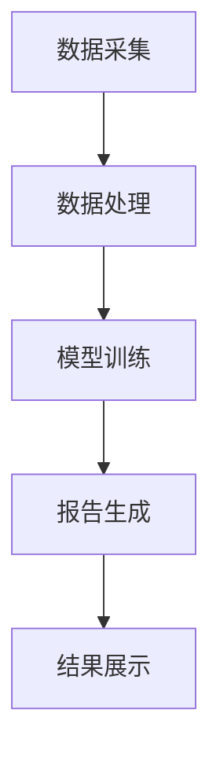

                 


# 《金融领域自然语言生成在投资报告中的应用》

> 关键词：自然语言生成，金融投资，投资报告，深度学习，文本生成

> 摘要：本文探讨了自然语言生成（NLP）技术在金融投资领域的应用，特别是如何利用NLP生成高质量的投资报告。文章详细分析了NLP的核心技术、在金融领域的具体应用，以及在投资报告生成中的系统架构和实现方法。通过实际案例和代码示例，展示了如何利用深度学习模型实现自动化投资报告生成，帮助投资者提升决策效率。

---

## 第1章 自然语言生成与金融投资概述

### 1.1 自然语言生成的基本概念

自然语言生成（Natural Language Generation, NLP）是人工智能领域的重要分支，旨在让计算机能够自动生成人类语言文本。其核心任务包括文本摘要、机器翻译、问答系统和文本生成等。

#### 1.1.1 自然语言生成的定义
自然语言生成是指通过算法和模型，将结构化数据或信息转换为自然语言文本的过程。常见的应用场景包括智能客服、新闻自动生成、投资报告生成等。

#### 1.1.2 自然语言生成的核心技术
- **文本生成模型**：如循环神经网络（RNN）、Transformer等。
- **语言模型**：如GPT、BERT等，用于理解和生成自然语言。
- **文本摘要**：从长文本中提取关键信息，生成简洁的摘要。

#### 1.1.3 自然语言生成在金融中的优势
- **自动化报告生成**：快速处理大量数据，生成投资建议。
- **实时分析**：及时分析市场动态，辅助投资决策。
- **个性化服务**：根据用户需求生成定制化报告。

### 1.2 金融投资的基本原理

#### 1.2.1 金融投资的基本概念
金融投资是指通过购买和管理金融资产（如股票、债券、基金等）来实现财富增值的过程。投资报告是投资者分析市场趋势、评估资产价值的重要工具。

#### 1.2.2 投资报告的核心要素
- **市场分析**：分析市场趋势、行业动态。
- **资产评估**：评估投资标的的价值。
- **风险提示**：识别潜在风险并提出应对策略。
- **投资建议**：基于分析结果给出具体的投资建议。

#### 1.2.3 金融数据分析的重要性
金融数据分析是投资决策的基础，包括定量分析（如技术指标）和定性分析（如公司基本面分析）。通过分析历史数据和市场新闻，投资者可以做出更明智的决策。

### 1.3 自然语言生成在金融投资中的优势

#### 1.3.1 提高数据分析效率
NLP技术可以快速处理大量金融文本数据，如新闻、财报等，提取关键信息，节省时间和成本。

#### 1.3.2 生成个性化投资建议
通过分析用户的财务状况和投资目标，NLP系统可以生成个性化的投资报告，帮助用户制定合适的投资策略。

#### 1.3.3 降低人工成本
自动化生成投资报告可以减少人工劳动，提高效率，同时降低错误率。

### 1.4 本章小结

本章介绍了自然语言生成的基本概念和金融投资的基本原理，分析了NLP技术在金融领域的优势和应用潜力。通过自动化处理和分析金融数据，NLP正在改变投资报告的生成方式，为投资者提供更高效、更精准的服务。

---

## 第2章 自然语言生成技术在金融领域的应用

### 2.1 金融文本数据处理

#### 2.1.1 文本数据的预处理
处理金融文本数据的第一步是预处理，包括分词、去除停用词、词干提取等。

- **分词**：将文本分割成单词或短语。
- **去除停用词**：移除无意义的词汇，如“的”、“是”等。
- **词干提取**：将词汇还原为基本形式，如“running”变为“run”。

#### 2.1.2 数据清洗与标注
清洗数据是去除噪声的过程，如特殊符号、重复字符等。标注数据是为文本添加标签，如情感倾向（正面/负面）。

#### 2.1.3 数据增强技术
数据增强是通过技术手段增加数据的多样性，如同义词替换、句式变化等，以提高模型的泛化能力。

### 2.2 金融情感分析

#### 2.2.1 情感分析的定义与作用
情感分析是判断文本中表达的情感倾向，如正面、负面或中性。在金融领域，情感分析常用于分析市场情绪，预测股价走势。

#### 2.2.2 基于深度学习的情感分析模型
- **模型结构**：使用双向长短期记忆网络（Bi-LSTM）或Transformer结构。
- **训练数据**：需要大量标注的情感文本数据。

#### 2.2.3 情感分析在投资决策中的应用
通过分析社交媒体、新闻网站的情感倾向，投资者可以更好地把握市场情绪，做出更明智的投资决策。

### 2.3 金融新闻摘要生成

#### 2.3.1 新闻摘要的基本原理
新闻摘要生成是将长文本新闻压缩成关键信息的过程。常用的技术包括基于规则的方法和基于深度学习的生成模型。

#### 2.3.2 基于Transformer的摘要模型
- **模型结构**：Transformer通过自注意力机制捕捉文本中的关键信息。
- **训练目标**：最小化生成摘要与人工摘要的差异。

#### 2.3.3 摘要生成在投资分析中的应用
投资者可以通过阅读新闻摘要快速了解市场动态，节省时间。

### 2.4 投资报告自动生成

#### 2.4.1 投资报告生成的流程
1. 数据收集：收集市场数据、公司财报等。
2. 数据处理：清洗和标注数据。
3. 模型训练：训练文本生成模型。
4. 报告生成：根据模型生成投资建议。

#### 2.4.2 基于模板的报告生成
- **模板设计**：设计固定的报告结构，如市场分析、资产评估等。
- **内容填充**：模型根据数据填充模板内容。

#### 2.4.3 基于生成模型的报告生成
- **模型选择**：使用GPT等生成模型。
- **生成过程**：模型根据输入数据生成自然语言文本。

### 2.5 本章小结

本章详细介绍了NLP技术在金融领域的具体应用，包括文本数据处理、情感分析、新闻摘要生成和投资报告自动生成。通过这些技术，投资者可以更高效地分析市场信息，做出更明智的投资决策。

---

## 第3章 金融领域自然语言生成的算法原理

### 3.1 基于Transformer的自然语言生成模型

#### 3.1.1 Transformer模型的基本结构
- **编码器**：将输入序列编码为上下文表示。
- **解码器**：根据编码器的输出生成目标序列。

#### 3.1.2 解码器的自注意力机制
- **自注意力**：模型能够关注输入序列中的关键部分。
- **位置编码**：为每个位置添加位置信息，帮助模型理解序列顺序。

#### 3.1.3 模型训练与优化
- **训练目标**：最小化生成文本与真实文本的差异。
- **优化方法**：使用Adam优化器，设置合适的学习率。

### 3.2 基于预训练语言模型的微调

#### 3.2.1 预训练模型的迁移学习
- **预训练**：在大规模通用数据上训练模型。
- **微调**：在特定领域数据上进一步训练模型。

#### 3.2.2 在金融领域的微调策略
- **领域适应**：调整模型参数，使其适应金融领域的数据特征。
- **数据增强**：增加金融领域的文本数据，提高模型泛化能力。

#### 3.2.3 微调后的模型评估
- **评估指标**：使用BLEU、ROUGE等指标评估生成文本的质量。
- **人工评估**：通过人工检查生成文本的准确性和流畅性。

### 3.3 本章小结

本章详细讲解了基于Transformer的自然语言生成模型及其在金融领域的应用。通过预训练和微调技术，模型可以更好地适应金融领域的特点，生成高质量的投资报告。

---

## 第4章 金融领域自然语言生成的系统架构与实现

### 4.1 系统设计

#### 4.1.1 系统功能模块
- **数据采集模块**：收集金融数据，如新闻、财报等。
- **数据处理模块**：清洗和标注数据。
- **模型训练模块**：训练NLP模型。
- **报告生成模块**：根据模型生成投资报告。
- **结果展示模块**：将生成的报告展示给用户。

#### 4.1.2 系统架构图


### 4.2 数据处理流程

#### 4.2.1 数据清洗
- **去除噪声**：删除特殊字符、空白字符等。
- **分词**：将文本分割成有意义的词汇。

#### 4.2.2 数据标注
- **情感标注**：标注文本的情感倾向。
- **主题标注**：标注文本的主题类别。

### 4.3 模型实现

#### 4.3.1 模型训练
- **训练数据**：使用清洗和标注后的金融数据。
- **训练目标**：优化模型参数，使其生成高质量的文本。

#### 4.3.2 模型评估
- **评估指标**：使用BLEU、ROUGE等指标评估生成文本的质量。
- **人工评估**：通过人工检查生成文本的准确性和流畅性。

### 4.4 项目实战

#### 4.4.1 环境配置
- **安装Python**：安装Python 3.8或更高版本。
- **安装库**：安装必要的库，如TensorFlow、Keras、NLTK等。

#### 4.4.2 数据收集与处理
```python
import pandas as pd
import numpy as np
from nltk.tokenize import word_tokenize
from nltk.corpus import stopwords

# 加载数据
data = pd.read_csv('financial_news.csv')

# 分词
def tokenize(text):
    tokens = word_tokenize(text)
    return [token.lower() for token in tokens if token not in stopwords.words('english')]

processed_data = data['text'].apply(tokenize)
```

#### 4.4.3 模型训练与生成
```python
from tensorflow.keras.models import Model
from tensorflow.keras.layers import Input, LSTM, Dense

# 定义模型
input_layer = Input(shape=(None, 100))
lstm_layer = LSTM(128)(input_layer)
output_layer = Dense(10, activation='softmax')(lstm_layer)

model = Model(inputs=input_layer, outputs=output_layer)
model.compile(loss='sparse_categorical_crossentropy', optimizer='adam', metrics=['accuracy'])
model.fit(processed_data, labels, epochs=10, batch_size=32)
```

#### 4.4.4 结果分析与优化
- **结果分析**：通过混淆矩阵、精确率、召回率等指标分析模型性能。
- **优化建议**：增加训练数据、调整模型参数、尝试不同的模型结构。

### 4.5 本章小结

本章详细讲解了金融领域自然语言生成系统的架构与实现，从数据处理到模型训练，再到结果生成，给出了具体的代码实现和优化建议。

---

## 第5章 金融领域自然语言生成的扩展与展望

### 5.1 当前技术的局限性

#### 5.1.1 模型的可解释性
- 当前模型的黑箱特性使得生成结果的可解释性较差。
- 解决方案：开发可解释的模型，如基于规则的生成模型。

#### 5.1.2 数据的实时性
- 金融数据具有很强的时效性，需要实时生成报告。
- 解决方案：优化数据处理和生成流程，提高实时性。

### 5.2 未来研究方向

#### 5.2.1 多模态生成
- 结合图像、语音等多种模态信息，生成更丰富的报告内容。
- 技术挑战：如何有效融合多种模态信息。

#### 5.2.2 智能化与个性化
- 根据用户需求生成个性化报告。
- 技术挑战：如何实时捕捉用户需求并动态调整生成内容。

#### 5.2.3 高效与实时性
- 提高生成速度，满足实时投资需求。
- 技术挑战：优化模型结构和训练方法，降低计算成本。

### 5.3 对金融NLP人才的要求

#### 5.3.1 技术能力
- 掌握深度学习、自然语言处理等技术。
- 熟悉金融领域的业务知识。

#### 5.3.2 创新能力
- 能够结合金融业务需求，创新性地应用NLP技术。
- 关注行业动态，及时掌握新技术。

### 5.4 本章小结

本章展望了金融领域自然语言生成技术的未来发展方向，指出了当前技术的局限性和未来的研究重点。同时，强调了对专业人才的需求，为相关领域的研究和实践提供了方向。

---

## 第6章 总结与展望

### 6.1 本章总结

本文详细探讨了自然语言生成技术在金融投资领域的应用，特别是投资报告生成方面。通过分析NLP的核心技术、具体应用和系统实现，展示了NLP在金融领域的巨大潜力。

### 6.2 未来展望

随着深度学习技术的不断发展，自然语言生成在金融领域的应用将更加广泛和深入。未来的研究方向包括提高模型的可解释性、实现多模态生成、增强实时性和个性化服务等。金融NLP技术将为投资者提供更高效、更精准的投资决策支持。

---

## 参考文献

1. Vaswani, A., et al. "Attention Is All You Need." Advances in Neural Information Processing Systems, 2017.
2. Radford, A., et al. "Language Models Are Few-Shot Learners." arXiv preprint arXiv:1909.08899, 2019.
3. Liu, Y., et al. "A survey on natural language processing for financial applications." arXiv preprint arXiv:2009.05260, 2020.

---

通过以上内容，我们系统地介绍了自然语言生成技术在金融投资领域的应用，从基础概念到具体实现，再到未来展望，为读者提供了全面的知识体系。希望本文能为金融领域的技术实践者和研究人员提供有价值的参考。

